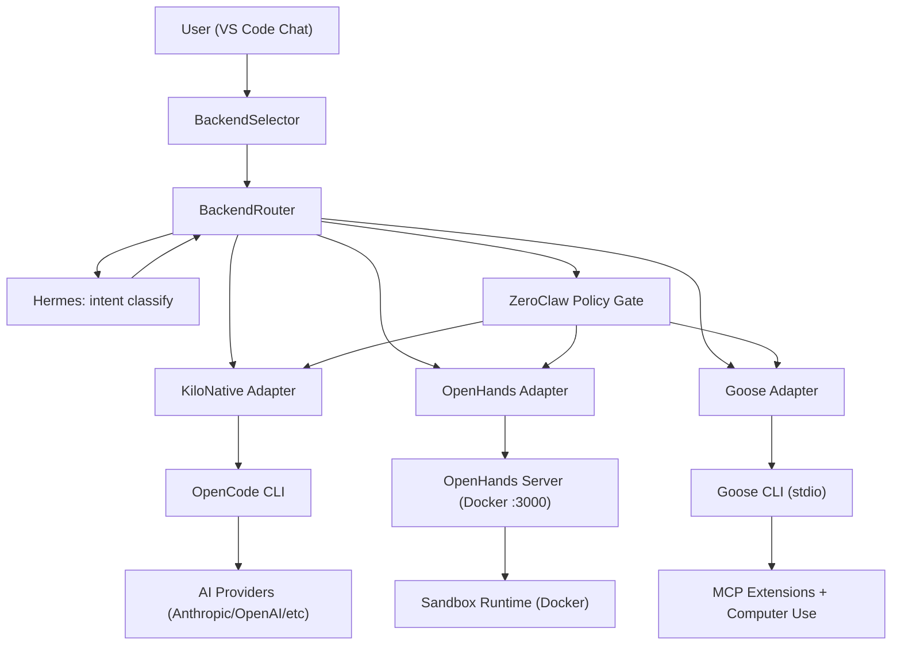

# KiloCode Backend Integration Architecture
# OpenHands Developer Runtime + Goose Computer Operator

> **Status:** Design specification — pre-implementation
> **Authors:** Architecture Design Agent
> **Date:** 2026-04-28
> **Scope:** Full system design for three-way switchable execution backends

---

## Table of Contents

1. [System Overview](#1-system-overview)
2. [Capability Matrix](#2-capability-matrix)
3. [Capability Router Design](#3-capability-router-design)
4. [Access Profiles Schema](#4-access-profiles-schema)
5. [Adapter Interface](#5-adapter-interface)
6. [Security Model](#6-security-model)
7. [Chat UI Design](#7-chat-ui-design)
8. [New Settings Tab Design](#8-new-settings-tab-design)

---

## 1. System Overview

### 1.1 Architecture Narrative

KiloCode gains three execution backends selectable per-task. The existing KiloCode pipeline
(VS Code extension host → OpenCode CLI → AI providers) becomes "Kilo Native" — one of three
options. The other two are OpenHands (Docker-sandboxed dev agent) and Goose (local machine
operator). Hermes acts as the routing broker that inspects intent and selects the appropriate
backend, while ZeroClaw enforces execution policy regardless of which backend is active.

### 1.2 Component Roles

| Component | Role in the integrated system |
|-----------|-------------------------------|
| KiloCode VS Code extension | UI host, backend selector, profile manager, audit log |
| OpenCode CLI (backend) | Kilo Native execution — file editing, tool calls, AI streaming |
| Hermes Bridge API | Intent analysis, capability tagging, backend routing decisions |
| ZeroClaw | Execution policy enforcement, sandboxing, approval gates |
| OpenHands | Docker-based dev agent: code edit, shell, tests, browser in sandbox |
| Goose | Local machine operator: GUI control, computer-use, MCP extensions |
| OpenClaw | External channel gateway — passes messages to the selected backend |

### 1.3 Message Flow Diagram

```
 ┌──────────────────────────────────────────────────────────────────────────┐
 │                    VS CODE EXTENSION HOST (Node.js)                      │
 │                                                                          │
 │  ┌──────────────┐   postMessage    ┌───────────────────────────────────┐ │
 │  │ KiloProvider │◄────────────────►│ WebView (SolidJS)                 │ │
 │  │              │                  │  ChatView                         │ │
 │  │              │                  │  ├─ BackendSelector (toolbar)     │ │
 │  │              │                  │  ├─ PromptInput                   │ │
 │  │              │                  │  └─ MessageList                   │ │
 │  └──────┬───────┘                  └───────────────────────────────────┘ │
 │         │                                                                 │
 │  ┌──────▼───────────────────────────────────────────────────────────┐    │
 │  │                    BackendRouter                                  │    │
 │  │  1. reads user intent from message                                │    │
 │  │  2. asks Hermes for capability tags (or uses override)            │    │
 │  │  3. selects adapter: KiloNative | OpenHands | Goose               │    │
 │  │  4. applies ZeroClaw policy to task envelope                      │    │
 │  │  5. streams events back to WebView                                │    │
 │  └──────┬─────────────┬────────────────────┬────────────────────────┘    │
 │         │             │                    │                              │
 │  ┌──────▼──────┐ ┌────▼──────────┐ ┌──────▼───────────────┐             │
 │  │KiloNative   │ │OpenHands      │ │GooseAdapter           │             │
 │  │Adapter      │ │Adapter        │ │                       │             │
 │  │             │ │               │ │                       │             │
 │  │wraps        │ │ POST /api/    │ │ spawn goose CLI       │             │
 │  │OpenCode CLI │ │ conversations │ │ connect stdio/MCP     │             │
 │  └──────┬──────┘ └────┬──────────┘ └──────┬───────────────┘             │
 │         │             │                    │                              │
 │  ┌──────▼─────────────▼────────────────────▼────────────────────────┐    │
 │  │                    ZeroClaw Policy Layer                          │    │
 │  │  (applies regardless of backend — enforces allowlist, risk gate)  │    │
 │  └───────────────────────────────────────────────────────────────────┘    │
 └──────────────────────────────────────────────────────────────────────────┘
          │                    │                        │
          ▼                    ▼                        ▼
  ┌──────────────┐   ┌──────────────────┐    ┌───────────────────────┐
  │ OpenCode CLI │   │ OpenHands Server │    │ Goose CLI process     │
  │ (local)      │   │ (Docker :3000)   │    │ (local, stdio)        │
  │              │   │                  │    │                       │
  │ AI providers │   │ Sandbox runtime  │    │ MCP extensions        │
  │ (Anthropic,  │   │ ├─ code edit     │    │ ├─ computer-use       │
  │  OpenAI,     │   │ ├─ bash shell    │    │ ├─ screen read        │
  │  Azure, etc) │   │ ├─ test runner   │    │ ├─ GUI automation     │
  └──────────────┘   │ └─ browser agent │    │ └─ local file ops     │
                     └──────────────────┘    └───────────────────────┘
          │
          ▼
  ┌──────────────────────────────────────────────────────────┐
  │  Hermes Bridge API  :18789                               │
  │  ├─ intent classification                                │
  │  ├─ capability tagging                                   │
  │  ├─ backend routing decisions                            │
  │  └─ audit trail                                          │
  └──────────────────────────────────────────────────────────┘
```

### 1.4 Mermaid Diagram (alternative view)



---

## 2. Capability Matrix

Each capability tag maps to exactly one primary backend and optional fallback(s).

| Capability | Kilo Native | OpenHands | Goose | Notes |
|------------|:-----------:|:---------:|:-----:|-------|
| `code_edit` | PRIMARY | ALSO | — | KiloNative edits via OpenCode VSCode integration; OpenHands edits in sandbox |
| `repo_refactor` | SECONDARY | PRIMARY | — | OpenHands preferred: multi-file, test-aware, sandboxed |
| `shell_command` | LIMITED | PRIMARY | ALSO | KiloNative: bash tool in ZeroClaw scope; OpenHands: full shell in container |
| `run_tests` | LIMITED | PRIMARY | — | OpenHands runs full test suite inside sandbox; KiloNative delegates to terminal |
| `browser_automation` | VIA-BROWSER-TAB | PRIMARY | SECONDARY | KiloNative has BrowserAutomationService; OpenHands has in-sandbox browser |
| `computer_use` | — | — | PRIMARY | Goose only: OS-level GUI, accessibility APIs, screen reader |
| `ssh_remote` | VIA-SSH-TAB | SECONDARY | PRIMARY | Goose can SSH into machines for ops; KiloNative uses SSHService |
| `vps_ops` | VIA-VPS-TAB | SECONDARY | PRIMARY | Goose executes remote commands; VPSService for KiloNative |
| `gpu_training` | VIA-TRAINING-TAB | — | SECONDARY | KiloNative has TrainingService; Goose can invoke CLI training scripts |
| `file_ops` | PRIMARY | PRIMARY | PRIMARY | All three can read/write files; scope determined by access profile |
| `search_web` | VIA-PROVIDER | PRIMARY | PRIMARY | OpenHands browser; Goose MCP web-search extension |
| `read_screen` | — | — | PRIMARY | Goose computer-use: screenshot, OCR, accessibility tree |
| `mcp_extensions` | LIMITED | — | PRIMARY | Goose is the MCP-native backend; KiloNative has limited MCP via config |
| `multi_agent` | VIA-HERMES | — | — | Hermes orchestrates sub-agents for KiloNative |
| `memory_recall` | VIA-MEMORY-TAB | SECONDARY | — | KiloCode MemoryService; OpenHands can read injected context |

**Legend:** PRIMARY = preferred handler, ALSO = capable, SECONDARY = fallback, LIMITED = partial support, — = not supported

---

## 3. Capability Router Design

### 3.1 Routing Pipeline

```
User message
    │
    ▼
┌──────────────────────────────┐
│  1. Manual override check    │  ← user selected a specific backend in UI
│     if override set → skip   │
│     intent classification    │
└──────────┬───────────────────┘
           │ no override
           ▼
┌──────────────────────────────┐
│  2. Intent classification    │  ← POST /hermes/classify
│     Extract:                 │     { message, context, session_history }
│     - verb clusters          │  ← returns: capability_tags[], confidence
│     - object types           │
│     - scope signals          │
└──────────┬───────────────────┘
           │
           ▼
┌──────────────────────────────┐
│  3. Capability tag scoring   │
│  Tag set → backend scores:   │
│                              │
│  kilo_score  = Σ weights     │
│  oh_score    = Σ weights     │
│  goose_score = Σ weights     │
│                              │
│  winner = argmax(scores)     │
└──────────┬───────────────────┘
           │
           ▼
┌──────────────────────────────┐
│  4. Availability check       │  ← is winner available (configured/running)?
│     fallback chain:          │
│     primary → secondary      │
│     → kilo-native (always)   │
└──────────┬───────────────────┘
           │
           ▼
┌──────────────────────────────┐
│  5. ZeroClaw policy gate     │  ← applies risk level, write policy, sandbox
│     on task envelope         │
└──────────┬───────────────────┘
           │
           ▼
┌──────────────────────────────┐
│  6. Launch backend session   │  ← adapter.launch(config, accessProfile)
│     stream events to UI      │
│     write audit entry        │
└──────────────────────────────┘
```

### 3.2 Intent Classification → Capability Tags

The Hermes classify endpoint receives the user message and returns capability tags. When Hermes is
offline, the extension falls back to a local regex/keyword tagger.

```typescript
// Sent to POST /hermes/classify
interface ClassifyRequest {
  message: string
  session_context: string      // last N message summaries
  workspace_language?: string  // "typescript" | "python" | etc.
  open_files?: string[]        // currently open file paths
}

// Returned by Hermes
interface ClassifyResponse {
  capability_tags: CapabilityTag[]
  confidence: number           // 0.0–1.0
  explanation: string
  suggested_backend: BackendId
  requires_multi_backend: boolean
  secondary_backend?: BackendId  // when requires_multi_backend = true
}
```

**Keyword clusters mapped to capability tags (local fallback):**

| Keyword cluster | Tag assigned |
|----------------|--------------|
| "refactor", "rename", "extract", "move files", "restructure" | `repo_refactor` |
| "run tests", "test suite", "pytest", "jest", "cargo test" | `run_tests` |
| "click", "open browser", "navigate to", "screenshot website" | `browser_automation` |
| "click button", "type into app", "open window", "use GUI" | `computer_use` |
| "ssh into", "connect to server", "remote machine" | `ssh_remote` |
| "deploy to VPS", "restart service", "docker ps" | `vps_ops` |
| "train model", "fine-tune", "GPU job", "submit training" | `gpu_training` |
| "search the web", "look up online", "find documentation" | `search_web` |
| "read the screen", "what do you see", "take screenshot" | `read_screen` |

### 3.3 Backend Selection Scoring

```typescript
interface CapabilityWeight {
  tag: CapabilityTag
  kilo: number    // 0.0–1.0
  openhands: number
  goose: number
}

const CAPABILITY_WEIGHTS: CapabilityWeight[] = [
  { tag: "code_edit",           kilo: 0.9, openhands: 0.8, goose: 0.1 },
  { tag: "repo_refactor",       kilo: 0.5, openhands: 1.0, goose: 0.1 },
  { tag: "shell_command",       kilo: 0.5, openhands: 0.9, goose: 0.6 },
  { tag: "run_tests",           kilo: 0.4, openhands: 1.0, goose: 0.1 },
  { tag: "browser_automation",  kilo: 0.4, openhands: 0.9, goose: 0.5 },
  { tag: "computer_use",        kilo: 0.0, openhands: 0.0, goose: 1.0 },
  { tag: "ssh_remote",          kilo: 0.5, openhands: 0.3, goose: 0.8 },
  { tag: "vps_ops",             kilo: 0.5, openhands: 0.3, goose: 0.9 },
  { tag: "gpu_training",        kilo: 0.6, openhands: 0.1, goose: 0.4 },
  { tag: "file_ops",            kilo: 0.9, openhands: 0.8, goose: 0.7 },
  { tag: "search_web",          kilo: 0.3, openhands: 0.8, goose: 0.8 },
  { tag: "read_screen",         kilo: 0.0, openhands: 0.1, goose: 1.0 },
  { tag: "mcp_extensions",      kilo: 0.3, openhands: 0.1, goose: 1.0 },
]
```

### 3.4 Manual Override

The user can select a backend at any time using the BackendSelector dropdown in the chat toolbar.
The override is stored per-session and persists until changed. When an override is active:
- The routing pipeline skips steps 2 and 3.
- A `[Kilo Native]` / `[OpenHands]` / `[Goose]` badge appears in the chat header.
- Step 4 (availability check) still runs — if the selected backend is unavailable, the user sees
  an inline error with a "Switch to Kilo Native" fallback button.

### 3.5 Multi-Backend Tasks

Some tasks require both OpenHands AND Goose. Example: "refactor the codebase, then open the browser
and demo the change." Hermes signals this via `requires_multi_backend: true`.

Execution model for multi-backend tasks:
1. BackendRouter creates a ParallelSession with two sub-sessions.
2. Sub-session A (OpenHands) handles the code work.
3. Sub-session B (Goose) is queued; starts after A emits a `TaskComplete` event.
4. The chat UI shows both sessions inline in a split-panel within the MessageList.
5. Either sub-session can be independently interrupted.

### 3.6 Fallback Chain

```
Selected backend unavailable
        │
        ▼
  Is there a secondary backend with capability? → yes → use secondary
        │ no
        ▼
  Use Kilo Native (always available)
        │
        ▼
  Emit BackendFallbackEvent to UI (shows yellow badge: "Using Kilo Native — OpenHands unavailable")
```

---

## 4. Access Profiles Schema

Access profiles define what a backend session is allowed to touch. They are stored in VS Code's
global `SecretStorage` (for credentials) and `globalState` (for non-secret fields).

### 4.1 Storage Keys

- Non-secret: `kilo-code.accessProfiles` → JSON array of `AccessProfile` (no credential fields)
- Secret fields: one key per profile: `kilo-code.accessProfile.${id}.credentials`

### 4.2 Base Schema

```typescript
type AccessProfileType =
  | "local-repo"
  | "local-docker"
  | "vps-ssh"
  | "remote-gpu"
  | "browser-automation"
  | "computer-use"
  | "custom"

interface AccessProfile {
  // ── Identity ──────────────────────────────────────────────────────────────
  id: string                  // UUID, auto-generated, never changes
  name: string                // Human label, e.g. "Production VPS"
  type: AccessProfileType
  description?: string        // Optional user note
  createdAt: string           // ISO 8601
  updatedAt: string           // ISO 8601
  enabled: boolean            // default: true

  // ── Backend compatibility ─────────────────────────────────────────────────
  compatibleBackends: BackendId[]   // which backends can use this profile
  defaultBackend?: BackendId        // pre-select when this profile is active

  // ── Security policy ───────────────────────────────────────────────────────
  security: SecurityPolicy

  // ── Type-specific config ──────────────────────────────────────────────────
  localRepo?:        LocalRepoConfig
  localDocker?:      LocalDockerConfig
  vpsSsh?:           VpsSshConfig
  remoteGpu?:        RemoteGpuConfig
  browserAutomation?: BrowserAutomationConfig
  computerUse?:      ComputerUseConfig
  custom?:           CustomConfig
}
```

### 4.3 SecurityPolicy Schema

```typescript
interface SecurityPolicy {
  // File system
  allowedPaths: string[]          // required; e.g. ["/workspace", "/tmp"]. Use ["*"] for unrestricted.
  deniedPaths: string[]           // takes precedence over allowedPaths
  writePolicy: "read_only"        // no writes allowed
              | "buffered"        // writes buffered, shown as diff before apply
              | "approved"        // writes require explicit user approval
              | "auto"            // writes applied immediately (YOLO mode)

  // Network
  networkPolicy: "deny"           // no outbound network
               | "allowlist"      // only listed hosts
               | "open"           // unrestricted
  networkAllowlist?: string[]     // required when networkPolicy = "allowlist"

  // Resource limits
  limits: {
    timeoutSec: number            // default: 300 (5 min). 0 = unlimited.
    memoryMb: number              // default: 2048. 0 = unlimited.
    cpuShares?: number            // Docker CPU shares (1024 = 1 core)
    maxFilesChanged: number       // default: 50. 0 = unlimited.
  }

  // Approval gates
  requireApprovalFor: ApprovalTrigger[]  // default: ["high_risk", "network_write", "secret_access"]
  yoloMode: boolean               // default: false. Bypasses all approval gates.

  // Risk classification
  riskLevel: "low" | "medium" | "high"  // auto-computed from other fields; can be overridden
}

type ApprovalTrigger =
  | "high_risk"          // task classified as high risk by ZeroClaw
  | "network_write"      // any network + write combination
  | "secret_access"      // task would read/write files matching secret patterns
  | "process_spawn"      // task spawns external processes
  | "file_delete"        // any file deletion
  | "all"                // require approval for everything
```

### 4.4 LocalRepoConfig

```typescript
interface LocalRepoConfig {
  workspacePath: string       // required; absolute path to the repo root
                              //   example: "/home/user/projects/myapp"
  gitBranch?: string          // restrict to this branch; empty = any branch
  allowGitPush: boolean       // default: false
  allowGitCommit: boolean     // default: false
  scopeToWorkspace: boolean   // default: true; block access outside workspacePath
}

// Example profile (YAML representation):
// id: "a1b2c3d4-..."
// name: "Local Repo — MyApp"
// type: local-repo
// compatibleBackends: [kilo-native, openhands]
// localRepo:
//   workspacePath: /home/user/projects/myapp
//   allowGitPush: false
//   allowGitCommit: true
//   scopeToWorkspace: true
// security:
//   allowedPaths: [/home/user/projects/myapp, /tmp/kilo-sandbox]
//   writePolicy: buffered
//   networkPolicy: allowlist
//   networkAllowlist: [api.anthropic.com, api.openai.com]
//   limits: { timeoutSec: 300, memoryMb: 4096, maxFilesChanged: 100 }
//   requireApprovalFor: [high_risk, file_delete]
//   yoloMode: false
```

### 4.5 LocalDockerConfig

```typescript
interface LocalDockerConfig {
  image: string               // required; Docker image, e.g. "ghcr.io/all-hands-ai/runtime:0.29"
  pullPolicy: "always"        // pull on every launch
             | "if-missing"   // pull only if image absent (default)
             | "never"        // use local only; fail if missing
  containerName?: string      // fixed name; auto-generated if omitted
  ports?: PortMapping[]       // host:container port mappings
  volumes?: VolumeMount[]     // additional volume mounts
  envVars?: Record<string, string>  // non-secret env vars
  envSecretRefs?: string[]    // names of VS Code SecretStorage keys to inject
  network?: string            // Docker network name; default: bridge
  privileged: boolean         // default: false; required for some computer-use scenarios
  removeOnStop: boolean       // default: true; --rm flag
}

interface PortMapping {
  hostPort: number
  containerPort: number
  protocol?: "tcp" | "udp"    // default: tcp
}

interface VolumeMount {
  hostPath: string            // absolute host path
  containerPath: string       // absolute container path
  readonly: boolean           // default: false
}

// Example profile (YAML):
// name: "OpenHands Sandbox"
// type: local-docker
// compatibleBackends: [openhands]
// localDocker:
//   image: ghcr.io/all-hands-ai/runtime:0.29
//   pullPolicy: if-missing
//   ports: [{hostPort: 3000, containerPort: 3000}]
//   volumes: [{hostPath: /home/user/projects, containerPath: /workspace, readonly: false}]
//   removeOnStop: true
//   privileged: false
// security:
//   allowedPaths: [/workspace]
//   writePolicy: buffered
//   networkPolicy: allowlist
//   networkAllowlist: [api.anthropic.com, pypi.org, npmjs.com]
//   limits: { timeoutSec: 600, memoryMb: 8192, maxFilesChanged: 500 }
//   requireApprovalFor: [file_delete, process_spawn]
//   yoloMode: false
```

### 4.6 VpsSshConfig

```typescript
interface VpsSshConfig {
  sshProfileId: string        // required; references an SSHProfile in SSHTab
  workingDirectory: string    // default: "~"
  sudoEnabled: boolean        // default: false
  dockerEnabled: boolean      // default: false
  allowServiceRestart: boolean  // default: false
  allowPortForwarding: boolean  // default: false
  knownServices?: string[]    // service names allowed for restart
}

// Example profile (YAML):
// name: "Production VPS — deploy ops"
// type: vps-ssh
// compatibleBackends: [goose, kilo-native]
// vpsSsh:
//   sshProfileId: "prod-vps-profile-uuid"
//   workingDirectory: /var/www/app
//   sudoEnabled: false
//   dockerEnabled: true
//   allowServiceRestart: false
// security:
//   allowedPaths: [/var/www/app, /tmp]
//   writePolicy: approved
//   networkPolicy: deny
//   limits: { timeoutSec: 120, memoryMb: 0, maxFilesChanged: 20 }
//   requireApprovalFor: [all]
//   yoloMode: false
//   riskLevel: high
```

### 4.7 RemoteGpuConfig

```typescript
interface RemoteGpuConfig {
  sshProfileId: string        // required; references SSHProfile
  gpuType?: string            // informational: "H100", "A100", "RTX 4090"
  cudaVersion?: string        // informational; used to validate image compatibility
  trainingFramework: "pytorch" | "tensorflow" | "jax" | "custom"
  jobSubmitCommand: string    // command to submit training job
                              //   e.g. "python train.py" or "sbatch job.slurm"
  checkpointDir: string       // where to find/write checkpoints
  logDir: string              // where training logs are written
  monitorCommand?: string     // optional command to poll training progress
  maxJobDurationMin: number   // safety limit; default: 480 (8 hours)
}

// Example profile (YAML):
// name: "Remote A100 — NLP training"
// type: remote-gpu
// compatibleBackends: [kilo-native, goose]
// remoteGpu:
//   sshProfileId: "gpu-cluster-uuid"
//   gpuType: A100
//   cudaVersion: "12.1"
//   trainingFramework: pytorch
//   jobSubmitCommand: python train.py --config config/run.yaml
//   checkpointDir: /data/checkpoints
//   logDir: /data/logs
//   maxJobDurationMin: 240
// security:
//   allowedPaths: [/data, /home/user/code]
//   writePolicy: approved
//   networkPolicy: allowlist
//   networkAllowlist: [huggingface.co, wandb.ai]
//   limits: { timeoutSec: 0, memoryMb: 0, maxFilesChanged: 1000 }
//   requireApprovalFor: [high_risk]
//   yoloMode: false
```

### 4.8 BrowserAutomationConfig

```typescript
interface BrowserAutomationConfig {
  browserType: "chromium" | "firefox" | "webkit"  // default: chromium
  headless: boolean           // default: true
  startUrl?: string           // initial URL on launch
  viewportWidth: number       // default: 1280
  viewportHeight: number      // default: 720
  recordVideo: boolean        // default: false
  videoSaveDir?: string       // required when recordVideo = true
  allowCookies: boolean       // default: true
  allowLocalStorage: boolean  // default: true
  userDataDir?: string        // persistent profile dir; isolated session if omitted
  proxy?: string              // HTTP proxy URL
}
```

### 4.9 ComputerUseConfig

```typescript
interface ComputerUseConfig {
  // Required Goose backend
  displayIndex?: number       // X display number (Linux) or screen index (macOS/Win)
  screenshotIntervalMs: number  // how often Goose polls screen state; default: 1000
  requireAccessibilityPermission: boolean  // default: true; safety check before launch
  allowKeyboardInput: boolean  // default: true
  allowMouseControl: boolean   // default: true
  allowClipboardAccess: boolean  // default: true
  allowApplicationLaunch: boolean  // default: false
  restrictToWindows?: string[] // window titles / process names Goose may interact with
                               // empty = no restriction
  // Safety
  pauseHotkey: string          // key combo to immediately halt Goose; default: "ctrl+shift+esc"
  screenshotBeforeAction: boolean  // default: true; capture before each GUI action
}

// Example profile (YAML):
// name: "Local Desktop — Goose computer-use"
// type: computer-use
// compatibleBackends: [goose]
// computerUse:
//   screenshotIntervalMs: 1000
//   requireAccessibilityPermission: true
//   allowKeyboardInput: true
//   allowMouseControl: true
//   allowClipboardAccess: true
//   allowApplicationLaunch: false
//   restrictToWindows: [Chrome, Firefox, code]
//   pauseHotkey: ctrl+shift+esc
//   screenshotBeforeAction: true
// security:
//   allowedPaths: [/home/user]
//   writePolicy: approved
//   networkPolicy: open
//   limits: { timeoutSec: 300, memoryMb: 0, maxFilesChanged: 50 }
//   requireApprovalFor: [high_risk, file_delete]
//   yoloMode: false
```

### 4.10 CustomConfig

```typescript
interface CustomConfig {
  launchCommand: string         // required; full shell command to start the backend process
  workingDirectory: string      // required; cwd for the process
  protocol: "stdio"             // communicate via stdin/stdout
           | "http"             // HTTP REST + SSE streaming
           | "websocket"        // WebSocket
  httpBaseUrl?: string          // required when protocol = "http"
  websocketUrl?: string         // required when protocol = "websocket"
  envVars?: Record<string, string>
  envSecretRefs?: string[]      // VS Code SecretStorage key names
  healthCheckPath?: string      // e.g. "/health" — GET on start to verify up
  healthCheckTimeoutMs?: number // default: 5000
  stopCommand?: string          // command to gracefully stop; SIGTERM if omitted
}
```

---

## 5. Adapter Interface

### 5.1 Core Types

```typescript
// Identifiers
type BackendId = "kilo-native" | "openhands" | "goose"

type CapabilityTag =
  | "code_edit"
  | "repo_refactor"
  | "shell_command"
  | "run_tests"
  | "browser_automation"
  | "computer_use"
  | "ssh_remote"
  | "vps_ops"
  | "gpu_training"
  | "file_ops"
  | "search_web"
  | "read_screen"
  | "mcp_extensions"
  | "multi_agent"
  | "memory_recall"

type AgentEventType =
  | "text_delta"         // streaming text chunk
  | "tool_call"          // backend is invoking a tool
  | "tool_result"        // tool returned a result
  | "file_changed"       // backend modified a file
  | "approval_request"   // backend needs user approval
  | "session_complete"   // backend finished the task
  | "session_error"      // backend encountered an unrecoverable error
  | "screenshot"         // Goose: screen capture for computer-use
  | "status_update"      // generic progress message
  | "cost_delta"         // token/cost increment (where available)
```

### 5.2 BackendAdapter Interface

```typescript
interface BackendSession {
  id: string
  backendId: BackendId
  startedAt: Date
  accessProfile: AccessProfile
  state: "starting" | "running" | "awaiting_approval" | "stopped" | "error"
  metadata: Record<string, unknown>   // backend-specific session data
}

interface AgentMessage {
  role: "user"
  content: string
  attachments?: AgentMessageAttachment[]
  contextFiles?: string[]   // file paths to inject as context
}

interface AgentMessageAttachment {
  type: "image" | "file"
  mimeType: string
  data: string | Buffer     // base64 string or Buffer
  filename?: string
}

interface AgentEvent {
  sessionId: string
  type: AgentEventType
  timestamp: Date

  // type = "text_delta"
  textDelta?: string

  // type = "tool_call"
  toolName?: string
  toolInput?: Record<string, unknown>

  // type = "tool_result"
  toolOutput?: string
  toolError?: string

  // type = "file_changed"
  filePath?: string
  fileDiff?: string         // unified diff format

  // type = "approval_request"
  approvalRequest?: ApprovalRequest

  // type = "screenshot"
  screenshotBase64?: string
  screenshotCaption?: string

  // type = "status_update"
  statusText?: string
  progress?: number         // 0–100

  // type = "cost_delta"
  inputTokens?: number
  outputTokens?: number
  costUsd?: number

  // type = "session_error"
  error?: {
    code: string
    message: string
    recoverable: boolean
  }
}

interface ApprovalRequest {
  id: string
  description: string         // human-readable what is about to happen
  riskLevel: "low" | "medium" | "high"
  affectedPaths?: string[]
  commands?: string[]
  previewDiff?: string
  autoApproveAfterMs?: number  // 0 = never auto-approve
}

interface BackendConfig {
  accessProfile: AccessProfile
  zeroclawPolicy: ZeroClawPolicySnapshot
  sessionOptions?: {
    maxTurns?: number
    systemPromptAppend?: string
    temperature?: number
    model?: string              // override model for this session
  }
}

interface ZeroClawPolicySnapshot {
  riskLevel: RiskLevel
  networkPolicy: NetworkPolicy
  writePolicy: WritePolicy
  limits: TaskLimits
  workspaceScope: string[]
}

interface BackendAdapter {
  readonly id: BackendId
  readonly capabilities: CapabilityTag[]

  /**
   * Return true if the backend is installed and minimally configured.
   * This must be synchronous and fast — it is called during routing.
   */
  isAvailable(): boolean

  /**
   * Return detailed availability status including why it may be unavailable.
   * Used by the settings UI and health checks.
   */
  getStatus(): Promise<BackendStatus>

  /**
   * Launch a new backend session for the given configuration.
   * Resolves when the session is ready to receive messages.
   * Rejects if the backend cannot be started.
   */
  launch(config: BackendConfig): Promise<BackendSession>

  /**
   * Send a message to an active session.
   * Resolves when the message has been accepted by the backend.
   * Does NOT wait for a response — listen to stream() for events.
   */
  send(session: BackendSession, message: AgentMessage): Promise<void>

  /**
   * Async iterable of events from the backend session.
   * Yields until the session ends (session_complete or session_error event).
   */
  stream(session: BackendSession): AsyncIterable<AgentEvent>

  /**
   * Respond to an approval request.
   */
  approve(session: BackendSession, requestId: string, approved: boolean, reason?: string): Promise<void>

  /**
   * Stop the session gracefully. Resolves when the session is fully torn down.
   * Must not throw even if the session is already stopped.
   */
  stop(session: BackendSession): Promise<void>

  /**
   * Return artifacts produced by a completed session.
   */
  getArtifacts(session: BackendSession): Promise<SessionArtifact[]>
}

interface BackendStatus {
  available: boolean
  reason?: string                 // human-readable if !available
  version?: string
  latencyMs?: number
  details: Record<string, string> // e.g. { "Docker": "running", "Image": "present" }
}

interface SessionArtifact {
  type: "file" | "diff" | "screenshot" | "log" | "test_report"
  path?: string                   // local path if saved
  content?: string                // inline if small
  mimeType: string
  label: string
}
```

### 5.3 KiloNativeAdapter (wraps existing behavior)

```typescript
class KiloNativeAdapter implements BackendAdapter {
  readonly id = "kilo-native" as const
  readonly capabilities: CapabilityTag[] = [
    "code_edit", "shell_command", "file_ops", "browser_automation",
    "ssh_remote", "vps_ops", "gpu_training", "memory_recall",
    "multi_agent", "mcp_extensions"
  ]

  // Wraps the existing KiloConnectionService / KiloProvider session
  // Translates KiloCode's existing Part events → AgentEvent stream
  // No behavior change; this adapter is a compatibility shim

  launch(config: BackendConfig): Promise<BackendSession> {
    // Creates a new OpenCode session via the existing CLI backend
    // Injects ZeroClaw policy into the session metadata
  }

  send(session: BackendSession, message: AgentMessage): Promise<void> {
    // Calls existing KiloProvider.sendMessage()
  }

  stream(session: BackendSession): AsyncIterable<AgentEvent> {
    // Translates Part/PartUpdate events from the existing session stream
    // into the normalized AgentEvent format
  }
}
```

### 5.4 OpenHandsAdapter

```typescript
class OpenHandsAdapter implements BackendAdapter {
  readonly id = "openhands" as const
  readonly capabilities: CapabilityTag[] = [
    "code_edit", "repo_refactor", "shell_command", "run_tests",
    "browser_automation", "file_ops", "search_web", "ssh_remote"
  ]

  // OpenHands REST API:
  //   POST   /api/conversations       → create session
  //   POST   /api/conversations/:id/messages  → send message
  //   GET    /api/conversations/:id/events    → SSE stream
  //   DELETE /api/conversations/:id           → stop session
  //
  // OpenHands runs on a configurable port (default 3000).
  // Launch modes:
  //   a) Already-running server (user configures URL)
  //   b) docker run managed by the adapter
  //   c) `openhands serve` CLI (no Docker)

  launch(config: BackendConfig): Promise<BackendSession> {
    // 1. Validate Docker available (if launch mode = docker)
    // 2. docker run with volume mounts from accessProfile
    // 3. Wait for /health to return 200
    // 4. POST /api/conversations with workspace config
    // 5. Return session
  }

  send(session: BackendSession, message: AgentMessage): Promise<void> {
    // POST /api/conversations/:id/messages
    // { role: "user", content: message.content }
  }

  stream(session: BackendSession): AsyncIterable<AgentEvent> {
    // EventSource GET /api/conversations/:id/events
    // Map OpenHands event types to AgentEvent
    // OpenHands event types: AgentStateChanged, Observation, Action, Error
  }
}
```

### 5.5 GooseAdapter

```typescript
class GooseAdapter implements BackendAdapter {
  readonly id = "goose" as const
  readonly capabilities: CapabilityTag[] = [
    "computer_use", "ssh_remote", "vps_ops", "file_ops", "search_web",
    "read_screen", "shell_command", "mcp_extensions", "browser_automation",
    "gpu_training"
  ]

  // Goose communication:
  //   a) stdio protocol: spawn `goose run --format json-stream`
  //   b) MCP protocol: connect to goose as MCP server
  //
  // Default: stdio (no server dependency)
  // Goose emits newline-delimited JSON events on stdout

  launch(config: BackendConfig): Promise<BackendSession> {
    // 1. Validate goose binary exists on PATH (or configured path)
    // 2. Check accessibility permissions (for computer-use profiles)
    // 3. Spawn: goose run --profile <profile-id> --format json-stream
    // 4. Return session with child process reference
  }

  send(session: BackendSession, message: AgentMessage): Promise<void> {
    // Write JSON line to goose stdin:
    // { "type": "user_message", "content": message.content }
  }

  stream(session: BackendSession): AsyncIterable<AgentEvent> {
    // readline on goose stdout
    // Parse JSON events: text_chunk, tool_use, tool_result, status, done, error
    // Map to normalized AgentEvent
  }
}
```

### 5.6 BackendRouter

```typescript
class BackendRouter {
  constructor(
    private adapters: BackendAdapter[],
    private hermesClient: HermesClient,
    private zeroClaw: ZeroClawService,
  ) {}

  async route(
    message: AgentMessage,
    manualOverride?: BackendId,
    activeProfile?: AccessProfile,
  ): Promise<BackendSession> {
    const backendId = manualOverride ?? await this.classify(message)
    const adapter = this.resolveWithFallback(backendId)
    const policy = this.zeroClaw.buildPolicy(activeProfile)
    const config: BackendConfig = { accessProfile: activeProfile!, zeroclawPolicy: policy }
    return adapter.launch(config)
  }

  private async classify(message: AgentMessage): Promise<BackendId> { /* ... */ }
  private resolveWithFallback(id: BackendId): BackendAdapter { /* ... */ }
}
```

---

## 6. Security Model

### 6.1 Principles

1. **No raw secrets in messages.** No API keys, passwords, or tokens may appear in task
   descriptions, log output, or artifact content. The existing `ApiKeyScannerService` is extended
   to cover all backend event streams.

2. **ZeroClaw is always in the path.** No backend receives an execution request without first
   passing through `ZeroClawService.buildPolicy()`. This applies even to OpenHands and Goose, which
   do their own sandboxing — ZeroClaw's policy is enforced at the adapter level before any IPC.

3. **Least privilege by default.** All new access profiles default to restrictive settings:
   `writePolicy: "buffered"`, `networkPolicy: "allowlist"`, `yoloMode: false`.

4. **Approval gates block execution.** When `requireApprovalFor` triggers, the backend adapter
   suspends its session and emits an `approval_request` event. The VS Code UI renders the approval
   dock. No further actions execute until the user approves or rejects.

5. **YOLO mode requires explicit opt-in.** The `yoloMode: true` flag must be set on an access
   profile AND the user must confirm a warning dialog on every extension activation when any profile
   has YOLO mode enabled.

### 6.2 Allowlists

**Path allowlist enforcement:**
- KiloNative: `workspaceScope` array in ZeroClaw task envelope
- OpenHands: Docker volume mounts limited to `allowedPaths`; container cannot access host paths
  outside the mounts
- Goose: `restrictToWindows` for computer-use; `allowedPaths` passed as environment variable
  `GOOSE_ALLOWED_PATHS` (Goose honors this in its file operation tool)

**Network allowlist enforcement:**
- KiloNative: no change from existing ZeroClaw network policy
- OpenHands: Docker `--network` with iptables rules generated by `buildDockerNetworkArgs()`
- Goose: network policy enforced at the ZeroClaw level (proxy configuration)

### 6.3 Sandboxing

| Backend | Sandbox mechanism |
|---------|------------------|
| Kilo Native | ZeroClaw task envelope; existing workspace scope enforcement |
| OpenHands | Docker container with volume and network restrictions |
| Goose | OS process isolation; `restrictToWindows` for GUI; path env var |

### 6.4 ZeroClaw Integration

```typescript
// ZeroClaw policy is built from the access profile before calling any adapter
interface BackendPolicyBuilder {
  buildPolicy(profile: AccessProfile): ZeroClawPolicySnapshot
  auditEvent(event: AgentEvent, policy: ZeroClawPolicySnapshot): AuditEntry
  scanForSecrets(event: AgentEvent): SecretScanResult
}
```

Every `AgentEvent` emitted by any adapter is passed through:
1. `scanForSecrets()` — redacts matches before the event reaches the WebView
2. `auditEvent()` — writes to the audit log (stored in extension global state)
3. Optional approval gate check (for `file_changed` events exceeding write policy)

### 6.5 Audit Log

Each event is logged with:
```typescript
interface AuditEntry {
  id: string
  timestamp: string
  sessionId: string
  backendId: BackendId
  profileId: string
  eventType: AgentEventType
  summary: string         // human-readable one-liner
  riskFlag?: string       // set if event triggered a policy
  approved?: boolean      // set for approval_request events
  approvedBy?: string     // "user" | "auto" (yolo mode)
}
```

The audit log is viewable in the Agent Backends settings tab. Entries are retained for 30 days
(configurable). No audit entries are sent to telemetry.

---

## 7. Chat UI Design

### 7.1 Backend Selector in Chat Toolbar

The BackendSelector is inserted into the `PromptInput` toolbar, to the right of the existing
`ModelSelector` and `ModeSwitcher`. It renders as a compact dropdown button.

**Toolbar layout (left to right):**
```
[Mode: Code ▾]  [Model: claude-sonnet-4-6 ▾]  [Backend: Kilo Native ▾]  [Hub ●]  [Voice 🎤]
─────────────────────────────────────────── textarea ─────────────────────────────────────────
```

**BackendSelector component (SolidJS):**
```tsx
// packages/kilo-vscode/webview-ui/src/components/chat/BackendSelector.tsx

interface BackendOption {
  id: BackendId
  label: string
  icon: string        // codicon name or SVG
  tagline: string     // one-line description
  available: boolean
  statusColor: "green" | "yellow" | "red" | "gray"
}

const BACKEND_OPTIONS: BackendOption[] = [
  {
    id: "kilo-native",
    label: "Kilo Native",
    icon: "codicon-rocket",
    tagline: "VS Code-native AI coding. Fast, integrated.",
    available: true,  // always available
    statusColor: "green",
  },
  {
    id: "openhands",
    label: "OpenHands",
    icon: "codicon-server",
    tagline: "Sandboxed dev agent: code, shell, tests, browser.",
    available: false, // set by status check
    statusColor: "gray",
  },
  {
    id: "goose",
    label: "Goose",
    icon: "codicon-desktop-download",
    tagline: "Computer operator: GUI, screen, MCP extensions.",
    available: false,
    statusColor: "gray",
  },
]
```

**Dropdown options (rendered in popover):**
```
┌─────────────────────────────────────────────────┐
│ Select execution backend                         │
├─────────────────────────────────────────────────┤
│ ◉  Kilo Native          ● ready                 │
│    VS Code-native AI coding. Fast, integrated.   │
├─────────────────────────────────────────────────┤
│ ○  OpenHands            ○ not configured         │
│    Sandboxed dev agent: code, shell, tests.      │
│    [Configure →]                                 │
├─────────────────────────────────────────────────┤
│ ○  Goose                ○ not configured         │
│    Computer operator: GUI, screen, MCP.          │
│    [Configure →]                                 │
├─────────────────────────────────────────────────┤
│ Auto (Hermes routes)    ● active                 │
└─────────────────────────────────────────────────┘
```

**[Configure →]** links navigate to the Agent Backends tab in Settings.

### 7.2 Status Indicator

When a non-native backend is active, the chat header shows a status badge:
```
Task: Refactor auth module    [OpenHands ● running]    $0.023   99k/200k
```

Badge colors:
- Green dot `●`: session running
- Yellow dot `●`: awaiting approval
- Red dot `●`: error
- Gray dot `●`: stopped

### 7.3 Active Backend in Chat Header

The `TaskHeader` component renders a `BackendBadge` next to the task title when a non-native
backend is active. Clicking the badge opens a mini status popover showing:
- Backend version
- Container/process status (for OpenHands/Goose)
- Resource usage (memory, time elapsed)
- "Stop backend" button

### 7.4 Approval Dock Integration

The existing `PermissionDock` is extended to handle `approval_request` events from all adapters.
OpenHands and Goose approval requests render identically to existing ZeroClaw approval UI:
```
┌──────────────────────────────────────────────────────────────────┐
│ OpenHands wants to:                             MEDIUM RISK       │
│   Delete 3 files:                                                 │
│   • src/old-auth.ts                                               │
│   • src/old-auth.test.ts                                          │
│   • src/old-auth-types.ts                                         │
│                                                                   │
│  [Reject]                    [Approve]                            │
└──────────────────────────────────────────────────────────────────┘
```

### 7.5 Quick Profile Selector

Next to the BackendSelector, a compact profile indicator shows the active Access Profile:
```
[Backend: OpenHands ▾]  [Profile: Local Docker ▾]
```
Clicking the profile dropdown shows profiles compatible with the current backend.

---

## 8. New Settings Tab Design

### 8.1 Tab Registration

Add `agentBackends` to the `"integrations"` group in `Settings.tsx`:

```typescript
// Settings.tsx — TAB_GROUPS update
{
  id: "integrations",
  label: "Integrations",
  tabs: [
    "browser", "ssh", "vps", "hermes", "openclaw", "zeroclaw",
    "hub", "notifications", "speech",
    "agentBackends",   // NEW
  ],
}
```

```typescript
// TAB_LABELS addition
agentBackends: "Agent Backends",
```

### 8.2 AgentBackendsTab Component Structure

File: `packages/kilo-vscode/webview-ui/src/components/settings/AgentBackendsTab.tsx`

The tab has six collapsible panels:

**Panel 1: Backend Enable/Disable**
```
╔══════════════════════════════════════════════════════════════════╗
║ Execution Backends                                               ║
╠══════════════════════════════════════════════════════════════════╣
║ Kilo Native     [always enabled]   ● VS Code-native AI coding   ║
║                                                                  ║
║ OpenHands       [●  Enabled]       ○ not running                ║
║   Server URL:   [http://localhost:3000          ]                ║
║   Launch mode:  (●) Docker  ( ) Pre-running server              ║
║   Docker image: [ghcr.io/all-hands-ai/runtime:0.29  ]           ║
║                                             [Test Connection]   ║
║                                                                  ║
║ Goose           [●  Enabled]       ○ not found                   ║
║   CLI path:     [auto-detect            ]  [Browse]             ║
║   Protocol:     (●) stdio  ( ) MCP server                       ║
║                                             [Test Connection]   ║
╚══════════════════════════════════════════════════════════════════╝
```

**Panel 2: OpenHands Configuration**
- Server URL (http://localhost:3000 default)
- Launch mode: "Managed Docker" | "Pre-running server" | "CLI (no Docker)"
- Docker image and pull policy
- Runtime type: "docker" | "e2b" | "modal"
- Default model override (optional; uses KiloCode model if blank)
- Max concurrent sessions
- Container resource limits (CPU, memory)
- Environment variable injection (non-secret; secret refs via SecretStorage)
- [Test Connection] → shows OpenHands version and health

**Panel 3: Goose Configuration**
- CLI path (auto-detect from PATH, or manual)
- Protocol: stdio | MCP server
- MCP server URL (when protocol = MCP server)
- Enabled extensions (checklist of available Goose extensions)
- Computer-use: enable toggle + accessibility permission check button
- Default session profile
- [Test Connection] → shows Goose version

**Panel 4: Access Profiles**
```
╔══════════════════════════════════════════════════════════════════╗
║ Access Profiles                              [+ New Profile]    ║
╠══════════════════════════════════════════════════════════════════╣
║  ● Local Repo — MyApp         [Edit]  [Duplicate]  [Delete]     ║
║    type: local-repo  •  backends: Kilo Native, OpenHands        ║
║                                                                  ║
║  ● OpenHands Sandbox          [Edit]  [Duplicate]  [Delete]     ║
║    type: local-docker  •  backends: OpenHands                   ║
║                                                                  ║
║  ● Production VPS             [Edit]  [Duplicate]  [Delete]     ║
║    type: vps-ssh  •  backends: Goose, Kilo Native               ║
╚══════════════════════════════════════════════════════════════════╝
```

The profile editor opens as an in-tab modal with:
- All fields from the schema (Section 4)
- JSON-mode toggle (shows raw JSON for expert editing)
- Credential fields that save to SecretStorage (rendered as password inputs)
- Validation errors inline with field labels

**Panel 5: Routing Rules**
- Auto-routing toggle (Hermes-driven vs always use override)
- Manual override dropdown (Kilo Native / OpenHands / Goose / Auto)
- Capability weight sliders (advanced; collapsed by default)
- Fallback chain config (drag-to-reorder)
- "Test routing with message" — text field + [Simulate] button shows routing decision

**Panel 6: Security Policies**
- Global YOLO mode toggle (with warning banner: "All approval gates bypassed")
- Default write policy selector
- Default network policy selector
- Secret scan sensitivity (strict / standard / off)
- Audit log retention (days)
- [View Audit Log] → opens scrollable audit entries

**Panel 7: Audit Log Viewer**
- Filterable by: backend, profile, event type, date range, risk flag
- Each entry shows: timestamp, session id (truncated), backend badge, event type, summary
- [Export as JSON] button
- Auto-refresh toggle (updates every 5s when a session is active)

### 8.3 Settings Storage Keys

```
kilo-code.agentBackends.openhands.enabled         boolean
kilo-code.agentBackends.openhands.serverUrl        string
kilo-code.agentBackends.openhands.launchMode       "docker" | "prerunning" | "cli"
kilo-code.agentBackends.openhands.dockerImage      string
kilo-code.agentBackends.openhands.pullPolicy       string
kilo-code.agentBackends.openhands.maxSessions      number

kilo-code.agentBackends.goose.enabled              boolean
kilo-code.agentBackends.goose.cliPath              string
kilo-code.agentBackends.goose.protocol             "stdio" | "mcp"
kilo-code.agentBackends.goose.mcpUrl               string
kilo-code.agentBackends.goose.enabledExtensions    string[]
kilo-code.agentBackends.goose.computerUseEnabled   boolean

kilo-code.agentBackends.routing.mode               "auto" | "manual"
kilo-code.agentBackends.routing.manualOverride     BackendId | "auto"
kilo-code.agentBackends.routing.fallbackChain      BackendId[]

kilo-code.agentBackends.security.yoloMode          boolean
kilo-code.agentBackends.security.defaultWritePolicy
kilo-code.agentBackends.security.defaultNetworkPolicy
kilo-code.agentBackends.security.auditRetentionDays
kilo-code.agentBackends.security.secretScanSensitivity

kilo-code.accessProfiles                           AccessProfile[] (non-secret fields)
kilo-code.accessProfile.${id}.credentials         (SecretStorage, per-profile)
kilo-code.agentBackends.auditLog                   AuditEntry[] (last N entries)
```

---

## Appendix A: OpenHands API Reference (Used Endpoints)

| Method | Path | Purpose |
|--------|------|---------|
| GET | /health | Health check / version |
| POST | /api/conversations | Create session |
| POST | /api/conversations/:id/messages | Send message |
| GET | /api/conversations/:id/events | SSE event stream |
| GET | /api/conversations/:id | Get session state |
| DELETE | /api/conversations/:id | Stop session |

OpenHands event types (incoming SSE):
- `AgentStateChanged` — maps to `status_update`
- `FileEditObservation` — maps to `file_changed`
- `CmdOutputObservation` — maps to `tool_result`
- `BrowserOutputObservation` — maps to `tool_result`
- `AgentFinishAction` — maps to `session_complete`
- `ErrorObservation` — maps to `session_error`

---

## Appendix B: Goose stdio Protocol (JSON-stream)

Goose `--format json-stream` emits newline-delimited JSON on stdout.

Outgoing (to stdin):
```json
{ "type": "user_message", "content": "...", "session_id": "..." }
{ "type": "approve", "action_id": "...", "approved": true }
{ "type": "stop" }
```

Incoming (from stdout):
```json
{ "type": "text_chunk", "content": "...", "session_id": "..." }
{ "type": "tool_use", "name": "...", "input": {...}, "action_id": "..." }
{ "type": "tool_result", "action_id": "...", "output": "...", "error": null }
{ "type": "file_write", "path": "...", "diff": "..." }
{ "type": "screenshot", "base64": "...", "caption": "..." }
{ "type": "approval_needed", "action_id": "...", "description": "...", "risk": "medium" }
{ "type": "done", "session_id": "...", "cost": { "usd": 0.012 } }
{ "type": "error", "message": "...", "recoverable": false }
```

---

*End of BACKEND_INTEGRATION_ARCHITECTURE.md*
