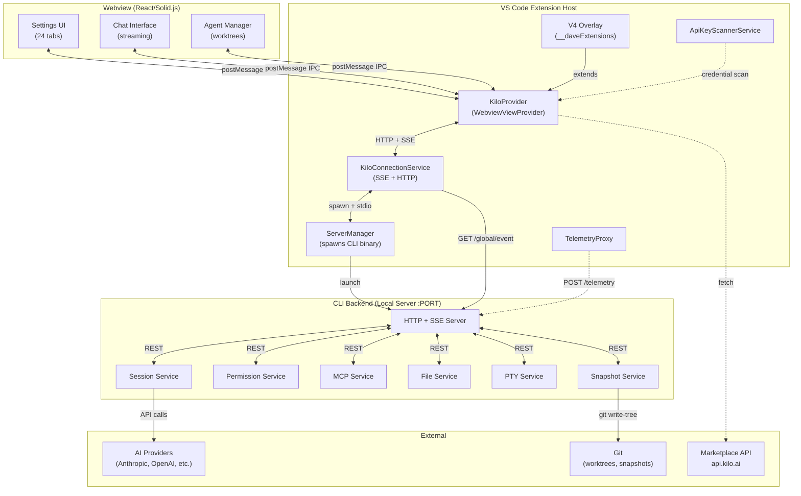

# KiloCode Agent Reference — Master Index

> **FOR AGENTS, NOT HUMANS.** All docs in this directory are machine-readable, typed, and structured for programmatic consumption by AI agents. Precision over prose.

Generated by 12-agent parallel reverse-engineering run — 2026-04-27.

## Document Index

| Doc | Topic | Key Types | Critical For |
|-----|-------|-----------|-------------|
| [01_SETTINGS_ARCHITECTURE.md](01_SETTINGS_ARCHITECTURE.md) | All 24 settings tabs, state shapes, persistence | `Config`, `PermissionConfig`, `McpConfig` | Modifying any user setting |
| [02_PROVIDERS_AND_MODELS.md](02_PROVIDERS_AND_MODELS.md) | All 25+ providers, model schemas, auth flows | `ProviderConfig`, `ModelConfig`, `AuthInfo` | Routing AI requests |
| [03_CONTEXT_RULES_SYSTEM.md](03_CONTEXT_RULES_SYSTEM.md) | System prompt, rules, .kilo/ structure | `RulesConfig`, prompt ordering | Understanding what reaches model |
| [04_MCP_TOOLS_SYSTEM.md](04_MCP_TOOLS_SYSTEM.md) | MCP servers, tool discovery, permissions | `ConfigMCP`, `Tool`, `Permission` | Using/adding tools |
| [05_CHAT_TASK_FLOW.md](05_CHAT_TASK_FLOW.md) | Message types, streaming, task states | `PartUpdatedMessage`, `SessionStatus` | Chat interaction |
| [06_SESSION_HISTORY.md](06_SESSION_HISTORY.md) | SQLite schema, pagination, compaction | `Session`, `Message`, `Part` | Retrieving history |
| [07_MODES_AGENTS_MAOS.md](07_MODES_AGENTS_MAOS.md) | 21-agent MAOS, mode definitions, routing | `AgentConfig`, mode enum | Multi-agent orchestration |
| [08_IPC_PROTOCOL.md](08_IPC_PROTOCOL.md) | Complete webview↔extension message protocol | `WebviewMessage`, `ExtensionMessage` | Extension integration |
| [09_FILE_WORKSPACE.md](09_FILE_WORKSPACE.md) | File ops, diff application, git, .kilo/ | `GitOps`, `SnapshotFileDiff` | File operations |
| [10_CLI_BACKEND.md](10_CLI_BACKEND.md) | Local server, SSE, all API endpoints | `ServerInstance`, SSE events | Backend communication |
| [11_BROWSER_TERMINAL_CHECKPOINTS.md](11_BROWSER_TERMINAL_CHECKPOINTS.md) | Browser automation, PTY, checkpoints | `BrowserAction`, `Pty.Info`, `Patch` | Automation & recovery |
| [12_MARKETPLACE_PERMISSIONS.md](12_MARKETPLACE_PERMISSIONS.md) | Marketplace, auto-approve, telemetry, V4 | `MarketplaceItem`, `TelemetryEventName` | Extensions & permissions |

## Quick Reference: Where Is X?

| Question | File |
|----------|------|
| How do I change a setting? | 01 — `updateConfig()` + `saveConfig()` pattern |
| What providers are available? | 02 — Provider Enum section |
| What's in the system prompt? | 03 — System Prompt Construction |
| How do I add an MCP server? | 04 — Config File Location & Format |
| How does streaming work? | 05 — Streaming Architecture |
| Where is session data stored? | 06 — Storage Architecture |
| How do I switch modes? | 07 — Mode Switching section |
| What message types exist? | 08 — Full union types |
| How does file reading work? | 09 — File Operations API |
| What REST endpoints exist? | 10 — API Endpoints section |
| How does revert work? | 11 — Checkpoint/Snapshot System |
| How does permission work? | 12 — Auto-approval Configuration |

## Architecture Overview



## Config vs Extension Settings Split

```
Config (kilo.json / server-persisted):
  model, small_model, agent, provider, permission, mcp, command,
  instructions, skills, snapshot, share, remote_control, watcher,
  compaction, commit_message, experimental, langModelMap, layout,
  username, formatter, lsp, tools, default_agent

Extension Settings (VS Code globalState):
  browserAutomation.*, autocomplete.*, notifications.*,
  speech.*, routing.*, memory.*, training.*, governance.*,
  hub.*, ssh.*, vps.*, hermes.*, zeroclaw.*
```
