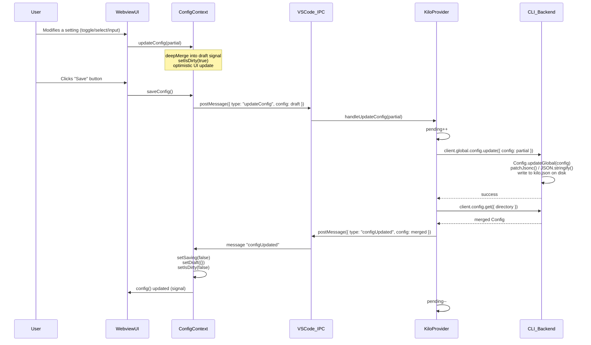
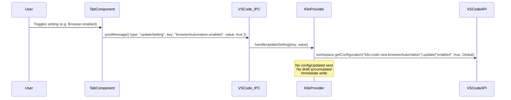

# KiloCode Settings Architecture
> FOR AGENTS. Typed, structured, exhaustive.

---

## 1. Two Distinct Settings Systems

| System | Storage | Scope | Written by |
|---|---|---|---|
| **Config** | Disk — `kilo.json` (global) or project `.kilo/kilo.json` | Server-persisted; read by CLI backend on every session | `Config.updateGlobal()` / `global.config.update` API |
| **Extension Settings** | VS Code `globalState` + `workspace.getConfiguration("kilo-code.new.*")` | Extension-local; not sent to CLI | `KiloProvider.handleUpdateSetting()` / `extensionContext.globalState.update()` |

- `Config` keys are the TypeScript type `Info` (see §3).
- Extension settings include browser, autocomplete, notifications, speech, sounds — they only live in VS Code and never appear in `kilo.json`.

---

## 2. Config File Paths on Disk

### Global config — priority-ordered candidates, first match wins for writes

```
$XDG_CONFIG_HOME/kilo/kilo.jsonc    ← primary write target if exists
$XDG_CONFIG_HOME/kilo/kilo.json     ← fallback write target
$XDG_CONFIG_HOME/kilo/opencode.json
$XDG_CONFIG_HOME/kilo/opencode.jsonc
$XDG_CONFIG_HOME/kilo/config.json
```

- `XDG_CONFIG_HOME` resolves via `xdg-basedir`. Typical values:
  - Linux: `~/.config/kilo/`
  - macOS: `~/Library/Application Support/kilo/` (unless `$XDG_CONFIG_HOME` is set)
  - Windows: `%APPDATA%\kilo\`
- Source: `packages/opencode/src/global/index.ts` — `app = "kilo"` + `xdgConfig`
- `globalConfigFile()` in `config.ts` returns first existing candidate, defaults to `kilo.jsonc`

### Project-local config

```
<projectRoot>/.kilo/kilo.json
<projectRoot>/.kilo/kilo.jsonc
<projectRoot>/.opencode/opencode.json
<projectRoot>/.opencode/opencode.jsonc
```

- Discovered by `ConfigPaths.projectFiles()` walking up from project directory.
- Written by `Config.update()` (project scope) vs `Config.updateGlobal()` (global scope).

---

## 3. `Config` / `Info` TypeScript Type (full shape)

Source: `packages/opencode/src/config/config.ts` — `Info` zod schema + `packages/kilo-vscode/webview-ui/src/components/settings/settings-io.ts` — `KNOWN_KEYS`

```typescript
interface Config {
  $schema?: string                          // "https://app.kilo.ai/config.json"
  logLevel?: "debug" | "info" | "warn" | "error"
  server?: {
    port?: number
    hostname?: string
    mdns?: boolean
    mdnsDomain?: string                     // kilocode_change
    cors?: string[]
  }
  command?: Record<string, ConfigCommand.Info>
  skills?: {
    paths?: string[]
    urls?: string[]
  }
  watcher?: {
    ignore?: string[]
  }
  snapshot?: boolean                        // checkpoints on/off
  plugin?: ConfigPlugin.Spec[]
  share?: "manual" | "auto" | "disabled"
  autoshare?: boolean                       // @deprecated → use share
  remote_control?: boolean                  // kilocode_change
  autoupdate?: boolean | "notify"
  disabled_providers?: string[]
  enabled_providers?: string[]
  model?: string | null                     // "provider/model" — null = delete sentinel
  small_model?: string | null               // kilocode_change nullable
  default_agent?: string
  username?: string
  mode?: Record<string, ConfigAgent.Info>   // @deprecated → use agent
  agent?: {
    plan?: ConfigAgent.Info
    build?: ConfigAgent.Info
    debug?: ConfigAgent.Info                // kilocode_change
    orchestrator?: ConfigAgent.Info         // kilocode_change
    ask?: ConfigAgent.Info                  // kilocode_change
    general?: ConfigAgent.Info
    explore?: ConfigAgent.Info
    title?: ConfigAgent.Info
    summary?: ConfigAgent.Info
    compaction?: ConfigAgent.Info
    [custom: string]: ConfigAgent.Info | undefined
  }
  provider?: Record<string, ConfigProvider.Info>
  mcp?: Record<string, ConfigMCP.Info | { enabled: boolean }>
  formatter?: false | Record<string, {
    disabled?: boolean
    command?: string[]
    environment?: Record<string, string>
    extensions?: string[]
  }>
  lsp?: false | Record<string, {
    disabled?: true
  } | {
    command: string[]
    extensions?: string[]
    disabled?: boolean
    env?: Record<string, string>
    initialization?: Record<string, unknown>
  }>
  instructions?: string[]
  layout?: "auto" | "stretch"              // @deprecated always stretch
  permission?: ConfigPermission.Info
  tools?: Record<string, boolean>
  enterprise?: { url?: string }
  commit_message?: {                        // kilocode_change
    prompt?: string
  }
  compaction?: {
    auto?: boolean
    prune?: boolean
    reserved?: number
  }
  experimental?: {
    disable_paste_summary?: boolean
    batch_tool?: boolean
    codebase_search?: boolean               // kilocode_change
    openTelemetry?: boolean                 // kilocode_change default=true
    primary_tools?: string[]
    continue_loop_on_deny?: boolean
    mcp_timeout?: number
  }
  // derived state — never persisted:
  plugin_origins?: ConfigPlugin.Origin[]
}
```

---

## 4. Extension Settings (VS Code `globalState` Keys)

These keys are stored in VS Code's `extensionContext.globalState` — NOT in `kilo.json`.

| globalState key | Type | Written by | Purpose |
|---|---|---|---|
| `variantSelections` | `Record<string, string>` | `case "persistVariant"` | Per-session model variant selections |
| `recentModels` | validated array | `case "persistRecents"` | Recently used models list |
| `favoriteModels` | `Array<{providerID, modelID}>` | `case "toggleFavorite"` | Starred models |
| `kilo.dismissedNotificationIds` | `string[]` | `handleDismissNotification()` | Dismissed cloud notifications |

### VS Code `workspace.getConfiguration("kilo-code.new.*")` keys

| Configuration key | Source tab | Purpose |
|---|---|---|
| `kilo-code.new.language` | Language | UI locale (`setLanguage` message) |
| `kilo-code.new.claudeCodeCompat` | AgentBehaviour / Rules | Claude Code AGENTS.md compatibility |
| `kilo-code.new.autocomplete.enableAutoTrigger` | Autocomplete | Inline completion auto-trigger |
| `kilo-code.new.autocomplete.enableSmartInlineTaskKeybinding` | Autocomplete | Smart keybinding for inline tasks |
| `kilo-code.new.autocomplete.enableChatAutocomplete` | Autocomplete | Chat text-area completion |
| `kilo-code.new.browserAutomation.enabled` | Browser | Enable browser automation tool |
| `kilo-code.new.browserAutomation.useSystemChrome` | Browser | Use system Chrome vs bundled |
| `kilo-code.new.browserAutomation.headless` | Browser | Headless browser mode |
| `kilo-code.new.notifications.agent` | Notifications | Agent-done notifications |
| `kilo-code.new.notifications.permissions` | Notifications | Permission-request notifications |
| `kilo-code.new.notifications.errors` | Notifications | Error notifications |
| `kilo-code.new.sounds.agent` | Notifications | Sound for agent events |
| `kilo-code.new.sounds.permissions` | Notifications | Sound for permission events |
| `kilo-code.new.sounds.errors` | Notifications | Sound for error events |
| `kilo-code.new.speech.provider` | Speech | TTS provider |
| `kilo-code.new.speech.azure.apiKey` | Speech | Azure Speech API key |
| `kilo-code.new.speech.azure.region` | Speech | Azure Speech region |
| `kilo-code.new.speech.google.apiKey` | Speech | Google TTS API key |
| `kilo-code.new.speech.openai.apiKey` | Speech | OpenAI TTS API key |
| `kilo-code.new.speech.elevenlabs.apiKey` | Speech | ElevenLabs API key |
| `kilo-code.new.speech.polly.accessKeyId` | Speech | AWS Polly access key |
| `kilo-code.new.speech.polly.secretAccessKey` | Speech | AWS Polly secret |
| `kilo-code.new.showTaskTimeline` | Display | Task timeline sidebar visibility |
| `kilo-code.new.training.huggingface.token` | Training | HuggingFace token for GPU training |

---

## 5. All 24 Settings Tabs

Source: `packages/kilo-vscode/webview-ui/src/components/settings/Settings.tsx`

| # | Tab ID (value=) | Display Label | Storage type | Config keys written |
|---|---|---|---|---|
| 1 | `models` | Models | Config | `model`, `small_model`, `agent.<name>.model` |
| 2 | `providers` | Providers | Config | `provider.*`, `disabled_providers`, `enabled_providers` |
| 3 | `agentBehaviour` | Agent Behaviour | Config + VS Code | `agent.*`, `mcp.*`, `instructions`, `skills.*`, `default_agent`; VS Code: `claudeCodeCompat` |
| 4 | `autoApprove` | Auto Approve | Config | `permission.*` (allow/ask/deny per tool + pattern exceptions) |
| 5 | `browser` | Browser | VS Code | `kilo-code.new.browserAutomation.*` |
| 6 | `checkpoints` | Checkpoints | Config | `snapshot` |
| 7 | `display` | Display | Config | `username`, `layout`, `density` (localStorage + config) |
| 8 | `autocomplete` | Autocomplete | VS Code | `kilo-code.new.autocomplete.*` |
| 9 | `notifications` | Notifications | VS Code | `kilo-code.new.notifications.*`, `kilo-code.new.sounds.*` |
| 10 | `context` | Context | Config | `compaction.auto`, `compaction.prune`, `watcher.ignore` |
| 11 | `ssh` | SSH & Remote | V4 service | SSHService — not in kilo.json |
| 12 | `vps` | VPS & Infra | V4 service | VPSService — not in kilo.json |
| 13 | `hermes` | Hermes | V4 service | HermesStatusService / HermesClient |
| 14 | `zeroclaw` | ZeroClaw | V4 service | ZeroClawService |
| 15 | `routing` | Provider Routing | V4 service | RoutingService |
| 16 | `memory` | Memory (Shiba) | V4 service | MemoryService |
| 17 | `training` | Training & GPU | V4 service | TrainingService; VS Code secret: `kilo-training-huggingface` |
| 18 | `governance` | Governance | V4 service | GovernanceService |
| 19 | `hub` | Hub | V4 service | Hub operations surface |
| 20 | `speech` | Speech | VS Code | `kilo-code.new.speech.*` |
| 21 | `commitMessage` | Commit Message | Config | `commit_message.prompt` |
| 22 | `experimental` | Experimental | Config | `experimental.*`, `remote_control`, `share`, `formatter`, `lsp`, `tools.*` |
| 23 | `language` | Language | VS Code + Config | `kilo-code.new.language`; Config: `langModelMap` (routing) |
| 24 | `aboutKiloCode` | About KiloCode | Read-only | Displays extension version, server port, connection state |

### AgentBehaviour sub-tabs

| Sub-tab ID | Config keys |
|---|---|
| `agents` | `agent.*`, `default_agent` |
| `mcpServers` | `mcp.*` |
| `rules` | `instructions`, `claudeCodeCompat` (VS Code) |
| `workflows` | WorkflowsTab (custom config) |
| `skills` | `skills.paths`, `skills.urls` |
| `presets` | PresetsTab (agent presets) |

---

## 6. Settings Save Flow

### 6a. Config (kilo.json) save flow



### 6b. Extension Settings save flow (no draft, immediate)



### 6c. Draft accumulation detail

```
updateConfig(partial)
  └─ deepMerge(prev, partial) → new config signal   [optimistic UI]
  └─ deepMerge(draft, partial) → new draft signal   [pending write]
  └─ setIsDirty(true)

saveConfig()
  └─ reads draft()
  └─ setSaving(true)
  └─ postMessage({ type: "updateConfig", config: draft })
  └─ does NOT clear draft — waits for "configUpdated" confirmation

discardConfig()
  └─ setConfig(saved())     [revert to last server state]
  └─ setDraft({})
  └─ setIsDirty(false)
```

---

## 7. Key File Locations

| File | Role |
|---|---|
| `packages/opencode/src/config/config.ts` | `Info` zod schema, `Config.updateGlobal()`, `patchJsonc()`, `globalConfigFile()` |
| `packages/opencode/src/global/index.ts` | `Global.Path.config` — resolves XDG config dir with `app = "kilo"` |
| `packages/kilo-vscode/src/KiloProvider.ts` | All webview message handlers: `handleUpdateConfig`, `handleUpdateSetting`, `globalState.*` |
| `packages/kilo-vscode/src/SettingsEditorProvider.ts` | Opens Settings/Profile/Marketplace as singleton editor panels |
| `packages/kilo-vscode/webview-ui/src/context/config.tsx` | `ConfigContext` — draft accumulation, `saveConfig()`, `discardConfig()` |
| `packages/kilo-vscode/webview-ui/src/components/settings/Settings.tsx` | Root settings component — 24 tab definitions, save bar, command palette |
| `packages/kilo-vscode/webview-ui/src/components/settings/settings-io.ts` | `KNOWN_KEYS` list, `buildExport()`, `parseImport()` |
| `packages/kilo-vscode/webview-ui/src/components/settings/ModelsTab.tsx` | Writes `model`, `small_model`, `agent.<name>.model` |
| `packages/kilo-vscode/webview-ui/src/components/settings/AutoApproveTab.tsx` | Writes `permission.*` with granular pattern support |
| `packages/kilo-vscode/webview-ui/src/components/settings/AgentBehaviourTab.tsx` | Writes `agent.*`, `mcp.*`, `instructions`, `skills.*`, `default_agent` |
| `packages/kilo-vscode/webview-ui/src/components/settings/ExperimentalTab.tsx` | Writes `experimental.*`, `remote_control`, `share`, `formatter`, `lsp`, `tools.*` |
| `packages/kilo-vscode/webview-ui/src/components/settings/CommitMessageTab.tsx` | Writes `commit_message.prompt` |
| `packages/kilo-vscode/webview-ui/src/components/settings/CheckpointsTab.tsx` | Writes `snapshot` |
| `packages/kilo-vscode/webview-ui/src/components/settings/ContextTab.tsx` | Writes `compaction.*`, `watcher.ignore` |
| `packages/kilo-vscode/webview-ui/src/components/settings/DisplayTab.tsx` | Writes `username`, `layout`, `density` |
| `packages/kilo-vscode/webview-ui/src/components/settings/BrowserTab.tsx` | Writes VS Code `browserAutomation.*` |
| `packages/kilo-vscode/webview-ui/src/components/settings/AutocompleteTab.tsx` | Writes VS Code `autocomplete.*` |
| `packages/kilo-vscode/webview-ui/src/components/settings/NotificationsTab.tsx` | Writes VS Code `notifications.*`, `sounds.*` |

---

## 8. Permission Model (AutoApprove tab)

- Config key: `permission` → `ConfigPermission.Info`
- Each tool has a `PermissionRule`: either a string `"allow" | "ask" | "deny"` or an object `{ "*": level, [pattern]: level | null }`
- `null` is a delete sentinel — `patchJsonc()` removes the key from JSONC; `stripNulls()` removes it from optimistic UI state.
- Backend default: `"*": "allow"` globally; overrides per tool in `agent.ts`.
- Tools with non-`allow` defaults: `doom_loop → "ask"`, `external_directory → "ask"`.

```typescript
type PermissionLevel = "allow" | "ask" | "deny"
type PermissionRule = PermissionLevel | Record<string, PermissionLevel | null>
// Config.permission shape:
type PermissionInfo = Record<string, PermissionRule>
```

---

## 9. Config Merge Order (highest priority last = wins)

```
1. Legacy Kilo configs (loadLegacyConfigs)
2. Organization modes (loadOrganizationModes)
3. Well-known remote configs (auth.wellknown entries)
4. Global config ($XDG_CONFIG_HOME/kilo/kilo.json etc.)
5. KILO_CONFIG env var file (if set)
6. Project config files (.kilo/kilo.json, .opencode/opencode.json etc.)
7. Managed config dir files
8. macOS MDM managed preferences (.mobileconfig)
9. KILO_CONFIG_CONTENT env var (if set)
10. Org console config (account API)
11. KILO_PERMISSION env var flag
```

- Array fields (`instructions`, `plugin`) are **concatenated**, not replaced (via `mergeConfigConcatArrays`).
- All other fields: deep-merge, last writer wins.

---

## 10. V4-only Tabs (no kilo.json involvement)

Tabs 11–19 (ssh, vps, hermes, zeroclaw, routing, memory, training, governance, hub) communicate with dedicated V4 services injected via `SettingsEditorProvider.setV4Services()` and `setHermesServices()`. Their state is maintained in the respective service classes, not in `kilo.json` or VS Code globalState. Messages are handled by `KiloProvider.__daveExtensions.handleV4Message()`.

```typescript
interface V4Services {
  ssh: SSHService
  vps: VPSService
  zeroClaw: ZeroClawService
  routing: RoutingService
  memory: MemoryService
  training: TrainingService
  governance: GovernanceService
  workstation: WorkstationProfileService
  discovery?: OnboardingDiscoveryService
}
```

---

## 11. canary.9 improvements

### Tab lazy loading

All 24 settings tabs are now wrapped with `lazy()`. Tab component modules are code-split and only loaded when the user first navigates to that tab. This reduces the initial settings panel bundle size and improves open latency.

```typescript
// Settings.tsx — tab component registration pattern
const ModelsTab        = lazy(() => import("./ModelsTab"))
const ProvidersTab     = lazy(() => import("./ProvidersTab"))
// ... all 24 tabs follow the same pattern
```

Each lazy tab is wrapped in a `<Suspense fallback={<TabSkeleton />}>` boundary so a spinner placeholder is shown during the first load of each tab.

### Settings command palette (Ctrl+K)

A command palette overlay is now available inside the settings panel. Trigger with `Ctrl+K` (or `Cmd+K` on macOS). It provides:

- Full-text search across all tab labels and setting names
- Keyboard-navigable results list
- Instant jump to the matched tab (and sub-tab where applicable)
- Implemented in `SettingsCommandPalette.tsx`; registered as a global `keydown` listener that fires `setCommandPaletteOpen(true)` in `Settings.tsx`

### Tab groups

The 24 tabs are now organised into four named groups displayed as section headers in the sidebar:

| Group label | Tabs included |
|---|---|
| **AI Models** | Models, Providers |
| **Workflow** | Agent Behaviour, Auto Approve, Checkpoints, Context, Commit Message, Experimental |
| **Integrations** | Browser, Autocomplete, Notifications, Speech, SSH & Remote, VPS & Infra, Hermes, ZeroClaw, Provider Routing, Memory, Training, Governance, Hub |
| **System** | Display, Language, About KiloCode |

Group metadata is defined in `SETTINGS_TAB_GROUPS` constant in `Settings.tsx`.

### SettingsRow enhanced props

`SettingsRow` (the shared row primitive used by all tab components) gained the following optional props in canary.9:

| Prop | Type | Purpose |
|---|---|---|
| `helpText` | `string \| ReactNode` | Renders a collapsible help-text paragraph below the control |
| `warningText` | `string` | Renders an amber inline warning banner |
| `errorText` | `string` | Renders a red inline error banner |
| `required` | `boolean` | Shows a red asterisk next to the label; adds `aria-required` |
| `isDirty` | `boolean` | Shows a dot indicator next to the label when the field has unsaved changes |
| `section` | `string` | Groups rows under a collapsible section header within a tab |
| `collapsible` | `boolean` | Makes the row itself collapsible (wraps children in `<details>`) |
| `copyable` | `boolean \| string` | Renders a copy-to-clipboard icon; copies the string value or the `copyable` string when provided |

### Config deep-equality check prevents unnecessary saves

`saveConfig()` in `ConfigContext` now performs a deep-equality comparison between `draft()` and the last confirmed server state (`saved()`) before calling `postMessage({ type: "updateConfig" })`. If the values are structurally identical the save is skipped and `isDirty` is reset to `false`. This prevents spurious writes to `kilo.json` when the user opens settings, changes a value, then reverts it manually.
