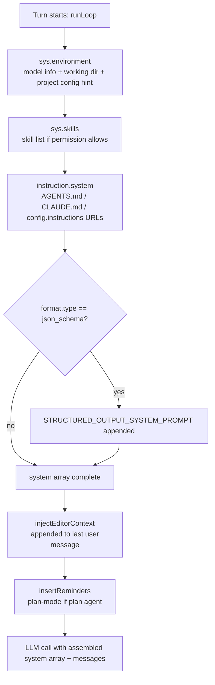

# KiloCode Context & Rules System
> FOR AGENTS. Typed, structured, exhaustive.

---

## Table of Contents

1. [.kilo/ Directory Structure](#kilo-directory-structure)
2. [Instruction Files (AGENTS.md / CLAUDE.md)](#instruction-files)
3. [Rules Files — Load Order](#rules-files--load-order)
4. [System Prompt Assembly](#system-prompt-assembly)
5. [Config Interfaces](#config-interfaces)
6. [Context Window Management](#context-window-management)
7. [EditorContext — Dynamic Per-Message Context](#editorcontext--dynamic-per-message-context)
8. [@mention Syntax](#mention-syntax)
9. [Environment Flags](#environment-flags)
10. [Key Source Files](#key-source-files)

---

## .kilo/ Directory Structure

```
<project-root>/
├── AGENTS.md                      # Primary instruction file (loaded natively)
├── CLAUDE.md                      # Claude-compat alias (loaded unless KILO_DISABLE_CLAUDE_CODE_PROMPT)
├── kilo.json | kilo.jsonc         # Project config (highest precedence among kilo files)
├── opencode.json | opencode.jsonc # Project config (lower precedence)
│
└── .kilo/                         # Canonical Kilo project config directory
    ├── kilo.json | kilo.jsonc     # Config inside dir
    ├── opencode.json              # Config inside dir
    ├── agent/                     # Custom agent definitions
    │   └── <name>.md              # Frontmatter + prompt body → agent named <name>
    ├── agents/                    # Alias for agent/
    ├── command/                   # Custom slash commands
    │   └── <name>.md              # Frontmatter + prompt body → command named <name>
    ├── commands/                  # Alias for command/
    ├── rules/                     # Instruction files (injected into config.instructions[])
    │   └── *.md
    ├── rules-<mode>/              # Mode-specific rules (e.g. rules-code/, rules-architect/)
    │   └── *.md
    ├── plans/                     # Plan files written by the plan agent
    │   └── <session-id>.md
    └── skills/                    # Skill definitions (SKILL.md pattern)
        └── <skill-name>/
            └── SKILL.md

# Legacy / alternate project directory (both .kilo and .kilocode are scanned)
.kilocode/                         # Same structure as .kilo/ (lower precedence)
    ├── agent/ | agents/
    ├── command/ | commands/
    ├── rules/
    ├── rules-<mode>/
    └── skills/

# Legacy single-file rules (project root)
.kilocoderules                     # Legacy; triggers migration warning
.kilocoderules-<mode>              # Legacy mode-specific; e.g. .kilocoderules-code

# Global config (~/.config/kilo/ on Linux, ~/Library/Application Support/kilo/ on macOS,
#               %APPDATA%/kilo/ on Windows — resolved via XDG_CONFIG_HOME)
~/.config/kilo/                    # Global.Path.config
    ├── AGENTS.md                  # Global instruction file
    ├── kilo.json | kilo.jsonc
    ├── opencode.json | opencode.jsonc
    ├── config.json                # Legacy global config
    ├── agent/ | agents/
    ├── command/ | commands/
    └── skills/

~/.kilo/                           # Global kilo dir for skills
~/.kilocode/                       # Global kilocode dir for skills (legacy)
~/.claude/CLAUDE.md                # Read unless KILO_DISABLE_CLAUDE_CODE_PROMPT=true
```

**Scan targets** (walked from `Instance.directory` up to `Instance.worktree`):
- `.kilocode`
- `.kilo`
- `.opencode`

Source: `packages/opencode/src/config/paths.ts` → `directories()`, `packages/opencode/src/kilocode/paths.ts`.

---

## Instruction Files

### Auto-Loaded Files (system prompt)

`Instruction.system()` in `packages/opencode/src/session/instruction.ts` loads these at each turn:

| Priority | Files Checked (in order) | Scope |
|---|---|---|
| 1 | `AGENTS.md`, `CLAUDE.md`\*, `CONTEXT.md`\*\* | Project: first match walking up from `Instance.directory` to `Instance.worktree` — **only first found file/set wins** |
| 2 | `$KILO_CONFIG_DIR/AGENTS.md` | Flag override |
| 3 | `~/.config/kilo/AGENTS.md` | Global |
| 4 | `~/.claude/CLAUDE.md`\* | Global Claude-compat |
| 5 | `config.instructions[]` paths/URLs | Explicit list from config |

\* Omitted when `KILO_DISABLE_CLAUDE_CODE_PROMPT=true` (or `KILO_DISABLE_CLAUDE_CODE=true`).  
\*\* `CONTEXT.md` is deprecated.

### Contextual Instruction Files (per read-tool call)

`Instruction.resolve()` walks upward from the file being read and injects nearby `AGENTS.md`/`CLAUDE.md`/`CONTEXT.md` files **once per assistant message** (claim-tracked to avoid duplicates). Files already loaded as system instructions or already loaded via `read` tool are skipped.

### config.instructions[]

Array of file paths or `https://` URLs. Paths may be:
- Absolute: used as-is
- `~/...`: expanded from `os.homedir()`
- Relative (no leading `/`): resolved via `globUp` walking from `Instance.directory` → `Instance.worktree`

Remote URLs are fetched with a 5-second timeout.

Format when injected into system prompt:
```
Instructions from: /absolute/path/to/file
<file contents>
```

---

## Rules Files — Load Order

Rules are loaded via `RulesMigrator.discoverRules()` in `packages/opencode/src/kilocode/rules-migrator.ts` and injected into `config.instructions[]` by `KilocodeConfig.loadLegacyConfigs()`.

### Discovery Order

```
1. Global rules  (~/.kilo/rules/*.md, ~/.kilocode/rules/*.md)
   — deduped by filename; first global dir wins per filename

2. Project rules (.kilo/rules/*.md, .kilocode/rules/*.md)
   — deduped by filename; .kilo wins over .kilocode per filename

3. Legacy project file (.kilocoderules)
   — included with migration warning

4. Mode-specific rules (per mode in ["code","architect","ask","debug","orchestrator"]):
     a. .kilo/rules-<mode>/*.md, .kilocode/rules-<mode>/*.md
     b. .kilocoderules-<mode>  (legacy, with warning)
```

**All mode-specific rules are loaded regardless of current active mode.**

Injected into `config.instructions[]` (deduplicated via `Array.from(new Set([...existing, ...rules]))`).

### Overall Config Merge Order (lowest → highest precedence)

```
1. Legacy Kilo configs (modes, workflows, rules, MCP, ignore)
2. Organization modes (Kilo Cloud API — requires OAuth)
3. Well-known remote configs (auth entries with type="wellknown")
4. Global config (~/.config/kilo/{kilo,opencode,config}.json[c])
5. KILO_CONFIG env-var file (if set)
6. Project kilo.json / opencode.json files (root-first walk)
7. Config dirs (.kilo/, .kilocode/, .opencode/) kilo/opencode JSON files
8. Per-dir agents, modes, commands (markdown scan)
9. KILO_CONFIG_CONTENT env-var JSON string
10. Kilo Console remote org config
11. Managed config dir (macOS MDM / enterprise)
12. KILO_PERMISSION env-var (permission only)
```

Source: `packages/opencode/src/config/config.ts` → `loadInstanceState()`.

---

## System Prompt Assembly

### Mermaid Diagram



### Ordered System Array Construction

Built in `packages/opencode/src/session/prompt.ts` → `runLoop()` inner block:

```typescript
const [skills, env, instructions, modelMsgs] = yield* Effect.all([
  sys.skills(agent),           // slot 2 — skill list (optional)
  Effect.sync(() =>
    sys.environment(model, lastUser.editorContext)  // slot 1 — env block
  ),
  instruction.system(),        // slot 3 — AGENTS.md + config.instructions
  MessageV2.toModelMessagesEffect(msgs, model),
])
const system = [...env, ...(skills ? [skills] : []), ...instructions]
// if json_schema format: system.push(STRUCTURED_OUTPUT_SYSTEM_PROMPT)
```

Final system array order:
1. **`env[]`** — environment block(s) from `SystemPrompt.environment()`
2. **`skills`** — skill list string (omitted if empty / permission denied)
3. **`instructions[]`** — AGENTS.md + config.instructions files/URLs

### env Block Content

```
You are powered by the model named {model.api.id}. The exact model ID is {providerID}/{modelID}
Here is some useful information about the environment you are running in:
<env>
  Working directory: {Instance.directory}
  Workspace root folder: {Instance.worktree}
  Is directory a git repo: yes|no
  Platform: {process.platform}
  Project config: .kilo/command/*.md, .kilo/agent/*.md, kilo.json, AGENTS.md. Put new commands and agents in .kilo/. Do not use .kilocode/ or .opencode/.
  Global config: {Global.Path.config}/ (same structure)
  [Default shell: {ctx.shell}]   ← only if EditorContext.shell is set
</env>
```

Source: `packages/opencode/src/session/system.ts` → `SystemPrompt.environment()`.

### Provider-Specific System Prompts

Selected by `SystemPrompt.provider(model)` based on `model.prompt` or `model.api.id`:

| `model.prompt` value | Prompt file |
|---|---|
| `anthropic` | `prompt/anthropic.txt` |
| `anthropic_without_todo` | `prompt/default.txt` |
| `beast` | `prompt/beast.txt` |
| `codex` | `prompt/codex.txt` |
| `gemini` | `prompt/gemini.txt` |
| `ling` | `prompt/ling.txt` |
| `trinity` | `prompt/trinity.txt` |
| _(fallback)_ | `prompt/default.txt` |

These are the **agent behavioral prompts** — injected into the model message array (not the system array above). Also: `SOUL` (`soul.txt`) is available via `SystemPrompt.soul()` as the KiloCode identity/personality text.

---

## Config Interfaces

### `Config.Info` (full schema, key fields)

```typescript
// packages/opencode/src/config/config.ts
interface ConfigInfo {
  $schema?: string                           // "https://app.kilo.ai/config.json"
  instructions?: string[]                   // Paths or https:// URLs for extra instruction files
  agent?: Record<string, ConfigAgent.Info>  // Agent overrides; keys: "plan","code","debug","ask","orchestrator","general","explore","title","summary","compaction",...
  command?: Record<string, ConfigCommand.Info>
  model?: string                             // "providerID/modelID"
  small_model?: string
  default_agent?: string                    // Default primary agent name (fallback: "code")
  permission?: ConfigPermission.Info
  mcp?: Record<string, ConfigMCP.Info | { enabled: boolean }>
  compaction?: {
    auto?: boolean      // default true — enable auto-compaction on overflow
    prune?: boolean     // default true — prune old tool outputs
    reserved?: number   // token buffer; default min(20000, maxOutputTokens)
  }
  instructions?: string[]                   // Additional instruction file paths/URLs
  experimental?: {
    codebase_search?: boolean
    openTelemetry?: boolean                 // default true
    batch_tool?: boolean
    primary_tools?: string[]
    continue_loop_on_deny?: boolean
    mcp_timeout?: number
  }
  commit_message?: {
    prompt?: string     // Custom commit message system prompt
  }
  // ...server, lsp, formatter, plugin, provider, etc.
}
```

### `ConfigAgent.Info`

```typescript
// packages/opencode/src/config/agent.ts
interface ConfigAgentInfo {
  model?: string | null        // "providerID/modelID"; null = delete sentinel
  variant?: string
  temperature?: number
  top_p?: number
  prompt?: string              // Agent system prompt body
  description?: string
  mode?: "subagent" | "primary" | "all"
  hidden?: boolean             // Hide from @ autocomplete (subagents only)
  steps?: number               // Max agentic iterations before forced text-only
  permission?: ConfigPermission.Info
  color?: string               // Hex #RRGGBB or theme token
  disable?: boolean
  options?: Record<string, unknown>
}
```

### `RulesMigrator.RuleFile`

```typescript
// packages/opencode/src/kilocode/rules-migrator.ts
interface RuleFile {
  path: string
  source: "global" | "project" | "legacy"
  mode?: string   // e.g. "code", "architect" — undefined = applies to all modes
}
```

### `EditorContext`

```typescript
// packages/opencode/src/kilocode/editor-context.ts
interface EditorContext {
  visibleFiles?: string[]  // Files visible in the editor viewport
  openTabs?: string[]      // All open editor tabs
  activeFile?: string      // Currently focused file
  shell?: string           // Default shell path (placed in static <env> for caching)
}
```

### `SystemPrompt.Interface`

```typescript
// packages/opencode/src/session/system.ts
interface SystemPromptInterface {
  environment: (model: Provider.Model, editorContext?: EditorContext) => string[]
  skills: (agent: Agent.Info) => Effect.Effect<string | undefined>
}
```

### `Instruction.Interface`

```typescript
// packages/opencode/src/session/instruction.ts
interface InstructionInterface {
  clear: (messageID: MessageID) => Effect.Effect<void>
  systemPaths: () => Effect.Effect<Set<string>, AppFileSystem.Error>
  system: () => Effect.Effect<string[], AppFileSystem.Error>
  find: (dir: string) => Effect.Effect<string | undefined, AppFileSystem.Error>
  resolve: (
    messages: MessageV2.WithParts[],
    filepath: string,
    messageID: MessageID,
  ) => Effect.Effect<{ filepath: string; content: string }[], AppFileSystem.Error>
}
```

---

## Context Window Management

### Overflow Detection

`packages/opencode/src/session/overflow.ts` → `isOverflow()`:

```typescript
function isOverflow(input: {
  cfg: Config.Info
  tokens: MessageV2.Assistant["tokens"]
  model: Provider.Model
}): boolean

// Returns false if: compaction.auto === false, or model.limit.context === 0
// token count = tokens.total || (tokens.input + tokens.output)
//   NOTE: cache.read and cache.write are NOT additive (they're subsets of input tokens)
// usable = model.limit.input
//          ? model.limit.input - reserved
//          : model.limit.context - maxOutputTokens(model)
// reserved = config.compaction.reserved
//            ?? min(20_000, maxOutputTokens(model))
// overflow = count >= usable
```

### Compaction (context summarization)

Triggered when `isOverflow()` is true. Capped at `MAX_COMPACTION_ATTEMPTS = 3` per turn.

**Prune** (`SessionCompaction.prune`): Erases output of old tool calls backwards from current position, protecting the most recent `PRUNE_PROTECT = 40_000` token-worth of tool calls. Only runs if `compaction.prune !== false`. Minimum savings threshold: `PRUNE_MINIMUM = 20_000` tokens. Protected tools (never pruned): `["skill"]`.

**Compaction model**: Uses `agent["compaction"].model` if configured, otherwise falls back to the current session model.

### Message Filtering for Context

`MessageV2.filterCompactedEffect()` — removes compacted-out messages before sending to model.

`KiloSessionPromptQueue.scope()` — hides queued follow-up prompts from the current turn's context window.

---

## EditorContext — Dynamic Per-Message Context

`EditorContext` is passed from the VS Code extension on each user message. It is split into two parts:

### Static Part (system prompt — benefits from prompt caching)

Built once per session by `staticEnvLines(ctx)`:
- `Default shell: {ctx.shell}` — appended to `<env>` block in system prompt only if set.

### Dynamic Part (user message — refreshed every turn)

Built by `environmentDetails(ctx)` and injected into the last user message by `KiloSessionPrompt.injectEditorContext()`:

```xml
<environment_details>
Current time: 2026-04-27T14:30:00+00:00
Active file: src/index.ts
Visible files:
  src/index.ts
  src/util.ts
Open tabs:
  src/index.ts
  src/util.ts
  README.md
</environment_details>
```

**Caching**: `injectEditorContext` uses an `EnvCache` keyed by `lastUser.id` — same user message ID across loop iterations produces a byte-identical block (preserves prompt cache hits).

Source: `packages/opencode/src/kilocode/editor-context.ts`, `packages/opencode/src/kilocode/session/prompt.ts`.

---

## @mention Syntax

### In Chat Messages / Command Templates

Regex: `FILE_REGEX = /(?<![\w`])@(\.?[^\s`,.]*(?:\.[^\s`,.]+)*)/g`

Matches `@<path>` tokens (not preceded by word chars or backtick). Captured group 1 = path string.

**Resolution** (`SessionPrompt.resolvePromptParts(template)`):

```
@<path>  →  resolve against Instance.worktree
@~/<path>  →  expand from os.homedir()
```

For each match:
1. If path is a **file**: inject as `FilePart` (text/plain → calls Read tool; directory → calls Read with `includeDirectoryFiles:true`; other mime → base64 data URL)
2. If path is an **agent name** (no file at that path): inject as `AgentPart` — triggers `task` tool call with that subagent

### In Config Files (command templates / instruction patterns)

Same `FILE_REGEX` applies to command `.md` template bodies.

Shell interpolation: `` !`<cmd>` `` in templates is executed via the preferred shell before dispatch.

Positional args in templates: `$1`, `$2`, ... `$N` (last positional captures remaining args). `$ARGUMENTS` captures the full raw argument string.

### @mention → PromptInput.parts mapping

```typescript
// discriminated union
type PromptInputPart =
  | { type: "text";    text: string; ... }
  | { type: "file";    url: string; mime: string; filename?: string; source?: MCPResource }
  | { type: "agent";   name: string }
  | { type: "subtask"; agent: string; prompt: string; description: string; command?: string; model?: ModelRef }
```

Source: `packages/opencode/src/config/markdown.ts` (FILE_REGEX), `packages/opencode/src/session/prompt.ts` (resolvePromptParts).

---

## Environment Flags

| Flag | Type | Effect |
|---|---|---|
| `KILO_DISABLE_PROJECT_CONFIG` | bool | Skip all project-local config/instruction loading |
| `KILO_DISABLE_CLAUDE_CODE` | bool | Disables `CLAUDE.md` loading and Claude Code skills |
| `KILO_DISABLE_CLAUDE_CODE_PROMPT` | bool | Skip `CLAUDE.md` and `~/.claude/CLAUDE.md` |
| `KILO_CONFIG` | path | Additional config file (loaded after global, before project) |
| `KILO_CONFIG_DIR` | path | Override config directory (used for instruction path resolution) |
| `KILO_CONFIG_CONTENT` | JSON string | Highest-precedence config; parsed inline |
| `KILO_PERMISSION` | JSON string | Permission override (merged last) |
| `KILO_DISABLE_AUTOCOMPACT` | bool | Sets `compaction.auto = false` |
| `KILO_DISABLE_PRUNE` | bool | Sets `compaction.prune = false` |
| `KILO_EXPERIMENTAL_PLAN_MODE` | bool | Enable experimental plan mode flow |
| `KILO_CLIENT` | string | `"cli"` \| `"vscode"` — affects plan follow-up UX |

Source: `packages/opencode/src/flag/flag.ts`.

---

## Key Source Files

| File | Purpose |
|---|---|
| `packages/opencode/src/session/instruction.ts` | `Instruction` service: loads AGENTS.md, config.instructions[], contextual instruction files per read-tool call |
| `packages/opencode/src/session/system.ts` | `SystemPrompt` service: assembles env block, skills list |
| `packages/opencode/src/session/prompt.ts` | `SessionPrompt` service: orchestrates runLoop, system array assembly, @mention resolution |
| `packages/opencode/src/session/overflow.ts` | Context overflow detection logic |
| `packages/opencode/src/session/compaction.ts` | Compaction (summarize + prune) |
| `packages/opencode/src/config/config.ts` | Full config loading pipeline + merge order |
| `packages/opencode/src/config/paths.ts` | Config directory discovery (walks .kilo/.kilocode/.opencode) |
| `packages/opencode/src/config/agent.ts` | Agent config loading from `agent/*.md` |
| `packages/opencode/src/config/markdown.ts` | FILE_REGEX (@mention), SHELL_REGEX, frontmatter parser |
| `packages/opencode/src/kilocode/rules-migrator.ts` | Discovers .kilocoderules / .kilo/rules/*.md → config.instructions[] |
| `packages/opencode/src/kilocode/config/config.ts` | KilocodeConfig: legacy mode/workflow/rules/MCP/ignore migration |
| `packages/opencode/src/kilocode/editor-context.ts` | EditorContext interface, staticEnvLines(), environmentDetails() |
| `packages/opencode/src/kilocode/session/prompt.ts` | KiloSessionPrompt: injectEditorContext, insertPlanReminders |
| `packages/opencode/src/kilocode/paths.ts` | Skill directory discovery, VSCode global storage paths |
| `packages/opencode/src/flag/flag.ts` | All feature flags and env-var toggles |
| `packages/opencode/src/global/index.ts` | Global.Path.* (config, data, cache, state) via XDG |
| `packages/opencode/src/session/prompt/` | Provider-specific system prompt text files (.txt) |
| `packages/opencode/src/kilocode/soul.txt` | KiloCode identity/personality prompt (Kilo persona) |
