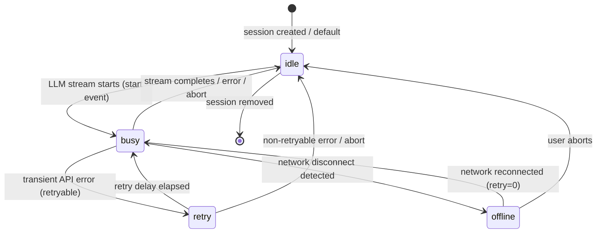
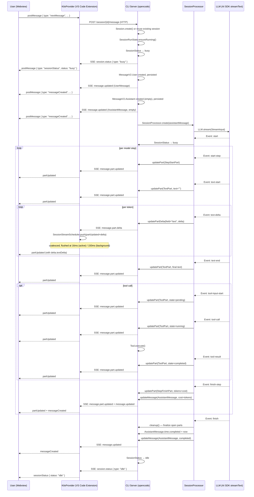
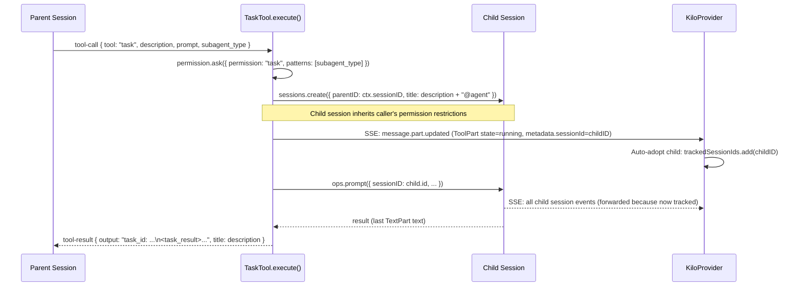

# KiloCode Chat & Task Flow
> FOR AGENTS. Typed, structured, exhaustive.

---

## Table of Contents
1. [Core ID Types](#core-id-types)
2. [Session Info Type](#session-info-type)
3. [SessionStatus State Machine](#sessionstatus-state-machine)
4. [Message Part Types](#message-part-types)
5. [MessageV2 Info Types](#messagev2-info-types)
6. [IPC Message Types (Webview)](#ipc-message-types-webview)
7. [Chat Lifecycle Sequence](#chat-lifecycle-sequence)
8. [SSE → Webview Mapping](#sse--webview-mapping)
9. [Streaming Architecture](#streaming-architecture)
10. [Task Interruption](#task-interruption)
11. [Subtask / Subagent Spawning](#subtask--subagent-spawning)
12. [Token Counting & Context Window Warnings](#token-counting--context-window-warnings)
13. [Retry Policy](#retry-policy)
14. [Key Files](#key-files)

---

## Core ID Types

File: `packages/opencode/src/session/schema.ts`

```typescript
type SessionID = Brand<string, "SessionID">   // prefix: "session", descending ulid
type MessageID = Brand<string, "MessageID">   // prefix: "message", ascending ulid
type PartID    = Brand<string, "PartID">      // prefix: "part",    ascending ulid
```

- `SessionID.descending()` — newest-first ordering for session list
- `MessageID.ascending()` — chronological ordering within a session
- `PartID.ascending()` — chronological ordering within a message

---

## Session Info Type

File: `packages/opencode/src/session/session.ts`

```typescript
interface Info {
  id: SessionID
  slug: string
  projectID: ProjectID
  workspaceID?: WorkspaceID
  directory: string
  parentID?: SessionID      // set for child (subtask) sessions
  title: string
  version: string
  summary?: {
    additions: number
    deletions: number
    files: number
    diffs?: Array<{ file: string; additions: number; deletions: number; status?: "added"|"deleted"|"modified" }>
  }
  share?: { url: string }
  permission?: Permission.Ruleset
  revert?: {
    messageID: MessageID
    partID?: PartID
    snapshot?: string
    diff?: string
  }
  time: {
    created: number      // epoch ms
    updated: number      // epoch ms
    compacting?: number  // epoch ms; set while compaction is running
    archived?: number    // epoch ms; set when archived
  }
}
```

### Session Events (SyncEvent)

| Event type | Payload |
|---|---|
| `session.created` | `{ sessionID, info: Info }` |
| `session.updated` | `{ sessionID, info: Partial<Info> }` |
| `session.deleted` | `{ sessionID, info: Info }` |
| `session.diff`    | `{ sessionID, diff: FileDiff[] }` |
| `session.error`   | `{ sessionID?, error: AssistantError }` |

---

## SessionStatus State Machine

File: `packages/opencode/src/session/status.ts`

```typescript
type SessionStatus =
  | { type: "idle" }
  | { type: "busy" }
  | { type: "retry"; attempt: number; message: string; next: number }  // next = epoch ms of next attempt
  | { type: "offline"; requestID: string; message: string }            // kilocode extension
```

### State Transitions



### BusEvent
```typescript
// Published on every status change
"session.status": { sessionID: SessionID; status: SessionStatus.Info }
// Legacy (deprecated)
"session.idle":   { sessionID: SessionID }
```

---

## Message Part Types

File: `packages/opencode/src/session/message-v2.ts`

All parts share `PartBase`:
```typescript
interface PartBase {
  id: PartID
  sessionID: SessionID
  messageID: MessageID
}
```

### Complete Part Union

```typescript
type Part =
  | TextPart
  | ReasoningPart
  | FilePart
  | ToolPart
  | StepStartPart
  | StepFinishPart
  | SnapshotPart
  | PatchPart
  | AgentPart
  | RetryPart
  | CompactionPart
  | SubtaskPart
```

### TextPart
```typescript
interface TextPart extends PartBase {
  type: "text"
  text: string
  synthetic?: boolean    // injected by system, not shown to user
  ignored?: boolean      // excluded from model context
  time?: { start: number; end?: number }
  metadata?: Record<string, any>
}
```

### ReasoningPart
```typescript
interface ReasoningPart extends PartBase {
  type: "reasoning"
  text: string
  time: { start: number; end?: number }
  metadata?: Record<string, any>
}
```

### ToolPart
```typescript
interface ToolPart extends PartBase {
  type: "tool"
  callID: string
  tool: string           // tool name, e.g. "bash", "edit", "task"
  state: ToolState
  metadata?: Record<string, any>
}

type ToolState =
  | { status: "pending"; input: Record<string,any>; raw: string }
  | { status: "running"; input: Record<string,any>; title?: string; metadata?: Record<string,any>; time: { start: number } }
  | { status: "completed"; input: Record<string,any>; output: string; title: string; metadata: Record<string,any>;
      time: { start: number; end: number; compacted?: number }; attachments?: FilePart[] }
  | { status: "error"; input: Record<string,any>; error: string; metadata?: Record<string,any>;
      time: { start: number; end: number } }
```

### StepStartPart / StepFinishPart
```typescript
interface StepStartPart extends PartBase {
  type: "step-start"
  snapshot?: string
}

interface StepFinishPart extends PartBase {
  type: "step-finish"
  reason: string          // finishReason from AI SDK
  snapshot?: string
  cost: number
  tokens: {
    total?: number
    input: number
    output: number
    reasoning: number
    cache: { read: number; write: number }
  }
}
```

### SubtaskPart
```typescript
interface SubtaskPart extends PartBase {
  type: "subtask"
  prompt: string
  description: string
  agent: string           // subagent_type name
  model?: { providerID: ProviderID; modelID: ModelID }
  command?: string
}
```

### FilePart
```typescript
interface FilePart extends PartBase {
  type: "file"
  mime: string
  filename?: string
  url: string             // data: URL or file:// URL
  source?: FilePartSource // "file" | "symbol" | "resource"
}
```

### Other Part Types
```typescript
interface SnapshotPart extends PartBase { type: "snapshot"; snapshot: string }
interface PatchPart     extends PartBase { type: "patch"; hash: string; files: string[] }
interface AgentPart     extends PartBase { type: "agent"; name: string; source?: { value: string; start: number; end: number } }
interface CompactionPart extends PartBase { type: "compaction"; auto: boolean; overflow?: boolean }
interface RetryPart     extends PartBase { type: "retry"; attempt: number; error: APIError; time: { created: number } }
```

### Part Events (SyncEvent / BusEvent)

| Event | Transport | Payload |
|---|---|---|
| `message.part.updated` | SyncEvent | `{ sessionID, part: Part, time: number }` |
| `message.part.delta`   | BusEvent  | `{ sessionID, messageID, partID, field: string, delta: string }` |
| `message.part.removed` | SyncEvent | `{ sessionID, messageID, partID }` |

`message.part.delta` is used for streaming text increments — only `field="text"` is currently used.

---

## MessageV2 Info Types

File: `packages/opencode/src/session/message-v2.ts`

```typescript
type MessageInfo = UserMessage | AssistantMessage

interface UserMessage {
  id: MessageID
  sessionID: SessionID
  role: "user"
  time: { created: number }
  format?: OutputFormat       // "text" | "json_schema"
  summary?: { title?: string; body?: string; diffs: FileDiff[] }
  agent: string               // agent name
  model: { providerID: ProviderID; modelID: ModelID; variant?: string }
  system?: string             // extra system prompt override
  tools?: Record<string, boolean>  // per-tool enable/disable
  editorContext?: {           // kilocode extension
    visibleFiles?: string[]
    openTabs?: string[]
    activeFile?: string
    shell?: string
  }
}

interface AssistantMessage {
  id: MessageID
  sessionID: SessionID
  role: "assistant"
  parentID: MessageID         // the UserMessage that triggered this response
  time: { created: number; completed?: number }
  error?: AssistantError      // set when stream ends with error
  modelID: ModelID
  providerID: ProviderID
  agent: string
  mode: string                // deprecated
  path: { cwd: string; root: string }
  summary?: boolean           // true if this is a compaction summary message
  cost: number                // total USD cost accumulated across steps
  tokens: { total?: number; input: number; output: number; reasoning: number; cache: { read: number; write: number } }
  structured?: any            // populated when format=json_schema
  variant?: string
  finish?: string             // finishReason of last step
}
```

### AssistantError Discriminated Union
```typescript
type AssistantError =
  | { name: "ProviderAuthError";      data: { providerID: string; message: string } }
  | { name: "MessageOutputLengthError"; data: {} }
  | { name: "MessageAbortedError";    data: { message: string } }
  | { name: "StructuredOutputError";  data: { message: string; retries: number } }
  | { name: "ContextOverflowError";   data: { message: string; responseBody?: string } }
  | { name: "APIError";               data: { message: string; statusCode?: number; isRetryable: boolean;
                                               responseHeaders?: Record<string,string>; responseBody?: string;
                                               metadata?: Record<string,string> } }
  | { name: "UnknownError";           data: { message: string } }
```

### Message Events (SyncEvent)

| Event | Payload |
|---|---|
| `message.updated` | `{ sessionID, info: MessageInfo }` |
| `message.removed` | `{ sessionID, messageID }` |

---

## IPC Message Types (Webview)

File: `packages/kilo-vscode/src/shared/stream-messages.ts` and `packages/kilo-vscode/src/kilo-provider-utils.ts`

```typescript
// Streaming wire types — single source of truth for extension ↔ webview
type PartTextDelta = { type: "text-delta"; textDelta: string }

type PartUpdate<P = unknown> = {
  type: "partUpdated"
  sessionID: string
  messageID: string
  part: P
  delta?: PartTextDelta    // present only for streaming text increments
}

type PartBatch<P = unknown> = {
  type: "partsUpdated"
  updates: PartUpdate<P>[]
}
```

```typescript
// Complete WebviewMessage union
type WebviewMessage =
  | PartUpdate
  | PartBatch
  | { type: "messageCreated"; message: Record<string, unknown> }
  | { type: "sessionStatus"; sessionID: string; status: string;
      attempt?: number; message?: string; next?: number }
  | { type: "permissionRequest"; permission: {
        id: string; sessionID: string; toolName: string;
        patterns: string[]; always: string[]; args: Record<string, unknown>;
        message: string; tool?: { messageID: string; callID: string } } }
  | { type: "todoUpdated"; sessionID: string; items: unknown[] }
  | { type: "questionRequest"; question: {
        id: string; sessionID: string; questions: unknown[];
        blocking?: boolean; tool?: unknown } }
  | { type: "questionResolved"; requestID: string }
  | { type: "suggestionRequest"; suggestion: {
        id: string; sessionID: string; text: string; actions: unknown[];
        blocking?: boolean; tool?: unknown } }
  | { type: "suggestionResolved"; requestID: string }
  | { type: "suggestionError"; requestID: string }
  | { type: "permissionResolved"; permissionID: string }
  | { type: "permissionError"; permissionID: string }
  | { type: "sessionCreated"; session: SessionSummary; draftID?: string }
  | { type: "sessionUpdated"; session: SessionSummary }
  | { type: "messageRemoved"; sessionID: string; messageID: string }
  | { type: "sessionError"; sessionID?: string; error?: unknown }
  | null
```

```typescript
// Minimal session shape sent to webview (sessionToWebview())
interface SessionSummary {
  id: string
  parentID: string | null
  title: string
  createdAt: string          // ISO 8601
  updatedAt: string          // ISO 8601
  revert: Session.Info["revert"] | null
  summary: Session.Info["summary"] | null
}
```

---

## Chat Lifecycle Sequence



---

## SSE → Webview Mapping

File: `packages/kilo-vscode/src/kilo-provider-utils.ts` — `mapSSEEventToWebviewMessage(event, sessionID)`

| SSE Event type | WebviewMessage type | Notes |
|---|---|---|
| `message.part.updated` | `partUpdated` | Full part replacement; `delta` absent |
| `message.part.delta`   | `partUpdated` | Streaming delta; `delta.type="text-delta"` + `delta.textDelta` set |
| `message.updated`      | `messageCreated` | Creates or updates a message in webview store |
| `message.removed`      | `messageRemoved` | — |
| `session.status`       | `sessionStatus`  | Carries `attempt`/`message`/`next` for retry; `message` for offline |
| `permission.asked`     | `permissionRequest` | Tool permission gate |
| `permission.replied`   | `permissionResolved` | — |
| `todo.updated`         | `todoUpdated`    | — |
| `question.asked`       | `questionRequest` | — |
| `question.replied` / `question.rejected` | `questionResolved` | — |
| `suggestion.shown`     | `suggestionRequest` | — |
| `suggestion.accepted` / `suggestion.dismissed` | `suggestionResolved` | — |
| `session.error`        | `sessionError`   | — |
| `session.created`      | `sessionCreated` | — |
| `session.updated`      | `sessionUpdated` | — |
| anything else          | `null`           | Dropped silently |

### Routing in KiloProvider.handleEvent()

1. Drop events from foreign projects (`isEventFromForeignProject`)
2. `session.status` events bypass the tracked-session guard — forwarded to all providers
3. `message.part.updated` and `message.part.delta` without a resolvable sessionID are dropped
4. Events with a sessionID not in `trackedSessionIds` are dropped
5. `partUpdated` messages are routed through `SessionStreamScheduler.push()`; all other messages bypass the scheduler via direct `postMessage()`

---

## Streaming Architecture

File: `packages/kilo-vscode/src/kilo-provider/session-stream-scheduler.ts`

```typescript
class SessionStreamScheduler {
  // Coalesces PartUpdate events per (sessionID, messageID, partID) key.
  // Prioritises the focused session; throttles background sessions.

  focus(sessionID?: string): void   // called when user switches to a session tab
  push(msg: PartUpdate): void       // called for every message.part.delta / message.part.updated
  flush(sessionID?: string): void   // called before any non-partUpdated message for ordering
  drop(sessionID: string): void     // discard buffered updates (session deleted / snapshot loaded)
  dispose(): void                   // clean up timers on provider teardown
}
```

### Timing constants

| Constant | Default | Purpose |
|---|---|---|
| `activeMs` | 16 ms | Flush cadence for focused session (~60 Hz frame) |
| `backgroundBaseMs` | 150 ms | Base flush cadence for non-focused sessions |
| `backgroundStepMs` | 20 ms | Extra ms per background session beyond first 2 |
| `backgroundMaxMs` | 400 ms | Hard cap for background flush delay |

### Coalescing logic
- Keyed by `{sessionID}:{messageID}:{partID}`
- Delta updates (`delta.textDelta`) are string-concatenated into the buffered part's `text` field
- A full-part replacement after buffered deltas triggers an immediate flush of the buffer first

---

## Task Interruption

### Server side (SessionRunState)

File: `packages/opencode/src/session/run-state.ts`

```typescript
interface SessionRunState.Interface {
  assertNotBusy(sessionID): Effect<void>          // throws BusyError if already running
  cancel(sessionID): Effect<void>                 // interrupts the running Effect fiber
  ensureRunning(sessionID, onInterrupt, work): Effect<WithParts>
  startShell(sessionID, onInterrupt, work): Effect<WithParts>
}
```

`cancel()` flow:
1. Looks up the `Runner` for the session
2. Calls `runner.cancel` which sends an `Interrupt` signal to the running Effect fiber
3. The fiber's `onInterrupt` handler sets `aborted = true` and calls `halt(new DOMException("Aborted", "AbortError"))`
4. `halt()` writes `AssistantMessage.error = AbortedError` and calls `status.set(sessionID, { type: "idle" })`
5. `cleanup()` runs unconditionally via `Effect.ensuring()` — finalizes any open parts, marks tools as interrupted

### Extension side

File: `packages/kilo-vscode/src/KiloProvider.ts`

The webview sends `{ type: "cancelCurrentRequest" }` → KiloProvider calls:
```typescript
await this.client.session.abort({ id: sessionID })
// DELETE /session/{id}/message  (or equivalent abort endpoint)
```

### Interrupted tool state

When a tool call is in-flight during abort:
- `ToolPart.state` is set to `{ status: "error", error: "Tool execution aborted", metadata: { interrupted: true } }`
- The `interrupted` flag is checked in `toModelMessages()` to inject a tool result instead of dangling `tool_use`

---

## Subtask / Subagent Spawning

Files:
- `packages/opencode/src/tool/task.ts` — `TaskTool`
- `packages/opencode/src/session/message-v2.ts` — `SubtaskPart`

### Flow



### SubtaskPart placement
- Written to the **parent** session's UserMessage parts (not the child session)
- Contains `prompt`, `description`, `agent`, optional `model`, optional `command`

### Task resumption
- Pass `task_id` parameter equal to a prior child session ID
- TaskTool resolves the existing session via `sessions.get(SessionID.make(task_id))` instead of creating a new one

### Permission inheritance
- `KiloTask.inherited()` copies edit/bash/MCP restrictions from the caller agent's session
- Child session's `permission` ruleset explicitly denies `todowrite` and `task` unless the subagent's config allows them

---

## Token Counting & Context Window Warnings

File: `packages/opencode/src/session/overflow.ts`

```typescript
function isOverflow(input: {
  cfg: Config.Info
  tokens: AssistantMessage["tokens"]
  model: Provider.Model
}): boolean
```

### Logic

```
if cfg.compaction.auto === false → never overflow
if model.limit.context === 0 → never overflow

count = tokens.total OR (tokens.input + tokens.output)

reserved = cfg.compaction.reserved
         ?? min(20_000, model maxOutputTokens)

usable = model.limit.input
         ? model.limit.input - reserved
         : model.limit.context - model.maxOutputTokens

return count >= usable
```

Note: `tokens.cache.read` and `tokens.cache.write` are NOT added to `count`. They are subsets of `tokens.input` already.

### On overflow

In `SessionProcessor.process()`:
1. `isOverflow()` is checked after every `finish-step` event
2. If true: `ctx.needsCompaction = true`, stream is drained via `Stream.takeUntil(() => ctx.needsCompaction)`
3. `SessionProcessor.process()` returns `"compact"`
4. Caller (in `SessionPrompt`) runs `SessionCompaction` which summarizes history and injects a `CompactionPart`

### Context overflow error

If the model itself rejects the request (400/context-too-long response body):
- `MessageV2.fromError()` maps it to `ContextOverflowError`
- `SessionProcessor.halt()` detects `ContextOverflowError`, sets `ctx.needsCompaction = true`, publishes `session.error`, but does NOT set `assistantMessage.error`
- Result is `"compact"` not `"stop"`

---

## Retry Policy

File: `packages/opencode/src/session/retry.ts`

```typescript
// Delay calculation (milliseconds)
function delay(attempt: number, error?: APIError): number
// Base: 2000 * 2^(attempt-1), capped at 30s (no headers) or MAX_INT (with headers)
// Respects Retry-After and Retry-After-Ms response headers
```

### Retryable conditions
- `APIError` with `isRetryable: true` OR `statusCode >= 500`
- Error message contains "rate limit", "too many requests", "rate increased too quickly"
- JSON body has `type: "error"` with `error.type: "too_many_requests"` or rate-limit code

### Non-retryable
- `ContextOverflowError` — handled as compaction
- `ProviderAuthError` / auth failures
- Kilo-specific billing errors (`isKiloError()`)
- `FreeUsageLimitError` in response body
- Abort (user cancellation)

### Status during retry
```typescript
// Published to SSE → webview for each retry attempt
{ type: "session.status", sessionID, status: {
    type: "retry",
    attempt: number,
    message: string,   // human-readable reason
    next: number       // epoch ms of next attempt
}}
```

---

## Key Files

| Path | Role |
|---|---|
| `packages/opencode/src/session/session.ts` | Session CRUD, event publication, `getUsage()` cost calculation |
| `packages/opencode/src/session/message-v2.ts` | All part types, message types, `toModelMessages()`, `fromError()` |
| `packages/opencode/src/session/schema.ts` | `SessionID`, `MessageID`, `PartID` branded types |
| `packages/opencode/src/session/status.ts` | `SessionStatus` type and service |
| `packages/opencode/src/session/run-state.ts` | `SessionRunState` — concurrency control, cancel |
| `packages/opencode/src/session/processor.ts` | `SessionProcessor` — LLM stream event handler, part lifecycle |
| `packages/opencode/src/session/prompt.ts` | `SessionPrompt` — entry point for chat turns, tool wiring |
| `packages/opencode/src/session/llm.ts` | `LLM.stream()` — wraps AI SDK `streamText`, injects system prompts |
| `packages/opencode/src/session/retry.ts` | `SessionRetry.policy()` — Effect Schedule for transient errors |
| `packages/opencode/src/session/overflow.ts` | `isOverflow()` — context window saturation check |
| `packages/opencode/src/tool/task.ts` | `TaskTool` — subtask/subagent spawning |
| `packages/kilo-vscode/src/kilo-provider-utils.ts` | `mapSSEEventToWebviewMessage()`, `WebviewMessage` union |
| `packages/kilo-vscode/src/shared/stream-messages.ts` | `PartUpdate`, `PartBatch`, `PartTextDelta` wire types |
| `packages/kilo-vscode/src/kilo-provider/session-stream-scheduler.ts` | `SessionStreamScheduler` — coalescing/throttling |
| `packages/kilo-vscode/src/KiloProvider.ts` | `handleEvent()` — SSE dispatch, scheduler integration |
