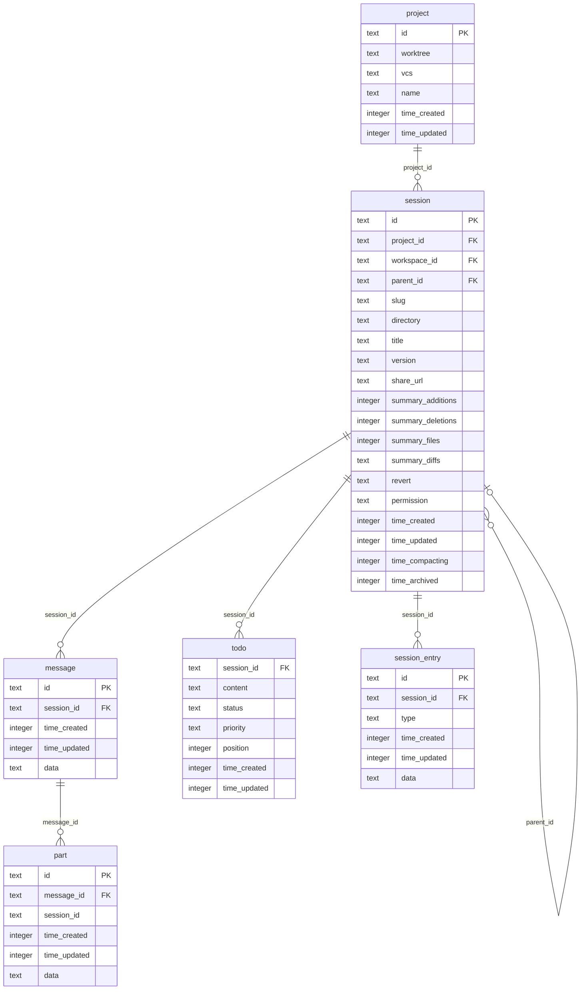

# KiloCode Session & History Storage
> FOR AGENTS. Typed, structured, exhaustive.

---

## Storage Location

### SQLite Database Path

```
path.join(Global.Path.data, "kilo.db")
```

`Global.Path.data` resolves via XDG base-dir conventions:

| Platform | `Global.Path.data` | Full DB path |
|---|---|---|
| Linux | `$XDG_DATA_HOME/kilo` → `~/.local/share/kilo` | `~/.local/share/kilo/kilo.db` |
| macOS | `$XDG_DATA_HOME/kilo` → `~/Library/Application Support/kilo` | `~/Library/Application Support/kilo/kilo.db` |
| Windows | `%APPDATA%\kilo` | `%APPDATA%\kilo\kilo.db` |

Override: `KILO_DB=<path>` env var. `:memory:` for in-memory. Relative path is joined to `Global.Path.data`.

Source: `packages/opencode/src/storage/db.ts` → `getChannelPath()` + `Path`

### SQLite PRAGMAs applied at open

```sql
PRAGMA journal_mode = WAL;
PRAGMA synchronous = NORMAL;
PRAGMA busy_timeout = 5000;
PRAGMA cache_size = -64000;
PRAGMA foreign_keys = ON;
PRAGMA wal_checkpoint(PASSIVE);
```

---

## Schema

### ER Diagram



---

### SQL CREATE TABLE Statements (current schema)

```sql
CREATE TABLE session (
  id               text PRIMARY KEY,
  project_id       text NOT NULL REFERENCES project(id) ON DELETE CASCADE,
  workspace_id     text,
  parent_id        text,
  slug             text NOT NULL,
  directory        text NOT NULL,
  title            text NOT NULL,
  version          text NOT NULL,
  share_url        text,
  summary_additions integer,
  summary_deletions integer,
  summary_files    integer,
  summary_diffs    text,             -- JSON: {file,additions,deletions,status?}[]
  revert           text,             -- JSON: {messageID,partID?,snapshot?,diff?}
  permission       text,             -- JSON: Permission.Ruleset
  time_created     integer NOT NULL,
  time_updated     integer NOT NULL,
  time_compacting  integer,
  time_archived    integer
);

CREATE TABLE message (
  id           text PRIMARY KEY,
  session_id   text NOT NULL REFERENCES session(id) ON DELETE CASCADE,
  time_created integer NOT NULL,
  time_updated integer NOT NULL,
  data         text NOT NULL         -- JSON: MessageV2.Info (User | Assistant), minus id/sessionID
);

CREATE TABLE part (
  id           text PRIMARY KEY,
  message_id   text NOT NULL REFERENCES message(id) ON DELETE CASCADE,
  session_id   text NOT NULL,
  time_created integer NOT NULL,
  time_updated integer NOT NULL,
  data         text NOT NULL         -- JSON: MessageV2.Part variant, minus id/sessionID/messageID
);

CREATE TABLE todo (
  session_id   text NOT NULL REFERENCES session(id) ON DELETE CASCADE,
  content      text NOT NULL,
  status       text NOT NULL,
  priority     text NOT NULL,
  position     integer NOT NULL,
  time_created integer NOT NULL,
  time_updated integer NOT NULL,
  PRIMARY KEY (session_id, position)
);

CREATE TABLE session_entry (
  id           text PRIMARY KEY,
  session_id   text NOT NULL REFERENCES session(id) ON DELETE CASCADE,
  type         text NOT NULL,
  time_created integer NOT NULL,
  time_updated integer NOT NULL,
  data         text NOT NULL         -- JSON: Omit<SessionEntry.Entry, "type"|"id">
);
```

### Indexes

```sql
CREATE INDEX session_project_idx                 ON session (project_id);
CREATE INDEX session_workspace_idx               ON session (workspace_id);
CREATE INDEX session_parent_idx                  ON session (parent_id);
CREATE INDEX message_session_time_created_id_idx ON message (session_id, time_created, id);
CREATE INDEX part_message_id_id_idx              ON part    (message_id, id);
CREATE INDEX part_session_idx                    ON part    (session_id);
CREATE INDEX todo_session_idx                    ON todo    (session_id);
CREATE INDEX session_entry_session_idx           ON session_entry (session_id);
CREATE INDEX session_entry_session_type_idx      ON session_entry (session_id, type);
CREATE INDEX session_entry_time_created_idx      ON session_entry (time_created);
```

---

## Drizzle ORM Schema Definitions

Source: `packages/opencode/src/session/session.sql.ts`

```typescript
import { sqliteTable, text, integer, index, primaryKey } from "drizzle-orm/sqlite-core"
import { Timestamps } from "../storage/schema.sql"

// Timestamps helper (applied via spread):
// time_created: integer().notNull().$default(() => Date.now())
// time_updated: integer().notNull().$onUpdate(() => Date.now())

export const SessionTable = sqliteTable(
  "session",
  {
    id:                  text().$type<SessionID>().primaryKey(),
    project_id:          text().$type<ProjectID>().notNull().references(() => ProjectTable.id, { onDelete: "cascade" }),
    workspace_id:        text().$type<WorkspaceID>(),
    parent_id:           text().$type<SessionID>(),
    slug:                text().notNull(),
    directory:           text().notNull(),
    title:               text().notNull(),
    version:             text().notNull(),
    share_url:           text(),
    summary_additions:   integer(),
    summary_deletions:   integer(),
    summary_files:       integer(),
    summary_diffs:       text({ mode: "json" })
                           .$type<{ file: string; additions: number; deletions: number; status?: "added"|"deleted"|"modified" }[]>(),
    revert:              text({ mode: "json" })
                           .$type<{ messageID: MessageID; partID?: PartID; snapshot?: string; diff?: string }>(),
    permission:          text({ mode: "json" }).$type<Permission.Ruleset>(),
    ...Timestamps,
    time_compacting:     integer(),
    time_archived:       integer(),
  },
  (table) => [
    index("session_project_idx").on(table.project_id),
    index("session_workspace_idx").on(table.workspace_id),
    index("session_parent_idx").on(table.parent_id),
  ],
)

export const MessageTable = sqliteTable(
  "message",
  {
    id:          text().$type<MessageID>().primaryKey(),
    session_id:  text().$type<SessionID>().notNull().references(() => SessionTable.id, { onDelete: "cascade" }),
    ...Timestamps,
    data:        text({ mode: "json" }).notNull().$type<Omit<MessageV2.Info, "id"|"sessionID">>(),
  },
  (table) => [
    index("message_session_time_created_id_idx").on(table.session_id, table.time_created, table.id),
  ],
)

export const PartTable = sqliteTable(
  "part",
  {
    id:          text().$type<PartID>().primaryKey(),
    message_id:  text().$type<MessageID>().notNull().references(() => MessageTable.id, { onDelete: "cascade" }),
    session_id:  text().$type<SessionID>().notNull(),
    ...Timestamps,
    data:        text({ mode: "json" }).notNull().$type<Omit<MessageV2.Part, "id"|"sessionID"|"messageID">>(),
  },
  (table) => [
    index("part_message_id_id_idx").on(table.message_id, table.id),
    index("part_session_idx").on(table.session_id),
  ],
)
```

---

## ID Format

Source: `packages/opencode/src/id/id.ts`

### Prefixes

| Entity | Prefix | Example prefix in ID |
|---|---|---|
| session | `ses` | `ses_<body>` |
| message | `msg` | `msg_<body>` |
| part | `prt` | `prt_<body>` |

### Format

```
<prefix>_<12-hex-time-bytes><14-base62-random>
```

- Total length: `prefix.length + 1 + 26` characters
- Time portion: 6 bytes encoded as 12 hex chars = millisecond timestamp × 0x1000 + monotonic counter
- Random portion: 14 base62 chars (charset: `0-9A-Za-z`)
- `ascending` direction: raw time value (lexicographically sortable oldest→newest)
- `descending` direction: bitwise NOT of time value (lexicographically sortable newest→oldest)

```typescript
// Session IDs are DESCENDING (newest first in lexicographic order)
SessionID.descending()  // used at session creation

// Message IDs are ASCENDING (oldest first)
MessageID.ascending()

// Part IDs are ASCENDING
PartID.ascending()
```

### TypeScript ID Types

```typescript
// packages/opencode/src/session/schema.ts

export const SessionID = Schema.String
  .annotate({ [ZodOverride]: Identifier.schema("session") })
  .pipe(Schema.brand("SessionID"), withStatics(s => ({
    descending: (id?: string) => s.make(Identifier.descending("session", id)),
    zod: Identifier.schema("session").pipe(z.custom<...>()),
  })))

export const MessageID = Schema.String
  .annotate({ [ZodOverride]: Identifier.schema("message") })
  .pipe(Schema.brand("MessageID"), withStatics(s => ({
    ascending: (id?: string) => s.make(Identifier.ascending("message", id)),
    zod: Identifier.schema("message").pipe(z.custom<...>()),
  })))

export const PartID = Schema.String
  .annotate({ [ZodOverride]: Identifier.schema("part") })
  .pipe(Schema.brand("PartID"), withStatics(s => ({
    ascending: (id?: string) => s.make(Identifier.ascending("part", id)),
    zod: Identifier.schema("part").pipe(z.custom<...>()),
  })))
```

---

## Cursor-Based Pagination

Source: `packages/opencode/src/session/message-v2.ts` → `MessageV2.page()`, `MessageV2.stream()`

### Cursor Structure

```typescript
interface Cursor {
  id:   MessageID   // message ID at page boundary
  time: number      // time_created value at page boundary
}
```

Encoding: `Buffer.from(JSON.stringify(cursor)).toString("base64url")`
Decoding: `Cursor.parse(JSON.parse(Buffer.from(input, "base64url").toString("utf8")))`

### page() Function

```typescript
function page(input: {
  sessionID: SessionID
  limit: number      // default used by UI: 80 (no fixed constant; callers pass it)
  before?: string    // opaque base64url cursor; omit for first page
}): {
  items: MessageV2.WithParts[]   // oldest→newest within page
  more: boolean
  cursor?: string                // present only when more=true
}
```

- Query orders by `(time_created DESC, id DESC)` — newest messages first
- Returns `limit + 1` rows to detect `more`
- Slices to `limit`, reverses to return oldest→newest
- "Older than cursor" predicate:
  ```sql
  time_created < cursor.time
  OR (time_created = cursor.time AND id < cursor.id)
  ```

### stream() Generator (internal)

```typescript
function* stream(sessionID: SessionID): Generator<MessageV2.WithParts>
// page size = 50
// yields oldest→newest across all pages
// used internally for full history loads
```

### HTTP API Pagination

`GET /session/:sessionID/message?limit=N&before=<cursor>`

- No `limit` or `limit=0`: returns all messages (no pagination)
- With `limit=N`: returns page; if `more`, sets:
  - `Link: <url?limit=N&before=<cursor>>; rel="next"`
  - `X-Next-Cursor: <cursor>`

---

## TypeScript Interfaces

```typescript
// Session info (packages/opencode/src/session/session.ts)
interface SessionInfo {
  id:          SessionID
  slug:        string
  projectID:   ProjectID
  workspaceID?: WorkspaceID
  directory:   string
  parentID?:   SessionID
  title:       string
  version:     string
  summary?: {
    additions: number
    deletions: number
    files:     number
    diffs?: { file: string; additions: number; deletions: number; status?: "added"|"deleted"|"modified" }[]
  }
  share?: { url: string }
  permission?: Permission.Ruleset
  revert?: { messageID: MessageID; partID?: PartID; snapshot?: string; diff?: string }
  time: {
    created:    number   // ms epoch
    updated:    number
    compacting?: number
    archived?:  number
  }
}

// Message info (packages/opencode/src/session/message-v2.ts)
type MessageInfo = UserMessage | AssistantMessage

interface UserMessage {
  id:        MessageID
  sessionID: SessionID
  role:      "user"
  time:      { created: number }
  agent:     string
  model:     { providerID: ProviderID; modelID: ModelID; variant?: string }
  format?:   OutputFormat
  summary?:  { title?: string; body?: string; diffs: FileDiff[] }
  system?:   string
  tools?:    Record<string, boolean>
  editorContext?: {
    visibleFiles?: string[]
    openTabs?: string[]
    activeFile?: string
    shell?: string
  }
}

interface AssistantMessage {
  id:         MessageID
  sessionID:  SessionID
  role:       "assistant"
  parentID:   MessageID
  modelID:    ModelID
  providerID: ProviderID
  mode:       string       // deprecated
  agent:      string
  path:       { cwd: string; root: string }
  summary?:   boolean
  cost:       number
  tokens:     { total?: number; input: number; output: number; reasoning: number; cache: { read: number; write: number } }
  time:       { created: number; completed?: number }
  error?:     MessageError
  structured?: any
  variant?:   string
  finish?:    string
}

// Part (union discriminated by "type")
type Part =
  | TextPart | ReasoningPart | FilePart | ToolPart
  | StepStartPart | StepFinishPart | SnapshotPart
  | PatchPart | AgentPart | RetryPart | CompactionPart
  | SubtaskPart

// All parts share:
interface PartBase {
  id:        PartID
  sessionID: SessionID
  messageID: MessageID
}
```

---

## Session Listing

### list() — scoped to current project instance

```typescript
function* list(input?: {
  directory?: string
  workspaceID?: WorkspaceID
  roots?: boolean      // only sessions with no parentID
  start?: number       // filter time_updated >= start (ms epoch)
  search?: string      // LIKE %search% on title
  limit?: number       // default 100
}): Generator<SessionInfo>
// ORDER BY time_updated DESC
// scoped to Instance.project.id
```

### listGlobal() — cross-project

```typescript
function* listGlobal(input?: {
  projectID?: string
  directory?: string
  directories?: string[]
  roots?: boolean
  start?: number
  cursor?: number
  search?: string
  limit?: number
  archived?: boolean
}): Generator<GlobalInfo>
// Delegates to KiloSession.listGlobal (adds project worktree family)
```

### HTTP API Endpoints

| Method | Path | Operation ID | Description |
|---|---|---|---|
| GET | `/session` | `session.list` | List sessions for current instance |
| GET | `/session/:sessionID` | `session.get` | Get one session |
| GET | `/session/:sessionID/children` | `session.children` | List child (forked) sessions |
| GET | `/session/:sessionID/message` | `session.messages` | Paginated message list |
| GET | `/session/:sessionID/message/:messageID` | `session.message` | Single message with parts |
| GET | `/session/:sessionID/diff` | `session.diff` | File diffs for a session/message |
| GET | `/session/:sessionID/todo` | `session.todo` | Session todo list |
| POST | `/session` | `session.create` | Create session |
| POST | `/session/:sessionID/message` | `session.prompt` | Send message (streaming) |
| POST | `/session/:sessionID/fork` | `session.fork` | Fork session at message |
| POST | `/session/:sessionID/summarize` | `session.summarize` | Trigger compaction |
| POST | `/session/:sessionID/abort` | `session.abort` | Abort active session |
| PATCH | `/session/:sessionID` | `session.update` | Update title/permission/archived |
| DELETE | `/session/:sessionID` | `session.delete` | Delete session |
| DELETE | `/session/:sessionID/message/:messageID` | `session.deleteMessage` | Delete message |
| DELETE | `/session/:sessionID/message/:messageID/part/:partID` | `part.delete` | Delete part |

---

## Session Compaction

Source: `packages/opencode/src/session/compaction.ts`

### When Compaction Triggers

- **Manual**: `POST /session/:sessionID/summarize` with `{ providerID, modelID, auto: false }`
- **Automatic**: triggered by `SessionCompaction.Service.create()` when the runner detects context overflow (`isOverflow()`)

### `isOverflow()` Check

Delegates to `overflow({ cfg, tokens, model })` from `packages/opencode/src/session/overflow.ts`. Checks token usage against model context limit.

### What Compaction Does

1. Creates a user message with a `CompactionPart` (`type: "compaction"`)
2. Sends all prior messages to the model with a summarization prompt
3. Creates an assistant message with `summary: true` containing the compaction text
4. On success publishes `session.compacted` event
5. If `auto: true`: optionally replays the last user message and appends a "continue" prompt

### Prune (lightweight compaction)

```typescript
const PRUNE_MINIMUM = 20_000  // tokens — minimum pruned before acting
const PRUNE_PROTECT = 40_000  // tokens — keep this many recent tool-result tokens intact
```

- Iterates messages newest→oldest starting from 2 turns back
- Sets `part.state.time.compacted = Date.now()` on completed `ToolPart`s whose output puts total above `PRUNE_PROTECT`
- Output of compacted parts is replaced with `"[Old tool result content cleared]"` at model-message conversion time
- Protected tools: `["skill"]`

### Compaction Session Flags

- `session.time_compacting`: set to `Date.now()` during active compaction (cleared on finish)
- `message.summary: true`: marks the assistant message that contains the compaction summary
- `CompactionPart.auto`: whether triggered automatically

---

## Session Deletion

Source: `packages/opencode/src/session/session.ts` → `remove()`

```typescript
// Cascade order:
// 1. Recursively delete child sessions (sessions where parent_id = sessionID)
// 2. Cancel any running SessionRunState
// 3. Clear KiloSession platform override
// 4. Fire SyncEvent.Deleted (removes from DB via ON DELETE CASCADE on message, part, todo, session_entry)
// 5. SyncEvent.remove(sessionID) — clears in-memory sync state
```

- SQLite `ON DELETE CASCADE` handles all child rows automatically
- HTTP: `DELETE /session/:sessionID` → returns `true`

---

## Session Export

- **No built-in export endpoint** exists in the HTTP API
- **Share**: `POST /session/:sessionID/share` creates a public URL (`session.share_url`); `DELETE /session/:sessionID/share` removes it
- Raw data can be read via `GET /session/:sessionID/message` (all messages + parts as JSON)
- No CSV/JSON file export command is provided

---

## Key Files

| File | Purpose |
|---|---|
| `packages/opencode/src/storage/db.ts` | DB path resolution, SQLite connection, PRAGMA setup, migrations runner |
| `packages/opencode/src/storage/schema.sql.ts` | `Timestamps` Drizzle helper (time_created, time_updated) |
| `packages/opencode/src/storage/storage.ts` | JSON file storage layer (legacy/supplementary; not primary DB) |
| `packages/opencode/src/session/session.sql.ts` | Drizzle table definitions: SessionTable, MessageTable, PartTable, TodoTable, SessionEntryTable, PermissionTable |
| `packages/opencode/src/session/schema.ts` | Branded ID types: SessionID, MessageID, PartID |
| `packages/opencode/src/id/id.ts` | `Identifier.create()` — ID generation with ascending/descending time encoding |
| `packages/opencode/src/session/session.ts` | Session CRUD: create, fork, get, list, remove, messages |
| `packages/opencode/src/session/message-v2.ts` | Message/Part types, `page()`, `stream()`, cursor encode/decode |
| `packages/opencode/src/session/compaction.ts` | Compaction logic: isOverflow, prune, process, create |
| `packages/opencode/src/server/instance/session.ts` | HTTP route handlers for all session/message endpoints |
| `packages/opencode/src/global/index.ts` | `Global.Path.data` resolution via XDG |
| `packages/opencode/migration/` | SQL migration files (chronological schema history) |

---

## canary.9 improvements

### SessionList search / filter, grouping by date, starred sessions, bulk delete, sort options

**Search / filter**

The history panel (`SessionList`) gained a search bar that filters sessions client-side by title substring match. As the user types, visible sessions are filtered in real time without a round-trip. A debounce of 200 ms is applied before re-filtering. The search input sends `{ type: "loadSessions" }` with a `search` field on initial load; subsequent filtering is purely in-memory.

**Date grouping**

Sessions are now grouped under date-bucket headers:
- Today
- Yesterday
- This week (last 7 days, excluding today/yesterday)
- Last 30 days
- Older

Groups collapse/expand on header click. Collapse state is persisted to `localStorage` under the key `kilo.historyGroupCollapsed.<bucketName>`.

**Starred sessions**

A star icon appears on each session row on hover. Clicking it dispatches `{ type: "toggleFavoriteSession", sessionID, starred: boolean }`. Starred sessions are surfaced in a **Starred** group at the top of the list regardless of date. The starred set is stored in VS Code `globalState["starredSessions"]` (string array of session IDs).

**Bulk delete**

A checkbox column appears when hovering the session list header. Checking individual sessions (or the header "select all") enables a **Delete selected** toolbar button. The toolbar dispatches sequential `{ type: "deleteSession", sessionID }` messages and shows a progress indicator. Confirmation dialog appears for bulk deletes of 5 or more sessions.

**Sort options**

A sort control in the history panel header allows switching between:
- **Last updated** (default — `time_updated DESC`)
- **Created** (`time_created DESC`)
- **Alphabetical** (title ASC)

Sort preference is stored in `localStorage` under `kilo.historySort`.

### Export session as Markdown

Each session row now has an **Export** context-menu item. Selecting it:

1. Webview sends `{ type: "requestSessionPreview", sessionID }` to obtain full message data.
2. Extension fetches all messages via `GET /session/:sessionID/message` (no limit) and converts them to a Markdown document:
   - User messages rendered as `**User:**` blocks
   - Assistant text rendered verbatim
   - Tool calls rendered as fenced code blocks with language tag `tool:<toolName>`
3. Extension triggers a VS Code `saveDialog` and writes the `.md` file to the chosen path.
4. A toast notification confirms the export path.

The Markdown export is implemented in `packages/kilo-vscode/src/session-export.ts`.

### Session preview on hover (requestSessionPreview)

Hovering a session row for 400 ms triggers:

```
webview → extension: { type: "requestSessionPreview", sessionID: string }
extension → webview: { type: "sessionPreviewLoaded", sessionID, preview: string, messageCount: number, lastModel?: string }
```

The `preview` field is the first 280 characters of the first user message in the session. The preview is rendered in a floating tooltip above the hovered row. Tooltips are dismissed on `mouseleave` or after 4 seconds. Previews are cached in the component's `Map<sessionID, PreviewData>` so subsequent hovers do not re-fetch.

### Resume session navigates automatically to chat view

Previously, clicking **Resume** on a session in the history panel loaded the session messages but left the user on the history view. In canary.9, after `messagesLoaded` is received for the resumed session, the webview automatically dispatches a navigation action:

```typescript
postMessage({ type: "navigate", view: "newTask" })
// or equivalent internal router push to the chat view
```

The active session ID is set before navigation so the chat input is focused and ready immediately.

### history.css new styles

`packages/kilo-vscode/webview-ui/src/components/history/history.css` received the following new class additions in canary.9:

| Class | Purpose |
|---|---|
| `.session-group-header` | Sticky date-bucket heading with collapse chevron |
| `.session-group-header--collapsed` | Modifier — rotates chevron 180°, hides group body |
| `.session-row--starred` | Amber star highlight on starred rows |
| `.session-row--selected` | Blue left border on checkbox-selected rows |
| `.session-bulk-toolbar` | Fixed bottom toolbar shown during bulk selection |
| `.session-preview-tooltip` | Floating preview bubble on hover |
| `.session-sort-control` | Sort dropdown in the history panel header |
| `.session-search-input` | Search bar at the top of the history panel |
