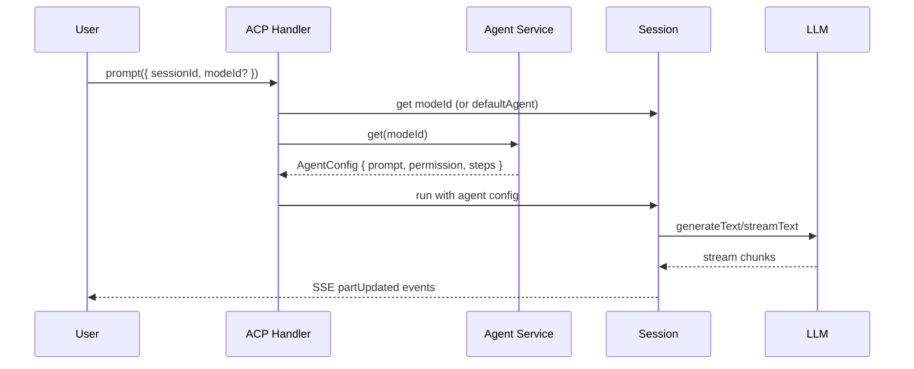
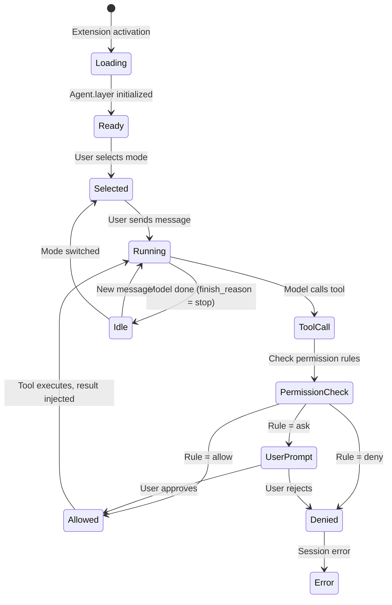

# KiloCode Modes & Multi-Agent System (MAOS)

> FOR AGENTS. Typed, structured, exhaustive.

## Mode Definitions

Modes and agents are synonymous in KiloCode. "Switching modes" = selecting an agent. All agents are loaded by `Agent.layer` and available via `/app/agents` endpoint.

```typescript
// Location: packages/opencode/src/agent/agent.ts
DEFAULT_MODE_SLUGS = ["code", "build", "architect", "ask", "debug", "orchestrator", "review"]

type AgentMode = "subagent" | "primary" | "all"
```

## AgentConfig Schema

```typescript
// packages/opencode/src/config/agent.ts lines 19-102
interface AgentConfig {
  model?: string | null                     // Override model (format: "provider/model")
  variant?: string                          // Model variant
  temperature?: number                      // 0–2
  top_p?: number                            // 0–1
  prompt?: string                           // System prompt override
  tools?: Record<string, boolean>           // @deprecated: use permission
  disable?: boolean                         // Disable this agent
  description?: string                      // "When to use" text
  mode?: "subagent" | "primary" | "all"
  hidden?: boolean                          // Hide from @ autocomplete
  options?: Record<string, any>             // { displayName, source, color, etc. }
  color?: string                            // "#RRGGBB" hex or theme token
  steps?: number                            // Max agentic iterations before text-only
  permission?: PermissionConfig             // Tool permissions
}
```

## Built-in Primary Modes

| Agent ID | Display | Tools | Bash | Edits | Use Case |
|----------|---------|-------|------|-------|----------|
| **code** | Code | All | ask | Yes | General execution (default) |
| **debug** | Debug | All + question/suggest | ask | Yes | Systematic debugging |
| **ask** | Ask | Read-only bash only | read-only | No | Q&A without changes |
| **architect** | Architect | Read-only | read-only | plan-only | Planning & design |
| **orchestrator** | Orchestrator | task/todo/read only | **deny** | No | Task delegation (deprecated) |
| **plan** | Plan | Read-only | read-only | plan-only | Planning (internal) |
| **explore** | Explore | grep/glob/bash/read | Yes | No | Fast codebase navigation |

## 21-Agent MAOS Workforce

Defined in `packages/opencode/src/kilocode/agent/index.ts` `patchAgents()`:

```typescript
const kcAgents = [
  { id: "kc-01", name: "Integration Lead",       color: "#FF6B6B", mode: "subagent", steps: 5 },
  { id: "kc-02", name: "Creative Brainstormer",  color: "#4ECDC4", mode: "subagent", steps: 5 },
  { id: "kc-03", name: "System Architect",       color: "#45B7D1", mode: "subagent", steps: 5 },
  { id: "kc-04", name: "Bug Triage Specialist",  color: "#96CEB4", mode: "subagent", steps: 5 },
  { id: "kc-05", name: "Root Cause Analyst",     color: "#FFEAA7", mode: "subagent", steps: 5 },
  { id: "kc-06", name: "Code Generator",         color: "#DDA0DD", mode: "subagent", steps: 5 },
  { id: "kc-07", name: "Code Reviewer",          color: "#FFB6C1", mode: "subagent", steps: 5 },
  { id: "kc-08", name: "Test Writer",            color: "#98D8C8", mode: "subagent", steps: 5 },
  { id: "kc-09", name: "Debugger",               color: "#F7DC6F", mode: "subagent", steps: 5 },
  { id: "kc-10", name: "Refactorer",             color: "#BB8FCE", mode: "subagent", steps: 5 },
  { id: "kc-11", name: "Documenter",             color: "#85C1E2", mode: "subagent", steps: 5 },
  { id: "kc-12", name: "Security Auditor",       color: "#E74C3C", mode: "subagent", steps: 5 },
  { id: "kc-13", name: "Performance Analyst",    color: "#F39C12", mode: "subagent", steps: 5 },
  { id: "kc-14", name: "API Integrator",         color: "#16A085", mode: "subagent", steps: 5 },
  { id: "kc-15", name: "Database Specialist",    color: "#8E44AD", mode: "subagent", steps: 5 },
  { id: "kc-16", name: "DevOps Engineer",        color: "#27AE60", mode: "subagent", steps: 5 },
  { id: "kc-17", name: "Frontend Specialist",    color: "#E67E22", mode: "subagent", steps: 5 },
  { id: "kc-18", name: "Backend Specialist",     color: "#2C3E50", mode: "subagent", steps: 5 },
  { id: "kc-19", name: "Research Analyst",       color: "#34495E", mode: "subagent", steps: 5 },
  { id: "kc-20", name: "Prompt Engineer",        color: "#9B59B6", mode: "subagent", steps: 5 },
]
// kc-main = the primary orchestrating agent (implicit)
```

## MAOS Architecture Diagram

```mermaid
graph TD
    USER["User"] --> KC_MAIN["kc-main\n(Orchestrator)"]
    KC_MAIN --> KC01["kc-01\nIntegration Lead"]
    KC_MAIN --> KC02["kc-02\nCreative Brainstormer"]
    KC_MAIN --> KC03["kc-03\nSystem Architect"]
    KC_MAIN --> KC04["kc-04\nBug Triage"]
    KC_MAIN --> KC05["kc-05\nRoot Cause"]
    KC_MAIN --> KC06["kc-06\nCode Generator"]
    KC_MAIN --> KC07["kc-07\nCode Reviewer"]
    KC_MAIN --> KC08["kc-08\nTest Writer"]
    KC_MAIN --> KC09["kc-09\nDebugger"]
    KC_MAIN --> KC10["kc-10\nRefactorer"]
    KC_MAIN --> KC11["kc-11\nDocumenter"]
    KC_MAIN --> KC12["kc-12\nSecurity Auditor"]
    KC_MAIN --> KC13["kc-13\nPerformance"]
    KC_MAIN --> KC14["kc-14\nAPI Integrator"]
    KC_MAIN --> KC15["kc-15\nDatabase"]
    KC_MAIN --> KC16["kc-16\nDevOps"]
    KC_MAIN --> KC17["kc-17\nFrontend"]
    KC_MAIN --> KC18["kc-18\nBackend"]
    KC_MAIN --> KC19["kc-19\nResearch"]
    KC_MAIN --> KC20["kc-20\nPrompt Engineer"]
```



## Agent Routing Flow



## Mode Switch Flow

```typescript
// Client → Extension:
postMessage({ type: "setSessionMode", sessionId, modeId: "debug" })

// Extension → Backend:
ACP.setSessionMode({ sessionId, modeId: "debug" })

// Backend validation:
const modes = await loadAvailableModes(directory)
if (!modes.some(m => m.id === modeId)) throw Error("Agent not found")
sessionManager.setMode(sessionId, modeId)

// Next prompt automatically uses new agent
```

## Custom Agent Creation

### Via .kilo/ directory

```markdown
<!-- .kilo/agent/my-agent.md -->
---
description: "When to use this agent"
mode: subagent
color: "#FF5733"
permission:
  edit: allow
  bash:
    "*": deny
    "grep *": allow
---

You are my-agent. Your specialization is...
```

### Via CLI

```bash
kilo agent generate "A code reviewer focused on security"
```

## Permission Rules Per Mode

```typescript
// packages/opencode/src/kilocode/agent/index.ts

// Safe bash allow-list (all modes unless overridden)
const bash = {
  "*": "ask",
  "cat *": "allow", "head *": "allow", "grep *": "allow",
  "git log *": "allow", "git show *": "allow", "git diff *": "allow",
  "touch *": "allow", "mkdir *": "allow", "cp *": "allow", "mv *": "allow",
}

// Read-only bash (ask/plan modes)
const readOnlyBash = {
  "*": "deny",
  "cat *": "allow", "git log *": "allow", "git show *": "allow",
}

// Orchestrator-specific (no bash at all)
agents.orchestrator.permission = {
  "*": "deny",
  task: "allow", todoread: "allow", todowrite: "allow",
  read: "allow", bash: "deny",
}
```

## Agent Lifecycle



## Key Files

| File | Purpose |
|------|---------|
| `packages/opencode/src/agent/agent.ts` | Agent service layer, native agent defs |
| `packages/opencode/src/acp/agent.ts` | ACP protocol, `loadAvailableModes()`, `setSessionMode()` |
| `packages/opencode/src/acp/session.ts` | Session `modeId` storage |
| `packages/opencode/src/kilocode/agent/index.ts` | Kilo MAOS patches, 20 kc-* agents |
| `packages/opencode/src/config/agent.ts` | `AgentConfig.Info` Zod schema |
| `packages/opencode/src/kilocode/modes-migrator.ts` | Legacy `.kilocodemodes` → agent conversion |
