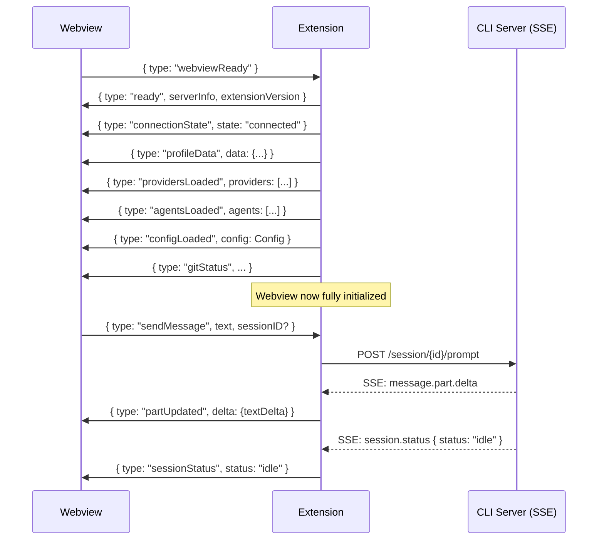

# KiloCode Webview ↔ Extension IPC Protocol

> FOR AGENTS. Complete typed union types for all ~140 message types.

## Protocol Summary

- **Transport:** `vscode.postMessage()` (webview→extension) / `webview.postMessage()` (extension→webview)
- **Handshake:** Webview sends `webviewReady` → extension sends full state sync (~10 messages)
- **Real-time:** Backend SSE events mapped by `mapSSEEventToWebviewMessage()` → forwarded to webview
- **Pattern:** Mostly fire-and-forget; SSE is the response channel

## Core Handshake Sequence



## Webview → Extension: Core Messages

```typescript
// ─── HANDSHAKE ───────────────────────────────────────────────
{ type: "webviewReady" }

// ─── MESSAGING ───────────────────────────────────────────────
{
  type: "sendMessage"
  text: string
  messageID?: string
  sessionID?: string
  draftID?: string
  providerID?: string
  modelID?: string
  agent?: string
  variant?: string
  files?: Array<{ mime: string; url: string; filename?: string }>
}

{ type: "sendCommand"; command: string; arguments: string; /* same optionals */ }
{ type: "abort"; sessionID?: string }
{ type: "createSession" }
{ type: "clearSession" }

// ─── SESSION MGMT ─────────────────────────────────────────────
{ type: "loadMessages"; sessionID: string; mode: "replace"|"prepend"|"focus"|"reconcile"; before?: string; limit?: number }
{ type: "loadSessions" }
{ type: "deleteSession"; sessionID: string }
{ type: "renameSession"; sessionID: string; name: string }
{ type: "syncSession"; sessionID: string; parentSessionID?: string }
{ type: "revertSession"; sessionID: string; messageID: string }
{ type: "unrevertSession"; sessionID: string }
{ type: "compact"; sessionID: string; messageID?: string; modelID?: string; providerID?: string }
{ type: "forkSession"; /* see IPC types */ }
{ type: "sidebarForkSession"; /* see IPC types */ }

// ─── PERMISSIONS ──────────────────────────────────────────────
{
  type: "permissionResponse"
  permissionID: string
  response: "once" | "always" | "reject"
  approvedAlways: string[]
  deniedAlways: string[]
}

// ─── QUESTIONS / SUGGESTIONS ──────────────────────────────────
{ type: "questionReply";   requestID: string; sessionID?: string; answers: string[][] }
{ type: "questionReject";  requestID: string; sessionID?: string }
{ type: "suggestionAccept"; requestID: string; sessionID: string; index: number }
{ type: "suggestionDismiss"; requestID: string; sessionID: string }

// ─── AUTH ─────────────────────────────────────────────────────
{ type: "login" }
{ type: "cancelLogin" }
{ type: "logout" }
{ type: "setOrganization"; organizationId: string | null }
{ type: "refreshProfile" }

// ─── CONFIG ───────────────────────────────────────────────────
{ type: "requestConfig" }
{ type: "requestGlobalConfig" }
{ type: "updateConfig"; config: Partial<Config> }
{ type: "updateSetting"; key: string; value: unknown }
{ type: "resetAllSettings" }
{ type: "settingsTabChanged"; tab: string }

// ─── PROVIDERS & MODELS ───────────────────────────────────────
{ type: "requestProviders" }
{ type: "connectProvider"; requestId: string; providerID: string; apiKey: string }
{ type: "authorizeProviderOAuth"; requestId: string; providerID: string; method: number }
{ type: "completeProviderOAuth"; requestId: string; providerID: string; method: number; code?: string }
{ type: "disconnectProvider"; requestId: string; providerID: string }
{ type: "saveCustomProvider"; requestId: string; providerID: string; config: ProviderConfig; apiKey?: string }
{ type: "fetchCustomProviderModels"; requestId: string; baseURL: string; apiKey?: string }
{ type: "toggleFavorite"; action: "add"|"remove"; providerID: string; modelID: string }
{ type: "persistRecents"; recents: ModelSelection[] }
{ type: "persistModelSelection"; /* ... */ }
{ type: "clearModelSelection"; /* ... */ }

// ─── AGENTS / SKILLS / COMMANDS ───────────────────────────────
{ type: "requestAgents" }
{ type: "requestSkills" }
{ type: "requestCommands" }
{ type: "removeSkill"; /* ... */ }
{ type: "removeMode"; /* ... */ }
{ type: "removeMcp"; /* ... */ }

// ─── MCP ──────────────────────────────────────────────────────
{ type: "requestMcpStatus" }
{ type: "connectMcp"; /* server name */ }
{ type: "disconnectMcp"; /* server name */ }

// ─── FILE SEARCH & AUTOCOMPLETE ───────────────────────────────
{ type: "requestFileSearch"; query: string; requestId: string; sessionID?: string }
{ type: "requestTerminalContext"; requestId: string; sessionID?: string }
{ type: "requestChatCompletion"; text: string; requestId: string }
{ type: "chatCompletionAccepted"; requestId: string }

// ─── UI / NAVIGATION ──────────────────────────────────────────
{ type: "openExternal"; url: string }
{ type: "openFile"; filePath: string; line?: number; column?: number }
{ type: "openSettingsPanel"; tab?: string }
{ type: "openMarketplacePanel" }
{ type: "previewImage"; dataUrl: string; filename: string }
{ type: "copyToClipboard"; text: string }
{ type: "openChanges" }
{ type: "retryConnection" }

// ─── AGENT MANAGER / WORKTREES ────────────────────────────────
{ type: "agentManager.createWorktree"; baseBranch?: string; branchName?: string; variant?: string }
{ type: "continueInWorktree"; sessionId: string }
{ type: "agentManager.forkSession"; sessionId: string; worktreeId?: string; messageId?: string }
{ type: "agentManager.requestWorktreeDiff"; sessionId: string }
{ type: "agentManager.startDiffWatch"; sessionId: string }
{ type: "agentManager.stopDiffWatch" }
{ type: "agentManager.applyWorktreeDiff"; worktreeId: string; selectedFiles?: string[] }

// ─── MARKETPLACE ──────────────────────────────────────────────
{ type: "fetchMarketplaceData" }
{ type: "installMarketplaceItem"; item: MarketplaceItem; options?: InstallOptions }
{ type: "removeInstalledMarketplaceItem"; slug: string }

// ─── REMOTE / CLOUD ───────────────────────────────────────────
{ type: "requestRemoteStatus" }
{ type: "toggleRemote" }
{ type: "setRemoteEnabled"; enabled: boolean }
{ type: "requestCloudSessions" }

// ─── TELEMETRY ────────────────────────────────────────────────
{ type: "telemetry"; event: TelemetryEventName; properties?: Record<string, unknown> }

// ─── V4 OVERLAY ───────────────────────────────────────────────
{ type: "ssh*" | "vps*" | "zeroClaw*" | "routing*" | "memory*" | "training*" | "governance*" | "hermes*" | "workstation*" | "requestDiscovery" | "triggerDiscovery" }
```

## Extension → Webview: Core Messages

```typescript
// ─── HANDSHAKE & STATE ────────────────────────────────────────
{
  type: "ready"
  serverInfo?: { port: number; version?: string }
  extensionVersion?: string
  vscodeLanguage?: string
  workspaceDirectory?: string
}
{ type: "connectionState"; state: "connecting"|"connected"|"disconnected"|"error" }
{ type: "extensionDataReady" }
{ type: "error"; message: string }

// ─── SESSION LIFECYCLE ─────────────────────────────────────────
{
  type: "sessionStatus"
  sessionID: string
  status: "idle" | "busy" | "retry" | "offline"
  attempt?: number      // if retry
  message?: string      // if retry or offline
  next?: number         // ms until next retry
}
{ type: "sessionCreated"; session: SessionInfo }
{ type: "sessionUpdated"; session: SessionInfo }
{ type: "sessionDeleted"; sessionID: string }
{ type: "sessionForked"; sessionID: string }
{ type: "sessionError"; sessionID: string; error: { name: string; data?: Record<string, unknown> } }
{ type: "sessionsLoaded"; sessions: SessionInfo[] }

// ─── STREAMING (CORE REAL-TIME) ────────────────────────────────
{
  type: "partUpdated"
  sessionID: string
  messageID: string
  part: Part             // Full part object
  delta?: { type: "text-delta"; textDelta: string }
}
{ type: "partsUpdated"; updates: PartUpdatedMessage[] }  // Coalesced batch
{ type: "messageCreated"; message: Message }
{ type: "messageRemoved"; sessionID: string; messageID: string }
{ type: "messagesLoaded"; messages: Message[]; sessionID: string; mode: string }

// ─── INTERACTIVE ──────────────────────────────────────────────
{
  type: "permissionRequest"
  permission: {
    id: string; sessionID: string; toolName: string
    patterns: string[]; always: string[]
    args: Record<string, unknown>; message?: string
    tool?: { messageID: string; callID: string }
  }
}
{ type: "permissionResolved"; permissionID: string }
{
  type: "questionRequest"
  question: { id: string; sessionID: string; questions: QuestionInfo[]; blocking?: boolean; tool?: { messageID: string; callID: string } }
}
{ type: "questionResolved"; requestID: string }
{
  type: "suggestionRequest"
  suggestion: { id: string; sessionID: string; text: string; actions: SuggestionAction[]; blocking?: boolean }
}
{ type: "suggestionResolved"; requestID: string }
{ type: "todoUpdated"; sessionID: string; items: TodoItem[] }

// ─── CONFIG ───────────────────────────────────────────────────
{ type: "configLoaded"; config: Config }
{ type: "globalConfigLoaded"; config: Config }
{ type: "configUpdated"; config: Partial<Config> }
{ type: "configUpdateFailed"; error: string }

// ─── CATALOG ──────────────────────────────────────────────────
{ type: "providersLoaded"; providers: Provider[] }
{ type: "agentsLoaded"; agents: AgentInfo[] }
{ type: "skillsLoaded"; skills: SkillInfo[] }
{ type: "commandsLoaded"; commands: SlashCommandInfo[] }
{ type: "variantsLoaded"; variants: Record<string, string> }
{ type: "recentsLoaded"; recents: ModelSelection[] }
{ type: "favoritesLoaded"; favorites: Array<{ providerID: string; modelID: string }> }
{ type: "modelSelectionsLoaded"; selections: Record<string, ModelSelection> }
{ type: "mcpStatusLoaded"; status: Record<string, McpStatus> }

// ─── AUTOCOMPLETE ─────────────────────────────────────────────
{ type: "chatCompletionResult"; text: string; requestId: string }
{ type: "fileSearchResult"; requestId: string; results: FileSearchResult[]; hasMore: boolean }
{ type: "terminalContextResult"; requestId: string; content: string }
{ type: "terminalContextError"; requestId: string; error: string }

// ─── AUTH & PROFILE ───────────────────────────────────────────
{ type: "profileData"; data: { profile, balance, currentOrgId } | null }
{ type: "deviceAuthStarted"; code: string; verificationUrl: string; expiresIn: number }
{ type: "deviceAuthComplete" }
{ type: "deviceAuthFailed"; error: string }
{ type: "providerConnected"; requestId: string; providerID: string }
{ type: "providerOAuthReady"; requestId: string; providerID: string; authorization: {...} }
{ type: "customProviderModelsFetched"; requestId: string; models?: Model[]; error?: string }

// ─── UI ACTIONS ───────────────────────────────────────────────
{ type: "navigate"; view: "newTask"|"marketplace"|"history"|"profile"|"settings"; tab?: string }
{ type: "setChatBoxMessage"; text: string }
{ type: "appendChatBoxMessage"; text: string }
{ type: "action"; action: string }
{ type: "sendMessageFailed"; error: string; text: string }

// ─── REMOTE STATUS ────────────────────────────────────────────
{ type: "remoteStatus"; enabled: boolean }

// ─── SETTINGS ─────────────────────────────────────────────────
{ type: "browserSettingsLoaded"; settings: BrowserSettings }
{ type: "autocompleteSettingsLoaded"; settings: AutocompleteSettings }
{ type: "notificationSettingsLoaded"; settings: NotificationSettings }
{ type: "speechSettingsLoaded"; settings: SpeechSettings }
{ type: "azureKeyValidationResult"; valid: boolean; error?: string }

// ─── MARKETPLACE ──────────────────────────────────────────────
{ type: "marketplaceData" /* items */ }
{ type: "marketplaceInstallResult"; success: boolean; slug: string; error?: string }
{ type: "marketplaceRemoveResult"; success: boolean; slug: string; error?: string }

// ─── AGENT MANAGER ────────────────────────────────────────────
{ type: "agentManager.state"; state: AgentManagerState }
{ type: "agentManager.worktreeDiff"; sessionId: string; diff: string; stats: {...} }
{ type: "agentManager.worktreeDiffLoading"; sessionId: string }
{ type: "agentManager.applyWorktreeDiffResult"; worktreeId: string; success: boolean; error?: string }
{ type: "continueInWorktreeProgress"; status: "capturing"|"creating"|"setup"|"transferring"|"forking"|"done"|"error"; detail?: string }

// ─── LEGACY MIGRATION ─────────────────────────────────────────
{ type: "migrationState"; needed: boolean }
{ type: "legacyMigrationData"; /* ... */ }
{ type: "legacyMigrationProgress"; /* ... */ }
{ type: "legacyMigrationComplete" }
```

## SSE → Webview Mapping

```typescript
// packages/kilo-vscode/src/kilo-provider-utils.ts mapSSEEventToWebviewMessage()

SSE Event                    → Webview Message
─────────────────────────────────────────────────────────────────
message.part.updated         → partUpdated { part, delta? }
message.part.delta           → partUpdated { part: text, delta: {textDelta} }
message.updated              → messageCreated { message }
message.removed              → messageRemoved { sessionID, messageID }
session.status               → sessionStatus { status, attempt, message, next }
session.created              → sessionCreated { session }
session.updated              → sessionUpdated { session }
session.error                → sessionError { sessionID, error }
permission.asked             → permissionRequest { permission: {...} }
permission.replied           → permissionResolved { permissionID }
question.asked               → questionRequest { question: {...} }
question.replied             → questionResolved { requestID }
question.rejected            → questionResolved { requestID }
suggestion.shown             → suggestionRequest { suggestion: {...} }
suggestion.accepted          → suggestionResolved { requestID }
suggestion.dismissed         → suggestionResolved { requestID }
todo.updated                 → todoUpdated { sessionID, items }
```

## Handler Registry (Extension)

Source: `KiloProvider.ts` `setupWebviewMessageHandler()` line 580+

| Message | Handler | Response |
|---------|---------|----------|
| `webviewReady` | `syncWebviewState()` | ~10 state messages |
| `sendMessage` | `handleSendMessage()` | SSE stream |
| `abort` | `handleAbort()` | SSE sessionStatus idle |
| `loadMessages` | `handleLoadMessages()` | `messagesLoaded` |
| `loadSessions` | `handleLoadSessions()` | `sessionsLoaded` |
| `permissionResponse` | `handlePermissionResponse()` | `permissionResolved` |
| `questionReply` | `handleQuestionReply()` | `questionResolved` |
| `requestConfig` | `fetchAndSendConfig()` | `configLoaded` |
| `updateConfig` | `handleUpdateConfig()` | `configUpdated` or `configUpdateFailed` |
| `requestProviders` | `fetchAndSendProviders()` | `providersLoaded` |
| `requestAgents` | `fetchAndSendAgents()` | `agentsLoaded` |
| `requestFileSearch` | `handleFileSearch()` | `fileSearchResult` |
| `compact` | `handleCompact()` | async |
| `forkSession` | `handleForkSession()` | `sessionForked` SSE |
| `continueInWorktree` | `handleContinueInWorktree()` | `continueInWorktreeProgress` |

## Type Files

- **Full union types:** `/webview-ui/src/types/messages.ts` (1700+ lines)
- **SSE mapping:** `/src/kilo-provider-utils.ts` line 382
- **Stream protocol:** `/src/shared/stream-messages.ts`
- **Handlers:** `/src/KiloProvider.ts` line 580+

---

## New message types (canary.9)

All types below were added in canary.9. Direction column: **W→E** = webview sends to extension, **E→W** = extension sends to webview.

### Provider / model testing

| Message type | Direction | Payload fields | Purpose |
|---|---|---|---|
| `testProviderKey` | W→E | `requestId: string`, `providerID: string`, `apiKey: string` | Trigger API key validation for a provider |
| `testProviderKeyResult` | E→W | `requestId: string`, `success: boolean`, `error?: string` | Result of provider key test |
| `testCustomProviderModel` | W→E | `requestId: string`, `baseURL: string`, `apiKey?: string`, `modelID: string` | Test a single model on a custom provider endpoint |
| `customProviderModelTestResult` | E→W | `requestId: string`, `modelID: string`, `success: boolean`, `latencyMs?: number`, `error?: string` | Per-model test result |
| `testCustomProviderConnection` | W→E | `requestId: string`, `baseURL: string`, `apiKey?: string` | Test connectivity to a custom provider base URL |
| `customProviderConnectionResult` | E→W | `requestId: string`, `success: boolean`, `models?: string[]`, `error?: string` | Connection test result; includes discovered model IDs on success |
| `detectCustomProviderEnv` | W→E | _(none)_ | Ask extension to scan env for known provider vars |
| `customProviderEnvDetected` | E→W | `detected: Record<string, string>` | Env vars found in the extension host process |

### Rules / system prompt

| Message type | Direction | Payload fields | Purpose |
|---|---|---|---|
| `requestRulesFiles` | W→E | _(none)_ | Request list of rules files (AGENTS.md, .kilorules, etc.) |
| `rulesFilesLoaded` | E→W | `files: Array<{ path: string; content: string; source: "workspace" \| "global" }>` | Loaded rules file list |
| `createRulesFile` | W→E | `scope: "workspace" \| "global"`, `filename: string`, `content?: string` | Create a new rules file |
| `previewSystemPrompt` | W→E | `sessionID?: string`, `agentName?: string` | Request a rendered system prompt preview |
| `systemPromptPreview` | E→W | `content: string`, `tokenCount: number` | Rendered system prompt for display |

### Language / locale

| Message type | Direction | Payload fields | Purpose |
|---|---|---|---|
| `requestVSCodeLanguage` | W→E | _(none)_ | Ask extension for the VS Code display language |
| `vscodeLanguageDetected` | E→W | `language: string` | VS Code language code (e.g. `"en"`, `"zh-cn"`) |

### Notifications / diagnostics

| Message type | Direction | Payload fields | Purpose |
|---|---|---|---|
| `testNotification` | W→E | `message?: string` | Trigger a test VS Code notification (used in Notifications settings tab) |

### Checkpoints

| Message type | Direction | Payload fields | Purpose |
|---|---|---|---|
| `checkpointCreateBranch` | W→E | `sessionID: string`, `branchName?: string` | Create a git branch from the current session checkpoint snapshot |

### Session history

| Message type | Direction | Payload fields | Purpose |
|---|---|---|---|
| `toggleFavoriteSession` | W→E | `sessionID: string`, `starred: boolean` | Star or unstar a session in the history list |
| `requestSessionPreview` | W→E | `sessionID: string` | Request a preview snippet for hover display in the history list |
| `sessionPreviewLoaded` | E→W | `sessionID: string`, `preview: string`, `messageCount: number`, `lastModel?: string` | Preview data for a session |

### MAOS / config import

| Message type | Direction | Payload fields | Purpose |
|---|---|---|---|
| `configureMaos` | W→E | `config: Record<string, unknown>` | Apply a MAOS (multi-agent orchestration settings) configuration block |
| `importKiloConfig` | W→E | `content: string`, `format: "json" \| "jsonc"` | Import a kilo config file from pasted/uploaded text |
| `kiloConfigImported` | E→W | `success: boolean`, `error?: string`, `config?: Partial<Config>` | Result of config import |

### Browser / service worker

| Message type | Direction | Payload fields | Purpose |
|---|---|---|---|
| `browserStatusUpdate` | E→W | `status: "launching" \| "ready" \| "closed" \| "error"`, `error?: string` | Browser automation status change |
| `swRegistrationFailed` | E→W | `error: string` | Service worker registration failure notification |
| `swRegistrationOk` | E→W | `scope: string` | Service worker registered successfully |
