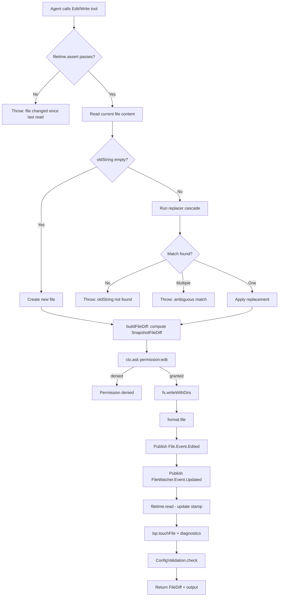

# KiloCode File & Workspace Operations
> FOR AGENTS. Typed, structured, exhaustive.

---

## 1. Key Source Files

| Module | Path |
|---|---|
| File service | `packages/opencode/src/file/index.ts` |
| File watcher | `packages/opencode/src/file/watcher.ts` |
| File ignore patterns | `packages/opencode/src/file/ignore.ts` |
| Protected paths | `packages/opencode/src/file/protected.ts` |
| File time tracking | `packages/opencode/src/file/time.ts` |
| Ripgrep wrapper | `packages/opencode/src/file/ripgrep.ts` |
| Git service | `packages/opencode/src/git/index.ts` |
| VCS service | `packages/opencode/src/project/vcs.ts` |
| Snapshot service | `packages/opencode/src/snapshot/index.ts` |
| DiffFull helper | `packages/opencode/src/kilocode/snapshot/diff-full.ts` |
| Project detection | `packages/opencode/src/project/project.ts` |
| Instance context | `packages/opencode/src/project/instance.ts` |
| Config paths | `packages/opencode/src/config/paths.ts` |
| KiloCode paths | `packages/opencode/src/kilocode/paths.ts` |
| Global paths | `packages/opencode/src/global/index.ts` |
| Read tool | `packages/opencode/src/tool/read.ts` |
| Write tool | `packages/opencode/src/tool/write.ts` |
| Edit tool | `packages/opencode/src/tool/edit.ts` |
| File HTTP routes | `packages/opencode/src/server/instance/file.ts` |

---

## 2. Core Types

```typescript
// packages/opencode/src/file/index.ts

/** Git diff info for a file (returned by File.status) */
interface FileInfo {
  path: string
  added: number    // lines added (from git --numstat)
  removed: number  // lines removed (from git --numstat)
  status: "added" | "deleted" | "modified"
}

/** Directory listing entry */
interface FileNode {
  name: string
  path: string      // relative to Instance.directory
  absolute: string
  type: "file" | "directory"
  ignored: boolean  // true if matched by .gitignore / .ignore rules
}

/** File content envelope */
interface FileContent {
  type: "text" | "binary"
  content: string                        // UTF-8 text, or base64 if encoding=="base64"
  diff?: string                          // unified-diff string vs HEAD (text files in git repos)
  patch?: StructuredPatch                // parsed diff object (same condition as diff)
  encoding?: "base64"                    // present when content is base64-encoded
  mimeType?: string
}

// packages/opencode/src/snapshot/index.ts

/** Zod schema ref: "SnapshotFileDiff" */
interface SnapshotFileDiff {
  file: string
  patch: string      // unified-diff text; "" for binary or oversized files
  additions: number
  deletions: number
  status?: "added" | "deleted" | "modified"
}

/** A snapshot tree hash + list of changed file paths */
interface Patch {
  hash: string       // git tree-sha from `git write-tree`
  files: string[]    // absolute paths in worktree
}
```

```typescript
// packages/opencode/src/git/index.ts

/** Raw git command result */
interface GitResult {
  exitCode: number
  text: () => string
  stdout: Buffer
  stderr: Buffer
}

interface GitOptions {
  cwd: string
  env?: Record<string, string>
}

type GitKind = "added" | "deleted" | "modified"

/** Single file from git status / diff */
interface GitItem {
  file: string
  code: string   // raw porcelain status code, e.g. " M", "??", "A "
  status: GitKind
}

/** Per-file line-count stats from --numstat */
interface GitStat {
  file: string
  additions: number
  deletions: number
}

/** Branch reference */
interface GitBase {
  name: string   // short name, e.g. "main"
  ref: string    // full ref, e.g. "origin/main"
}
```

```typescript
// packages/opencode/src/project/vcs.ts

interface VcsInfo {
  branch?: string
  default_branch?: string
}

/** VcsFileDiff — same shape as SnapshotFileDiff, different zod ref */
interface VcsFileDiff {
  file: string
  patch: string
  additions: number
  deletions: number
  status?: "added" | "deleted" | "modified"
}

type VcsMode = "git" | "branch"
// "git"    → diff vs HEAD (working tree changes)
// "branch" → diff vs merge-base of current branch and default branch
```

```typescript
// packages/opencode/src/file/time.ts

/** Per-file read stamp stored per session */
interface FileStamp {
  read: Date              // wall-clock when file was read
  mtime: number | undefined   // fs.stat mtime at read time
  size: number | undefined    // fs.stat size at read time
}
```

---

## 3. GitOps Interface

```typescript
// packages/opencode/src/git/index.ts

interface GitOpsInterface {
  /** Spawn raw git command; always succeeds (errors become exitCode !== 0) */
  run(args: string[], opts: GitOptions): Effect<GitResult>

  /** Current branch name; undefined in detached HEAD */
  branch(cwd: string): Effect<string | undefined>

  /** Path prefix for the current subdirectory inside the worktree */
  prefix(cwd: string): Effect<string>

  /** Default/main branch derived from remote HEAD or config */
  defaultBranch(cwd: string): Effect<GitBase | undefined>

  /** Returns true if HEAD ref exists (false on empty repos) */
  hasHead(cwd: string): Effect<boolean>

  /** git merge-base <base> <head?> */
  mergeBase(cwd: string, base: string, head?: string): Effect<string | undefined>

  /** Read file content at a specific git ref; empty string for binary or missing */
  show(cwd: string, ref: string, file: string, prefix?: string): Effect<string>

  /** git status --porcelain=v1 (NUL-separated, untracked included) */
  status(cwd: string): Effect<GitItem[]>

  /** git diff --name-status <ref> (files changed since ref) */
  diff(cwd: string, ref: string): Effect<GitItem[]>

  /** git diff --numstat <ref> (line counts changed since ref) */
  stats(cwd: string, ref: string): Effect<GitStat[]>
}
```

Global git flags always prepended by `Git.Service`:
```
--no-optional-locks
-c core.autocrlf=false
-c core.fsmonitor=false
-c core.longpaths=true
-c core.symlinks=true
-c core.quotepath=false
```

---

## 4. Snapshot Service Interface

```typescript
// packages/opencode/src/snapshot/index.ts

interface SnapshotInterface {
  /** Initialize snapshot git repo for current instance */
  init(): Effect<void>

  /** GC old objects (runs automatically every 1 hour) */
  cleanup(): Effect<void>

  /**
   * Stage all workspace changes and write a tree object.
   * Returns the tree SHA or undefined if snapshots are disabled.
   */
  track(): Effect<string | undefined>

  /**
   * List files that differ between current working tree and <hash>.
   * Runs `git add` first so the index is current.
   */
  patch(hash: string): Effect<Patch>

  /** Full unified diff text of working tree vs snapshot <hash> */
  diff(hash: string): Effect<string>

  /**
   * Per-file structured diffs between two snapshot tree hashes.
   * Uses DiffFull.batch (git diff) instead of JS Myers.
   * Result is cached (max 100 entries, LRU eviction).
   */
  diffFull(from: string, to: string): Effect<SnapshotFileDiff[]>

  /**
   * Restore working tree to snapshot <snapshot> (git read-tree + checkout-index -a -f).
   */
  restore(snapshot: string): Effect<void>

  /**
   * Revert specific files to their state in the given patches.
   * Batches up to 100 files per git checkout call.
   * Deletes files that did not exist in the snapshot.
   */
  revert(patches: Patch[]): Effect<void>
}
```

Snapshot storage location:
```
{Global.Path.data}/snapshot/{project.id}/{Hash.fast(worktree)}/
```
(`Global.Path.data` is `$XDG_DATA_HOME/kilo` on Linux/macOS, `%LOCALAPPDATA%/kilo` on Windows)

Snapshot limits:
- File size limit before exclusion from snapshot index: **2 MB** (`2 * 1024 * 1024` bytes)
- Max diff size constant exported: `MAX_DIFF_SIZE = 256 * 1024` bytes
- Diff cache size: **100** entries (LRU)
- ACP clients (`Flag.KILO_CLIENT === "acp"`): snapshots disabled
- Snapshots disabled if `config.snapshot === false`

---

## 5. File Service Interface

```typescript
// packages/opencode/src/file/index.ts

interface FileServiceInterface {
  /** Trigger background file-tree scan via ripgrep */
  init(): Effect<void>

  /**
   * Git working-tree status for all modified/added/deleted files.
   * Returns [] if project.vcs !== "git".
   * Uses: git diff --numstat HEAD, git ls-files --others --exclude-standard,
   *       git diff --name-only --diff-filter=D HEAD
   */
  status(): Effect<FileInfo[]>

  /**
   * Read file content.
   * - Path must not escape Instance.directory (throws "Access denied")
   * - Images → base64 content + mimeType + encoding:"base64"
   * - Known binary extensions → { type:"binary", content:"" }
   * - Text files in git repos → includes patch + diff vs HEAD (via DiffFull.file)
   */
  read(file: string): Effect<FileContent>

  /**
   * List directory entries relative to Instance.directory.
   * Entries sorted: directories first, then alphabetical.
   * Marks entries ignored per .gitignore + .ignore files.
   */
  list(dir?: string): Effect<FileNode[]>

  /**
   * Fuzzy-search the cached file/directory tree via fuzzysort.
   * Results are hidden-file-last unless query starts with "." or "/.".
   */
  search(input: {
    query: string
    limit?: number    // default 100
    dirs?: boolean
    type?: "file" | "directory"
  }): Effect<string[]>
}
```

---

## 6. HTTP API Endpoints

| Operation | Method | Path | Parameters | Returns |
|---|---|---|---|---|
| Search text | GET | `/find` | `?pattern=<regex>` | `Ripgrep.Match["data"][]` |
| Search files | GET | `/find/file` | `?query=&dirs=&type=&limit=` | `string[]` |
| Search symbols | GET | `/find/symbol` | `?query=` | `LSP.Symbol[]` (always `[]`) |
| List directory | GET | `/file` | `?path=<rel-path>` | `FileNode[]` |
| Read file | GET | `/file/content` | `?path=<rel-path>` | `FileContent` |
| Git file status | GET | `/file/status` | (none) | `FileInfo[]` |
| List workspaces | GET | `/experimental/workspace` | (none) | `Workspace.Info[]` |
| Create workspace | POST | `/experimental/workspace` | JSON body | `Workspace.Info` |
| Workspace status | GET | `/experimental/workspace/status` | (none) | `Workspace.ConnectionStatus[]` |
| Remove workspace | DELETE | `/experimental/workspace/:id` | path param | `Workspace.Info?` |
| Session restore | POST | `/experimental/workspace/:id/session-restore` | JSON body | `{ total: number }` |

All file paths passed to `/file` and `/file/content` are **relative to `Instance.directory`**.

---

## 7. Workspace Detection Algorithm

```
Project.fromDirectory(directory: string):
  1. Walk up from `directory` searching for `.git` entry
     → If not found: id=ProjectID.global, worktree="/", vcs=undefined
  2. sandbox = dirname(.git)
  3. Read cached project ID from `.git/kilo` file (text file, trimmed)
  4. If git binary available:
     a. git rev-parse --git-common-dir   → resolve main .git dir for worktrees
     b. worktree = parent of common dir  (non-worktree: worktree === sandbox)
     c. Also try to read ID from worktree/.git/kilo
  5. If still no ID: git rev-list --max-parents=0 HEAD → sorted root commits → first SHA
     → Write to .git/kilo for future cache hits
  6. git rev-parse --show-toplevel → sandbox = that resolved path
  7. Returns { project: Project.Info, sandbox: string }
     - project.worktree = worktree (main git root)
     - sandbox = actual working directory (may differ in git worktrees)
```

**Instance context** (async-local storage, per request):
```typescript
interface InstanceContext {
  directory: string   // absolute path of the opened directory (may be a worktree subdir)
  worktree: string    // git worktree root (may differ from directory for git worktrees)
  project: Project.Info
}
```

Path containment check:
```typescript
Instance.containsPath(filepath):
  AppFileSystem.contains(instance.directory, filepath) ||
  (instance.worktree !== "/" && AppFileSystem.contains(instance.worktree, filepath))
```

---

## 8. `.kilo/` Directory

The `.kilo/` directory (also `.kilocode/`) stores per-workspace configuration data. Both names are supported; `.kilo` takes precedence.

### Config file discovery (`config/paths.ts`)
```
directories(directory, worktree) searches:
  1. Global.Path.config                          (XDG config dir / kilo)
  2. Walk up from `directory` to `worktree`:
       .kilocode/, .kilo/, .opencode/ at each level
  3. Walk up from Global.Path.home:
       .kilocode/, .kilo/, .opencode/
  4. Flag.KILO_CONFIG_DIR if set
```

Config files at each found directory:
```
{dir}/config.json   or   {dir}/config.jsonc
{dir}/agent.json    or   {dir}/agent.jsonc
{dir}/command.json  or   {dir}/command.jsonc
```

### Skills discovery (`kilocode/paths.ts`)
```
KilocodePaths.skillDirectories({ projectDir, worktreeRoot }):
  1. ~/.kilocode/skills/  and  ~/.kilo/skills/
  2. VSCode globalStorage: {platform-specific}/kilocode.kilo-code/skills/
  3. Walk up from projectDir to worktreeRoot:
       .kilocode/skills/  and  .kilo/skills/
```

### Project ID cache
```
{worktree}/.git/kilo   — text file containing ProjectID (first root commit SHA)
```

---

## 9. File Watching

```typescript
// packages/opencode/src/file/watcher.ts

namespace FileWatcher {
  /** Events published to Bus */
  Event.Updated: BusEvent<{
    file: string   // absolute path
    event: "add" | "change" | "unlink"
  }>

  interface Interface {
    init(): Effect<void>
  }
}
```

Watcher backends:
| Platform | Backend |
|---|---|
| Windows | `windows` (ReadDirectoryChangesW) |
| macOS | `fs-events` |
| Linux | `inotify` |

Native binding: `@parcel/watcher-{platform}-{arch}[-{libc}]`
- `FileWatcher.hasNativeBinding()` returns false if binding fails to load
- `Flag.KILO_EXPERIMENTAL_DISABLE_FILEWATCHER` disables the watcher entirely
- `Flag.KILO_EXPERIMENTAL_FILEWATCHER` must be true to subscribe to the workspace directory
- Always subscribes to the `.git/` directory (excluding all entries except `HEAD`) for branch change detection
- Subscribe timeout: **10,000 ms**

Ignore patterns applied by watcher (`FileIgnore.PATTERNS`):
```
Folders: node_modules, bower_components, .pnpm-store, vendor, .npm, dist, build,
         out, .next, target, bin, obj, .git, .svn, .hg, .vscode, .idea, .turbo,
         .output, desktop, .sst, .cache, .webkit-cache, __pycache__, .pytest_cache,
         mypy_cache, .history, .gradle

Files:   **/*.swp, **/*.swo, **/*.pyc, **/.DS_Store, **/Thumbs.db,
         **/logs/**, **/tmp/**, **/temp/**, **/*.log,
         **/coverage/**, **/.nyc_output/**
```

Protected system paths (never watched/scanned):
- macOS: `~/Music`, `~/Pictures`, `~/Movies`, `~/Downloads`, `~/Desktop`, `~/Documents`, `~/Public`, `~/Applications`, `~/Library`, and specific Library subdirs
- Windows: `AppData`, `Downloads`, `Desktop`, `Documents`, `Pictures`, `Music`, `Videos`, `OneDrive`

---

## 10. File Time Tracking

```typescript
// packages/opencode/src/file/time.ts

namespace FileTime {
  interface Interface {
    /**
     * Record that <sessionID> read <file> right now.
     * Captures mtime + size from fs.stat.
     */
    read(sessionID: SessionID, file: string): Effect<void>

    /** Returns the Date when the session last read the file, or undefined */
    get(sessionID: SessionID, file: string): Effect<Date | undefined>

    /**
     * Assert file has not changed since session last read it.
     * Throws with human-readable message if mtime or size changed.
     * No-op if Flag.KILO_DISABLE_FILETIME_CHECK is set.
     * MUST be called before any write/edit operation.
     */
    assert(sessionID: SessionID, filepath: string): Effect<void>

    /** Serialize writes to the same file path across concurrent tool calls */
    withLock<T>(filepath: string, fn: () => Effect<T>): Effect<T>
  }
}
```

**Write precondition:** Both `WriteTool` and `EditTool` call `filetime.assert(sessionID, filepath)` before writing. This enforces the read-before-write discipline. The error message instructs the agent to re-read the file.

---

## 11. File Read Operations

### Read tool (`tool/read.ts`)

```
Parameters:
  filePath: string   — absolute path (resolved against Instance.directory if relative)
  offset?: number    — 1-indexed start line (default: 1)
  limit?: number     — max lines to return (default: 2000)

Limits:
  DEFAULT_READ_LIMIT = 2000 lines
  MAX_LINE_LENGTH    = 2000 chars (truncated with suffix)
  MAX_BYTES          = 50 * 1024 bytes (hard cap, then cut=true)

Binary detection (isBinaryFile):
  1. Extension allowlist check (always binary: .zip .tar .gz .exe .dll .so .class .jar
     .war .7z .doc .docx .xls .xlsx .ppt .pptx .odt .ods .odp .bin .dat .obj .o
     .a .lib .wasm .pyc .pyo)
  2. Read first 4096 bytes; if any NUL byte → binary
  3. If >30% bytes are non-printable (< 0x09 or 0x0E–0x1F) → binary

Directory read:
  Returns sorted list of entries (dirs with / suffix).
  ctx.extra.includeDirectoryFiles=true → also reads file contents.

Image/PDF read:
  Returns base64 data-URI attachment; output = "Image read successfully" / "PDF read successfully".

Post-read side effects:
  - lsp.touchFile(filepath, false)   — warm LSP diagnostics
  - filetime.read(sessionID, filepath)  — record read stamp
```

### FileContent encoding rules (`file/index.ts`)

```
isImageByExtension → base64 + mimeType + encoding:"base64"
isBinaryByExtension && !isTextByExtension → { type:"binary", content:"" }
shouldEncode(mimeType) && !isImage → { type:"binary", content:"", mimeType }
shouldEncode(mimeType) && isImage → base64 + mimeType + encoding:"base64"
text file in git repo with diff → content + patch (StructuredPatch) + diff (string)
text file, no diff → { type:"text", content }
```

---

## 12. File Write/Edit Operations

### Write tool (`tool/write.ts`)

```
Parameters:
  filePath: string   — absolute path
  content: string    — full file content

Flow:
  1. Resolve to absolute path
  2. assertExternalDirectoryEffect (permission check)
  3. Read existing content (empty string if new file)
  4. filetime.assert if file exists
  5. Compute unified diff (createTwoFilesPatch)
  6. buildFileDiff → SnapshotFileDiff (with diffLines count)
  7. ctx.ask({ permission:"edit", ... }) — may prompt user
  8. fs.writeWithDirs(filepath, content)
  9. format.file(filepath)
  10. Publish File.Event.Edited + FileWatcher.Event.Updated
  11. filetime.read(sessionID, filepath)
  12. lsp.touchFile + diagnostics check
  13. ConfigValidation.check

Returns: { title, metadata: { diagnostics, filepath, exists, diff, filediff }, output }
```

### Edit tool (`tool/edit.ts`)

```
Parameters:
  filePath: string
  oldString: string   — text to find (empty = create new file)
  newString: string   — replacement text
  replaceAll?: boolean  — replace all occurrences (default false)

Replacer cascade (tried in order, first match wins):
  1. SimpleReplacer            — exact indexOf match
  2. LineTrimmedReplacer       — trim each line, match position
  3. BlockAnchorReplacer       — match first+last lines as anchors, Levenshtein similarity
  4. WhitespaceNormalizedReplacer — collapse whitespace
  5. IndentationFlexibleReplacer  — strip common indentation
  6. EscapeNormalizedReplacer    — unescape \n \t etc.
  7. TrimmedBoundaryReplacer    — trim leading/trailing whitespace from find string
  8. ContextAwareReplacer       — 3+ lines, anchor match + 50% middle-line similarity
  9. MultiOccurrenceReplacer    — yield all exact matches

Error conditions:
  - oldString not found → throws with message
  - multiple matches (no replaceAll) → throws with message
  - oldString === newString → throws immediately

Line ending preservation:
  Original file line ending (\n or \r\n) detected and re-applied to newString.

buildFileDiff limit:
  MAX_DIFF_CONTENT = 500_000 bytes
  If before.length > 500000 or after.length > 500000: patch="" (size guard)
```

---

## 13. Diff Application Flow



---

## 14. SnapshotFileDiff: Production and Consumption

### Production

**Via `Snapshot.diffFull(from, to)`** (snapshot-to-snapshot comparison):
```
1. git diff --name-status --no-renames <from> <to>  → status map
2. git diff --numstat --no-renames <from> <to>       → additions/deletions
3. DiffFull.batch: git diff --unified=2147483647 <from> <to> -- <files>
   (batched in 500-file chunks; falls back to empty patch on git failure)
4. Returns SnapshotFileDiff[] with patch="" for binary files
```

**Via `DiffFull.file(gitText, file)`** (single-file working-tree vs HEAD):
```
1. git diff --no-color --no-ext-diff --ignore-all-space --unified=INT_MAX -- <file>
2. If empty: git diff --staged ... (check staged changes)
3. parsePatch → normalize oldFileName/newFileName to bare path
4. Returns { patch: StructuredPatch, text: string } | null
```

**Via `buildFileDiff(file, before, after)`** (Edit/Write tools):
```
1. If content > 500KB: return { file, patch:"", additions:0, deletions:0 }
2. diffLines(before, after) → count added/removed lines
3. createTwoFilesPatch → unified diff text
4. Returns SnapshotFileDiff
```

### Consumption

| Consumer | Source | Purpose |
|---|---|---|
| `EditTool` | `buildFileDiff` | `ctx.metadata.filediff`, displayed in UI diff view |
| `WriteTool` | `buildFileDiff` | same as EditTool |
| `Snapshot.patch(hash)` | `git diff --cached --name-only` | list affected file paths |
| `Snapshot.diff(hash)` | `git diff --cached` | raw unified diff text |
| `Snapshot.diffFull(from,to)` | `DiffFull.batch` | structured per-file diffs for snapshot viewer |
| `File.read(file)` | `DiffFull.file` | inline patch in `FileContent.patch` |
| `Vcs.diff(mode)` | `files()` helper | `VcsFileDiff[]` for VCS panel |

---

## 15. Ripgrep Operations

```typescript
// packages/opencode/src/file/ripgrep.ts

namespace Ripgrep {
  interface FilesInput {
    cwd: string
    glob?: string[]     // additional --glob patterns
    hidden?: boolean    // default true (--hidden)
    follow?: boolean    // follow symlinks
    maxDepth?: number
    signal?: AbortSignal
  }

  interface SearchInput {
    cwd: string
    pattern: string     // regex pattern
    glob?: string[]
    limit?: number      // --max-count
    follow?: boolean
    file?: string[]     // restrict to specific files
    signal?: AbortSignal
  }

  interface SearchResult {
    items: Item[]      // matched lines with path/line/submatch data
    partial: boolean   // true if rg exited with code 2 (limit hit)
  }

  interface Interface {
    /** Stream of relative file paths (excludes .git/*) */
    files(input: FilesInput): Stream<string, Error>
    /** Directory tree as indented text string */
    tree(input: TreeInput): Effect<string, Error>
    /** Search with JSON output, returns parsed match items */
    search(input: SearchInput): Effect<SearchResult, Error>
  }
}
```

Worker dispatch: if `AbortSignal` provided **and** `Worker` is available → use Web Worker (`ripgrep.worker.ts`); otherwise direct WASM invocation.

Tree output filters out `.kilo` and `.opencode` entries.

---

## 16. Directory Listing & Glob

### `File.list(dir?)` — shallow directory listing
- Default dir: `Instance.directory`
- Excludes: `.git`, `.DS_Store`
- Marks ignored via `ignore` npm package with `.gitignore` + `.ignore` content
- Returns `FileNode[]` sorted: directories first, then alphabetical

### `File.search(input)` — fuzzy file path search
- Cache populated by `rg --files` scan on first call (re-populated after each `init()`)
- Uses `fuzzysort` library
- `type:"directory"` returns paths with trailing `/`
- Hidden files sorted last unless query starts with `.`

### Ripgrep glob rules (always applied)
```
--files --glob=!.git/*   (for files listing)
--json  --hidden --glob=!.git/* --no-messages   (for search)
RIPGREP_CONFIG_PATH is deleted from env before each invocation
```

---

## 17. VCS Interface

```typescript
// packages/opencode/src/project/vcs.ts

interface VcsInterface {
  init(): Effect<void>

  /** Current branch name; undefined in detached HEAD */
  branch(): Effect<string | undefined>

  /** Default/main branch name (from remote HEAD or config) */
  defaultBranch(): Effect<string | undefined>

  /**
   * mode="git"    → diff vs HEAD (or empty tree if no HEAD)
   *                 uses git.status() + git.stats()
   * mode="branch" → diff vs merge-base of current branch and default branch
   *                 uses git.diff() + git.stats() + git.status()
   * Returns [] if project.vcs !== "git"
   */
  diff(mode: VcsMode): Effect<VcsFileDiff[]>
}
```

Branch change detection: `FileWatcher.Event.Updated` events with `file.endsWith("HEAD")` trigger re-read of `git.branch()` and emit `Vcs.Event.BranchUpdated`.

---

## 18. Snapshot Checkout / Revert

```
Snapshot.restore(snapshot: string):
  git read-tree <snapshot>              → load snapshot tree into index
  git checkout-index -a -f              → force-write all indexed files to disk

Snapshot.revert(patches: Patch[]):
  For each unique file (deduped, preserving first-seen patch):
    git checkout <hash> -- <file>
  If checkout fails:
    git ls-tree <hash> -- <rel>
    If file existed: log and keep (checkout transient failure)
    If file absent in tree: delete file from disk

  Batching: up to 100 same-hash non-path-conflicting files in one checkout call.
  Path conflict: paths a, b clash if a===b or a.startsWith(b+"/") or vice versa.
```

---

## 19. Global Paths Reference

```typescript
// packages/opencode/src/global/index.ts  (app = "kilo")

Global.Path = {
  home: process.env.KILO_TEST_HOME || os.homedir()
  data:   // $XDG_DATA_HOME/kilo
  cache:  // $XDG_CACHE_HOME/kilo
  config: // $XDG_CONFIG_HOME/kilo
  state:  // $XDG_STATE_HOME/kilo
  bin:    // $XDG_CACHE_HOME/kilo/bin
  log:    // $XDG_DATA_HOME/kilo/log
}

// Snapshot repo: {data}/snapshot/{projectID}/{Hash.fast(worktree)}/
// Cache version file: {cache}/version  (current: "21")
```

Platform defaults for XDG base dirs:
| Platform | Data | Cache | Config |
|---|---|---|---|
| Linux | `~/.local/share` | `~/.cache` | `~/.config` |
| macOS | `~/Library/Application Support` | `~/Library/Caches` | `~/Library/Preferences` |
| Windows | `%LOCALAPPDATA%` | `%LOCALAPPDATA%` | `%APPDATA%` |

---

## 20. File Event Bus Topics

| Event Type | BusEvent Key | Payload | Publisher |
|---|---|---|---|
| File edited by tool | `file.edited` | `{ file: string }` | EditTool, WriteTool |
| File watcher change | `file.watcher.updated` | `{ file: string, event: "add"\|"change"\|"unlink" }` | Watcher callback, EditTool (synthetic), WriteTool (synthetic) |
| VCS branch changed | `vcs.branch.updated` | `{ branch?: string }` | Vcs service (on HEAD file change) |
