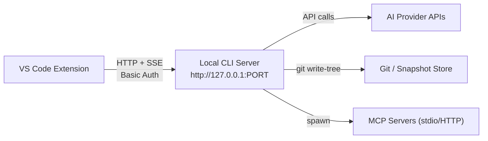

# KiloCode CLI Backend Protocol

> FOR AGENTS. Complete endpoint reference, SSE events, auth, reconnection.

## Architecture



## Server Startup

**Binary:** `/extension/bin/kilo` (or `kilo.exe` on Windows) — bundled with extension

**Launch command:** `kilo serve --port 0` (port 0 = OS auto-selects)

**Port discovery:** Extension parses stdout for `listening on http://127.0.0.1:(\d+)`

```typescript
interface ServerInstance {
  port: number
  password: string   // 32-byte hex, generated at startup
  process: ChildProcess
}
```

**Key environment variables set by extension:**
```
KILO_SERVER_PASSWORD      = <32-byte-hex>
KILO_CLIENT               = "vscode"
KILO_ENABLE_QUESTION_TOOL = "true"
KILOCODE_FEATURE          = "vscode-extension"
KILO_TELEMETRY_LEVEL      = "all" | "off"
KILO_APP_NAME             = "kilo-code"
KILO_EDITOR_NAME          = vscode.env.appName
KILO_PLATFORM             = "vscode"
KILO_MACHINE_ID           = vscode.env.machineId
KILO_APP_VERSION          = extension version
KILO_VSCODE_VERSION       = vscode.version
MIMALLOC_PURGE_DELAY      = "0"
```

**Startup timeout:** 30 seconds

## Authentication

**Method:** HTTP Basic Auth

```
Authorization: Basic <base64("kilo:{KILO_SERVER_PASSWORD}")>
```

Every request from extension to server uses this header. Password is static for server lifetime; regenerated each spawn.

## All API Endpoints

**Base URL:** `http://127.0.0.1:{port}`

### Global

| Method | Path | Purpose |
|--------|------|---------|
| GET | `/global/health` | Health check — poll every 10s |
| GET | `/global/event` | SSE stream of ALL events |
| POST | `/global/config/get` | Get global config |
| POST | `/global/config/update` | Update global config |
| POST | `/global/dispose` | Shutdown all instances |
| POST | `/global/upgrade` | Upgrade CLI version |

### Session Management

| Method | Path | Key Params | Returns |
|--------|------|-----------|---------|
| POST | `/session/create` | `{ directory, workspace? }` | SessionInfo |
| POST | `/session/list` | `{ directory, workspace?, roots?, search?, limit?, start? }` | SessionInfo[] |
| GET | `/session/{id}` | — | SessionInfo |
| POST | `/session/{id}/update` | `{ title?, time? }` | SessionInfo |
| POST | `/session/{id}/delete` | — | void |
| POST | `/session/{id}/status` | — | SessionStatus |
| POST | `/session/{id}/abort` | — | void |
| POST | `/session/{id}/fork` | `{ messageID? }` | SessionInfo |
| POST | `/session/{id}/messages` | `{ limit?: 80, before?: cursor }` | Message[] + cursor |
| POST | `/session/{id}/children` | — | SessionInfo[] |
| POST | `/session/{id}/todo` | — | Todo[] |
| POST | `/session/{id}/diff` | `{ messageID? }` | FileDiff[] |
| POST | `/session/{id}/summarize` | `{ modelID?, providerID?, auto? }` | void |
| POST | `/session/{id}/revert` | `{ messageID?, partID? }` | void |
| POST | `/session/{id}/unrevert` | — | void |
| POST | `/session/{id}/viewed` | `{ focused?, open? }` | void |

### Messaging

| Method | Path | Key Params | Notes |
|--------|------|-----------|-------|
| POST | `/session/{id}/prompt` | See below | SSE streaming response |
| POST | `/session/{id}/prompt-async` | Same | Non-blocking |
| POST | `/session/{id}/shell` | `{ command?, agent?, model? }` | Execute shell command |
| POST | `/session/{id}/message/{msgId}` | — | Get message details |
| POST | `/session/{id}/message/{msgId}/delete` | — | Delete message |

**Prompt parameters:**
```typescript
{
  sessionID: string
  directory?: string
  workspace?: string
  messageID?: string
  model?: { providerID: string; modelID: string }
  agent?: string
  noReply?: boolean
  tools?: Record<string, boolean>
  format?: OutputFormat
  system?: string
  variant?: string
  editorContext?: {
    visibleFiles?: string[]
    openTabs?: string[]
    activeFile?: string
    shell?: string
  }
  parts?: Array<
    | { type: "text"; text: string }
    | { type: "file"; mime: string; url: string; filename?: string }
    | { type: "agent"; name: string }
  >
}
```

### Permissions & Questions

| Method | Path | Key Params |
|--------|------|-----------|
| POST | `/permission/list` | `{ directory?, workspace? }` |
| POST | `/permission/reply` | `{ requestID, reply: "once"\|"always"\|"reject" }` |
| POST | `/permission/save-always-rules` | `{ requestID, approvedAlways?, deniedAlways? }` |
| POST | `/permission/allow-everything` | `{ enable?, requestID?, sessionID? }` |
| POST | `/question/list` | `{ directory?, workspace? }` |
| POST | `/question/reply` | `{ requestID, answers: string[][] }` |
| POST | `/question/reject` | `{ requestID }` |

### File Operations

| Method | Path | Params |
|--------|------|--------|
| POST | `/file/list` | `{ path, depth? }` |
| POST | `/file/read` | `{ path }` |
| POST | `/file/status` | `{ path }` |
| POST | `/worktree/diff` | `{ directory? }` |
| GET | `/find/file` | `?query=&type=file|directory&limit=1-200` |
| GET | `/find` | `?pattern=` (regex) |
| GET | `/find/symbol` | Query string |

### MCP

| Method | Path | Purpose |
|--------|------|---------|
| POST | `/mcp/status` | Get all server statuses |
| POST | `/mcp/connect` | Connect named server |
| POST | `/mcp/disconnect` | Disconnect named server |
| POST | `/mcp/add` | Add new MCP server |
| POST | `/mcp/auth/start` | Start OAuth flow |
| POST | `/mcp/auth/callback` | Complete OAuth |

### PTY (Pseudo-Terminal)

| Method | Path | Params |
|--------|------|--------|
| POST | `/pty/list` | `{ directory?, workspace? }` |
| POST | `/pty/create` | `{ command, args, cwd, title? }` |
| POST | `/pty/{id}/connect` | WebSocket upgrade |
| POST | `/pty/{id}/update` | — |
| POST | `/pty/{id}/remove` | — |

### Project

| Method | Path | Params |
|--------|------|--------|
| POST | `/project/list` | `{ directory?, workspace? }` |
| POST | `/project/current` | `{ directory?, workspace? }` |
| POST | `/project/{id}/update` | `{ name?, icon?, commands? }` |

## SSE Event Types

**Endpoint:** `GET /global/event`
**Schema:** `{ directory: string; payload: Event }`

### Session Events
```
session.created          payload: { info: Session }
session.updated          payload: { info: Session }
session.status           payload: { sessionID, status: "idle"|"busy"|"retry"|"offline", attempt?, message?, next? }
session.idle             payload: { sessionID }
session.error            payload: { sessionID?, error }
session.network.asked    payload: { sessionID, requestID, message }
session.network.replied  payload: { sessionID, requestID }
session.turn.open        payload: { sessionID }
session.turn.close       payload: { sessionID, reason: "completed"|"error"|"interrupted" }
session.diff             payload: { sessionID, diff: FileDiff[] }
```

### Message/Part Events
```
message.updated          payload: { info: { id, sessionID, ... } }
message.part.updated     payload: { part: { messageID?, sessionID?, ... } }
message.part.delta       payload: { sessionID, messageID, partID, field, delta: string }
message.removed          payload: { sessionID, messageID }
```

### Permission/Question Events
```
permission.asked         payload: { id, sessionID, permission, patterns, always, args, tool? }
permission.replied       payload: { sessionID, requestID, reply }
question.asked           payload: { id, sessionID, questions: QuestionInfo[], blocking? }
question.replied         payload: { sessionID, requestID, answers }
question.rejected        payload: { sessionID, requestID }
suggestion.shown         payload: { id, sessionID, text, actions, blocking? }
suggestion.accepted      payload: { sessionID, requestID }
suggestion.dismissed     payload: { sessionID, requestID }
```

### Todo / System Events
```
todo.updated             payload: { sessionID, todos: Todo[] }
server.heartbeat         (keepalive — 10s interval; 15s timeout triggers reconnect)
global.disposed          (shutdown)
workspace.ready          payload: { name }
workspace.failed         payload: { message }
worktree.ready           payload: { name, branch }
worktree.failed          payload: { message }
vcs.branch.updated       payload: { branch? }
installation.updated     payload: { version }
mcp.tools.changed        payload: { server }
lsp.client.diagnostics
pty.created / pty.updated / pty.exited / pty.deleted
```

## Reconnection Logic

```typescript
// Health monitoring (two independent channels):
SSE heartbeat timeout: 15s
Health poll (/global/health): every 10s

// Backoff schedule (exponential):
Attempt 1: 1,000ms
Attempt 2: 5,000ms
Attempt 3: 15,000ms
Attempt 4: 60,000ms
Attempt 5+: 300,000ms (5 min)

// Transient errors (trigger backoff):
"load failed", "network connection lost", "failed to fetch",
"econnreset", "econnrefused", "etimedout", "socket hang up"

// Manual restart:
healthRecoveryService.restart()  // SIGTERM → SIGKILL (5s) → respawn
```

## SDK Client Interface

```typescript
const client = createKiloClient({
  baseUrl: `http://127.0.0.1:${port}`,
  headers: { Authorization: `Basic ${base64("kilo:" + password)}` }
})

// Namespaces:
client.global    // Health, events, config, disposal
client.session   // Session CRUD, messaging, status
client.message   // Message operations
client.part      // Message part operations
client.permission // Permission requests/responses
client.question  // Question requests/responses
client.project   // Project management
client.pty       // PTY management
client.mcp       // MCP server integration
client.file      // File operations
client.worktree  // Worktree/branch operations
client.auth      // Provider authentication
client.config    // Global configuration
client.provider  // Provider listing & auth

// SSE streaming:
const result = await client.global.event({ signal: AbortSignal })
for await (const event of result.stream) { ... }
```

## Key Implementation Files

| File | Purpose |
|------|---------|
| `packages/kilo-vscode/src/services/cli-backend/connection-service.ts` | Main connection lifecycle |
| `packages/kilo-vscode/src/services/cli-backend/server-manager.ts` | CLI process spawning |
| `packages/kilo-vscode/src/services/cli-backend/sdk-sse-adapter.ts` | SSE reconnection loop |
| `packages/kilo-vscode/src/services/cli-backend/HealthRecoveryService.ts` | Health monitoring & backoff |
| `.kilo/node_modules/@kilocode/sdk/dist/v2/gen/sdk.gen.d.ts` | Full API type definitions |
