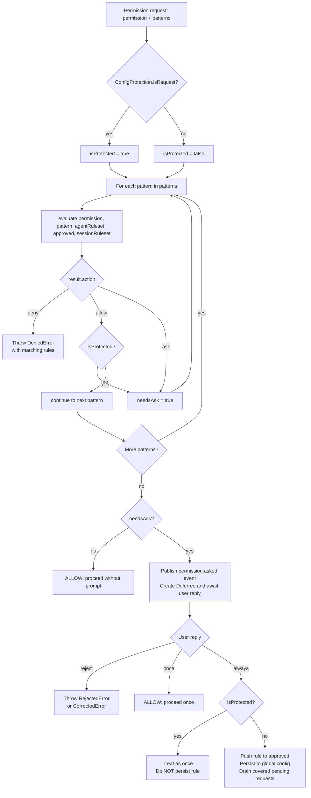

# KiloCode Marketplace, Permissions & Telemetry
> FOR AGENTS. Typed, structured, exhaustive.

---

## 1. Marketplace

### 1.1 Type System

```typescript
// packages/kilo-vscode/src/services/marketplace/types.ts

interface McpParameter {
  name: string
  key: string
  placeholder?: string
  optional?: boolean
}

interface McpInstallationMethod {
  name: string
  content: string
  parameters?: McpParameter[]
  prerequisites?: string[]
}

interface MarketplaceItemBase {
  id: string
  name: string
  description: string
  author?: string
  authorUrl?: string
  tags?: string[]
  prerequisites?: string[]
}

interface McpMarketplaceItem extends MarketplaceItemBase {
  type: "mcp"
  url: string
  content: string | McpInstallationMethod[]  // string = inline JSON; array = named methods
  parameters?: McpParameter[]
}

interface ModeMarketplaceItem extends MarketplaceItemBase {
  type: "mode"
  content: string  // YAML mode definition
}

interface SkillMarketplaceItem extends MarketplaceItemBase {
  type: "skill"
  category: string
  displayName: string
  displayCategory: string
  githubUrl: string
  content: string  // URL to .tar.gz tarball
}

type MarketplaceItem = McpMarketplaceItem | ModeMarketplaceItem | SkillMarketplaceItem

interface InstallMarketplaceItemOptions {
  target?: "global" | "project"  // default: "project"
  parameters?: Record<string, unknown>  // __method key selects McpInstallationMethod
}

interface MarketplaceInstalledMetadata {
  project: Record<string, { type: string }>  // id → { type: "mcp"|"mode"|"skill" }
  global:  Record<string, { type: string }>
}

interface MarketplaceDataResponse {
  marketplaceItems: MarketplaceItem[]
  marketplaceInstalledMetadata: MarketplaceInstalledMetadata
  errors?: string[]
}

interface InstallResult {
  success: boolean
  slug: string
  error?: string
  filePath?: string  // for skills: path to SKILL.md
  line?: number
}

interface RemoveResult {
  success: boolean
  slug: string
  error?: string
}
```

### 1.2 Remote API

| Property | Value |
|---|---|
| Base URL | `https://api.kilo.ai/api/marketplace` |
| Modes endpoint | `GET /modes` → `{ items: ModeMarketplaceItem[] }` |
| MCPs endpoint | `GET /mcps` → `{ items: McpMarketplaceItem[] }` |
| Skills endpoint | `GET /skills` → `{ items: RawSkill[] }` (transformed client-side) |
| Cache TTL | 300 000 ms (5 min), per endpoint key |
| Retries | 3 attempts with exponential back-off (1 s, 2 s, 4 s) |
| Timeout per request | 10 000 ms |
| Response format | JSON or YAML (parsed with `yaml` library as fallback) |

### 1.3 Discovery (installed items)

`InstallationDetector.detect(workspace?, skills?)` returns `MarketplaceInstalledMetadata`.

- **MCP / mode detection**: reads `kilo.json` at project scope (`<workspace>/.kilo/kilo.json`) and global scope (`$XDG_CONFIG_HOME/kilo/kilo.json` or `~/.config/kilo/kilo.json`). Keys under `mcp` and `agent` objects are returned.
- **Skill detection**: sourced from the CLI backend (`GET /skill`), passed in as `CliSkill[]`. A skill is classified as project-scope if its `location` path starts with the workspace root.

### 1.4 Installation

`MarketplaceInstaller.install(item, options, workspace?)`:

| Item type | Storage location | Mechanism |
|---|---|---|
| `mcp` | `kilo.json` at selected scope, under `.mcp[item.id]` | Writes normalized MCP entry (see 1.4.1) |
| `mode` | `kilo.json` at selected scope, under `.agent[item.id]` | Converts YAML mode → agent config (see 1.4.2) |
| `skill` | `<skillsDir>/<item.id>/` | Downloads tarball → extracts → validates `SKILL.md` → atomic rename |

Config paths:
- **Project**: `<workspace>/.kilo/kilo.json`
- **Global**: `$XDG_CONFIG_HOME/kilo/kilo.json` (default: `~/.config/kilo/kilo.json`)

Skill directories:
- **Project**: `<workspace>/.kilo/skills/`
- **Global**: `~/.kilo/skills/`

#### 1.4.1 MCP Entry Normalization

Marketplace API uses legacy format. Installer normalizes to CLI `Config.Mcp` schema:

```
Old: { command: "npx", args: [...], env: {...} }
New: { type: "local", command: ["npx", ...], environment: {...} }

Old: { type: "sse"|"streamable-http", url: "...", headers: {...} }
New: { type: "remote", url: "...", headers: {...} }
```

Parameter substitution: `{{key}}` and `${key}` placeholders in content are replaced with JSON-escaped values from `options.parameters`. `__method` key selects named installation method.

#### 1.4.2 Mode → Agent Conversion

YAML `groups` field is mapped to permissions:

| Group name | Permission key |
|---|---|
| `read` | `read` |
| `edit` | `edit` |
| `browser` | `bash` |
| `command` | `bash` |
| `mcp` | `mcp` |

Groups with `fileRegex` produce `{ [fileRegex]: "allow", "*": "deny" }`. Groups not listed receive `"deny"`. Agent config shape: `{ mode: "primary", description, prompt, permission }`.

#### 1.4.3 Skill Security

- ID validated against regex: `^(@[a-z0-9][a-z0-9\-_.]*\/)?[a-z0-9][a-z0-9\-_.]*$`
- IDs with `..`, `/`, `\`, leading `.` or `-` are rejected
- Max ID length: 214 characters
- Post-extract: all paths must be contained within staging directory (symlink resolution checked)
- `SKILL.md` must be present at archive root; missing file causes rollback

### 1.5 Removal

`MarketplaceInstaller.remove(item, scope, workspace?)`:
- `mcp`: deletes `config.mcp[item.id]`
- `mode`: deletes `config.agent[item.id]`
- `skill`: `fs.rm(skillDir, { recursive: true })`

---

## 2. Auto-Approve Configuration

### 2.1 Config Schema

Permissions are stored in `kilo.json` (project or global) under the `permission` key.

```typescript
// packages/opencode/src/config/permission.ts
type Action = "ask" | "allow" | "deny" | null  // null = delete sentinel

type Object = Record<string, Action>  // pattern → action

type Rule = Action | Object  // scalar shorthand or per-pattern map

type Info = Record<string, Rule>  // permission-key → rule
// Known top-level keys: read, edit, glob, grep, list, bash, task,
//   external_directory, todowrite, question, webfetch, websearch,
//   codesearch, lsp, doom_loop, skill
// Plus catchall for mcp tool names
// "*" key applies to all permissions

// Scalar shorthand: { "bash": "allow" } expands to { "bash": { "*": "allow" } }
```

### 2.2 Default Permission Levels

Defined in `packages/opencode/src/agent/agent.ts` (`baseDefaults`):

| Permission key | Default | Notes |
|---|---|---|
| `*` | `allow` | Global fallback for all tools |
| `doom_loop` | `ask` | Requires approval |
| `external_directory` | `ask` (with exceptions) | Whitelisted: skill dirs, `~/.config/kilo/*`, `~/.kilo/*` |
| `suggest` | `deny` | |
| `question` | `deny` | Overridden to `allow` in `build`/`plan` agents |
| `plan_enter` | `deny` | |
| `plan_exit` | `deny` | Overridden to `allow` in `plan` agent |
| `read` (`.env` files) | `ask` | Patterns: `*.env`, `*.env.*` |
| `read` (`.env.example`) | `allow` | Explicit allow |

### 2.3 Per-Tool UI Grouping

Configured through `AutoApproveTab` (`packages/kilo-vscode/webview-ui/src/components/settings/AutoApproveTab.tsx`):

**Granular tools** (per-pattern rules supported): `external_directory`, `bash`, `read`, `edit`

**Simple tools** (wildcard only): `glob`, `grep`, `list`, `task`, `skill`, `lsp`

**Grouped tools** (single UI row → multiple config keys):
- `todoread` / `todowrite`
- `websearch` / `codesearch`

**Trailing tools**: `webfetch`, `doom_loop`

### 2.4 Runtime Auto-Approve Toggle

Command: `kilo-code.new.toggleAutoApprove` (Ctrl+Alt+A / Cmd+Alt+A)

File: `packages/kilo-vscode/src/commands/toggle-auto-approve.ts`

Behavior:
- **Does not write to config** — intercepts `permission.asked` SSE events and auto-replies `"once"`
- On enable: drains all currently pending permission requests across all tracked directories
- On disable: stops intercepting; in-flight drain is invalidated via generation counter
- Generation counter prevents stale drains after rapid toggle

### 2.5 CLI Auto-Approve Flags

| Flag | Behavior |
|---|---|
| `--auto` (kilocode_change) | Auto-approve all permissions in `run` mode; replies `"once"` to each `permission.asked` event |
| `--dangerously-skip-permissions` | Auto-approve all non-explicitly-denied permissions (upstream flag) |

### 2.6 API: Allow Everything

`POST /permission/allow-everything` (Hono route, `packages/opencode/src/kilocode/permission/routes.ts`):

```typescript
// Request body
{ enable: boolean, requestID?: string, sessionID?: string }

// Session-scoped (sessionID provided):
//   Sets session.permission to include { permission: "*", pattern: "*", action: "allow" }
//   Does NOT write to global config

// Global (no sessionID):
//   Writes to global config: permission: { "*": { "*": "allow" } }
//   Disabling writes: permission: { "*": { "*": null } }  (null = delete sentinel)
```

---

## 3. V4 Overlay System

> NOTE: No dedicated "V4 overlay" module exists in this codebase. The overlay pattern refers to the **session-scoped permission layer** (`State.session`) layered on top of the global approved ruleset. The term "V4" references Zod v4 imports used in the MCP/provider layer, not a permission subsystem.

### 3.1 Permission Ruleset Layering (the actual overlay mechanism)

The permission engine evaluates three stacked rulesets in order (last match wins):

```
Layer 1: Agent ruleset    — per-agent defaults + user config (from kilo.json)
Layer 2: Approved ruleset — project-persisted "always" approvals (PermissionTable in SQLite)
Layer 3: Session ruleset  — in-memory session-scoped rules (State.session[sessionID])
```

Session-scoped rules are set by `allowEverything({ enable, sessionID })`:
- Written to `State.session[sessionID]` (in-memory only, not persisted)
- Cleared by `allowEverything({ enable: false, sessionID })`
- Automatically cleared when the session ends

### 3.2 Config Protection Overlay (ConfigProtection)

File: `packages/opencode/src/kilocode/permission/config-paths.ts`

Overrides the normal evaluation result for config file edits:

- Protected paths: `.kilo/**`, `.kilocode/**`, `.opencode/**` (excluding `plans/` subdir); root-level `kilo.json`, `kilo.jsonc`, `opencode.json`, `opencode.jsonc`, `AGENTS.md`; absolute paths under `~/.config/kilo/`, `~/.kilo/`, `~/.kilocode/`
- When a request targets a protected path: `allow` → `ask` (forced ask even if approved)
- "Allow always" option hidden in UI (`metadata.disableAlways = true`)
- Even if user replies `"always"`, approval is downgraded to `"once"` for config edits

---

## 4. Permission Evaluation Algorithm

### 4.1 Core Function

File: `packages/opencode/src/permission/evaluate.ts`

```typescript
function evaluate(permission: string, pattern: string, ...rulesets: Rule[][]): Rule {
  const rules = rulesets.flat()
  const match = rules.findLast(
    (rule) => Wildcard.match(permission, rule.permission) && Wildcard.match(pattern, rule.pattern),
  )
  return match ?? { action: "ask", permission, pattern: "*" }
}
// ALGORITHM: last-matching-wildcard-rule wins
// Default when no rule matches: "ask"
```

### 4.2 Decision Tree



### 4.3 Rule Object

```typescript
interface Rule {
  permission: string  // wildcard-matchable permission key (e.g., "edit", "bash", "*")
  pattern: string     // wildcard-matchable target (e.g., "~/projects/*", "*", "rm -rf *")
  action: "allow" | "deny" | "ask"
}
```

### 4.4 Wildcard Matching

Uses `Wildcard.match(value, pattern)`. Standard glob-style: `*` matches any sequence (including `/`). Matching is applied to both `permission` dimension and `pattern` dimension independently.

### 4.5 Rulesets in Evaluation Order (last wins)

1. `ruleset` — agent-specific rules (passed in the `AskInput`)
2. `approved` — project-persisted always-rules (loaded from SQLite `PermissionTable`)
3. `local` — session-scoped rules (`State.session[sessionID]`)

### 4.6 Reply Types

| Reply | Effect |
|---|---|
| `"once"` | Allow this specific tool call only; no rule added |
| `"always"` | Add `allow` rules for `always[]` patterns to `approved`; persist to global config |
| `"reject"` | Fail with `RejectedError`; cascade-reject all pending requests in same session |

### 4.7 Disabled Tools

`Permission.disabled(tools, ruleset)` returns tools that are unconditionally blocked:
- Checks each tool name (edit/write/apply_patch/multiedit → mapped to `"edit"` permission key)
- A tool is "disabled" if the last matching wildcard rule has `pattern === "*"` and `action === "deny"`

### 4.8 Scalar-Only Permissions

These permissions accept only a scalar `Action`, not a per-pattern map:
`todowrite`, `todoread`, `question`, `webfetch`, `websearch`, `codesearch`, `doom_loop`

---

## 5. The "Dangerous" Tool Flag

The `DangerousAction` concept lives in the **GovernanceService** (`packages/kilo-vscode/src/services/governance/GovernanceService.ts`), not in the core permission engine. It is a separate approval tier system.

```typescript
// packages/kilo-vscode/src/services/governance/GovernanceService.ts

interface DangerousAction {
  id: string
  name: string
  description: string
  severity: "warning" | "critical"
  minimumTier: "observer" | "operator" | "admin" | "superadmin"
  requiresApproval: boolean
  blocked: boolean
}
```

### 5.1 How DangerousAction Affects Approval

When `GovernanceService.evaluateAction(actionId, actor)` is called:

1. If `dangerousAction.blocked === true` → **always blocked**, `AuditEntry.result = "blocked"`
2. If actor's tier level < `dangerousAction.minimumTier` → **denied**, insufficient tier
3. If `severity === "critical"` and actor is not `superadmin` → **denied**, escalation required
4. If `requiresApproval === true` → **requires explicit human approval**
5. Otherwise → proceeds (low-risk actions auto-approve)

### 5.2 Risk Levels

```typescript
interface RiskBehavior {
  level: "low" | "medium" | "high"
  action: "auto-execute" | "execute-with-logging" | "block-until-approved"
  description: string
}
```

- `low` → `auto-execute`
- `medium` → `execute-with-logging`
- `high` → `block-until-approved`

### 5.3 Relationship to Core Permission Engine

`DangerousAction` / `GovernanceService` is **orthogonal** to the `Permission` service. The `Permission` service controls tool-level allow/ask/deny for LLM tool calls. `GovernanceService` is a higher-level human-approval system for governance-classified actions. They do not share code.

---

## 6. Telemetry

### 6.1 Architecture

- **TelemetryProxy** (`packages/kilo-vscode/src/services/telemetry/telemetry-proxy.ts`): singleton
- **Transport**: fire-and-forget `POST {cliServerUrl}/telemetry/capture`
- **Auth**: `Basic base64("kilo:<password>")`
- **Delivery**: CLI server handles PostHog; extension does not call PostHog directly
- **Guard**: `vscode.env.isTelemetryEnabled` checked before every `capture()` call

### 6.2 Disabling Telemetry

Set VS Code telemetry level to `"off"` (via `telemetry.telemetryLevel` setting or VS Code privacy settings). `TelemetryProxy.isVSCodeTelemetryEnabled()` returns `false` → all `capture()` calls are no-ops.

### 6.3 Payload Shape

```typescript
// POST /telemetry/capture
interface TelemetryPayload {
  event: string          // TelemetryEventName value
  properties: Record<string, unknown>  // provider props merged with event-specific props
}
// Provider properties (from TelemetryPropertiesProvider) are set first;
// event-specific properties override them.
// Auth header: Authorization: Basic <base64("kilo:<password>")>
```

### 6.4 TelemetryEventName Enum

File: `packages/kilo-vscode/src/services/telemetry/types.ts`

| Enum key | String value | Category |
|---|---|---|
| `TASK_CREATED` | `"Task Created"` | Task Lifecycle |
| `TASK_RESTARTED` | `"Task Reopened"` | Task Lifecycle |
| `TASK_COMPLETED` | `"Task Completed"` | Task Lifecycle |
| `TASK_CONVERSATION_MESSAGE` | `"Conversation Message"` | Task Lifecycle |
| `LLM_COMPLETION` | `"LLM Completion"` | LLM & AI |
| `CONTEXT_CONDENSED` | `"Context Condensed"` | LLM & AI |
| `SLIDING_WINDOW_TRUNCATION` | `"Sliding Window Truncation"` | LLM & AI |
| `TOOL_USED` | `"Tool Used"` | Tools & Modes |
| `MODE_SWITCH` | `"Mode Switched"` | Tools & Modes |
| `MODE_SETTINGS_CHANGED` | `"Mode Setting Changed"` | Tools & Modes |
| `CUSTOM_MODE_CREATED` | `"Custom Mode Created"` | Tools & Modes |
| `CODE_ACTION_USED` | `"Code Action Used"` | Tools & Modes |
| `CHECKPOINT_CREATED` | `"Checkpoint Created"` | Checkpoints |
| `CHECKPOINT_RESTORED` | `"Checkpoint Restored"` | Checkpoints |
| `CHECKPOINT_DIFFED` | `"Checkpoint Diffed"` | Checkpoints |
| `TAB_SHOWN` | `"Tab Shown"` | UI Interactions |
| `TITLE_BUTTON_CLICKED` | `"Title Button Clicked"` | UI Interactions |
| `PROMPT_ENHANCED` | `"Prompt Enhanced"` | UI Interactions |
| `MARKETPLACE_INSTALL_BUTTON_CLICKED` | `"Marketplace Install Button Clicked"` | Marketplace |
| `MARKETPLACE_ITEM_INSTALLED` | `"Marketplace Item Installed"` | Marketplace |
| `MARKETPLACE_ITEM_REMOVED` | `"Marketplace Item Removed"` | Marketplace |
| `MARKETPLACE_TAB_VIEWED` | `"Marketplace Tab Viewed"` | Marketplace |
| `ACCOUNT_CONNECT_CLICKED` | `"Account Connect Clicked"` | Account & Auth |
| `ACCOUNT_CONNECT_SUCCESS` | `"Account Connect Success"` | Account & Auth |
| `ACCOUNT_LOGOUT_CLICKED` | `"Account Logout Clicked"` | Account & Auth |
| `ACCOUNT_LOGOUT_SUCCESS` | `"Account Logout Success"` | Account & Auth |
| `SCHEMA_VALIDATION_ERROR` | `"Schema Validation Error"` | Error Tracking |
| `DIFF_APPLICATION_ERROR` | `"Diff Application Error"` | Error Tracking |
| `SHELL_INTEGRATION_ERROR` | `"Shell Integration Error"` | Error Tracking |
| `CONSECUTIVE_MISTAKE_ERROR` | `"Consecutive Mistake Error"` | Error Tracking |
| `AUTOCOMPLETE_SUGGESTION_REQUESTED` | `"Autocomplete Suggestion Requested"` | Autocomplete |
| `AUTOCOMPLETE_LLM_REQUEST_COMPLETED` | `"Autocomplete LLM Request Completed"` | Autocomplete |
| `AUTOCOMPLETE_LLM_REQUEST_FAILED` | `"Autocomplete LLM Request Failed"` | Autocomplete |
| `AUTOCOMPLETE_LLM_SUGGESTION_RETURNED` | `"Autocomplete LLM Suggestion Returned"` | Autocomplete |
| `AUTOCOMPLETE_SUGGESTION_CACHE_HIT` | `"Autocomplete Suggestion Cache Hit"` | Autocomplete |
| `AUTOCOMPLETE_ACCEPT_SUGGESTION` | `"Autocomplete Accept Suggestion"` | Autocomplete |
| `AUTOCOMPLETE_SUGGESTION_FILTERED` | `"Autocomplete Suggestion Filtered"` | Autocomplete |
| `AUTOCOMPLETE_UNIQUE_SUGGESTION_SHOWN` | `"Autocomplete Unique Suggestion Shown"` | Autocomplete |
| `INLINE_ASSIST_AUTO_TASK` | `"Inline Assist Auto Task"` | Inline Assist |
| `COMMIT_MSG_GENERATED` | `"Commit Message Generated"` | Kilo-specific |
| `AGENT_MANAGER_OPENED` | `"Agent Manager Opened"` | Kilo-specific |
| `AGENT_MANAGER_SESSION_STARTED` | `"Agent Manager Session Started"` | Kilo-specific |
| `AGENT_MANAGER_SESSION_COMPLETED` | `"Agent Manager Session Completed"` | Kilo-specific |
| `AGENT_MANAGER_SESSION_STOPPED` | `"Agent Manager Session Stopped"` | Kilo-specific |
| `AGENT_MANAGER_SESSION_ERROR` | `"Agent Manager Session Error"` | Kilo-specific |
| `AGENT_MANAGER_LOGIN_ISSUE` | `"Agent Manager Login Issue"` | Kilo-specific |
| `AUTO_PURGE_STARTED` | `"Auto Purge Started"` | Kilo-specific |
| `AUTO_PURGE_COMPLETED` | `"Auto Purge Completed"` | Kilo-specific |
| `AUTO_PURGE_FAILED` | `"Auto Purge Failed"` | Kilo-specific |
| `MANUAL_PURGE_TRIGGERED` | `"Manual Purge Triggered"` | Kilo-specific |
| `WEBVIEW_MEMORY_USAGE` | `"Webview Memory Usage"` | Kilo-specific |
| `MEMORY_WARNING_SHOWN` | `"Memory Warning Shown"` | Kilo-specific |
| `ASK_APPROVAL` | `"Ask Approval"` | Kilo-specific |
| `NOTIFICATION_CLICKED` | `"Notification Clicked"` | Kilo-specific |
| `SUGGESTION_BUTTON_CLICKED` | `"Suggestion Button Clicked"` | Kilo-specific |
| `FREE_MODELS_LINK_CLICKED` | `"Free Models Link Clicked"` | Kilo-specific |
| `CREATE_ORGANIZATION_LINK_CLICKED` | `"Create Organization Link Clicked"` | Kilo-specific |
| `GHOST_SERVICE_DISABLED` | `"Ghost Service Disabled"` | Kilo-specific |

---

## 7. VS Code globalState Keys

All keys stored via `vscode.ExtensionContext.globalState`:

| Key | Type | Service/File | Description |
|---|---|---|---|
| `variantSelections` | `Record<string, string>` | KiloProvider | Model variant selections per-model |
| `recentModels` | `string[]` (validated) | KiloProvider | Recently used model IDs |
| `favoriteModels` | `string[]` (validated) | KiloProvider | Favorited model IDs |
| `kilo.dismissedNotificationIds` | `string[]` | KiloProvider | Dismissed notification IDs |
| `kilocode.profile.onboardingComplete` | `boolean` | extension.ts, SecureProfileService | Onboarding wizard completion flag |
| `kilocode.profile.voices` | `VoicePreferences` | SecureProfileService | Voice preference settings |
| `kilocode.profile.routing` | `RoutingPrefs` | SecureProfileService | Routing mode, cost threshold, provider prefs |
| `kilocode.profile.workstation` | `unknown` | SecureProfileService | Workstation profile (type is generic `T`) |
| `kilocode.profile.providerChoices` | `Record<string, string>` | SecureProfileService | Role → providerId mapping |
| `daveai.onboarded` | `boolean` | OnboardingService | Whether onboarding wizard has been completed |
| `daveai.onboarding.result` | `OnboardingResult` | OnboardingService | Persisted wizard outcome |
| `daveai.hub.baseUrl` | `string` | OnboardingService | Hub base URL |
| `daveai.autoUpdate.mode` | `"off"\|"prompt"\|"silent"` | OnboardingService, AutoUpdateService | Auto-update behavior |
| `daveai.autoUpdate.channel` | `"stable"\|"canary"\|"dev"` | OnboardingService, AutoUpdateService | Update release channel |
| `daveai.autoUpdate.skippedVersions` | `string[]` | AutoUpdateService | Versions user chose to skip |
| `daveai.autoUpdate.lastCheckedAt` | `string` (ISO) | AutoUpdateService | Timestamp of last update check |
| `daveai.autoUpdate.pinnedVersion` | `string\|null` | AutoUpdateService | Pinned version (null = latest) |
| `daveai.routing.defaultModel` | `string` | OnboardingService | Preferred model ID from wizard |
| `daveai.deploymentMode` | `string` | OnboardingService | Deployment mode from wizard |
| `daveai.onboarding.migrated` | `boolean` | OnboardingService | Legacy config migration guard |
| `kilo.legacyMigrationStatus` | `MigrationStatus` | migration-service.ts | Legacy Roo/Kilo extension migration state |
| `vps.deployHistory` | `DeployEntry[]` | VPSService | VPS deployment history (max entries pruned) |
| `taskHistory` | `LegacyHistoryItem[]` | legacy-migration/sessions/migrate.ts | Legacy task history (migration source) |
| Legacy (cleared on migration) | | | |
| `kilo-code.autoApprovalEnabled` | `boolean` | legacy-migration | Legacy global auto-approval flag |
| `kilo-code.allowedCommands` | `string[]` | legacy-migration | Legacy allowed bash commands |
| `kilo-code.deniedCommands` | `string[]` | legacy-migration | Legacy denied bash commands |
| `alwaysAllowReadOnly` | `boolean` | legacy-migration | Legacy fine-grained approval flag |
| `alwaysAllowReadOnlyOutsideWorkspace` | `boolean` | legacy-migration | Legacy fine-grained approval flag |
| `alwaysAllowWrite` | `boolean` | legacy-migration | Legacy fine-grained approval flag |
| `alwaysAllowExecute` | `boolean` | legacy-migration | Legacy fine-grained approval flag |
| `alwaysAllowMcp` | `boolean` | legacy-migration | Legacy fine-grained approval flag |
| `alwaysAllowModeSwitch` | `boolean` | legacy-migration | Legacy fine-grained approval flag |
| `alwaysAllowSubtasks` | `boolean` | legacy-migration | Legacy fine-grained approval flag |
| `kilo-code.language` | `string` | legacy-migration | Legacy language setting |
| `customModePrompts` | `Record<string, LegacyPromptComponent>` | legacy-migration | Legacy custom mode prompts |
| `ghostServiceSettings` | `Record<string, unknown>` | legacy-migration | Legacy autocomplete service settings |

---

## 8. Key Source Files

| File | Purpose |
|---|---|
| `packages/kilo-vscode/src/services/marketplace/types.ts` | All marketplace TypeScript types |
| `packages/kilo-vscode/src/services/marketplace/api.ts` | `MarketplaceApiClient` — fetch/cache remote items |
| `packages/kilo-vscode/src/services/marketplace/installer.ts` | `MarketplaceInstaller` — install/remove logic |
| `packages/kilo-vscode/src/services/marketplace/detection.ts` | `InstallationDetector` — detect installed items |
| `packages/kilo-vscode/src/services/marketplace/paths.ts` | `MarketplacePaths` — config file path resolution |
| `packages/kilo-vscode/src/services/marketplace/index.ts` | `MarketplaceService` — public API (fetchData/install/remove) |
| `packages/opencode/src/permission/index.ts` | Permission service: `ask`, `reply`, `saveAlwaysRules`, `allowEverything` |
| `packages/opencode/src/permission/evaluate.ts` | Core `evaluate()` function (last-matching-wildcard-wins) |
| `packages/opencode/src/permission/schema.ts` | `PermissionID` type |
| `packages/opencode/src/config/permission.ts` | `ConfigPermission.Info` zod schema (config-layer representation) |
| `packages/opencode/src/kilocode/permission/config-paths.ts` | `ConfigProtection` namespace — protected config file detection |
| `packages/opencode/src/kilocode/permission/drain.ts` | `drainCovered()` — auto-resolve pending permissions after rule change |
| `packages/opencode/src/kilocode/permission/routes.ts` | `POST /permission/allow-everything` Hono route |
| `packages/opencode/src/agent/agent.ts` | Base permission defaults per agent; ruleset construction |
| `packages/kilo-vscode/src/commands/toggle-auto-approve.ts` | Runtime auto-approve toggle (SSE interception) |
| `packages/kilo-vscode/src/services/telemetry/types.ts` | `TelemetryEventName` enum + `TelemetryPropertiesProvider` interface |
| `packages/kilo-vscode/src/services/telemetry/telemetry-proxy.ts` | `TelemetryProxy` singleton — capture + POST to CLI |
| `packages/kilo-vscode/src/services/telemetry/telemetry-proxy-utils.ts` | `buildTelemetryPayload`, `buildTelemetryAuthHeader` |
| `packages/kilo-vscode/src/services/governance/GovernanceService.ts` | `DangerousAction`, tier-based approval system |
| `packages/kilo-vscode/src/services/profile/SecureProfileService.ts` | `globalState` key constants (`GLOBAL_KEYS`) |
| `packages/kilo-vscode/src/services/auto-update/AutoUpdateService.ts` | `STATE_KEY` constants for auto-update globalState |
| `packages/kilo-vscode/webview-ui/src/components/settings/AutoApproveTab.tsx` | UI for permission configuration |
