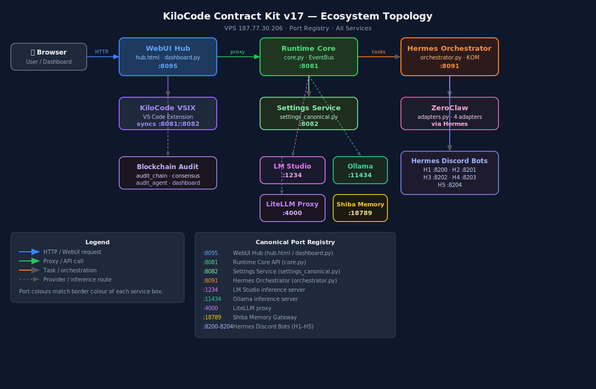

# 01 — Ecosystem Overview

> **Authoritative system map.** Verified by gates `V56_RUNTIME_TRUTH_COMPLETE`,
> `V69_hub_dashboard_truth`, and `V81_service_lifecycle_truth`.
> See [`00_MASTER_INDEX.md`](00_MASTER_INDEX.md) for navigation, [`12_TRUTH_AND_PROOF.md`](12_TRUTH_AND_PROOF.md) for proof catalog.



---

## Surfaces (5)

| Surface       | What it is                                 | Lives in                                                                                |
| ------------- | ------------------------------------------ | --------------------------------------------------------------------------------------- |
| **Hub v2**    | Operator control plane (web SPA + FastAPI) | `src/webui/` (`shell.html`, `panels/*.js`, `hub/routers/*.py`, `hub_start.py`)          |
| **KiloCode**  | VS Code extension (21-agent workspace)     | `G:\Github\kilocode-Azure2\packages\kilo-vscode\` (separate repo)                       |
| **Open WebUI**| Chat UI for end users                      | Hosted; integrated via `src/webui/hub/routers/openwebui.py` and 21-agent pipeline       |
| **Hermes**    | Orchestrator + 5 Discord auditor bots      | `src/hermes/orchestrator.py`, Docker stack `hermes1..5`                                 |
| **ZeroClaw** | Safe-exec research adapter                 | `src/zeroclaw/adapters.py` + KiloCode-side `services/zeroclaw/`                          |

All five surfaces share **one event bus** (`/events` SSE), **one settings truth**
(`SettingsCanonical`), **one Skills registry** (`~/daveai/skills/registry.json`),
and **one Service Lifecycle Watchdog** (`/api/services/ensure`).

---

## Service registry — 14 services

| ID                    | Kind     | Default URL                         | Required? | Auto-start?     |
| --------------------- | -------- | ----------------------------------- | --------- | --------------- |
| `hub`                 | local    | `http://localhost:8095`              | ✅         | (it spawns the rest) |
| `lmstudio`            | provider | `http://localhost:1234/v1/models`     |           | desktop app      |
| `ollama`              | provider | `http://localhost:11434/api/tags`     |           | `ollama serve`   |
| `litellm`             | provider | `http://localhost:4000/health`         |           | docker-compose   |
| `minimax`             | remote   | `https://api.minimaxi.chat/`          | ✅         | external         |
| `siliconflow`         | remote   | `https://api.siliconflow.cn/v1/models`|           | external         |
| `openwebui`           | local    | `http://localhost:3000/health`        | ✅         | docker           |
| `openwebui_pipelines` | local    | `http://localhost:9099/health`        | ✅         | docker           |
| `hermes`              | local    | `http://localhost:8091/health`        | ✅         | docker (`hermes1..5`) |
| `zeroclaw`            | local    | `http://localhost:8090/health`        | ✅         | systemd / docker |
| `shiba`               | local    | `http://localhost:18789/health`       |           | systemd          |
| `runtime`             | local    | `http://localhost:8081/health`        |           | KiloCode runtime |
| `settings`            | local    | `http://localhost:8082/health`        |           | systemd          |
| `skills`              | local    | `http://localhost:8095/api/skills/health` | ✅     | hub-internal     |

**Probe rule:** any HTTP `< 500` = reachable. `401/403/404` mean "server up, just unauthed/wrong path" → still healthy.
Connection refused / timeout / `5xx` = down.

**Required services** block `PASS_AGENTIC_TRUTH` if down.
**Auto-startable services** are ensured on every refresh of WebUI, on Hub boot, and on KiloCode activation.

See `src/webui/hub/routers/services.py` for the canonical list and [`11_SKILLS_AND_SERVICES.md`](11_SKILLS_AND_SERVICES.md) for full lifecycle docs.

---

## Service Lifecycle Watchdog


The watchdog fires from **5 trigger points** that all funnel into `ensure_all()`:
Hub boot, KiloCode VS Code activate, WebUI refresh, periodic poll, manual.

KiloCode's status bar shows live health (`$(server) DaveAI: 9/14`) and a click
opens a quick-pick where individual services can be started/stopped.

---

## Skills System


The Skills System adds a 10-component layer (registry, installer, audit,
permissions, runtime proof, logs, health, marketplace, execution, Voyager learn)
that enforces five hard rules before any skill is allowed to run. See
[`11_SKILLS_AND_SERVICES.md`](11_SKILLS_AND_SERVICES.md).

The default seed registry ships with `obliteratus` permanently quarantined as a
research-only refusal-bypass marker.

---

## Environment variables

```bash
# Provider keys (read at boot; never logged, never returned in /settings)
MINIMAX_API_KEY=...                 # endpoint: api.minimaxi.chat
SILICONFLOW_API_KEY=...              # endpoint: api.siliconflow.cn/v1
LITELLM_MASTER_KEY=...

# Service URLs (defaults shown — override per host)
HUB_URL=http://localhost:8095
RUNTIME_API_URL=http://localhost:8081
SETTINGS_API_URL=http://localhost:8082
HERMES_API_URL=http://localhost:8091
LM_STUDIO_URL=http://localhost:1234/v1
OLLAMA_URL=http://localhost:11434
SHIBA_DB_URL=http://localhost:18789

# Skills (location of registry + audit + evidence)
SKILLS_ROOT=$HOME/daveai/skills      # Linux/macOS
SKILLS_ROOT=%USERPROFILE%\daveai\skills   # Windows

# Hermes Discord (one token per H1..H5 bot)
DISCORD_TOKEN_H1=...
DISCORD_TOKEN_H2=...
DISCORD_TOKEN_H3=...
DISCORD_TOKEN_H4=...
DISCORD_TOKEN_H5=...
DISCORD_GUILD_ID=1490068195208331334

# Hub auth (optional; absent → all routes open)
HUB_ADMIN_TOKEN=...
```

Convention: services **never** read keys from disk-resident `settings.json`.
Keys live only in env (or KiloCode's `vscode.SecretStorage`).
`/settings` exposes presence (`has_minimax_key: true`), never the value.

---

## Health endpoints

Each service exposes `GET /health` returning `{"status": "ok", ...}`.

The Hub aggregates everything in one call:

```
GET http://localhost:8095/api/services/status
```

Response shape:
```json
{
  "ok": true,
  "ts": "2026-04-26T12:34:56Z",
  "total": 14,
  "healthy": 11,
  "down_required": ["hermes"],
  "down_optional": ["ollama"],
  "results": {
    "hub":     {"id": "hub",     "healthy": true, "status_code": 200, "latency_ms": 5},
    "minimax": {"id": "minimax", "healthy": true, "status_code": 401, "latency_ms": 312},
    "...":     "..."
  }
}
```

---

## Process topology

```
Hub (uvicorn, :8095, factory create_app)
 ├── routers/services.py       ← spawns: ollama, litellm, others with start_cmd
 ├── routers/skills.py         ← reads/writes ~/daveai/skills/
 ├── routers/runtime.py        ← proxies http://localhost:8081
 ├── routers/settings.py       ← proxies http://localhost:8082
 ├── routers/hermes.py         ← proxies http://localhost:8091
 ├── routers/openwebui.py      ← proxies http://localhost:3000
 ├── routers/warroom.py        ← in-process state for War Room
 ├── /events                   ← SSE event bus
 └── /mcp                      ← fastapi-mcp v0.4.0 mount

KiloCode VS Code extension
 ├── HubServicesService.ts     ← polls /api/services/status, status bar item
 ├── HubPanel.ts               ← embedded WebView of shell.html
 ├── SettingsEditorProvider.ts ← canonical settings editor
 └── 21 agent profiles         ← kc-main, kc-01..kc-20

Hermes orchestrator (Docker stack on VPS 187.77.30.206)
 ├── hermes1..5 containers     ← H1..H5 Discord auditor bots
 └── orchestrator.py           ← KOM, RepairRouter, TaskPacket pipeline

ZeroClaw safe-exec
 ├── ShellAdapter              ← whitelist-only commands
 ├── GitAdapter                ← blocks --force, filter-branch
 ├── FilesystemAdapter         ← path-jail
 └── ResearchAdapter           ← search/extract/summarize
```

---

## Where things live

| You want to                                  | Open                                              |
| -------------------------------------------- | ------------------------------------------------- |
| Add a Hub API endpoint                       | `src/webui/hub/routers/<area>.py`                 |
| Add a WebUI panel                            | `src/webui/panels/<name>.js` (auto-discovered)    |
| Add a service to the watchdog                | `src/webui/hub/routers/services.py:SERVICES[]`    |
| Add a skill                                  | `POST /api/skills/install` or seed `skills/registry.seed.json` |
| Add a Hermes agent route                     | `src/hermes/orchestrator.py:_select_agent_for_task` |
| Add a ZeroClaw adapter                       | `src/zeroclaw/adapters.py`                        |
| Add an audit gate                            | `G:\Github\kilocode-Azure2\scripts\audit\v##_*.py` + register in `_common.py` |
| Update KiloCode VS Code extension            | `G:\Github\kilocode-Azure2\packages\kilo-vscode\` |

---

## See also

- [`02_WEBUI_HUB.md`](02_WEBUI_HUB.md) — Hub v2 panels, routers, `/api/*` reference.
- [`04_HERMES_ORCHESTRATOR.md`](04_HERMES_ORCHESTRATOR.md) — KOM, H1–H5, RepairRouter.
- [`05_KILOCODE_VSIX.md`](05_KILOCODE_VSIX.md) — VS Code extension, HubServicesService, settings.
- [`06_ZEROCLAW_ADAPTERS.md`](06_ZEROCLAW_ADAPTERS.md) — safe-exec adapter inventory.
- [`08_DEPLOYMENT.md`](08_DEPLOYMENT.md) — VPS deployment, systemd, docker-compose.
- [`11_SKILLS_AND_SERVICES.md`](11_SKILLS_AND_SERVICES.md) — Skills + Service Lifecycle deep-dive.
- [`12_TRUTH_AND_PROOF.md`](12_TRUTH_AND_PROOF.md) — every audit gate with current pass/fail status.
