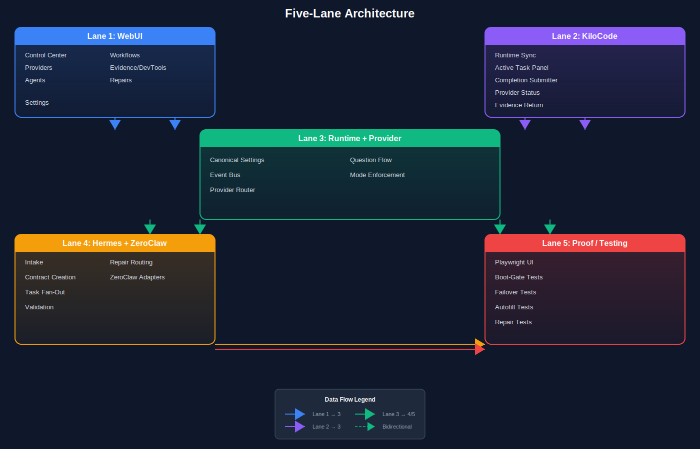

# Five Lane Architecture

## Overview

The KiloCode Contract Kit v17 implements a **five-lane architecture** designed for modular, scalable, and maintainable multi-agent contract processing. Each lane represents a distinct operational domain with well-defined interfaces for inter-lane communication via typed packets.

## Architecture Diagram



---

## Lane Summary

| Lane | Name | Purpose | Implementation Status |
|------|------|---------|----------------------|
| **Lane 1** | WebUI | User-facing control center | ⚠️ Partial |
| **Lane 2** | KiloCode | IDE integration and runtime sync | ⚠️ Partial |
| **Lane 3** | Runtime + Provider | Infrastructure, settings, routing | ⚠️ Partial |
| **Lane 4** | Hermes + ZeroClaw | Contract orchestration and execution | ⚠️ Partial |
| **Lane 5** | Proof / Testing | Validation and quality assurance | ❌ Missing |

---

## Inter-Lane Communication

### Packet Types

All lanes communicate via typed packets stored in `configs/packet_schema.json`:

| Packet Type | Direction | Purpose |
|-------------|-----------|---------|
| **Control Packet** | WebUI → Runtime | Source identity, action triggers (project.start, repair.run) |
| **Task Packet** | Runtime → Hermes | Project ID, phase, objective, acceptance criteria |
| **Completion Packet** | Hermes → KiloCode | Status, changed files, tests, artifacts |
| **Repair Packet** | Any → Hermes | Error context, repair actions, validation results |

### Event Bus

Lane communication uses NATS JetStream subjects defined in `configs/nats_subjects.json`. The event bus enables asynchronous, fault-tolerant message passing between lanes.

```json
{
  "description": "NATS subject mappings for lane communication",
  "subjects": {
    "control_packet": "contracts.control.{source}",
    "task_packet": "contracts.task.{project_id}",
    "completion_packet": "contracts.completion.{project_id}",
    "repair_packet": "contracts.repair.{node_id}"
  }
}
```

---

## Lane 1: WebUI

**Source repositories:** `v16_implementation_closure_master_kit`, `hermes-agent`, `kilocode-Azure2`, `claude-devtools`

### Components

| Component | Description | Status |
|-----------|-------------|--------|
| Control Center | Main dashboard for system health and controls | ⚠️ Partial |
| Providers Panel | Provider health, routing status, circuit breaker state | ⚠️ Partial |
| Agents Panel | Agent management, role assignment, crew visualization | ⚠️ Partial |
| Workflows Panel | Packet lifecycle tracking, phase progression | ⚠️ Partial |
| Evidence/DevTools | Trace inspection, token attribution, session replay | ⚠️ Partial |
| Repairs/Safemode | Health matrix, boot gate status, repair triggers | ⚠️ Partial |
| Settings | Missing settings question flow, autofill interface | ⚠️ Partial |

### Key Files

- `src/webui/` - WebUI React application
- `src/webui/control-center/` - Main dashboard components
- `src/webui/providers/` - Provider panel components
- `src/webui/agents/` - Agent management components
- `src/webui/workflows/` - Workflow tracking components
- `src/webui/evidence/` - Evidence/DevTools panels
- `src/webui/repairs/` - Repair and safemode components

### Integration Points

- **From Lane 3 (Runtime):** Receives canonical settings updates, provider health events
- **To Lane 3 (Runtime):** Sends control packets with user actions
- **From Lane 4 (Hermes):** Receives completion packets, repair requests
- **To Lane 2 (KiloCode):** Sends task assignments via runtime

---

## Lane 2: KiloCode

**Source repositories:** `v16_implementation_closure_master_kit`, `kilocode-Azure2`, `VPS`, `claude-devtools`

### Components

| Component | Description | Status |
|-----------|-------------|--------|
| Runtime Sync | Canonical settings synchronization with runtime | ⚠️ Partial |
| Active Task Panel | Current task display, progress tracking | ⚠️ Partial |
| Completion Submitter | Packet submission for task completion | ⚠️ Partial |
| Provider/Mode Status | Current provider, mode indicators | ✅ Complete |
| Evidence Return Panel | Evidence display from completion packets | ⚠️ Partial |
| Settings Autofill | Runtime-driven settings autofill | ⚠️ Partial |
| Command Palette | Quick actions and navigation | ⚠️ Partial |

### Key Files

- `src/kilocode/` - KiloCode VSIX extension
- `src/kilocode/runtime-sync/` - Runtime synchronization service
- `src/kilocode/task-panel/` - Active task display
- `src/kilocode/completion/` - Packet submission handlers
- `src/kilocode/evidence/` - Evidence return components

### Integration Points

- **From Lane 1 (WebUI):** Receives user commands, task assignments
- **From Lane 3 (Runtime):** Receives canonical settings, provider routing
- **To Lane 4 (Hermes):** Sends completion packets with evidence
- **From Lane 4 (Hermes):** Receives task delegations, validation callbacks

---

## Lane 3: Runtime + Provider

**Source repositories:** `v16_implementation_closure_master_kit`, `hermes-agent`, `kilocode-Azure2`

### Components

| Component | Description | Status |
|-----------|-------------|--------|
| Canonical Settings Truth | Runtime-owned settings store | ⚠️ Partial |
| Queue + Event Bus | NATS-based asynchronous messaging | ❌ Missing |
| Provider Router | Circuit breaker, failover logic | ✅ Complete |
| Missing-Settings Question | User prompt flow for secrets | ⚠️ Partial |
| Mode Enforcement | Tool/feature gating based on mode | ✅ Complete |
| Audit Logging | Action logging for compliance | ✅ Complete |
| SSH MCP Tool | Remote administration tooling | ⚠️ Partial |

### Key Files

- `src/runtime/` - Runtime Core API
- `src/runtime/settings/` - Canonical settings store
- `src/runtime/event-bus/` - NATS event bus implementation
- `src/runtime/router/` - Provider routing service
- `src/runtime/audit/` - Audit logging service

### Integration Points

- **From Lane 1 (WebUI):** Receives control packets, settings updates
- **From Lane 2 (KiloCode):** Receives runtime sync requests
- **To Lane 1 (WebUI):** Sends settings updates, provider health
- **To Lane 2 (KiloCode):** Sends canonical settings, routing decisions
- **To Lane 4 (Hermes):** Sends task packets
- **From Lane 4 (Hermes):** Receives completion packets, repair requests

---

## Lane 4: Hermes + ZeroClaw

**Source repositories:** `hermes-agent`, `VPS`, `kilocode-Azure2`, `MCP SSH Agent`

### Components

| Component | Description | Status |
|-----------|-------------|--------|
| Intake Normalization | Task form pre-fill, context bootstrap | ⚠️ Partial |
| Contract Creation | Task packet generation from intake | ⚠️ Partial |
| Task Packet Fan-Out | Delegation to sub-agents via delegate_tool | ✅ Complete |
| Validation Callbacks | Evidence-based validation against criteria | ⚠️ Partial |
| Repair Packet Routing | Error routing to repair handlers | ⚠️ Partial |
| ZeroClaw Adapters | Git, Shell, Filesystem, Research adapters | ⚠️ Partial |

### Key Files

- `src/hermes/` - Hermes Agent core
- `src/hermes/intake/` - Task intake normalization
- `src/hermes/contracts/` - Contract creation and validation
- `src/hermes/fanout/` - Task delegation and fan-out
- `src/hermes/repair/` - Repair packet routing
- `src/hermes/adapters/` - ZeroClaw adapter implementations
- `src/hermes/roles/` - Hermes agent role definitions (H1-H5)

### Agent Roles (H1-H5)

The VPS integration defines five Hermes agent roles:

| Role | Purpose | Status |
|------|--------|--------|
| **H1** | Primary orchestrator | ✅ Complete |
| **H2** | Code generation agent | ✅ Complete |
| **H3** | Testing and validation agent | ✅ Complete |
| **H4** | Research and analysis agent | ✅ Complete |
| **H5** | Repair and recovery agent | ✅ Complete |

### Integration Points

- **From Lane 3 (Runtime):** Receives task packets
- **To Lane 3 (Runtime):** Sends completion packets
- **From Lane 2 (KiloCode):** Receives completion evidence
- **To Lane 2 (KiloCode):** Sends validation callbacks
- **To Lane 5 (Proof):** Sends evidence for testing

---

## Lane 5: Proof / Testing

**Source repositories:** `hermes-agent` (3,000 tests), `v16_implementation_closure_master_kit`, `kilocode-Azure2`

### Components

| Component | Description | Status |
|-----------|-------------|--------|
| Playwright UI Tests | End-to-end browser automation | ❌ Missing |
| Boot-Gate Tests | Health matrix validation tests | ❌ Missing |
| Provider Failover Tests | Circuit breaker and failover tests | ⚠️ Partial |
| Settings/Autofill Tests | Settings question flow tests | ❌ Missing |
| Repair/Unlock Tests | Repair packet flow tests | ❌ Missing |

### Key Files

- `tests/` - Test suite root
- `tests/e2e/` - End-to-end tests
- `tests/e2e/playwright/` - Playwright UI tests
- `tests/e2e/boot-gate/` - Boot gate validation tests
- `tests/e2e/failover/` - Provider failover tests
- `tests/integration/` - Integration tests
- `tests/unit/` - Unit tests

### Testing Strategy

The proof lane validates all other lanes through automated testing:

1. **Smoke Tests** - Basic connectivity and health checks
2. **Boot Gate Tests** - Health matrix validation before operations
3. **Packet Flow Tests** - End-to-end packet generation and routing
4. **Provider Failover Tests** - Circuit breaker and fallback behavior
5. **Settings Autofill Tests** - Question flow and settings propagation
6. **Repair Flow Tests** - Error injection and repair packet routing

### Integration Points

- **From Lane 4 (Hermes):** Receives evidence for validation
- **To Lane 1 (WebUI):** Reports test results for display
- **To Lane 3 (Runtime):** Triggers boot gate validation

---

## Data Flow Examples

### Task Completion Flow

```
WebUI (Lane 1)
    │
    │ Control Packet: project.start
    ▼
Runtime (Lane 3)
    │
    │ Task Packet: { project_id, phase, objective }
    ▼
Hermes (Lane 4)
    │
    │ Task delegation via delegate_tool
    ▼
Sub-agents (H1-H5)
    │
    │ Completion Packet: { status, files, tests, artifacts }
    ▼
KiloCode (Lane 2)
    │
    │ Evidence extraction
    ▼
Proof (Lane 5)
    │
    │ Playwright validation
    ▼
WebUI (Lane 1) - Results display
```

### Repair Flow

```
Hermes (Lane 4)
    │
    │ Error detected
    ▼
Runtime (Lane 3)
    │
    │ Repair Packet: { error_context, repair_actions }
    ▼
Hermes (Lane 4) - H5 Repair Agent
    │
    │ Validation
    ▼
WebUI (Lane 1) - Repair status
```

---

## Implementation Priority

### Phase 1: Core Infrastructure (P0)
1. ✅ Complete packet schemas in `configs/`
2. ❌ Implement NATS event bus (or Redis alternative)
3. ❌ Build Runtime Core API for canonical settings
4. ❌ Create WebUI Control Center skeleton

### Phase 2: WebUI + KiloCode (P1)
5. ⚡ Adapt claude-devtools for evidence panels
6. 🔄 Merge v16 + opcode patterns for WebUI
7. ⚡ Implement Runtime Sync in KiloCode
8. ⚡ Build Active Task Panel

### Phase 3: Runtime + Provider (P2)
9. ❌ Implement event bus subjects
10. ✅ Provider router already complete
11. ⚡ Build settings question flow
12. ⚡ Integrate SSH MCP tool

### Phase 4: Hermes + ZeroClaw (P2)
13. ⚡ Integrate VPS agent roles
14. ⚡ Build ZeroClaw adapters
15. ⚡ Implement validation callbacks
16. ⚡ Build repair packet routing

### Phase 5: Proof / Testing (P3)
17. ❌ Create Playwright test suite
18. ❌ Build boot gate tests
19. ❌ Build failover tests
20. ❌ Build settings/autofill tests

---

## Configuration

### Environment Variables

| Variable | Description | Required |
|----------|-------------|----------|
| `HERMES_HOME` | Profile home directory | Yes |
| `NATS_URL` | NATS server URL | Yes |
| `RUNTIME_API_URL` | Runtime Core API URL | Yes |
| `WEBUI_URL` | WebUI URL | No |

### Profile Support

Each profile maintains isolated state under `HERMES_HOME` (default: `~/.hermes/`). The five-lane architecture is profile-aware and all paths resolve through `get_hermes_home()`.

---

## See Also

- [Lane 2: WebUI](02_WEBUI_LANE.md)
- [Lane 3: KiloCode](03_KILOCODE_LANE.md)
- [Lane 4: Runtime + Provider](04_RUNTIME_PROVIDER_LANE.md)
- [Lane 5: Hermes + ZeroClaw](05_HERMES_ZEROCLAW_LANE.md)
- [Lane 6: Proof / Testing](06_PROOF_TESTING_LANE.md)
- [GAP Analysis](../GAP_ANALYSIS.md)
- [Merge Matrix](../MERGE_MATRIX.md)

---

*Document Version: 17.0*
*Generated: 2026-04-20*
