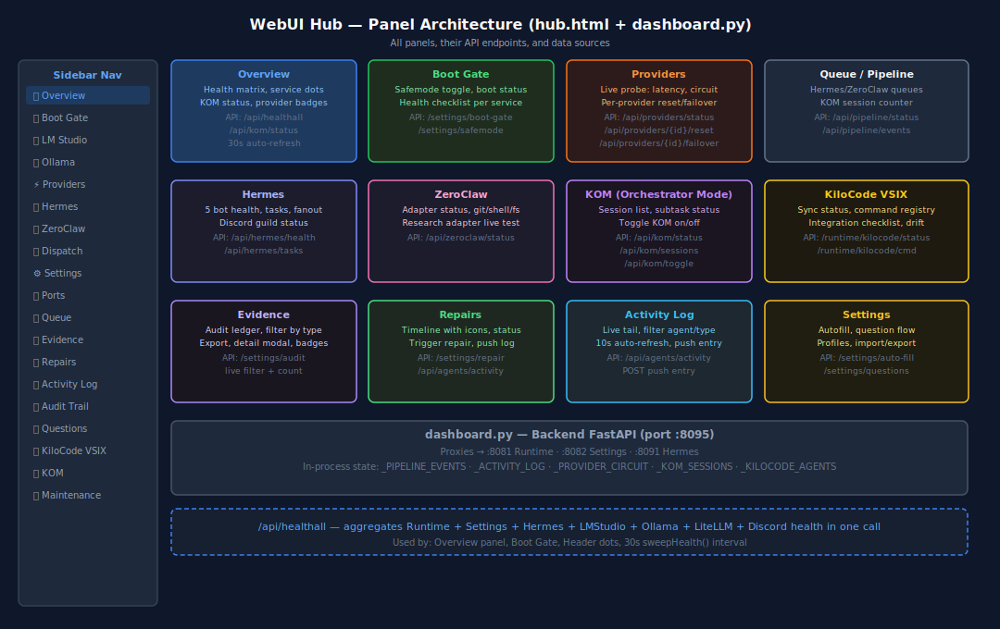

# 02 — WebUI Hub

> **Hub v2 — single-page operator console.** Verified by gates `V69_hub_dashboard_truth`,
> `V75_settings_all_tabs_truth`, and `V81_service_lifecycle_truth`.



---

## Architecture

The Hub is a **modular SPA**: a tiny shell (`shell.html` + `core.js`) loads
panel modules from `panels/*.js` via a manifest produced by
`hub/panel_registry.py`. Adding a new panel = drop a `.js` file in `panels/` —
it appears in the sidebar automatically.

The backend is a **FastAPI factory** (`hub/__init__.py:create_app`) that mounts:

- one router per concern (`hub/routers/*.py`)
- the SSE event bus (`/events`)
- the MCP server (`/mcp`, fastapi-mcp v0.4.0)
- the panel registry (`/panels/manifest.json`)
- a Service Lifecycle startup hook that auto-runs `ensure_all()` 0.5s after boot

```
src/webui/
├── shell.html              ← SPA shell, loads core.js + panel modules
├── hub_start.py            ← uvicorn launcher (factory mode)
├── requirements_hub.txt    ← FastAPI, httpx, fastapi-mcp, uvicorn
├── panels/
│   ├── core.js             ← Hub API client + SSE bus (loaded first)
│   ├── overview.js         ← header badges, summary cards
│   ├── services.js         ← service lifecycle + Ensure-all
│   ├── skills.js           ← skill registry + audit + execute
│   ├── providers.js        ← provider detection + circuit breakers
│   ├── settings.js         ← canonical settings editor
│   ├── agents.js           ← 21-agent table + diff renderer
│   ├── pipeline.js         ← task progress pipeline
│   ├── warroom.js          ← 21-agent presence grid
│   ├── kilocode.js         ← KOM session bar
│   ├── permissions.js      ← approval queue
│   ├── repairs.js          ← repair timeline
│   ├── mcp.js              ← MCP server health
│   ├── roadmap.js          ← 17-phase progress
│   ├── memory.js           ← Shiba memory browser
│   ├── discord.js          ← Hermes Discord status
│   ├── hermes.js           ← Hermes orchestrator UI
│   ├── openwebui.js        ← Open WebUI bridge
│   ├── tasks.js            ← task ledger viewer
│   ├── staging.js          ← staging → promote → rollback
│   ├── vps.js              ← VPS deployment tools
│   └── zeroclaw.js         ← ZeroClaw adapter status
└── hub/
    ├── __init__.py         ← create_app factory
    ├── auth.py             ← bearer-token middleware (HUB_ADMIN_TOKEN)
    ├── event_bus.py        ← SSE pub/sub
    ├── panel_registry.py   ← scans panels/ → manifest
    └── routers/
        ├── services.py     ← Service Lifecycle Watchdog (NEW)
        ├── skills.py       ← Skills System (NEW)
        ├── providers.py    ├── runtime.py     ├── settings.py
        ├── agents.py       ├── permissions.py ├── repairs.py
        ├── mcp.py          ├── roadmap.py     ├── warroom.py
        ├── openwebui.py    ├── kilocode.py    ├── kom.py
        ├── discord.py      ├── pipeline.py    ├── proxies.py
        ├── tasks.py        ├── staging.py     ├── capabilities.py
        ├── agents_bridge.py
        └── __init__.py
```

---

## Panel inventory (auto-discovered)

| Panel ID         | Section  | Purpose                                       | Refresh        |
| ---------------- | -------- | --------------------------------------------- | -------------- |
| `overview`       | Hub      | Header badges, summary cards, KiloCode sync    | 30s + SSE      |
| **`services`**   | Hub      | **Service Lifecycle (NEW)**, ensure-all       | mount + SSE    |
| **`skills`**     | Hub      | **Skills registry/audit/execute (NEW)**       | mount + SSE    |
| `providers`      | Hub      | Provider detection, circuit breakers, latency | 15s            |
| `settings`       | Hub      | Canonical settings editor + autofill          | manual         |
| `agents`         | Hub      | 21-agent table + diff/tool-result rendering   | 10s + SSE      |
| `pipeline`       | Hub      | Task progress (spinner → % → ✓/✗)             | SSE            |
| `warroom`        | War Room | 21-agent presence grid + collaboration        | SSE            |
| `permissions`    | War Room | Pending approvals queue                       | SSE            |
| `repairs`        | War Room | Repair timeline (before/after, dry-run)       | 10s            |
| `mcp`            | Hub      | MCP server health, tool approval, logs        | SSE            |
| `roadmap`        | Hub      | 17-phase interactive roadmap                  | manual         |
| `kilocode`       | Hub      | KOM session bar                               | 10s            |
| `discord`        | Hub      | Hermes Discord bot status                     | 10s            |
| `hermes`         | Hub      | Orchestrator queue, fanout                    | 10s            |
| `openwebui`      | Hub      | Open WebUI bridge status                      | 30s            |
| `memory`         | Hub      | Shiba memory browser                          | manual         |
| `tasks`          | Hub      | Task ledger                                   | 10s            |
| `staging`        | DevOps   | Staging → promote → rollback                  | manual         |
| `vps`            | DevOps   | VPS deployment status                         | manual         |
| `zeroclaw`       | DevOps   | Adapter availability                          | 30s            |

Panels live in `src/webui/panels/`. The registry at
`hub/panel_registry.py` scans the directory and serves a manifest at
`GET /panels/manifest.json`. **No manual registration needed** — `core.js` reads
the manifest and dynamically imports each module.

---

## Router inventory

| Router                  | Mount                  | Purpose                                                    |
| ----------------------- | ---------------------- | ---------------------------------------------------------- |
| `services.py` ⭐         | `/api/services/*`      | **NEW**: Service Lifecycle Watchdog                        |
| `skills.py` ⭐           | `/api/skills/*`        | **NEW**: Skills System (10 components)                     |
| `runtime.py`            | `/api/runtime/*`       | Control Center ViewModel + Runtime proxy                   |
| `providers.py`          | `/api/providers/*`     | Provider auto-detect, profiles, circuit breakers           |
| `settings.py`           | `/api/settings/*`      | Canonical settings sync, validation, autofill              |
| `agents.py`             | `/api/agents/*`        | 21-agent table, activity log                                |
| `agents_bridge.py`      | `/api/agents-bridge/*` | KiloCode ↔ Hub agent sync                                   |
| `permissions.py`        | `/api/permissions/*`   | Approval queue, audit log                                   |
| `repairs.py`            | `/api/repairs/*`       | Repair timeline, dry-run                                    |
| `mcp.py`                | `/api/mcp/*`           | MCP server health, tool approval                            |
| `roadmap.py`            | `/api/roadmap/*`       | Interactive 17-phase roadmap                                |
| `warroom.py`            | `/api/warroom/*`       | War Room collaboration surface                              |
| `kilocode.py`           | `/api/kilocode/*`      | KiloCode bridge                                             |
| `kom.py`                | `/api/kom/*`           | KOM session lifecycle                                       |
| `discord.py`            | `/api/discord/*`       | Hermes Discord status                                       |
| `openwebui.py`          | `/api/openwebui/*`     | Open WebUI bridge                                           |
| `pipeline.py`           | `/api/pipeline/*`      | Task pipeline events                                        |
| `proxies.py`            | `/api/{runtime,settings,hermes}/health` | upstream health proxies                |
| `tasks.py`              | `/api/tasks/*`         | Task ledger                                                 |
| `staging.py`            | `/api/staging/*`       | Staging → promote → rollback                                |
| `capabilities.py`       | `/api/capabilities/*`  | 21-agent capability policy enforcement                      |

For full endpoint list, see [`09_API_REFERENCE.md`](09_API_REFERENCE.md).

---

## Skills + Services panel UX


**`panels/skills.js`** renders an installed registry table (verdict, dangerous,
approved, use counts, actions: Audit / Approve / Execute / Logs) plus a
marketplace section with one-click install. Quarantined skills cannot be
installed for production use — the Install button is disabled.


**`panels/services.js`** renders 14 services with status badges (UP/DOWN/REASON),
latency, kind (local/remote/provider), and per-row Start/Stop buttons. The
**Ensure all** button calls `POST /api/services/ensure` and reports
`{started, failed, healthy, total}`. The panel auto-refreshes on mount and on
five SSE events: `services.probed`, `services.ensured`, `service.started`,
`service.stopped`, `skill.executed`.

---

## Event bus (`/events` SSE)

Every state change is broadcast over Server-Sent Events. Consumers:

- The Hub WebUI itself (panels register via `hub.on('event.type', cb)`)
- KiloCode `HubServicesService.ts`
- Open WebUI MCP pipeline (`/mcp`)
- Any external subscriber via `EventSource('/events')`

| Event type                  | Payload                                          | Emitter                            |
| --------------------------- | ------------------------------------------------ | ---------------------------------- |
| `services.probed`           | `{healthy, total, results}`                      | `services.probe_all()`             |
| `services.ensured`          | `{started: [], failed: [], healthy, total}`      | `services.ensure_all()`            |
| `service.started`           | `{id, action, pid?}`                             | `services.start_service()`         |
| `service.stopped`           | `{id}`                                           | `services.stop_service()`          |
| `skill.installed`           | `{skill_id, verdict}`                            | `skills.install_skill()`           |
| `skill.audited`             | `{skill_id, verdict}`                            | `skills.audit_skill()`             |
| `skill.executed`            | `{skill_id, run_id, status}`                     | `skills.execute_skill()`           |
| `skill.permissions.updated` | `{skill_id, approved, permissions}`              | `skills.update_permissions()`      |
| `skill.learned`             | `{skill_id, trigger}`                            | `skills.learn()` (Voyager)         |
| `task-created`              | `{task_id, agent, goal}`                         | `tasks.create()`                   |
| `task-progress`             | `{task_id, percent, stage}`                      | runtime ticks                      |
| `task-complete`             | `{task_id, status, result}`                      | runtime finalizers                 |
| `settings-changed`          | `{key, old_value, new_value, changed_by}`        | `settings.upsert()`                |
| `repair-started/finished`   | `{type, target, dry_run, before, after}`         | repairs router                     |
| `permission-requested`      | `{capability, scope, agent}`                     | capabilities middleware            |
| `permission-resolved`       | `{capability, decision}`                         | permissions router                 |

---

## Auth model

- **Reads** are open by default.
- **Writes** require `Authorization: Bearer <HUB_ADMIN_TOKEN>` if `HUB_ADMIN_TOKEN` is set.
- Disruptive routes (e.g. promote/rollback, ensure with start_cmd) additionally
  check a maintenance window flag on `/api/maintenance/status`.

See `hub/auth.py:require_write` for the dependency.

---

## Auto-refresh intervals (panels.js)

```javascript
// services.js (NEW)
//   On mount: probe + render. Re-render on services.* SSE events.
//
// skills.js (NEW)
//   On mount: GET /api/skills/registry + /marketplace + /health
//   Re-render on skill.* SSE events.

setInterval(loadProviders, 15000);    // providers
setInterval(loadPipeline, 10000);     // queue
setInterval(loadActivityLog, 10000);  // activity
setInterval(loadRepairs, 10000);      // repairs
setInterval(loadKomStatus, 10000);    // KOM
setInterval(loadKcStatus, 15000);     // VSIX panel
setInterval(sweepHealth, 30000);      // overview header dots
```

---

## How to add a panel

1. Create `src/webui/panels/<name>.js` exporting an object:
   ```js
   import { hub } from './core.js';
   export default {
     id: '<name>', label: 'My Panel', icon: '🧩', section: 'Hub', order: 99,
     async init() { /* attach SSE listeners, first-load fetches */ },
     async refresh() { /* re-fetch + re-render */ },
     render() { return '<div id="panel-<name>">…</div>'; },
   };
   ```
2. Save the file. **No registration needed.** `panel_registry.py` picks it up.
3. Reload the Hub WebUI; your panel is in the sidebar.

---

## See also

- [`09_API_REFERENCE.md`](09_API_REFERENCE.md) — every endpoint, every payload.
- [`11_SKILLS_AND_SERVICES.md`](11_SKILLS_AND_SERVICES.md) — Skills + Service Lifecycle.
- [`05_KILOCODE_VSIX.md`](05_KILOCODE_VSIX.md) — how KiloCode embeds the Hub.
- [`07_TESTING_GUIDE.md`](07_TESTING_GUIDE.md) — Playwright suites for the Hub.
