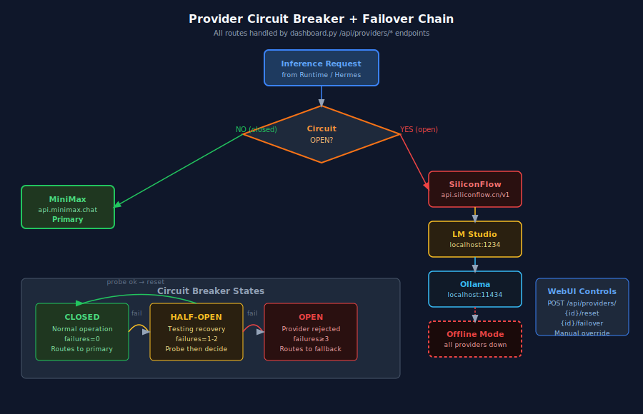

# 03 — Runtime Core

The Runtime layer is the canonical state plane for the entire ecosystem. It provides task packet routing, settings management, provider selection, and the event bus.

---

## Services

### Runtime Core — `src/runtime/core.py` · port **:8081**

The main orchestration API. Responsibilities:
- Receive and validate task packets
- Route packets to Hermes Orchestrator
- Manage provider selection (LM Studio / Ollama / SiliconFlow / MiniMax)
- Publish events to internal EventBus
- Expose health and metrics endpoints

#### Core Endpoints
```
GET  /health                         # service health
GET  /api/runtime/status             # runtime status summary
POST /api/runtime/task               # submit task packet
GET  /api/runtime/tasks              # list active tasks
GET  /api/runtime/task/{id}          # task detail
POST /api/runtime/task/{id}/cancel   # cancel task
GET  /api/runtime/metrics            # uptime, request counts, error rates
GET  /runtime/kilocode/status        # KiloCode VSIX sync status
POST /runtime/kilocode/cmd           # run VSIX command
```

#### KiloCode Status Response Shape
```json
{
  "synced": true,
  "last_sync": "2026-05-01T12:34:56Z",
  "drift": 0,
  "mode": "auto",
  "commands": {
    "syncRuntimeSettings": "ok",
    "validateProviderConfig": "ok",
    "runPreflightChecks": "ok",
    "applySettingsUpdate": "idle",
    "triggerRepairScan": "idle"
  }
}
```

---

### Settings Service — `src/runtime/settings_canonical.py` · port **:8082**

Manages the canonical settings store. All settings are versioned and HMAC-signed for integrity.

#### Settings Endpoints
```
GET  /health
GET  /settings                      # full settings dump
GET  /settings/{key}                # single key value
POST /settings                      # upsert key/value pairs
POST /settings/sync                 # trigger full sync to KiloCode VSIX
GET  /settings/boot-gate            # boot gate status
POST /settings/boot-gate            # {"enabled": bool}
GET  /settings/safemode             # safemode flag
POST /settings/safemode             # {"enabled": bool}
GET  /settings/auto-fill            # autofill suggestions
POST /settings/auto-fill            # apply autofill
GET  /settings/questions            # pending question prompts
POST /settings/questions/{id}/answer # answer a question
GET  /settings/audit                # audit log entries
POST /settings/repair               # trigger repair
```

#### Settings Priority Order
```
1. Runtime Cache      — canonical values from Settings Service
2. Environment Vars   — HERMES_*, MINIMAX_API_KEY, SILICONFLOW_API_KEY, etc.
3. Inference          — values inferred from usage patterns
4. User Input         — secrets prompted via /settings/questions
```

---

## Provider Chain



### Failover Chain

```
MiniMax (primary)
  └─ fail → SiliconFlow (api.siliconflow.cn/v1)
               └─ fail → LM Studio (localhost:1234)
                            └─ fail → Ollama (localhost:11434)
                                         └─ fail → Offline Mode
```

### Circuit Breaker States

| State | Condition | Behaviour |
|-------|-----------|-----------|
| **CLOSED** | failures = 0 | Normal operation, routes to this provider |
| **HALF-OPEN** | 1–2 failures | Sends probe request; resets to CLOSED on success |
| **OPEN** | ≥ 3 failures | Routes to next in chain; WebUI shows manual reset option |

### Provider Configuration
```yaml
providers:
  minimax:
    url: https://api.minimax.chat/v1
    priority: 1
    circuit_threshold: 3
    probe_interval: 60
  siliconflow:
    url: https://api.siliconflow.cn/v1
    priority: 2
    circuit_threshold: 3
  lm_studio:
    url: http://localhost:1234/v1
    priority: 3
    circuit_threshold: 2
  ollama:
    url: http://localhost:11434
    priority: 4
    circuit_threshold: 1
```

---

## EventBus

The Runtime Core maintains an internal EventBus for decoupled communication between components.

### Event Types

| Event | Publisher | Subscriber |
|-------|-----------|-----------|
| `task.submitted` | Runtime Core | Hermes Orchestrator |
| `task.completed` | Hermes | Runtime Core, WebUI |
| `task.failed` | Hermes | Runtime Core, RepairRouter |
| `provider.circuit_open` | Circuit Breaker | WebUI, Activity Log |
| `provider.failover` | Circuit Breaker | Runtime Core |
| `settings.updated` | Settings Service | Runtime Core, KiloCode VSIX |
| `repair.triggered` | RepairRouter | Activity Log, WebUI |
| `kom.session_done` | KOM | WebUI, Activity Log |

---

## Task Packet Schema

```json
{
  "project_id": "uuid",
  "task_id": "uuid",
  "phase": "planning|coding|testing|research|repair",
  "objective": "string",
  "criteria": ["string"],
  "context": {
    "repo_url": "string",
    "branch": "string",
    "working_dir": "string"
  },
  "agent_hint": "H1|H2|H3|H4|H5|auto",
  "priority": 1,
  "timeout_seconds": 300,
  "metadata": {}
}
```

---

## KiloCode VSIX Sync

The VSIX extension polls `GET /runtime/kilocode/status` every 15 seconds and displays sync state in the WebUI's VSIX pane. The sync protocol:

1. VSIX calls `GET /runtime/kilocode/status` → receives canonical settings snapshot
2. VSIX diffs local settings against snapshot → computes `drift` count
3. If `drift > 0`, VSIX calls `POST /runtime/kilocode/cmd` with `{"cmd": "syncRuntimeSettings"}`
4. Runtime applies update → settings propagate to `settings_canonical.py`

---

## See Also

- [docs/04_HERMES_ORCHESTRATOR.md](04_HERMES_ORCHESTRATOR.md) — how tasks are fanned out
- [docs/09_API_REFERENCE.md](09_API_REFERENCE.md) — full endpoint reference
- [ARCHITECTURE.md](../ARCHITECTURE.md) — system-level data flow SVG
