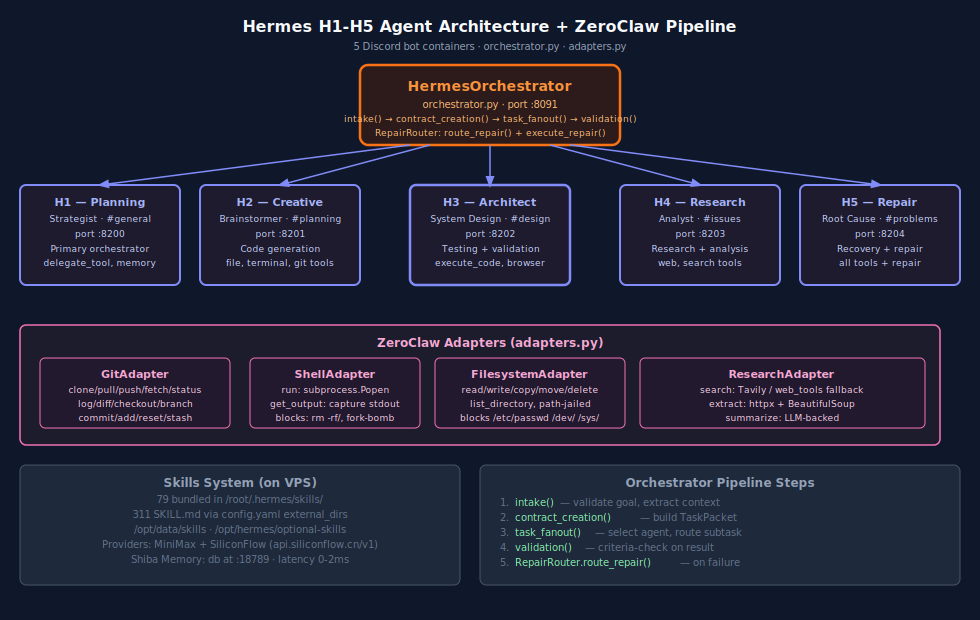
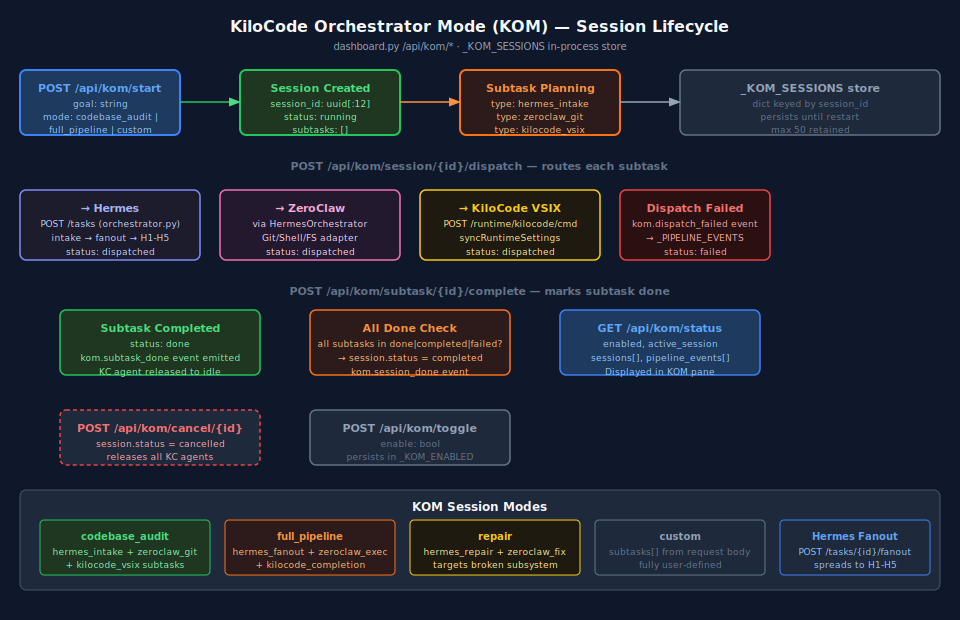

# 04 — Hermes Orchestrator

> **Multi-agent contract execution.** Verified by gate `V61_HERMES_RUNTIME`.
> Service-lifecycle integration verified by `V81_service_lifecycle_truth`
> (Hermes is a `required` service in the watchdog registry).



---

## What it is

Hermes drives all agentic work. It manages the **H1–H5 Discord auditor fleet**,
the **KOM** (KiloCode Orchestrator Mode) session lifecycle, and the
**RepairRouter** for self-healing flows. Hermes runs as a Docker stack on the
VPS (`hermes1..5`) plus a local FastAPI gateway (`gateway_server.py`) bound to
port `:8091` for the Hub to proxy to.

---

## Files

| File                                     | Purpose                                                    |
| ---------------------------------------- | ---------------------------------------------------------- |
| `src/hermes/orchestrator.py`             | `HermesOrchestrator`, `TaskPacket`, `RepairRouter`         |
| `src/hermes/gateway_server.py`           | FastAPI app: `/health /intake /tasks/{id} /jobs /fanout`   |
| `deploy/docker/hermes.Dockerfile`        | Container image for hermes1..5                              |
| `deploy/docker-compose.hermes.yml`       | 5-bot stack (containers `hermes1..hermes5`)                |
| ZeroClaw adapters live in `src/zeroclaw/adapters.py` — see [`06_ZEROCLAW_ADAPTERS.md`](06_ZEROCLAW_ADAPTERS.md) |

---

## Pipeline (TaskPacket lifecycle)

```
intake(goal, context)
  └─ validate fields, extract context
contract_creation(intake_result)
  └─ build TaskPacket (project_id, phase, criteria, context)
task_fanout(task_packet)
  └─ _select_agent_for_task(task) → H1|H2|H3|H4|H5|zeroclaw
  └─ dispatch to selected agent
validation(result, criteria)
  └─ substring-match criteria against result text
  └─ returns pass/fail
RepairRouter.route_repair(error)
  └─ keyword-based routing → repair type
  └─ execute_repair(repair_type) → repair result
```

### Agent selection (`_select_agent_for_task`)

| Task keyword                  | Selected agent     |
| ----------------------------- | ------------------ |
| `plan`, `design`, `architect` | **H1** (Planning)  |
| `code`, `implement`, `build`  | **H2** (Coding)    |
| `test`, `validate`, `verify`  | **H3** (Testing)   |
| `research`, `analyse`, `find` | **H4** (Research)  |
| `repair`, `fix`, `recover`    | **H5** (Repair)    |
| `git`, `shell`, `file`, `search` | **ZeroClaw** adapter |

---

## H1–H5 Discord bot fleet

| Agent | Role                  | Channel     | Port  | Tools                              |
| ----- | --------------------- | ----------- | ----- | ---------------------------------- |
| H1    | Planning Strategist   | `#general`  | :8200 | delegate, memory                    |
| H2    | Creative Brainstormer | `#planning` | :8201 | file, terminal, git                 |
| H3    | System Architect      | `#design`   | :8202 | execute_code, browser               |
| H4    | Bug Triage Specialist | `#issues`   | :8203 | web, search                         |
| H5    | Root Cause Analyst    | `#problems` | :8204 | all tools + repair                  |

VPS: `187.77.30.206` · Guild: `1490068195208331334` · Restart policy: `unless-stopped`.

### Skills (Hermes side)

Hermes has its own bundled skills directory at `/root/.hermes/skills/` with **79 skills**.
External skills are mounted from `config.yaml:external_dirs`:

```yaml
skills:
  external_dirs:
    - /opt/data/skills
    - /opt/hermes/optional-skills
```

This is **separate from** the Hub's Skills System (`~/daveai/skills/`). The Hub's
Skills System governs what KiloCode/Open WebUI can run via `/api/skills/execute`;
Hermes' bundled skills are part of its internal toolchain. A Voyager learn
event in the Hub may propose a Hermes skill, which lands in `~/daveai/skills/`
unapproved until reviewed. See [`11_SKILLS_AND_SERVICES.md`](11_SKILLS_AND_SERVICES.md).

---

## KOM — KiloCode Orchestrator Mode

KOM is a **session lifecycle** for multi-step orchestration started from
KiloCode. The Hub keeps in-process state in `_KOM_SESSIONS` (capped at 50)
and exposes:

```
GET    /api/kom/status                       enabled flag, active session, all sessions
POST   /api/kom/toggle                       {"enable": bool}
POST   /api/kom/start                        {"goal": str, "mode": "codebase_audit"|"full_pipeline"|"repair"|"custom"}
GET    /api/kom/session/{id}                 session detail + subtasks
POST   /api/kom/session/{id}/dispatch        {"subtask_type", "agent", "params"}
POST   /api/kom/subtask/{id}/complete        {"result", "status"}
POST   /api/kom/cancel/{id}
```

KOM modes:
- `codebase_audit` — Hermes fans out to ZeroClaw for repo scanning + H1 for plan.
- `full_pipeline` — H1 → H2 → H3 chain with validation gates.
- `repair` — RepairRouter routes to appropriate handler.
- `custom` — operator-defined subtasks.



---

## Service Lifecycle integration

Hermes is **service ID `hermes`** in the Hub watchdog (`required: true`,
probe `http://localhost:8091/health`). The Hub's `ensure_all()` on boot will
attempt to bring Hermes up if a `start_cmd` is configured. On the VPS the
start command is the docker-compose stack (managed externally by systemd);
locally the gateway is started manually:

```bash
python -m hermes.gateway_server      # exposes :8091
```

When Hermes is down, the Hub:
- Marks `down_required: ["hermes"]` in `/api/services/status`.
- Shows red warning in WebUI Services panel.
- Triggers a KiloCode status bar warning (`$(server) DaveAI: 8/14 ⚠`).

See [`02_WEBUI_HUB.md#service-lifecycle-integration`](02_WEBUI_HUB.md) and
the watchdog diagram below.


---

## Providers

Hermes uses two LLM providers in the production stack:

| Provider     | Endpoint                          | Used for                                         |
| ------------ | --------------------------------- | ------------------------------------------------ |
| MiniMax      | `https://api.minimaxi.chat/`       | Primary chat completion (M2.7-highspeed default) |
| SiliconFlow  | `https://api.siliconflow.cn/v1`    | Embedding + fallback                             |

Local fallbacks: LM Studio (`:1234`), Ollama (`:11434`), LiteLLM proxy (`:4000`).
Provider routing + circuit breakers live in `src/webui/hub/routers/providers.py`.

---

## RepairRouter

Routes errors to the right repair handler based on keyword match:

| Keyword                           | Handler                                  |
| --------------------------------- | ---------------------------------------- |
| `connection`, `timeout`           | network repair (retry with backoff)      |
| `permission`, `forbidden`         | permissions repair (request approval)    |
| `module`, `import`, `not found`   | dependency repair (install / vendor)     |
| `syntax`, `parse`                 | code repair (delegate to H2/H5)          |
| (no match)                        | default → escalate to human               |

Each repair attempt logs `repair-started` then `repair-finished` to `/events`,
captured by `panels/repairs.js` for the Repair Timeline UI.

---

## API surface (gateway_server.py · :8091)

| Method | Path                          | Purpose                                       |
| ------ | ----------------------------- | --------------------------------------------- |
| GET    | `/health`                     | Liveness probe.                               |
| POST   | `/intake`                     | Submit a TaskPacket; returns `contract_id`.   |
| GET    | `/tasks/{contract_id}`         | Fetch contract status + history.              |
| POST   | `/tasks/{contract_id}/fanout` | Fan to all H1–H5.                             |
| GET    | `/jobs`                       | List all active contracts (Bridge B).         |

Full details in [`09_API_REFERENCE.md`](09_API_REFERENCE.md).

---

## See also

- [`06_ZEROCLAW_ADAPTERS.md`](06_ZEROCLAW_ADAPTERS.md) — adapter inventory and safety rules.
- [`02_WEBUI_HUB.md`](02_WEBUI_HUB.md) — KOM panel, Hermes panel, services panel.
- [`07_TESTING_GUIDE.md`](07_TESTING_GUIDE.md) — Hermes integration tests.
- [`11_SKILLS_AND_SERVICES.md`](11_SKILLS_AND_SERVICES.md) — Voyager learn loop spec.
