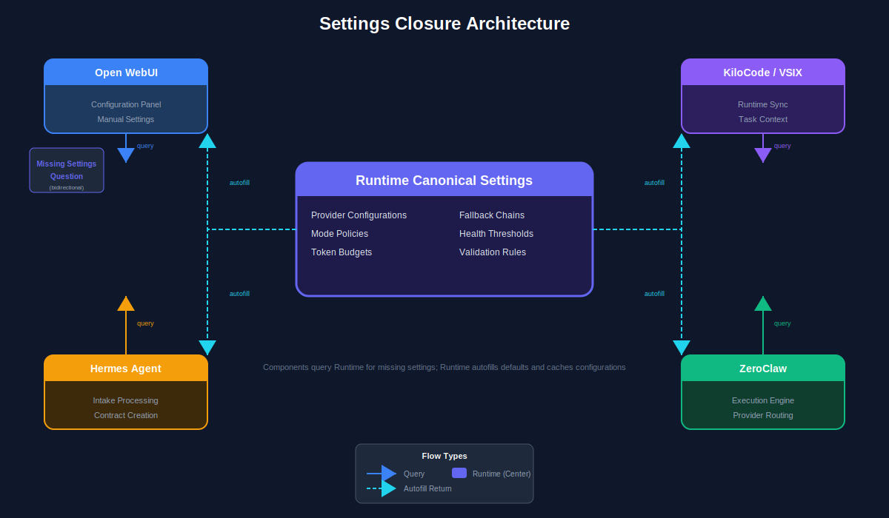

# Lane 4: Runtime + Provider

## Purpose

The Runtime + Provider lane provides the infrastructure backbone for the KiloCode Contract Kit v17. It maintains the canonical settings truth, operates the NATS event bus for inter-lane communication, manages provider routing with circuit breakers, handles the missing-settings question flow, enforces modes, and provides audit logging.

## Architecture Diagram



*See the settings closure diagram for canonical settings and autofill patterns. See provider routing diagram for failover hierarchy.*

---

## Components

### 1. Canonical Settings Truth

**Purpose:** Runtime-owned settings store that serves as the single source of truth for all configuration.

**Source:** `v16_implementation_closure_master_kit` (runtime_settings_schema.json) + `hermes-agent` (config loading) + `kilocode-Azure2` (kilo-gateway)

| Sub-component | Description | Status |
|---------------|-------------|--------|
| Settings Store | Centralized key-value store | ⚠️ Partial |
| Schema Validator | Validate settings against schema | ⚠️ Partial |
| Access Control | Permission-based access | ⚠️ Partial |
| Versioning | Settings change history | ⚠️ Partial |
| Encryption | Secret encryption at rest | ⚠️ Partial |

**Key Files:**
- `src/runtime/settings/store.ts`
- `src/runtime/settings/schema-validator.ts`
- `src/runtime/settings/access-control.ts`
- `src/runtime/settings/encryption.ts`

**Settings Schema (runtime_settings_schema.json):**
```json
{
  "$schema": "runtime_settings_schema.json",
  "type": "object",
  "properties": {
    "providers": {
      "type": "object",
      "properties": {
        "minimax": {
          "type": "object",
          "properties": {
            "api_key": { "type": "string", "secret": true },
            "endpoint": { "type": "string" },
            "model": { "type": "string" }
          }
        },
        "siliconflow": { "type": "object" },
        "lmstudio": { "type": "object" },
        "ollama": { "type": "object" }
      }
    },
    "agents": {
      "type": "object",
      "properties": {
        "max_iterations": { "type": "integer" },
        "timeout": { "type": "integer" },
        "toolsets": { "type": "array", "items": { "type": "string" } }
      }
    },
    "runtime": {
      "type": "object",
      "properties": {
        "event_bus_url": { "type": "string" },
        "api_port": { "type": "integer" },
        "profile": { "type": "string" }
      }
    }
  },
  "required": ["runtime"]
}
```

**API Endpoints:**
```typescript
// GET /api/settings - Fetch all settings (secrets redacted)
GET /api/settings/{key}  // Fetch specific setting
PUT /api/settings/{key}   // Update setting
POST /api/settings/sync  // Force sync with Runtime
DELETE /api/settings/{key} // Delete setting
```

---

### 2. Queue + Event Bus

**Purpose:** NATS JetStream-based asynchronous messaging for packet-based communication between lanes.

**Source:** `v16_implementation_closure_master_kit` (nats_subjects.json) + `hermes-agent` (event handling)

| Sub-component | Description | Status |
|-----------|-------------|--------|
| NATS Client | Connection management | ❌ Missing |
| Subject Registry | NATS subject definitions | ⚠️ Partial |
| Publisher | Packet publishing | ❌ Missing |
| Subscriber | Packet subscription | ❌ Missing |
| Dead Letter Queue | Failed message handling | ❌ Missing |

**Key Files:**
- `src/runtime/event-bus/nats-client.ts`
- `src/runtime/event-bus/subject-registry.ts`
- `src/runtime/event-bus/publisher.ts`
- `src/runtime/event-bus/subscriber.ts`

**NATS Subjects (nats_subjects.json):**
```json
{
  "description": "NATS subject mappings for lane communication",
  "subjects": {
    "control_packet": "contracts.control.{source}",
    "task_packet": "contracts.task.{project_id}",
    "completion_packet": "contracts.completion.{project_id}",
    "repair_packet": "contracts.repair.{node_id}",
    "settings_update": "runtime.settings.update",
    "provider_health": "runtime.provider.health",
    "agent_status": "runtime.agent.status",
    "audit_log": "runtime.audit.log"
  }
}
```

**Note:** The NATS implementation is currently **missing**. The architecture supports either NATS JetStream or an alternative like Redis Pub/Sub or PostgreSQL LISTEN/NOTIFY as a fallback.

**Configuration:**
```yaml
event_bus:
  type: "nats"  # or "redis" or "postgres"
  nats:
    url: "nats://localhost:4222"
    max_reconnect: 10
    reconnect_time_wait: 2000
  redis:
    url: "redis://localhost:6379"
  postgres:
    connection_string: "postgresql://localhost:5432/hermes"
```

---

### 3. Provider Router

**Purpose:** Intelligent provider selection with circuit breaker pattern and automatic failover.

**Source:** `kilocode-Azure2` (routing service) + `hermes-agent` (provider integration)

| Sub-component | Description | Status |
|---------------|-------------|--------|
| Circuit Breaker | Failure tracking and tripping | ✅ Complete |
| Load Balancer | Request distribution | ✅ Complete |
| Failover Manager | Automatic fallback | ✅ Complete |
| Health Checker | Provider health monitoring | ✅ Complete |
| Metrics Collector | Latency/error tracking | ✅ Complete |

**Key Files:**
- `src/runtime/router/circuit-breaker.ts`
- `src/runtime/router/load-balancer.ts`
- `src/runtime/router/failover-manager.ts`
- `src/runtime/router/health-checker.ts`

**Circuit Breaker States:**
```
CLOSED → (failure threshold reached) → OPEN
   ↑                                    │
   │ (timeout elapsed)                  │
   └─────────────── (half-open) ───────┘
```

**Circuit Breaker Configuration:**
```yaml
circuit_breaker:
  failure_threshold: 5      # failures before opening
  success_threshold: 2      # successes in half-open to close
  timeout: 30000            # ms before trying half-open
  half_open_max_requests: 3 # max requests in half-open
```

**Provider Configuration:**
```yaml
providers:
  minimax:
    enabled: true
    primary: true
    fallback: siliconflow
    max_retries: 3
    timeout: 30000
    health_check:
      enabled: true
      interval: 30000
      endpoint: "https://api.minimax.io/health"
  siliconflow:
    enabled: true
    primary: false
    fallback: lmstudio
  lmstudio:
    enabled: true
    primary: false
    fallback: ollama
  ollama:
    enabled: true
    primary: false
    fallback: null
```

---

### 4. Missing-Settings Question Flow

**Purpose:** Prompt users for required secrets that cannot be auto-filled.

**Source:** `v16_implementation_closure_master_kit` (question flow spec) + `hermes-agent` (CLI prompts)

| Sub-component | Description | Status |
|---------------|-------------|--------|
| Settings Scanner | Detect missing required settings | ⚠️ Partial |
| Question Generator | Generate user prompts | ⚠️ Partial |
| Response Handler | Process user input | ⚠️ Partial |
| Retry Logic | Handle failed validations | ⚠️ Partial |
| Timeout Manager | Enforce question timeouts | ⚠️ Partial |

**Key Files:**
- `src/runtime/settings/scanner.ts`
- `src/runtime/settings/question-generator.ts`
- `src/runtime/settings/response-handler.ts`

**Question Flow:**
```
Runtime detects missing setting
         │
         ▼
    Categorize setting
         │
    ┌────┴────┐
    │         │
 Secret    Non-secret
    │         │
    ▼         ▼
 User      Infer from
 Prompt    context/default
    │         │
    ▼         ▼
 Validate   Auto-apply
    │
    ▼
 Store in settings store
    │
    ▼
 Distribute to lanes
```

**Configuration:**
```yaml
question_flow:
  enabled: true
  timeout: 300          # seconds
  retry_count: 3
  retry_delay: 1000    # ms
  secret_questions:
    provider_api_key:
      prompt: "Enter your {provider} API key:"
      validation: "length >= 32"
      masked: true
```

---

### 5. Mode Enforcement

**Purpose:** Gate tools, features, and capabilities based on the current mode.

**Source:** `hermes-agent` (mode system) + `kilocode-Azure2` (mode config)

| Sub-component | Description | Status |
|---------------|-------------|--------|
| Mode Manager | Current mode state | ✅ Complete |
| Tool Gates | Enable/disable tools per mode | ✅ Complete |
| Feature Flags | Feature availability per mode | ✅ Complete |
| Mode Transitions | Valid mode changes | ✅ Complete |

**Key Files:**
- `src/runtime/modes/mode-manager.ts`
- `src/runtime/modes/tool-gates.ts`
- `src/runtime/modes/feature-flags.ts`

**Modes and Tool Availability:**

| Mode | delegate | file | terminal | git | web | execute_code | browser | repair |
|------|----------|------|----------|-----|-----|--------------|---------|--------|
| `auto` | ✅ | ✅ | ✅ | ✅ | ✅ | ✅ | ✅ | ✅ |
| `supervisor` | ✅ | ❌ | ❌ | ❌ | ❌ | ❌ | ❌ | ❌ |
| `coding` | ❌ | ✅ | ✅ | ✅ | ❌ | ❌ | ❌ | ❌ |
| `testing` | ❌ | ❌ | ✅ | ❌ | ❌ | ✅ | ✅ | ❌ |
| `research` | ❌ | ❌ | ❌ | ❌ | ✅ | ❌ | ❌ | ❌ |
| `repair` | ✅ | ✅ | ✅ | ✅ | ✅ | ✅ | ✅ | ✅ |

**Mode Configuration:**
```yaml
modes:
  default: auto
  allowed_transitions:
    auto: [supervisor, coding, testing, research, repair]
    coding: [auto, testing]
    testing: [auto, coding]
    research: [auto]
    repair: [auto]
    supervisor: [auto]
```

---

### 6. Audit Logging

**Purpose:** Comprehensive action logging for compliance and debugging.

**Source:** `hermes-agent` (logging system) + `hermes-agent` (trajectory saving)

| Sub-component | Description | Status |
|---------------|-------------|--------|
| Log Collector | Aggregate logs from all lanes | ✅ Complete |
| Log Formatter | Standardized log format | ✅ Complete |
| Log Storage | Persistent log storage | ✅ Complete |
| Log Search | Query and filter logs | ✅ Complete |
| Audit Reporter | Compliance reports | ✅ Complete |

**Key Files:**
- `src/runtime/audit/log-collector.ts`
- `src/runtime/audit/log-formatter.ts`
- `src/runtime/audit/log-storage.ts`

**Log Entry Structure:**
```typescript
interface AuditLogEntry {
  timestamp: string;           // ISO8601
  level: 'DEBUG' | 'INFO' | 'WARN' | 'ERROR';
  source: 'runtime' | 'webui' | 'kilocode' | 'hermes';
  action: string;
  actor: string;              // user or agent ID
  resource: string;           // affected resource
  details: Record<string, unknown>;
  packet_id?: string;         // related packet
  session_id?: string;
  trace_id?: string;
}
```

**Configuration:**
```yaml
audit:
  enabled: true
  log_level: INFO
  storage:
    type: "sqlite"  # or "postgres" or "file"
    path: "audit.db"
  retention_days: 90
  export_formats: ["json", "csv"]
```

---

### 7. SSH MCP Tool

**Purpose:** Remote administration via MCP SSH Agent integration.

**Source:** `MCP SSH Agent` (aiondadotcom) + `hermes-agent` (mcp_tool.py)

| Sub-component | Description | Status |
|---------------|-------------|--------|
| SSH Client | SSH connection management | ⚠️ Partial |
| File Transfer | SFTP operations | ⚠️ Partial |
| Command Execution | Remote command runner | ⚠️ Partial |
| Key Management | SSH key handling | ⚠️ Partial |
| Session Manager | Persistent SSH sessions | ⚠️ Partial |

**Key Files:**
- `src/runtime/ssh/ssh-client.ts`
- `src/runtime/ssh/file-transfer.ts`
- `src/runtime/ssh/command-executor.ts`

**MCP SSH Integration:**
The MCP SSH Agent (`server-simple.mjs`) is directly integrated into `hermes-agent/tools/mcp_tool.py`.

**Configuration:**
```yaml
ssh:
  default_timeout: 30000
  max_connections: 10
  key_path: "~/.ssh/id_rsa"
  known_hosts: "~/.ssh/known_hosts"
  agents:
    - name: "prod-server"
      host: "production.example.com"
      user: "admin"
      port: 22
```

---

## Implementation Status Summary

| Component | Status | Source |
|-----------|--------|--------|
| Canonical Settings Truth | ⚠️ Partial | v16 + hermes-agent + kilo-gateway |
| Queue + Event Bus | ❌ Missing | v16 + hermes-agent |
| Provider Router | ✅ Complete | kilocode-Azure2 + hermes-agent |
| Missing-Settings Question | ⚠️ Partial | v16 + hermes-agent |
| Mode Enforcement | ✅ Complete | hermes-agent + kilocode-Azure2 |
| Audit Logging | ✅ Complete | hermes-agent |
| SSH MCP Tool | ⚠️ Partial | MCP SSH Agent + hermes-agent |

---

## File Structure

```
src/runtime/
├── settings/
│   ├── store.ts
│   ├── schema-validator.ts
│   ├── access-control.ts
│   ├── encryption.ts
│   ├── scanner.ts
│   ├── question-generator.ts
│   └── response-handler.ts
├── event-bus/
│   ├── nats-client.ts
│   ├── redis-client.ts      # alternative
│   ├── subject-registry.ts
│   ├── publisher.ts
│   ├── subscriber.ts
│   └── dead-letter-queue.ts
├── router/
│   ├── circuit-breaker.ts
│   ├── load-balancer.ts
│   ├── failover-manager.ts
│   ├── health-checker.ts
│   └── metrics-collector.ts
├── modes/
│   ├── mode-manager.ts
│   ├── tool-gates.ts
│   └── feature-flags.ts
├── audit/
│   ├── log-collector.ts
│   ├── log-formatter.ts
│   ├── log-storage.ts
│   ├── log-search.ts
│   └── audit-reporter.ts
├── ssh/
│   ├── ssh-client.ts
│   ├── file-transfer.ts
│   ├── command-executor.ts
│   └── session-manager.ts
└── api.ts                    # FastAPI/Flask entry point
```

---

## Integration with Other Lanes

### From Lane 1 (WebUI)
- **Receives:** Control packets (project.start, repair.run)
- **Publishes:** Settings updates, provider health events

### From Lane 2 (KiloCode)
- **Receives:** Runtime sync requests, settings queries
- **Publishes:** Canonical settings, routing decisions

### To Lane 4 (Hermes + ZeroClaw)
- **Publishes:** Task packets
- **Receives:** Completion packets, repair requests

### To Lane 5 (Proof / Testing)
- **Publishes:** Boot gate validation triggers
- **Receives:** Test results

---

## API Endpoints

The Runtime Core API provides the following endpoints:

```yaml
# Settings
GET    /api/settings
GET    /api/settings/{key}
PUT    /api/settings/{key}
DELETE /api/settings/{key}
POST   /api/settings/sync

# Providers
GET    /api/providers
GET    /api/providers/{name}/health
GET    /api/providers/{name}/metrics

# Event Bus
POST   /api/events/publish
GET    /api/events/subscribe

# Audit
GET    /api/audit/logs
GET    /api/audit/logs/{id}

# Health
GET    /api/health
GET    /api/health/ready
```

---

## Testing Strategy

| Test Type | Coverage | Status |
|-----------|----------|--------|
| Settings Validation Tests | Schema validation | ❌ Not created |
| Event Bus Tests | NATS/Redis publish/subscribe | ❌ Not created |
| Circuit Breaker Tests | Failure/failover behavior | ✅ Complete |
| Question Flow Tests | User prompt handling | ❌ Not created |
| Mode Enforcement Tests | Tool gating | ✅ Complete |
| Audit Log Tests | Log collection and storage | ✅ Complete |

---

## See Also

- [Five Lane Architecture](01_FIVE_LANE_ARCHITECTURE.md)
- [GAP Analysis](../GAP_ANALYSIS.md)
- [Merge Matrix](../MERGE_MATRIX.md)
- [WebUI Lane](02_WEBUI_LANE.md)
- [KiloCode Lane](03_KILOCODE_LANE.md)
- [Hermes + ZeroClaw Lane](05_HERMES_ZEROCLAW_LANE.md)

---

*Document Version: 17.0*
*Generated: 2026-04-20*
