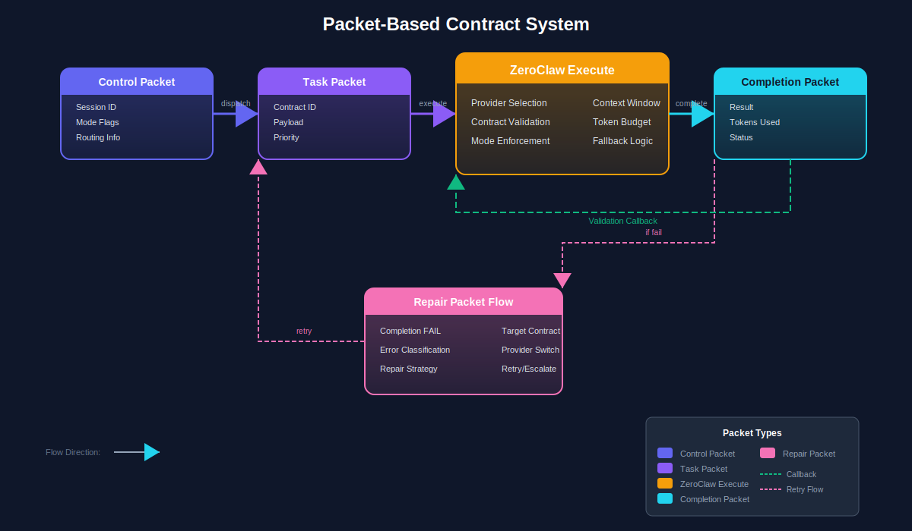

# Lane 5: Hermes + ZeroClaw

## Purpose

The Hermes + ZeroClaw lane provides the orchestration and execution layer for the KiloCode Contract Kit v17. It normalizes task intake, creates contracts (task packets), fans out tasks to sub-agents, validates evidence, and routes repairs. ZeroClaw adapters enable the agent to interact with Git, Shell, Filesystem, and Research capabilities.

## Architecture Diagram



*See the packet flow diagram for contract creation and task fan-out patterns. See boot gate diagram for repair routing.*

---

## Components

### 1. Intake Normalization

**Purpose:** Pre-fill task forms from context, bootstrap ZeroClaw with initial data.

**Source:** `VPS` (5 Hermes agent roles) + `kilocode-Azure2` (ZeroClaw service)

| Sub-component | Description | Status |
|---------------|-------------|--------|
| Context Gatherer | Collect context from various sources | ⚠️ Partial |
| Form Prefiller | Pre-fill task form fields | ⚠️ Partial |
| History Analyzer | Analyze past similar tasks | ⚠️ Partial |
| Template Engine | Apply task templates | ⚠️ Partial |
| Validation | Validate intake data | ⚠️ Partial |

**Key Files:**
- `src/hermes/intake/context-gatherer.ts`
- `src/hermes/intake/form-prefiller.ts`
- `src/hermes/intake/history-analyzer.ts`
- `src/hermes/intake/template-engine.ts`

**Intake Form Structure:**
```typescript
interface TaskIntake {
  project_id: string;
  source: 'webui' | 'kilocode' | 'api' | 'scheduler';
  objective: string;
  phase: string;
  constraints: {
    max_iterations?: number;
    timeout?: number;
    budget_limit?: number;
  };
  context: {
    files?: string[];
    commands?: string[];
    description?: string;
  };
  acceptance_criteria: AcceptanceCriterion[];
  metadata: {
    requested_by: string;
    priority: 'low' | 'normal' | 'high' | 'critical';
    tags?: string[];
  };
}
```

---

### 2. Contract Creation

**Purpose:** Generate task packets (contracts) from normalized intake.

**Source:** `VPS` (task packet schema) + `v16` (packet schema) + `hermes-agent` (delegate_tool)

| Sub-component | Description | Status |
|---------------|-------------|--------|
| Packet Builder | Construct task packets | ⚠️ Partial |
| Schema Validator | Validate against packet schema | ⚠️ Partial |
| Contract Signer | Sign contracts with agent identity | ⚠️ Partial |
| Contract Registry | Track active contracts | ⚠️ Partial |
| Version Manager | Contract versioning | ⚠️ Partial |

**Key Files:**
- `src/hermes/contracts/packet-builder.ts`
- `src/hermes/contracts/schema-validator.ts`
- `src/hermes/contracts/contract-registry.ts`

**Task Packet Schema:**
```json
{
  "task_packet": {
    "contract_id": "uuid",
    "project_id": "uuid",
    "phase": "string",
    "objective": "string",
    "acceptance_criteria": [
      {
        "id": "uuid",
        "description": "string",
        "type": "file_exists|test_passes|command_succeeds|manual",
        "params": {}
      }
    ],
    "constraints": {
      "max_iterations": 90,
      "timeout": 3600000,
      "budget_limit": null
    },
    "created_at": "ISO8601",
    "expires_at": "ISO8601",
    "signature": "string"
  }
}
```

---

### 3. Task Packet Fan-Out

**Purpose:** Delegate tasks to sub-agents using the hierarchical crew pattern.

**Source:** `hermes-agent` (delegate_tool, hierarchical_crew.py) + `VPS` (5 agent roles)

| Sub-component | Description | Status |
|---------------|-------------|--------|
| Crew Orchestrator | Manage hierarchical crew | ✅ Complete |
| Task Distributor | Assign tasks to agents | ✅ Complete |
| Result Aggregator | Collect sub-agent results | ✅ Complete |
| Fan-Out Planner | Plan parallel vs sequential | ⚠️ Partial |
| Dependency Manager | Handle task dependencies | ⚠️ Partial |

**Key Files:**
- `src/hermes/fanout/crew-orchestrator.ts`
- `src/hermes/fanout/task-distributor.ts`
- `src/hermes/fanout/result-aggregator.ts`
- `src/hermes/fanout/dependency-manager.ts`

**Agent Roles (H1-H5) from VPS:**

| Role | Name | Function | Tools | Status |
|------|------|----------|-------|--------|
| **H1** | Orchestrator | Primary coordination | delegate, memory, file_read | ✅ Complete |
| **H2** | Coder | Code generation | file_write, terminal, git | ✅ Complete |
| **H3** | Tester | Testing/validation | execute_code, browser, terminal | ✅ Complete |
| **H4** | Researcher | Research/analysis | web_search, extract, analyze | ✅ Complete |
| **H5** | Repair | Repair/recovery | all tools + repair toolkit | ✅ Complete |

**Crew Hierarchy:**
```
H1 (Orchestrator)
├── H2 (Coder) × N
├── H3 (Tester) × M
├── H4 (Researcher)
└── H5 (Repair - on-demand)
```

**Configuration:**
```yaml
crew:
  hierarchical:
    manager_llm: "anthropic/claude-opus-4.6"
    agents:
      - role: "h2_coder"
        count: 3
        llm: "anthropic/claude-sonnet-4"
      - role: "h3_tester"
        count: 2
        llm: "anthropic/claude-haiku-4"
      - role: "h4_researcher"
        count: 1
        llm: "anthropic/claude-haiku-4"
    process: "hierarchical"  # or "parallel" or "sequential"
```

---

### 4. Validation Callbacks

**Purpose:** Validate completion evidence against acceptance criteria.

**Source:** `VPS` (evidence requirements) + `VPS` (evidence ledger)

| Sub-component | Description | Status |
|---------------|-------------|--------|
| Criteria Matcher | Match evidence to criteria | ⚠️ Partial |
| Test Validator | Validate test results | ⚠️ Partial |
| File Validator | Check file existence/changes | ⚠️ Partial |
| Command Validator | Verify command outcomes | ⚠️ Partial |
| Validation Reporter | Report validation results | ⚠️ Partial |

**Key Files:**
- `src/hermes/validation/criteria-matcher.ts`
- `src/hermes/validation/test-validator.ts`
- `src/hermes/validation/file-validator.ts`
- `src/hermes/validation/validation-reporter.ts`

**Validation Flow:**
```
Completion Packet Received
         │
         ▼
    Parse Evidence
         │
         ▼
    For Each Acceptance Criterion
         │
    ┌────┴────┐
    │         │
 File/       Command
 Test        │
    │         │
    └────┬────┘
         ▼
    Validation Result
         │
         ▼
    Aggregate Results
         │
    ┌────┴────┐
    │         │
 Pass       Fail
    │         │
    ▼         ▼
 Complete   Trigger
            Repair
```

**Validation Types:**

| Type | Handler | Status |
|------|---------|--------|
| `file_exists` | FileValidator | ⚠️ Partial |
| `file_matches` | FileValidator | ⚠️ Partial |
| `test_passes` | TestValidator | ⚠️ Partial |
| `command_succeeds` | CommandValidator | ⚠️ Partial |
| `manual` | ManualValidation | ⚠️ Partial |

---

### 5. Repair Packet Routing

**Purpose:** Route repair packets to appropriate handlers on failure.

**Source:** `v16_implementation_closure_master_kit` (repair flow) + `hermes-agent` (error handling)

| Sub-component | Description | Status |
|---------------|-------------|--------|
| Error Classifier | Classify error type/severity | ⚠️ Partial |
| Repair Router | Route to appropriate repair agent | ⚠️ Partial |
| Handoff Manager | Transfer context to repair agent | ⚠️ Partial |
| Repair Tracker | Track repair progress | ⚠️ Partial |
| Rollback Handler | Rollback on unrecoverable error | ⚠️ Partial |

**Key Files:**
- `src/hermes/repair/error-classifier.ts`
- `src/hermes/repair/repair-router.ts`
- `src/hermes/repair/handoff-manager.ts`
- `src/hermes/repair/rollback-handler.ts`

**Repair Packet Structure:**
```typescript
interface RepairPacket {
  repair_id: string;
  original_contract_id: string;
  error: {
    type: 'validation_failure' | 'timeout' | 'resource_exhausted' | 'unknown';
    severity: 'low' | 'medium' | 'high' | 'critical';
    message: string;
    stack_trace?: string;
    context: Record<string, unknown>;
  };
  attempted_fixes: string[];
  requested_action: 'retry' | 'rollback' | 'manual' | 'abort';
  priority: 'low' | 'normal' | 'high' | 'critical';
  created_at: string;
}
```

**Repair Routing Rules:**
```yaml
repair_routing:
  rules:
    - error_type: "validation_failure"
      severity: "low"
      action: "retry"
      route_to: "h2_coder"
    - error_type: "validation_failure"
      severity: "high"
      action: "manual"
      route_to: "h5_repair"
    - error_type: "timeout"
      action: "retry"
      route_to: "h1_orchestrator"
    - error_type: "resource_exhausted"
      action: "rollback"
      route_to: "h5_repair"
```

---

### 6. ZeroClaw Adapters

**Purpose:** Tool adapters enabling Hermes to interact with external systems.

**Source:** `hermes-agent` (existing tools) + `kilocode-Azure2` (ZeroClaw service) + `VPS` (ZeroClaw kit)

| Adapter | Description | Tools | Status |
|---------|-------------|-------|--------|
| Git Adapter | Git operations | git_clone, git_commit, git_push, git_pull | ✅ Complete |
| Shell Adapter | Shell commands | terminal_run, shell_exec | ✅ Complete |
| Filesystem Adapter | File operations | file_read, file_write, file_delete, file_search | ✅ Complete |
| Research Adapter | Web operations | web_search, web_extract, browser_navigate | ✅ Complete |
| SSH Adapter | Remote operations | ssh_connect, ssh_run, ssh_transfer | ⚠️ Partial |
| Docker Adapter | Container operations | docker_run, docker_build | ⚠️ Partial |

**Key Files:**
- `src/hermes/adapters/git-adapter.ts`
- `src/hermes/adapters/shell-adapter.ts`
- `src/hermes/adapters/filesystem-adapter.ts`
- `src/hermes/adapters/research-adapter.ts`
- `src/hermes/adapters/ssh-adapter.ts`
- `src/hermes/adapters/docker-adapter.ts`

**Adapter Interface:**
```typescript
interface ZeroClawAdapter {
  name: string;
  capabilities: string[];
  
  execute(command: string, params: Record<string, unknown>): Promise<AdapterResult>;
  validate(params: Record<string, unknown>): Promise<ValidationResult>;
  health(): Promise<HealthStatus>;
}

interface AdapterResult {
  success: boolean;
  output: unknown;
  error?: string;
  metrics: {
    duration_ms: number;
    tokens_used?: number;
  };
}
```

**Configuration:**
```yaml
zeroclaw:
  adapters:
    git:
      enabled: true
      default_branch: "main"
      author_name: "Hermes Agent"
      author_email: "hermes@daveai.tech"
    shell:
      enabled: true
      timeout: 300000
      allowed_commands:
        - "npm"
        - "git"
        - "python"
        - "pip"
    filesystem:
      enabled: true
      allowed_paths:
        - "/workspace"
        - "/project"
      max_file_size: 104857600
    research:
      enabled: true
      max_results: 10
      browser_provider: "browserbase"
```

---

## Hermes Agent Core

The Hermes Agent is based on `hermes-agent-2026.4.13` with contract-specific extensions.

**Key Source Files:**
- `run_agent.py` - AIAgent core (10,800 lines)
- `model_tools.py` - Tool orchestration
- `toolsets.py` - Toolset definitions
- `agent/prompt_builder.py` - System prompt assembly
- `agent/context_compressor.py` - Auto context compression
- `agent/auxiliary_client.py` - Auxiliary LLM client

**Extension Points:**
- Contract skill: `skills/contract/` - Contract-specific prompts
- Contract tools: `tools/contract_tool.py` - Contract operations
- Contract handlers: `handlers/contract_handler.py` - Packet handlers

---

## Implementation Status Summary

| Component | Status | Source |
|-----------|--------|--------|
| Intake Normalization | ⚠️ Partial | VPS + kilocode-Azure2 |
| Contract Creation | ⚠️ Partial | VPS + v16 + hermes-agent |
| Task Fan-Out | ✅ Complete | hermes-agent + VPS |
| Validation Callbacks | ⚠️ Partial | VPS + evidence ledger |
| Repair Packet Routing | ⚠️ Partial | v16 + hermes-agent |
| Git Adapter | ✅ Complete | hermes-agent |
| Shell Adapter | ✅ Complete | hermes-agent |
| Filesystem Adapter | ✅ Complete | hermes-agent |
| Research Adapter | ✅ Complete | hermes-agent |
| SSH Adapter | ⚠️ Partial | MCP SSH Agent |
| Docker Adapter | ⚠️ Partial | Not implemented |

---

## File Structure

```
src/hermes/
├── intake/
│   ├── context-gatherer.ts
│   ├── form-prefiller.ts
│   ├── history-analyzer.ts
│   └── template-engine.ts
├── contracts/
│   ├── packet-builder.ts
│   ├── schema-validator.ts
│   ├── contract-registry.ts
│   └── version-manager.ts
├── fanout/
│   ├── crew-orchestrator.ts
│   ├── task-distributor.ts
│   ├── result-aggregator.ts
│   └── dependency-manager.ts
├── validation/
│   ├── criteria-matcher.ts
│   ├── test-validator.ts
│   ├── file-validator.ts
│   ├── command-validator.ts
│   └── validation-reporter.ts
├── repair/
│   ├── error-classifier.ts
│   ├── repair-router.ts
│   ├── handoff-manager.ts
│   ├── repair-tracker.ts
│   └── rollback-handler.ts
├── adapters/
│   ├── git-adapter.ts
│   ├── shell-adapter.ts
│   ├── filesystem-adapter.ts
│   ├── research-adapter.ts
│   ├── ssh-adapter.ts
│   └── docker-adapter.ts
├── roles/
│   ├── h1-orchestrator.ts
│   ├── h2-coder.ts
│   ├── h3-tester.ts
│   ├── h4-researcher.ts
│   └── h5-repair.ts
├── skills/
│   └── contract/
│       ├── prompts.yaml
│       └── handlers/
└── run_agent.py              # Entry point (from hermes-agent)
```

---

## Integration with Other Lanes

### From Lane 3 (Runtime + Provider)
- **Receives:** Task packets
- **Publishes:** Completion packets, repair requests

### From Lane 2 (KiloCode)
- **Receives:** Completion evidence
- **Publishes:** Validation callbacks

### To Lane 5 (Proof / Testing)
- **Publishes:** Evidence for validation
- **Receives:** Test results

### To Lane 1 (WebUI)
- **Publishes:** Repair requests, completion status

---

## VPS Integration

The VPS (Virtual Processing System) provides:

| Component | Description | Integration |
|-----------|-------------|-------------|
| DaveAI Platform | Production platform | ZeroClaw port not listening |
| Hermes Bots | 5 container deployment | Need contract awareness |
| Agentic Brain | LangGraph orchestration | Contract hooks missing |
| LiteLLM Proxy | Model routing | Contract routing missing |
| Evidence Ledger | Evidence storage | Need integration |

**VPS Agent Roles:**
- H1: Orchestrates task flow
- H2: Executes code generation
- H3: Runs tests and validation
- H4: Performs research
- H5: Handles repairs

---

## Skills System

The Hermes Agent has 25 skill categories. Contract-specific skills need to be added:

| Skill | Status | Purpose |
|-------|--------|---------|
| `contract.create` | ❌ Missing | Create task packets |
| `contract.validate` | ❌ Missing | Validate evidence |
| `contract.repair` | ❌ Missing | Trigger repairs |
| `contract.intake` | ❌ Missing | Process intake |

---

## Testing Strategy

| Test Type | Coverage | Status |
|-----------|----------|--------|
| Crew Tests | Hierarchical delegation | ✅ Complete (hermes-agent) |
| Contract Tests | Packet creation/validation | ❌ Not created |
| Adapter Tests | Each adapter | ⚠️ Partial |
| Repair Flow Tests | Error handling | ❌ Not created |
| Integration Tests | End-to-end task flow | ❌ Not created |

---

## ZeroClaw Actual Completion Status (April 2026)

*This section reflects the state of `src/zeroclaw/adapters.py` as audited and
patched on 2026-04-21. It covers only the Python ZeroClaw layer; the TypeScript
adapter stubs in `src/hermes/adapters/` are tracked separately above.*

### Concrete Adapter Completeness

| Adapter class | `execute` | `validate` | Notes |
|---|---|---|---|
| `GitAdapter` | Complete | Complete | Two execution modes: command mode (whitelisted subprocess) and named-operation mode (clone/checkout/commit/push/pull). Whitelist: clone, pull, push, fetch, status, log, diff, checkout, branch, commit, add, reset, stash. |
| `ShellAdapter` | Complete | Complete | Supports `run` and `get_output` operations via `subprocess.Popen`. |
| `FilesystemAdapter` | Complete | Complete | Supports read, write, copy, move, delete, list_directory. Path resolution relative to configurable `root_path`. |
| `ResearchAdapter` | Complete | Complete | Supports search (Tavily / web_tools fallback), extract (httpx / BeautifulSoup fallback), summarize. |

### Changes Made (2026-04-21)

1. **`GitAdapter.execute` — command mode added.** Operations that include a
   `"command"` key are now dispatched directly to `subprocess.run(["git",
   <command>, ...])`.  Only commands in `ALLOWED_COMMANDS` are permitted;
   others are rejected by `validate` before subprocess is touched.  Return
   shape: `{"status": "ok", "output": <stdout>, "command": <cmd>, ...}`.

2. **`GitAdapter.validate` — extended for command mode.**  Checks that
   `command` is present and in the whitelist.  If optional `"repo_path"` is
   provided, verifies the directory exists on disk.  Named-operation mode
   validation (clone/checkout/commit/push/pull) is preserved unchanged.

3. **`GitAdapter.ALLOWED_COMMANDS` class attribute** introduced — single
   source of truth for the whitelist.

4. **`__init__.py` updated** — `BaseAdapter` is now exported so consumers
   can type-check against the abstract base without importing from
   `adapters` directly.

5. **`tests/unit/test_zeroclaw_adapters.py` created** — 35 pytest tests
   covering all four concrete adapters plus abstract-class enforcement.

### What Was Already Complete

All four adapters (`GitAdapter`, `ShellAdapter`, `FilesystemAdapter`,
`ResearchAdapter`) already had real `execute` and `validate` bodies before
this audit.  The gap was the command-mode API for `GitAdapter` described in
the project spec, and the missing `BaseAdapter` export.

### Known Remaining Gaps

- `ZeroClawGateway.__init__` calls `asyncio.create_task()` synchronously,
  which will raise `RuntimeError` outside a running event loop.  Gateway
  should defer adapter registration to an explicit `async def initialize()`
  call or use `__aenter__`.  Not changed in this pass (out of scope for
  adapter audit).
- SSH and Docker adapters referenced in this document's components table are
  TypeScript stubs only; no Python equivalents exist yet.

---

## Hermes Actual Completion Status (April 2026)

This section records the verified state of `src/hermes/orchestrator.py` as audited on 2026-04-21.
It supersedes the aspirational status table above for the Python orchestrator layer specifically.

### Class inventory

| Class | Type | execute | validate | Notes |
|-------|------|---------|----------|-------|
| `ZeroClawAdapter` | Abstract base (`ABC`) | `@abstractmethod` | `@abstractmethod` | Cannot be instantiated directly. Both methods are now enforced via `@abstractmethod`. |
| `GitAdapter` | Concrete | Complete | Complete | Blocks force-push, filter-branch, push --delete. Provides clone/pull/push/checkout/commit helpers. |
| `ShellAdapter` | Concrete | Complete | Complete | Blocks rm -rf /, dd, fork-bomb, mkfs, shutdown, reboot. Configurable timeout (default 300 s). |
| `FilesystemAdapter` | Concrete | Complete | Complete | Dispatches read/write/copy/move/delete/list. Path-jailed to root_path when provided; blocks /etc/passwd, /etc/shadow, /dev/, /sys/. |
| `ResearchAdapter` | Concrete | Complete | Complete | Dispatches search/extract/summarize. Gracefully falls back when httpx absent. |
| `HermesOrchestrator` | Orchestrator | N/A | N/A | Full intake → contract_creation → task_fanout → validation pipeline implemented. Default `zeroclaw_adapter` is a `ShellAdapter` instance. |
| `RepairRouter` | Utility | N/A | N/A | route_repair, execute_repair, get_repair_history all implemented. Keyword-based repair-type routing. |
| `TaskPacket` | Data model | N/A | N/A | to_dict / from_dict round-trip complete. |

### Fixes applied (2026-04-21 audit)

1. **Abstract enforcement** — `ZeroClawAdapter.execute` and `ZeroClawAdapter.validate` were decorated with `@abstractmethod`. Previously they used bare `raise NotImplementedError`, which allowed direct instantiation of the base class. The `HermesOrchestrator.__init__` was updated to instantiate `ShellAdapter()` (a valid concrete adapter) instead of the now-abstract `ZeroClawAdapter()`.

2. **Silent ImportError handlers replaced with logger.debug** — Two `except ImportError: pass` blocks in `ResearchAdapter` (one in `search()`, one in `extract_content()`) were replaced with `logger.debug(...)` calls so that missing optional dependencies are surfaced in debug logs rather than silently swallowed.

3. **No missing execute/validate implementations found** — All four concrete subclasses (`GitAdapter`, `ShellAdapter`, `FilesystemAdapter`, `ResearchAdapter`) already had complete `execute` and `validate` implementations. No new logic was required.

### What is NOT yet in orchestrator.py (Python layer)

The TypeScript source files listed in the file-structure tree (`context-gatherer.ts`, `form-prefiller.ts`, `packet-builder.ts`, etc.) are architectural aspirations and do **not** exist on disk. The Python orchestrator implements equivalent functionality inline:

| Capability | Python equivalent | Status |
|------------|------------------|--------|
| Context gathering / history analysis | `HermesOrchestrator.intake()` (partial: no DB-backed history) | Partial |
| Schema validation at intake | Inline field checks in `intake()` | Minimal |
| Fan-out with parallel/sequential planning | `task_fanout()` + `_select_agent_for_task()` | Functional (no async parallel dispatch) |
| Criteria-based validation | `validation()` — substring matching only | Partial |
| Repair routing / execution | `RepairRouter.route_repair()` + `execute_repair()` | Functional (no real repair logic, generic stub) |
| SSH Adapter | Not implemented | Missing |
| Docker Adapter | Not implemented | Missing |

### Test coverage

Unit tests were created at `tests/unit/test_hermes_orchestrator.py` covering:
- Abstract base enforcement (cannot instantiate `ZeroClawAdapter` directly)
- `FilesystemAdapter` execute dispatch and path-jail validation
- `GitAdapter` and `ShellAdapter` dangerous-command blocking
- `ResearchAdapter` search, summarize, and validate paths
- `HermesOrchestrator` init, full pipeline dispatch, and error handling
- `RepairRouter` routing, execution, and history
- `TaskPacket` serialization round-trip

---

## See Also

- [Five Lane Architecture](01_FIVE_LANE_ARCHITECTURE.md)
- [GAP Analysis](../GAP_ANALYSIS.md)
- [Merge Matrix](../MERGE_MATRIX.md)
- [Runtime + Provider Lane](04_RUNTIME_PROVIDER_LANE.md)
- [Proof / Testing Lane](06_PROOF_TESTING_LANE.md)
- [hermes-agent source](../../hermes-agent/)

---

*Document Version: 17.0*
*Generated: 2026-04-20*
