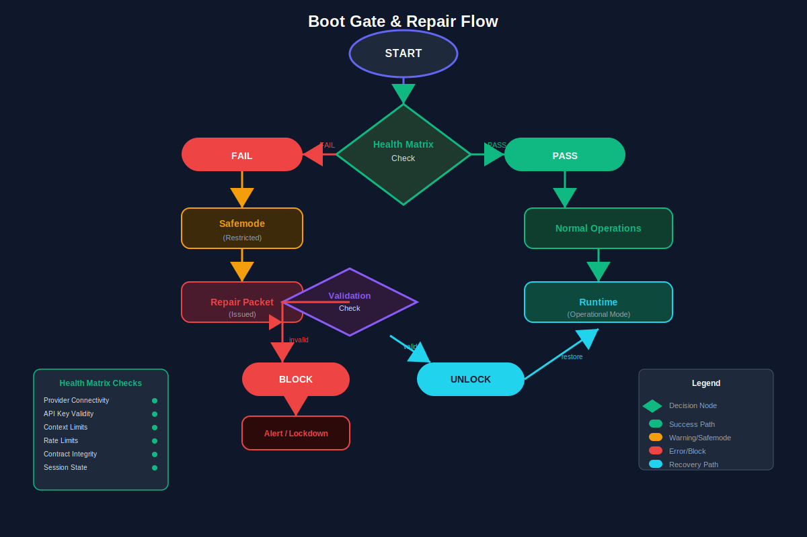

# Lane 6: Proof / Testing

## Purpose

The Proof / Testing lane provides comprehensive validation and quality assurance for the KiloCode Contract Kit v17. It creates and executes automated tests that validate all other lanes, including Playwright UI tests, boot-gate tests, provider failover tests, settings/autofill tests, and repair flow tests.

## Architecture Diagram



*See the boot gate diagram for safemode and repair testing patterns.*

---

## Overview

The Proof lane validates the entire five-lane architecture through automated testing:

```
┌─────────────────────────────────────────────────────────────────┐
│                    PROOF / TESTING LANE                         │
├─────────────────────────────────────────────────────────────────┤
│  ┌──────────────┐  ┌──────────────┐  ┌──────────────┐         │
│  │  Playwright  │  │  Boot Gate   │  │   Provider    │         │
│  │   UI Tests   │  │    Tests     │  │  Failover     │         │
│  └──────────────┘  └──────────────┘  └──────────────┘         │
│  ┌──────────────┐  ┌──────────────┐                            │
│  │   Settings   │  │   Repair      │                            │
│  │  Autofill    │  │   Flow       │                            │
│  │   Tests      │  │   Tests       │                            │
│  └──────────────┘  └──────────────┘                            │
└─────────────────────────────────────────────────────────────────┘
         │                │                │
         ▼                ▼                ▼
┌─────────────┐  ┌─────────────┐  ┌─────────────┐
│  Lane 1     │  │  Lane 3      │  │  Lane 3     │
│  WebUI      │  │  Runtime     │  │  Runtime    │
└─────────────┘  └─────────────┘  └─────────────┘
```

---

## Components

### 1. Playwright UI Tests

**Purpose:** End-to-end browser automation tests for WebUI and KiloCode interfaces.

**Source:** `hermes-agent` (test structure) + `kilocode-Azure2` (e2e structure) + `claude-devtools` (test patterns)

| Test Category | Description | Status |
|--------------|-------------|--------|
| WebUI Smoke Tests | Basic connectivity and rendering | ❌ Not created |
| Control Center Tests | Health matrix, quick actions | ❌ Not created |
| Providers Panel Tests | Provider display, circuit breaker | ❌ Not created |
| Agents Panel Tests | Agent roster, crew visualization | ❌ Not created |
| Workflows Panel Tests | Packet tracking, phase progress | ❌ Not created |
| Evidence Panel Tests | Evidence display, tool call tree | ❌ Not created |
| Settings Flow Tests | Settings editor, question prompts | ❌ Not created |
| KiloCode Task Tests | Task display, completion submit | ❌ Not created |

**Key Files:**
- `tests/e2e/playwright/webui-smoke.spec.ts`
- `tests/e2e/playwright/control-center.spec.ts`
- `tests/e2e/playwright/providers-panel.spec.ts`
- `tests/e2e/playwright/agents-panel.spec.ts`
- `tests/e2e/playwright/workflows-panel.spec.ts`
- `tests/e2e/playwright/evidence-panel.spec.ts`
- `tests/e2e/playwright/settings-flow.spec.ts`
- `tests/e2e/playwright/kilocode-task.spec.ts`

**Playwright Configuration:**
```typescript
// playwright.config.ts
import { defineConfig, devices } from '@playwright/test';

export default defineConfig({
  testDir: './tests/e2e/playwright',
  fullyParallel: true,
  forbidOnly: !!process.env.CI,
  retries: process.env.CI ? 2 : 0,
  workers: process.env.CI ? 1 : undefined,
  reporter: [['html'], ['json', { outputFile: 'playwright-results.json' }]],
  use: {
    baseURL: 'http://localhost:3000',
    trace: 'on-first-retry',
    screenshot: 'only-on-failure',
  },
  projects: [
    { name: 'chromium', use: { ...devices['Desktop Chrome'] } },
    { name: 'firefox', use: { ...devices['Desktop Firefox'] } },
    { name: 'webkit', use: { ...devices['Desktop Safari'] } },
  ],
});
```

**Example Test:**
```typescript
// tests/e2e/playwright/control-center.spec.ts
import { test, expect } from '@playwright/test';

test.describe('Control Center', () => {
  test.beforeEach(async ({ page }) => {
    await page.goto('/control-center');
    await page.waitForLoadState('networkidle');
  });

  test('should display health matrix', async ({ page }) => {
    const healthMatrix = page.locator('[data-testid="health-matrix"]');
    await expect(healthMatrix).toBeVisible();
    
    // Verify all lanes are represented
    const laneIndicators = page.locator('[data-testid="lane-indicator"]');
    await expect(laneIndicators).toHaveCount(5);
  });

  test('should show activity feed', async ({ page }) => {
    const activityFeed = page.locator('[data-testid="activity-feed"]');
    await expect(activityFeed).toBeVisible();
  });

  test('should handle quick action buttons', async ({ page }) => {
    const startButton = page.locator('[data-testid="quick-action-start"]');
    await expect(startButton).toBeEnabled();
    
    await startButton.click();
    // Verify modal or confirmation appears
    const modal = page.locator('[data-testid="confirm-dialog"]');
    await expect(modal).toBeVisible();
  });
});
```

---

### 2. Boot-Gate Tests

**Purpose:** Validate the boot gate sequence and safemode behavior.

**Source:** `v16_implementation_closure_master_kit` (deploy scripts) + `v16` (boot_gate_repair.svg)

| Test Category | Description | Status |
|--------------|-------------|--------|
| Health Check Tests | Lane health verification | ❌ Not created |
| Boot Sequence Tests | Sequential boot validation | ❌ Not created |
| Safemode Tests | Safemode trigger and behavior | ❌ Not created |
| Recovery Tests | Recovery from failed boot | ❌ Not created |

**Key Files:**
- `tests/e2e/boot-gate/health-check.spec.ts`
- `tests/e2e/boot-gate/boot-sequence.spec.ts`
- `tests/e2e/boot-gate/safemode.spec.ts`
- `tests/e2e/boot-gate/recovery.spec.ts`
- `tests/e2e/boot-gate/deploy-scripts/`

**Boot Gate Sequence:**
```
1. Check Runtime API connectivity
         │
         ▼
2. Verify NATS event bus status
         │
         ▼
3. Validate provider configurations
         │
         ▼
4. Check Hermes agent availability
         │
         ▼
5. Verify SSH MCP tool status
         │
         ▼
    All Passed → Ready
         │
       Failed → Safemode
```

**Example Test:**
```typescript
// tests/e2e/boot-gate/boot-sequence.spec.ts
import { test, expect } from '@playwright/test';

test.describe('Boot Gate Sequence', () => {
  test('should pass boot gate when all services healthy', async ({ request }) => {
    const response = await request.get('/api/health/ready');
    expect(response.ok()).toBeTruthy();
    
    const health = await response.json();
    expect(health.status).toBe('ready');
    expect(health.checks.runtime).toBe('healthy');
    expect(health.checks.event_bus).toBe('healthy');
    expect(health.checks.providers).toBe('healthy');
    expect(health.checks.hermes).toBe('healthy');
  });

  test('should enter safemode when Runtime API unavailable', async ({ request }) => {
    // Simulate Runtime API failure (via test harness)
    const response = await request.get('/api/health/ready');
    const health = await response.json();
    
    expect(health.safemode).toBe(true);
    expect(health.failed_check).toBe('runtime');
  });

  test('should recover from safemode on service restoration', async ({ request }) => {
    // First ensure safemode
    await enterSafemode();
    
    // Restore service
    await restoreRuntimeAPI();
    
    // Verify recovery
    const response = await request.get('/api/health/ready');
    const health = await response.json();
    expect(health.safemode).toBe(false);
    expect(health.status).toBe('ready');
  });
});
```

---

### 3. Provider Failover Tests

**Purpose:** Validate circuit breaker and failover behavior.

**Source:** `kilocode-Azure2` (routing service with circuit breaker) + `hermes-agent` (error classifier)

| Test Category | Description | Status |
|--------------|-------------|--------|
| Circuit Breaker Tests | Failure tracking and tripping | ⚠️ Partial |
| Failover Chain Tests | Provider fallback behavior | ⚠️ Partial |
| Recovery Tests | Recovery after failover | ⚠️ Partial |
| Load Balancing Tests | Request distribution | ⚠️ Partial |

**Key Files:**
- `tests/e2e/failover/circuit-breaker.spec.ts`
- `tests/e2e/failover/failover-chain.spec.ts`
- `tests/e2e/failover/recovery.spec.ts`

**Circuit Breaker States:**
```
CLOSED (normal) → OPEN (after 5 failures)
     ↑                   │
     │              timeout (30s)
     │                   ↓
     └────── HALF_OPEN ←──┘
         (2 successes to close)
```

**Example Test:**
```typescript
// tests/e2e/failover/circuit-breaker.spec.ts
import { test, expect } from '@playwright/test';

test.describe('Circuit Breaker', () => {
  test('should trip after failure threshold', async ({ request }) => {
    // Make 5 failing requests
    for (let i = 0; i < 5; i++) {
      await request.get('/api/providers/minimax/health', { 
        failOnStatusCode: false 
      });
    }
    
    // Next request should be blocked
    const response = await request.get('/api/providers/minimax/health', {
      failOnStatusCode: false
    });
    expect(response.status()).toBe(503); // Service unavailable
  });

  test('should fallback to secondary provider', async ({ request }) => {
    // Trip primary circuit breaker
    await tripCircuitBreaker('minimax');
    
    // Make request - should fallback to SiliconFlow
    const response = await request.post('/api/chat/completions', {
      data: { model: 'test-model', messages: [{ role: 'user', content: 'test' }] }
    });
    
    // Should succeed via fallback
    expect(response.ok()).toBeTruthy();
    const metrics = await getProviderMetrics();
    expect(metrics.siliconflow.requests).toBeGreaterThan(0);
  });

  test('should recover after timeout', async ({ request }) => {
    await tripCircuitBreaker('minimax');
    
    // Wait for timeout (30s)
    await page.waitForTimeout(35000);
    
    // Should allow one probe request
    const response = await request.get('/api/providers/minimax/health', {
      failOnStatusCode: false
    });
    expect(response.status()).not.toBe(503);
  });
});
```

---

### 4. Settings/Autofill Tests

**Purpose:** Validate settings question flow and autofill behavior.

**Source:** `v16_implementation_closure_master_kit` (settings schema) + `hermes-agent` (config tests)

| Test Category | Description | Status |
|--------------|-------------|--------|
| Schema Validation Tests | Settings schema enforcement | ❌ Not created |
| Question Flow Tests | User prompt handling | ❌ Not created |
| Autofill Tests | Auto-fill logic | ❌ Not created |
| Sync Tests | Runtime settings sync | ❌ Not created |

**Key Files:**
- `tests/e2e/settings/schema-validation.spec.ts`
- `tests/e2e/settings/question-flow.spec.ts`
- `tests/e2e/settings/autofill.spec.ts`
- `tests/e2e/settings/sync.spec.ts`

**Settings Autofill Priority:**
```
1. Runtime Cache (canonical settings from Runtime API)
2. Environment Variables (HERMES_*, provider API keys)
3. Inference (settings inferred from usage patterns)
4. User Input (only for secrets not available elsewhere)
```

**Example Test:**
```typescript
// tests/e2e/settings/autofill.spec.ts
import { test, expect } from '@playwright/test';

test.describe('Settings Autofill', () => {
  test('should autofill from environment variables', async ({ page }) => {
    await page.goto('/settings');
    
    // Set environment variable simulation
    await page.evaluate(() => {
      localStorage.setItem('test_env', JSON.stringify({
        MINIMAX_API_KEY: 'test-key-from-env'
      }));
    });
    
    await page.reload();
    
    // Verify API key field is populated
    const apiKeyField = page.locator('[data-testid="minimax-api-key"]');
    await expect(apiKeyField).toHaveValue('test-key-from-env');
  });

  test('should prompt for missing secrets', async ({ page }) => {
    await page.goto('/settings');
    
    // Remove all secret sources
    await page.evaluate(() => localStorage.clear());
    
    // Check for missing indicator
    const missingIndicator = page.locator('[data-testid="missing-secret"]');
    await expect(missingIndicator).toBeVisible();
    
    // Click to start question flow
    await missingIndicator.click();
    
    // Verify prompt modal
    const promptModal = page.locator('[data-testid="question-prompt"]');
    await expect(promptModal).toBeVisible();
  });

  test('should sync with Runtime API', async ({ page }) => {
    await page.goto('/settings');
    
    // Trigger sync
    await page.click('[data-testid="sync-settings"]');
    
    // Verify spinner and completion
    const spinner = page.locator('[data-testid="sync-spinner"]');
    await expect(spinner).toBeVisible();
    
    await expect(spinner).toBeHidden({ timeout: 10000 });
    
    // Verify last synced timestamp
    const lastSynced = page.locator('[data-testid="last-synced"]');
    await expect(lastSynced).not.toHaveText('Never');
  });
});
```

---

### 5. Repair/Unlock Tests

**Purpose:** Validate repair packet flow and recovery behavior.

**Source:** `v16_implementation_closure_master_kit` (repair flow) + `v16` (deploy scripts)

| Test Category | Description | Status |
|--------------|-------------|--------|
| Error Detection Tests | Error classification | ❌ Not created |
| Repair Trigger Tests | Repair initiation | ❌ Not created |
| Handoff Tests | Context transfer to repair agent | ❌ Not created |
| Rollback Tests | Rollback on unrecoverable error | ❌ Not created |

**Key Files:**
- `tests/e2e/repair/error-detection.spec.ts`
- `tests/e2e/repair/repair-trigger.spec.ts`
- `tests/e2e/repair/handoff.spec.ts`
- `tests/e2e/repair/rollback.spec.ts`

**Repair Flow:**
```
Error Detected
       │
       ▼
  Classify Error
       │
  ┌────┴────┐
  │         │
Validation  Timeout
Failure     │
  │         │
  ▼         ▼
 Retry or   Route to
 Manual     Repair
       │
       ▼
  Handoff
  to H5
       │
       ▼
   Validate
   Repair
       │
  ┌────┴────┐
  │         │
 Success   Fail
  │         │
  ▼         ▼
 Resume   Rollback
```

**Example Test:**
```typescript
// tests/e2e/repair/repair-trigger.spec.ts
import { test, expect } from '@playwright/test';

test.describe('Repair Flow', () => {
  test('should trigger repair on validation failure', async ({ page }) => {
    await page.goto('/workflows');
    
    // Inject a failing validation scenario
    await page.evaluate(() => {
      window.simulateValidationFailure({
        type: 'test_passes',
        expected: true,
        actual: false
      });
    });
    
    // Verify repair indicator
    const repairIndicator = page.locator('[data-testid="repair-triggered"]');
    await expect(repairIndicator).toBeVisible();
  });

  test('should route to H5 repair agent', async ({ page }) => {
    await page.goto('/agents');
    
    // Verify H5 repair agent is available
    const h5Agent = page.locator('[data-testid="agent-h5"]');
    await expect(h5Agent).toBeVisible();
    await expect(h5Agent).toHaveAttribute('data-status', 'idle');
    
    // Trigger repair scenario
    await page.click('[data-testid="trigger-repair"]');
    
    // Verify H5 is activated
    await expect(h5Agent).toHaveAttribute('data-status', 'active');
  });

  test('should rollback on unrecoverable error', async ({ page }) => {
    await page.goto('/workflows');
    
    // Inject unrecoverable error
    await page.evaluate(() => {
      window.simulateUnrecoverableError({
        type: 'resource_exhausted',
        message: 'Disk space exhausted'
      });
    });
    
    // Verify rollback indicator
    const rollbackIndicator = page.locator('[data-testid="rollback-initiated"]');
    await expect(rollbackIndicator).toBeVisible();
    
    // Verify state restoration
    const workflowState = page.locator('[data-testid="workflow-state"]');
    await expect(workflowState).toHaveText('rolled_back');
  });
});
```

---

## Test Suite Structure

```
tests/
├── e2e/
│   ├── playwright/                    # Playwright UI tests
│   │   ├── webui-smoke.spec.ts
│   │   ├── control-center.spec.ts
│   │   ├── providers-panel.spec.ts
│   │   ├── agents-panel.spec.ts
│   │   ├── workflows-panel.spec.ts
│   │   ├── evidence-panel.spec.ts
│   │   ├── settings-flow.spec.ts
│   │   └── kilocode-task.spec.ts
│   ├── boot-gate/                    # Boot gate tests
│   │   ├── health-check.spec.ts
│   │   ├── boot-sequence.spec.ts
│   │   ├── safemode.spec.ts
│   │   └── recovery.spec.ts
│   ├── failover/                     # Provider failover tests
│   │   ├── circuit-breaker.spec.ts
│   │   ├── failover-chain.spec.ts
│   │   └── recovery.spec.ts
│   ├── settings/                     # Settings/autofill tests
│   │   ├── schema-validation.spec.ts
│   │   ├── question-flow.spec.ts
│   │   ├── autofill.spec.ts
│   │   └── sync.spec.ts
│   ├── repair/                       # Repair flow tests
│   │   ├── error-detection.spec.ts
│   │   ├── repair-trigger.spec.ts
│   │   ├── handoff.spec.ts
│   │   └── rollback.spec.ts
│   └── playwright.config.ts
├── integration/                      # Integration tests
│   ├── lanes/
│   │   ├── webui-runtime.spec.ts
│   │   ├── runtime-hermes.spec.ts
│   │   └── hermes-kilocode.spec.ts
│   └── packets/
│       ├── control-packet.spec.ts
│       ├── task-packet.spec.ts
│       └── completion-packet.spec.ts
└── unit/                            # Unit tests
    ├── settings/
    ├── router/
    ├── validation/
    └── adapters/
```

---

## Implementation Status Summary

| Component | Status | Source |
|-----------|--------|--------|
| Playwright UI Tests | ❌ Not created | hermes-agent + kilocode-Azure2 |
| Boot-Gate Tests | ❌ Not created | v16 deploy scripts |
| Provider Failover Tests | ⚠️ Partial | kilocode-Azure2 + hermes-agent |
| Settings/Autofill Tests | ❌ Not created | v16 + hermes-agent |
| Repair/Unlock Tests | ❌ Not created | v16 |

---

## Running Tests

### Full Suite
```bash
# All tests
pytest tests/ -v

# E2E only
playwright test tests/e2e/playwright/

# Specific lane
pytest tests/e2e/boot-gate/ -v
```

### Individual Test Categories
```bash
# WebUI tests
playwright test tests/e2e/playwright/webui-smoke.spec.ts

# Boot gate tests
pytest tests/e2e/boot-gate/ -v

# Provider failover tests
pytest tests/e2e/failover/ -v

# Settings tests
pytest tests/e2e/settings/ -v

# Repair tests
pytest tests/e2e/repair/ -v
```

### CI/CD
```bash
# GitHub Actions example
- name: Run E2E Tests
  run: |
    npx playwright install --with-deps
    npx playwright test --reporter=html
```

---

## Test Coverage Goals

| Lane | Coverage Target | Current |
|------|-----------------|---------|
| WebUI | 80% | 0% |
| KiloCode | 75% | 0% |
| Runtime | 85% | 0% |
| Hermes | 80% | 0% |
| Proof | 90% | 0% |

---

## See Also

- [Five Lane Architecture](01_FIVE_LANE_ARCHITECTURE.md)
- [GAP Analysis](../GAP_ANALYSIS.md)
- [Merge Matrix](../MERGE_MATRIX.md)
- [WebUI Lane](02_WEBUI_LANE.md)
- [KiloCode Lane](03_KILOCODE_LANE.md)
- [Runtime + Provider Lane](04_RUNTIME_PROVIDER_LANE.md)
- [Hermes + ZeroClaw Lane](05_HERMES_ZEROCLAW_LANE.md)

---

*Document Version: 17.0*
*Generated: 2026-04-20*
