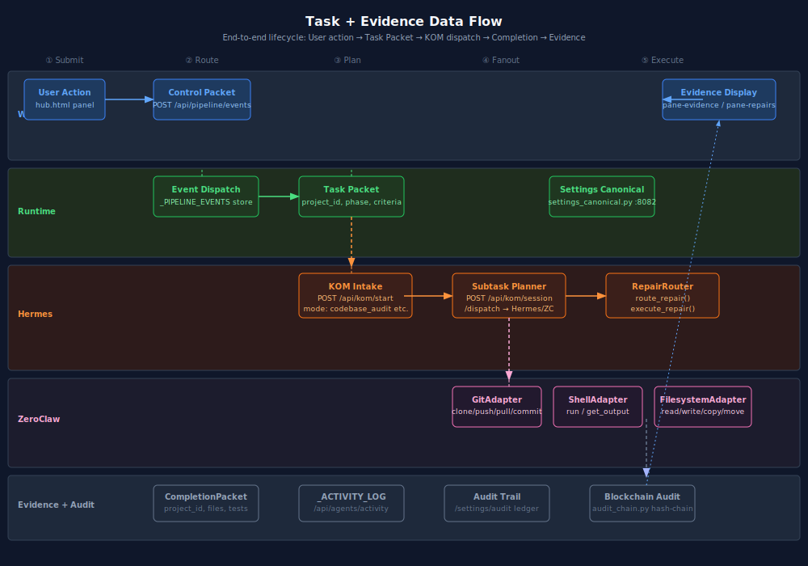
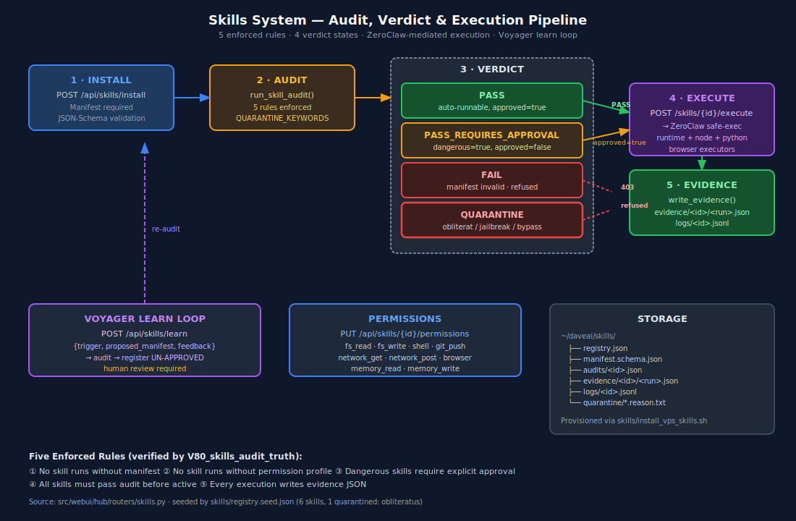

# 06 — ZeroClaw Adapters

> **Safe-execution research layer.** Verified by gate `V62_ZEROCLAW_RUNTIME`.
> Skill-execution path verified by `V79_skills_inventory` + `V80_skills_audit_truth`.



---

## What it is

ZeroClaw is the **safe-exec** layer that allows agents and skills to interact with
the host filesystem, Git repositories, shell commands, and external research
sources — each through a strictly constrained adapter that validates every
operation before executing it.

ZeroClaw is called from two directions:
1. **Hermes Orchestrator** — `_select_agent_for_task()` routes `git/shell/file/search`
   tasks to ZeroClaw adapters directly.
2. **Hub Skills System** — `POST /api/skills/{id}/execute` routes skills with
   executors `shell`, `fs_write`, `fs_delete`, `git_push` through ZeroClaw.

---

## File locations

| File                                  | Purpose                                              |
| ------------------------------------- | ---------------------------------------------------- |
| `src/zeroclaw/adapters.py`            | `ZeroClawGateway` + 4 adapter classes                |
| `src/webui/hub/routers/skills.py`     | Routes skill execution to appropriate executor       |
| `G:\Github\kilocode-Azure2\packages\kilo-vscode\src\services\zeroclaw\` | KiloCode-side ZeroClaw client |

---

## Adapter inventory

### `ZeroClawGateway`

Top-level gateway that manages adapter registration, operation logging, and
result routing. All adapter calls go through `gateway.execute(adapter_id, op, params)`.

```python
class ZeroClawGateway:
    def register(self, adapter_id: str, adapter: BaseAdapter) -> None
    async def execute(self, adapter_id: str, op: str, params: dict) -> dict
    def operation_log(self) -> list[dict]        # last 200 ops
```

### `GitAdapter`

Safe Git operations. All operations validated before execution.

| Operation       | Allowed | Notes                                             |
| --------------- | ------- | ------------------------------------------------- |
| `clone`         | ✅       | HTTPS only; no SSH by default                     |
| `status`        | ✅       | read-only                                         |
| `diff`          | ✅       | read-only                                         |
| `log`           | ✅       | read-only                                         |
| `add`           | ✅       | staged only                                       |
| `commit`        | ✅       | requires `message`                                |
| `push`          | ✅       | `--force` blocked, `filter-branch` blocked        |
| `checkout`      | ✅       | branch only; `--orphan` blocked                   |
| `pull`          | ✅       | `--rebase --force` blocked                        |
| `push --force`  | ❌       | permanently blocked                               |
| `filter-branch` | ❌       | permanently blocked                               |

### `ShellAdapter`

Whitelist-based command execution. **Only listed commands are permitted.**

```python
ALLOWED_COMMANDS = {
    "python", "python3", "pip", "pip3",
    "node", "npm", "npx", "bun",
    "pytest", "ruff", "mypy",
    "git",          # only through GitAdapter for safety
    "ls", "find", "cat", "head", "tail", "grep",
    "curl", "wget",
    "docker", "docker-compose",
    "systemctl", "journalctl",
    "echo", "mkdir", "cp", "mv",
}
```

Permanently blocked patterns:
- `rm -rf /` and variants
- `:(){ :|:& };:` (fork-bomb)
- `dd if=` targeting block devices
- `mkfs`, `fdisk`, `parted`
- Pipe to `bash`/`sh` from untrusted sources

### `FilesystemAdapter`

File read/write/delete within a declared `root_path`. All paths are
validated against the root before any I/O.

```python
class FilesystemAdapter(BaseAdapter):
    root_path: Path     # declared at construction time

    async def read(self, path: str) -> dict
    async def write(self, path: str, content: str) -> dict
    async def delete(self, path: str) -> dict
    async def list_dir(self, path: str) -> dict
    async def exists(self, path: str) -> dict
```

**Path jail:** any `path` that resolves outside `root_path` raises
`PermissionError` before any I/O. Symlinks are resolved first.

**Permanently blocked paths** (regardless of `root_path`):
- `/etc/passwd`, `/etc/shadow`, `/etc/sudoers`
- `/dev/` tree
- `/proc/`, `/sys/`
- `~/.ssh/`

### `ResearchAdapter`

External web research — search, extract, summarise.

| Operation   | Description                                              |
| ----------- | -------------------------------------------------------- |
| `search`    | DuckDuckGo / configured search engine, returns snippets  |
| `extract`   | Fetch URL, extract main content (readability)            |
| `summarize` | Call LLM to summarise extracted content                  |
| `fallback`  | If primary search fails, retry with alternative engine   |

Rate-limited to 10 requests/minute. Respects `robots.txt`.

---

## Safety architecture



Every adapter call goes through three layers before executing:

```
1. BaseAdapter.validate(op, params)
   ↳ checks op is in allowed_ops[]
   ↳ checks params schema (pydantic)

2. Adapter-specific pre-flight
   ↳ GitAdapter:   blocked_ops set check
   ↳ ShellAdapter: ALLOWED_COMMANDS whitelist check
   ↳ FilesystemAdapter: path jail resolution
   ↳ ResearchAdapter:   rate limit check + robots.txt

3. Execute + log
   ↳ result appended to gateway.operation_log (last 200)
   ↳ Skills System: write_evidence(skill_id, run_id, result)
```

Any validation failure returns `{"status": "error", "reason": "..."}` — no
partial execution, no silent failure.

---

## Skill execution via ZeroClaw

When the Hub Skills router receives `POST /api/skills/{id}/execute` and the
skill's `executor` is `shell`, `fs_write`, `fs_delete`, or `git_push`:

```
Hub skills.py
  → skill.verdict == PASS (or PASS + approved=true for dangerous)
  → build ZeroClaw request
  → POST http://localhost:8090/execute   (ZeroClaw gateway)
  → ZeroClawGateway.execute(adapter_id, op, params)
  → result → write_evidence(skill_id, run_id, result)
  → SSE: skill.executed
```

Executors `python`, `node`, `browser` run in isolated subprocesses via
`ShellAdapter` with the appropriate ALLOWED_COMMANDS entry.

**Quarantined skills never reach ZeroClaw** — they are refused at the Skills
router with `403 Forbidden` before any ZeroClaw call is made.

---

## API surface (ZeroClaw gateway · :8090)

| Method | Path                    | Purpose                                        |
| ------ | ----------------------- | ---------------------------------------------- |
| GET    | `/health`               | Gateway liveness + adapter registration status  |
| POST   | `/execute`              | `{adapter, op, params}` → result               |
| GET    | `/log`                  | Last 200 operation log entries                  |
| GET    | `/adapters`             | Registered adapter list + allowed ops           |

The Hub proxies ZeroClaw status at `GET /api/zeroclaw/status` and exposes the
operation log at `GET /api/zeroclaw/log`.

---

## KiloCode-side ZeroClaw client

`G:\Github\kilocode-Azure2\packages\kilo-vscode\src\services\zeroclaw\`

KiloCode calls ZeroClaw for:
- Running shell commands from agent suggestions (requires `shell` permission + approval)
- Applying file diffs produced by agents (uses `FilesystemAdapter`)
- Git commits/pushes produced by `kc-06` Code Generator (uses `GitAdapter`)
- Research fetch for `kc-19` Research Analyst (uses `ResearchAdapter`)

All calls go through `HubServicesService`'s active check — if ZeroClaw is down
(status bar shows it in `down_required`), KiloCode queues the operation and
retries after the next `/api/services/ensure` confirms it's back up.

---

## Testing

Unit tests: `tests/unit/test_zeroclaw_adapters.py`

```bash
pytest tests/unit/test_zeroclaw_adapters.py -v
# covers: ALLOWED_COMMANDS whitelist, path-jail, blocked-ops, fork-bomb, rm -rf /
```

Integration tests: `tests/integration/test_zeroclaw_adapter_integration.py`

```bash
pytest tests/integration/test_zeroclaw_adapter_integration.py -v -m "not vps_required"
```

Gate: `V62_ZEROCLAW_RUNTIME` — verifies adapter import, gateway health, and
operation log endpoint.

---

## See also

- [`04_HERMES_ORCHESTRATOR.md`](04_HERMES_ORCHESTRATOR.md) — Hermes → ZeroClaw routing.
- [`11_SKILLS_AND_SERVICES.md`](11_SKILLS_AND_SERVICES.md) — skill executor → ZeroClaw path.
- [`09_API_REFERENCE.md`](09_API_REFERENCE.md) — `/api/zeroclaw/*` endpoints.
- [`12_TRUTH_AND_PROOF.md`](12_TRUTH_AND_PROOF.md) — V62 gate evidence.
