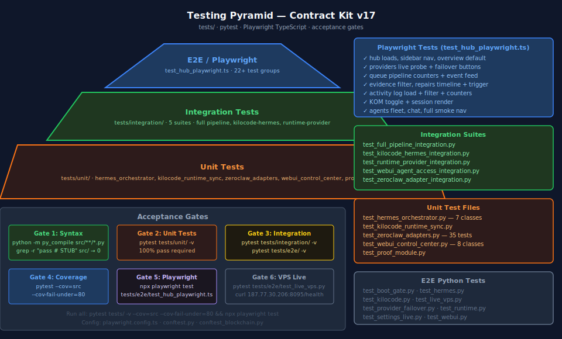

# 07 — Testing Guide



---

## Test Layout

```
tests/
├── unit/
│   ├── test_hermes_orchestrator.py       # 7 test classes, HermesOrchestrator pipeline
│   ├── test_kilocode_runtime_sync.py     # VSIX sync + drift detection
│   ├── test_zeroclaw_adapters.py         # 35 tests, all 4 adapters + abstract base
│   ├── test_webui_control_center.py      # 8 test classes, dashboard.py endpoints
│   └── test_proof_module.py             # Evidence + audit chain
├── integration/
│   ├── test_full_pipeline_integration.py
│   ├── test_kilocode_hermes_integration.py
│   ├── test_runtime_provider_integration.py
│   ├── test_webui_agent_access_integration.py
│   └── test_zeroclaw_adapter_integration.py
├── e2e/
│   ├── test_hub_playwright.ts            # Playwright E2E — 22+ test groups
│   ├── test_boot_gate.py
│   ├── test_hermes.py
│   ├── test_kilocode.py
│   ├── test_live_vps.py                  # VPS 187.77.30.206 live tests
│   ├── test_provider_failover.py
│   ├── test_runtime.py
│   ├── test_settings_live.py
│   └── test_webui.py
├── conftest.py
└── conftest_blockchain.py
```

---

## Running Tests

### All tests
```bash
pytest tests/ -v --cov=src --cov-fail-under=80
```

### Unit tests only
```bash
pytest tests/unit/ -v
```

### Integration tests
```bash
pytest tests/integration/ -v
```

### Playwright E2E (requires running hub at :8095)
```bash
npx playwright test tests/e2e/test_hub_playwright.ts
npx playwright test --headed   # with browser visible
npx playwright test --reporter=html   # HTML report
```

### VPS live tests
```bash
pytest tests/e2e/test_live_vps.py -v --base-url=http://187.77.30.206:8095
```

### Coverage report
```bash
pytest tests/ --cov=src --cov-report=html
open htmlcov/index.html
```

---

## Playwright Tests (test_hub_playwright.ts)

### Test Groups (22+)

| Test Group | What It Verifies |
|------------|-----------------|
| Hub loads + sidebar renders | Page title, all 19 nav items including `activity` |
| Overview pane default | Auto-displays, health dots present |
| Providers pane | Probe table, latency column, Reset/Failover buttons |
| Providers force-failover | POST → status update |
| Queue pane counters | Packet counts, in-flight table |
| Queue event feed | Events list, push entry |
| Evidence pane | Filter bar, badge types, detail modal |
| Repairs timeline | Timeline entries, icons, trigger button |
| Activity log | Load, filter by agent/type, counter |
| Activity push | Push form submits and appears in log |
| KOM pane | Toggle switch, session list, subtask status |
| KOM start session | POST /api/kom/start, session appears |
| VSIX pane | Sync status badge, command table, run button |
| Agents pane | Fleet cards for H1–H5 |
| Chat pane | Message input, send |
| Full smoke nav | Clicks through all sidebar items |

### Configuration (playwright.config.ts)
```typescript
export default {
  use: {
    baseURL: process.env.HUB_URL || 'http://localhost:8095',
    screenshot: 'only-on-failure',
    video: 'retain-on-failure',
  },
  testDir: './tests/e2e',
  reporter: [['html'], ['list']],
};
```

---

## Acceptance Gates

All six gates must pass before any merge to `main`:

| Gate | Command | Requirement |
|------|---------|------------|
| **1 — Syntax** | `python -m py_compile src/**/*.py` | Zero syntax errors |
| **2 — No stubs** | `grep -r "pass  # STUB" src/` | Zero matches |
| **3 — Unit tests** | `pytest tests/unit/ -v` | 100% pass |
| **4 — Coverage** | `pytest --cov=src --cov-fail-under=80` | ≥ 80% coverage |
| **5 — Playwright** | `npx playwright test` | All groups pass |
| **6 — VPS live** | `pytest tests/e2e/test_live_vps.py` | All health checks pass |

### One-command gate check
```bash
python -m py_compile src/**/*.py && \
! grep -r "pass  # STUB" src/ && \
pytest tests/unit/ -v && \
pytest tests/ --cov=src --cov-fail-under=80 && \
npx playwright test && \
echo "ALL GATES PASSED"
```

---

## Unit Test Details

### test_hermes_orchestrator.py

| Class | Tests |
|-------|-------|
| `TestAbstractEnforcement` | ZeroClawAdapter cannot be instantiated |
| `TestFilesystemAdapterExecute` | All 6 ops, path-jail |
| `TestGitAdapterSecurity` | Blocked commands |
| `TestShellAdapterSecurity` | Blocked shell patterns |
| `TestResearchAdapterPaths` | search, summarize, validate |
| `TestHermesOrchestratorPipeline` | init, full dispatch, error handling |
| `TestRepairRouterFull` | route, execute, history |
| `TestTaskPacketSerialization` | to_dict / from_dict round-trip |

### test_zeroclaw_adapters.py

35 tests across 9 classes. Key scenarios:
- Abstract base enforcement: `TypeError` on direct instantiation
- `GitAdapter` ALLOWED_COMMANDS whitelist — every allowed command passes; unlisted commands rejected
- `GitAdapter` dangerous ops blocked: `push --force`, `filter-branch`
- `ShellAdapter` fork-bomb, `rm -rf /`, `dd` patterns all rejected
- `FilesystemAdapter` path-jail: paths outside `root_path` rejected
- `FilesystemAdapter` blocked paths: `/etc/passwd`, `/dev/` rejected
- `ResearchAdapter` search + extract + summarize + fallback

### test_webui_control_center.py

8 classes testing `dashboard.py` in isolation (TestClient):
- `_PIPELINE_EVENTS` push + retrieve + cap at 200
- `_ACTIVITY_LOG` push + filter + cap at 500
- `_PROVIDER_CIRCUIT` state transitions
- `_KOM_SESSIONS` lifecycle: start → dispatch → complete → cancel
- `/api/healthall` aggregate response shape
- Provider reset + failover endpoints

---

## Integration Test Scope

| Suite | Services Required |
|-------|-----------------|
| `test_full_pipeline_integration.py` | Runtime + Hermes + ZeroClaw |
| `test_kilocode_hermes_integration.py` | Runtime + Hermes |
| `test_runtime_provider_integration.py` | Runtime + LM Studio or Ollama |
| `test_webui_agent_access_integration.py` | WebUI + Runtime + Hermes |
| `test_zeroclaw_adapter_integration.py` | ZeroClaw + actual filesystem/git |

Run with services up:
```bash
pytest tests/integration/ -v -m "not vps_required"
```

---

## Common Test Fixtures (conftest.py)

```python
@pytest.fixture
def runtime_client():
    """FastAPI TestClient for runtime core."""

@pytest.fixture
def dashboard_client():
    """FastAPI TestClient for dashboard.py."""

@pytest.fixture
def tmp_repo(tmp_path):
    """Temporary git repository for GitAdapter tests."""

@pytest.fixture
def mock_provider():
    """Mock LLM provider returning deterministic responses."""
```

---

## See Also

- [docs/10_DEVELOPER_GUIDE.md](10_DEVELOPER_GUIDE.md) — linting + code quality gates
- [ARCHITECTURE.md](../ARCHITECTURE.md) — testing pyramid SVG
- `tests/e2e/test_hub_playwright.ts` — full Playwright spec
