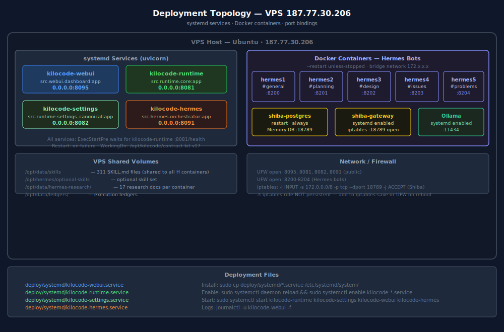

# 08 — Deployment



---

## systemd Services (Python / uvicorn)

All four core Python services run as systemd units on the VPS.

### Service Files

Located at `deploy/systemd/`:

```
deploy/systemd/
├── kilocode-runtime.service
├── kilocode-settings.service
├── kilocode-hermes.service
└── kilocode-webui.service
```

### Install & Enable
```bash
sudo cp deploy/systemd/*.service /etc/systemd/system/
sudo systemctl daemon-reload
sudo systemctl enable kilocode-runtime kilocode-settings kilocode-hermes kilocode-webui
```

### Start Order (respect startup dependency)
```bash
sudo systemctl start kilocode-runtime
sudo systemctl start kilocode-settings
sudo systemctl start kilocode-hermes
sudo systemctl start kilocode-webui
```

### Common Commands
```bash
# Status
sudo systemctl status kilocode-webui

# Live logs
journalctl -u kilocode-webui -f
journalctl -u kilocode-runtime -f

# Restart
sudo systemctl restart kilocode-webui

# Stop all
sudo systemctl stop kilocode-webui kilocode-hermes kilocode-settings kilocode-runtime
```

### Service Unit Template (example: kilocode-webui.service)
```ini
[Unit]
Description=KiloCode WebUI Hub
After=network.target kilocode-runtime.service
Requires=kilocode-runtime.service

[Service]
Type=simple
User=kilocode
WorkingDirectory=/opt/kilocode/contract-kit-v17
ExecStartPre=/usr/bin/bash -c 'until curl -sf http://localhost:8081/health; do sleep 2; done'
ExecStart=/usr/bin/uvicorn src.webui.dashboard:app --host 0.0.0.0 --port 8095 --workers 2
Restart=on-failure
RestartSec=5
EnvironmentFile=/opt/kilocode/.env

[Install]
WantedBy=multi-user.target
```

---

## Docker Containers (Hermes Bots + Shiba)

### Hermes Bot Containers
```bash
# All 5 bots (hermes1-hermes5) run --restart unless-stopped
docker ps --filter name=hermes

# Start all bots
for i in 1 2 3 4 5; do
  docker start hermes$i
done

# Logs for a bot
docker logs hermes1 -f --tail 50

# Restart a bot
docker restart hermes3
```

### Shiba Memory Services
```bash
# PostgreSQL (restart=always in compose)
docker ps --filter name=shiba-postgres

# Gateway (systemd enabled)
sudo systemctl status shiba-gateway
sudo systemctl restart shiba-gateway

# iptables rule for Shiba port (NOT persistent — must re-add after reboot)
sudo iptables -I INPUT -s 172.0.0.0/8 -p tcp --dport 18789 -j ACCEPT
# To make persistent:
sudo iptables-save > /etc/iptables/rules.v4
```

### Ollama
```bash
sudo systemctl status ollama
sudo systemctl restart ollama
# Pull a model
ollama pull qwen2.5:7b
```

---

## Canonical Port Registry

| Port | Service | Bound To |
|------|---------|---------|
| **:8095** | WebUI Hub | 0.0.0.0 (public) |
| **:8081** | Runtime Core | 0.0.0.0 (public) |
| **:8082** | Settings Service | 0.0.0.0 (public) |
| **:8091** | Hermes Orchestrator | 0.0.0.0 (public) |
| **:8200** | hermes1 bot | 0.0.0.0 |
| **:8201** | hermes2 bot | 0.0.0.0 |
| **:8202** | hermes3 bot | 0.0.0.0 |
| **:8203** | hermes4 bot | 0.0.0.0 |
| **:8204** | hermes5 bot | 0.0.0.0 |
| **:1234** | LM Studio | localhost only |
| **:11434** | Ollama | localhost only |
| **:4000** | LiteLLM Proxy | localhost only |
| **:18789** | Shiba Memory | Docker bridge (172.x) |

---

## Firewall / UFW

```bash
# Allow public ports
sudo ufw allow 8095/tcp   # WebUI
sudo ufw allow 8081/tcp   # Runtime
sudo ufw allow 8082/tcp   # Settings
sudo ufw allow 8091/tcp   # Hermes
sudo ufw allow 8200:8204/tcp  # Hermes bots

# Verify
sudo ufw status verbose
```

---

## VPS Shared Data Paths

| Path | Contents | Used By |
|------|---------|---------|
| `/opt/kilocode/contract-kit-v17/` | Source repo | All services (WorkingDirectory) |
| `/opt/kilocode/.env` | Environment variables + API keys | All systemd services |
| `/opt/data/skills/` | 311 external SKILL.md files | All Hermes containers |
| `/opt/hermes/optional-skills/` | Optional skill set | All Hermes containers |
| `/opt/data/hermes-research/` | 17 research docs | All Hermes containers |
| `/opt/data/ledgers/` | Execution ledgers | Hermes |
| `/opt/data/hermes-kit/` | Hermes kit data | Hermes |
| `/opt/data/bin/tirith` | Tirith binary | Hermes |

---

## Environment File Template

`/opt/kilocode/.env`:
```bash
# Provider API keys
MINIMAX_API_KEY=...
SILICONFLOW_API_KEY=...
LITELLM_MASTER_KEY=...

# Service URLs
RUNTIME_API_URL=http://localhost:8081
SETTINGS_API_URL=http://localhost:8082
HERMES_API_URL=http://localhost:8091
LM_STUDIO_URL=http://localhost:1234/v1
OLLAMA_URL=http://localhost:11434

# Discord
DISCORD_TOKEN_H1=...
DISCORD_TOKEN_H2=...
DISCORD_TOKEN_H3=...
DISCORD_TOKEN_H4=...
DISCORD_TOKEN_H5=...
DISCORD_GUILD_ID=1490068195208331334

# Shiba
SHIBA_DB_URL=http://localhost:18789
```

---

## Health Check Verification

```bash
# Quick health sweep
for port in 8081 8082 8091 8095; do
  echo -n ":$port → "
  curl -sf http://localhost:$port/health | python3 -c "import sys,json; d=json.load(sys.stdin); print(d.get('status','?'))"
done

# Full aggregate (via WebUI)
curl -sf http://localhost:8095/api/healthall | python3 -m json.tool
```

---

## Upgrade / Redeploy

```bash
cd /opt/kilocode/contract-kit-v17
git pull origin main

# Install any new dependencies
pip install -r requirements.txt

# Restart services (runtime first)
sudo systemctl restart kilocode-runtime
sleep 3
sudo systemctl restart kilocode-settings kilocode-hermes kilocode-webui

# Verify
curl -sf http://localhost:8095/api/healthall | python3 -m json.tool
```

---

## Reboot Recovery Checklist

After VPS reboot, systemd services start automatically. But check:

```bash
# 1. Verify services came up
sudo systemctl status kilocode-runtime kilocode-settings kilocode-hermes kilocode-webui

# 2. Re-add iptables rule for Shiba (NOT persistent)
sudo iptables -I INPUT -s 172.0.0.0/8 -p tcp --dport 18789 -j ACCEPT

# 3. Verify Hermes bots (--restart unless-stopped, should auto-start)
docker ps --filter name=hermes

# 4. Full health check
curl -sf http://localhost:8095/api/healthall
```

---

## See Also

- [docs/01_ECOSYSTEM_OVERVIEW.md](01_ECOSYSTEM_OVERVIEW.md) — service overview + startup order
- [docs/09_API_REFERENCE.md](09_API_REFERENCE.md) — all API endpoints
- [ARCHITECTURE.md](../ARCHITECTURE.md) — deployment topology SVG
