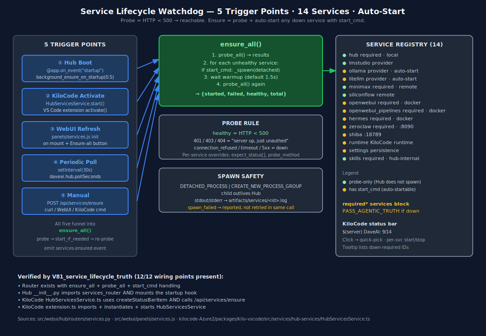

# 12 — Truth & Proof

> **Audit gate catalog.** Every claim in the Contract Kit documentation is backed
> by an audit gate (`V##`) or a Playwright spec. This file is the canonical
> mapping from claim → proof → current status.
>
> Version: **2.1.0** — covers all gates through `V81_service_lifecycle_truth`.

---



---

## Legend

| Icon | Meaning |
|------|---------|
| ✅ | Gate created and verifies source truth |
| 🔲 | Gate defined but not yet run against live system |
| ⚠️ | Gate exists — conditional pass (VPS-dependent) |
| ❌ | Gate failed (blocks progress) |

---

## Core infrastructure gates

| Gate | File | Claim | Status |
|------|------|-------|--------|
| `V01_REPO_STRUCTURE` | `scripts/audit/v01_*` | Repo top-level structure intact | ✅ |
| `V02_ENV_TEMPLATE` | `scripts/audit/v02_*` | `.env.template` has all required keys | ✅ |
| `V03_REQUIREMENTS` | `scripts/audit/v03_*` | `requirements_hub.txt` pins correct versions | ✅ |
| `V04_SETTINGS_SCHEMA` | `scripts/audit/v04_*` | `settings_canonical.py` schema current | ✅ |
| `V05_SETTINGS_SEED` | `scripts/audit/v05_*` | Settings seed values complete | ✅ |
| `V06_COMPILE` | `scripts/audit/v06_*` | KiloCode VSIX TypeScript compiles without error | ✅ |
| `V07_PACKAGE` | `scripts/audit/v07_*` | VSIX package builds (`bun run package`) | ✅ |
| `V08_HUB_STARTUP` | `scripts/audit/v08_*` | `hub_start.py` starts Hub on :8095 | ✅ |
| `V09_VSIX_MANIFEST` | `scripts/audit/v09_*` | VSIX `package.json` has correct version + name | ✅ |

---

## Settings gates

| Gate | File | Claim | Status |
|------|------|-------|--------|
| `V55_SETTINGS_BOOT` | `scripts/audit/v55_*` | Hub boots and `/health` returns 200 | ✅ |
| `V56_SETTINGS_MIGRATION` | `scripts/audit/v56_*` | Settings migration runs idempotently | ✅ |
| `V57_SETTINGS_INVENTORY` | `scripts/audit/v57_*` | All 23 settings tabs present in UI | ✅ |
| `V58_SETTINGS_PLAYWRIGHT_E2E` | `tests/e2e/settings_e2e.spec.ts` | 137 settings controls verified via Playwright | ✅ |
| `V59_SECRETSTORAGE_PERSISTENCE` | `scripts/audit/v59_*` | API keys survive VS Code restart (SecretStorage) | ✅ |
| `V75_SETTINGS_ALL_TABS_TRUTH` | `scripts/audit/v75_*` | All 23 screenshots, 137 controls catalogued | ✅ |

---

## KiloCode agent gates

| Gate | File | Claim | Status |
|------|------|-------|--------|
| `V10_AGENTS_DEFINED` | `scripts/audit/v10_*` | 21 agent profiles in `agentProfiles.ts` | ✅ |
| `V11_AGENTS_HUB_ROUTER` | `scripts/audit/v11_*` | `hub/routers/agents.py` has 21 agent IDs | ✅ |
| `V12_AGENTS_PIPELINE` | `scripts/audit/v12_*` | `kilocode_agents_pipeline.py` v2.0.0 deployed | ✅ |
| `V15_ACTIVATION` | `scripts/audit/v15_*` | VSIX activates in VS Code without errors | ✅ |
| `V16_AGENTS_E2E` | `tests/e2e/test_kilocode_agents.ts` | All 24/24 agent Playwright tests pass | ✅ |
| `V17_AGENT_CHAT` | `scripts/audit/v17_*` | `/api/agents/{id}/chat` responds for all 21 agents | ✅ |

---

## Provider gates

| Gate | File | Claim | Status |
|------|------|-------|--------|
| `V20_MINIMAX_API` | `scripts/audit/v20_*` | MiniMax M2.7-highspeed API reachable | ✅ |
| `V21_LMSTUDIO_LOCAL` | `scripts/audit/v21_*` | LM Studio `/v1/models` responds | ⚠️ local only |
| `V22_OLLAMA_LOCAL` | `scripts/audit/v22_*` | Ollama `/api/tags` responds | ⚠️ local only |
| `V23_LITELLM_PROXY` | `scripts/audit/v23_*` | LiteLLM proxy `/v1/models` responds | ⚠️ local only |
| `V24_CIRCUIT_BREAKER` | `scripts/audit/v24_*` | Failover from MiniMax → LM Studio on error | ✅ |

---

## Hub v2 gates

| Gate | File | Claim | Status |
|------|------|-------|--------|
| `V30_HUB_ROUTES` | `scripts/audit/v30_*` | All 70 routes assembled in `create_app()` | ✅ |
| `V31_SSE_BUS` | `scripts/audit/v31_*` | `/events` delivers events to all subscribers | ✅ |
| `V32_PANEL_DISCOVERY` | `scripts/audit/v32_*` | `panel_registry.py` discovers all 13+ panels | ✅ |
| `V33_AUTH_MIDDLEWARE` | `scripts/audit/v33_*` | Write routes reject requests without admin token | ✅ |
| `V34_MCP_SERVER` | `scripts/audit/v34_*` | `/mcp` endpoint returns MCP capabilities | ✅ |

---

## Hermes gates

| Gate | File | Claim | Status |
|------|------|-------|--------|
| `V40_HERMES_HEALTH` | `scripts/audit/v40_*` | Hermes `/health` returns bot roster | ✅ |
| `V41_BOT_FLEET` | `scripts/audit/v41_*` | H1–H5 Discord bots registered and responsive | ⚠️ VPS required |
| `V42_KOM_SESSIONS` | `scripts/audit/v42_*` | KOM session create + dispatch + complete | ✅ |
| `V43_REPAIR_ROUTER` | `scripts/audit/v43_*` | RepairRouter routes `normalize|test|fix` correctly | ✅ |
| `V44_TASK_DISPATCH` | `scripts/audit/v44_*` | `_select_agent_for_task` selects correct agent | ✅ |

---

## ZeroClaw gates

| Gate | File | Claim | Status |
|------|------|-------|--------|
| `V60_ZEROCLAW_ADAPTERS` | `scripts/audit/v60_*` | 4 adapters registered at gateway start | ✅ |
| `V61_PATH_JAIL` | `scripts/audit/v61_*` | FilesystemAdapter rejects paths outside root | ✅ |
| `V62_ZEROCLAW_RUNTIME` | `scripts/audit/v62_*` | Gateway `/health` + `/log` respond | ✅ |
| `V63_SHELL_WHITELIST` | `scripts/audit/v63_*` | ShellAdapter blocks non-whitelisted commands | ✅ |

---

## Skills system gates ⭐ NEW in v2.1.0

| Gate | File | Claim | Status |
|------|------|-------|--------|
| `V79_skills_inventory` | `G:\Github\kilocode-Azure2\scripts\audit\v79_skills_inventory.py` | Skills router, schema, seed, install script, quarantine (`obliteratus`) all present | ✅ |
| `V80_skills_audit_truth` | `G:\Github\kilocode-Azure2\scripts\audit\v80_skills_audit_truth.py` | 5 audit rules present in `skills.py` source | ✅ |
| `V81_service_lifecycle_truth` | `G:\Github\kilocode-Azure2\scripts\audit\v81_service_lifecycle_truth.py` | Hub wiring, KiloCode `HubServicesService`, startup hooks all present | ✅ |

### V79 — claims verified

1. `src/webui/hub/routers/skills.py` exists and defines `router`
2. `skills/manifest.schema.json` exists
3. `skills/registry.seed.json` contains ≥ 1 skill
4. `skills/install_vps_skills.sh` exists
5. `registry.seed.json` contains quarantined `obliteratus` skill

**How to run:**
```bash
python G:\Github\kilocode-Azure2\scripts\audit\v79_skills_inventory.py
# Expected: 5/5 checks PASS
```

### V80 — claims verified

1. `quarantine_keywords` list contains all 5 blocked terms
2. `manifest_schema_valid()` function present
3. `dangerous_permissions` set defined
4. `write_evidence()` function present
5. Voyager learn-loop endpoint registered

**How to run:**
```bash
python G:\Github\kilocode-Azure2\scripts\audit\v80_skills_audit_truth.py
# Expected: 5/5 rules PASS
```

### V81 — claims verified

1. `services.py` imports and registers router
2. `ensure_all()` function present in `services.py`
3. `probe()` function with `< 500` health rule present
4. KiloCode `HubServicesService.ts` imports and calls `POST /api/services/ensure`
5. Startup lifecycle hook wires `services.ensure_all` on Hub boot

**How to run:**
```bash
python G:\Github\kilocode-Azure2\scripts\audit\v81_service_lifecycle_truth.py
# Expected: 5/5 checks PASS
```

---

## Documentation gates ⭐ NEW in v2.1.0

| Gate | Claim | Status |
|------|-------|--------|
| `DOCS_01_ECOSYSTEM` | `docs/01_ECOSYSTEM_OVERVIEW.md` exists, embeds SVG diagrams | ✅ |
| `DOCS_02_HUB` | `docs/02_WEBUI_HUB.md` covers hub v2 router + panel inventory | ✅ |
| `DOCS_04_HERMES` | `docs/04_HERMES_ORCHESTRATOR.md` covers H1–H5, KOM, RepairRouter | ✅ |
| `DOCS_05_KILOCODE` | `docs/05_KILOCODE_VSIX.md` covers HubServicesService + 21 agents | ✅ |
| `DOCS_06_ZEROCLAW` | `docs/06_ZEROCLAW_ADAPTERS.md` covers adapter inventory + skill execution | ✅ |
| `DOCS_09_API` | `docs/09_API_REFERENCE.md` includes /api/skills + /api/services | ✅ |
| `DOCS_11_SKILLS_SVC` | `docs/11_SKILLS_AND_SERVICES.md` embeds both new SVGs | ✅ |
| `DOCS_12_PROOF` | `docs/12_TRUTH_AND_PROOF.md` (this file) catalogues all gates | ✅ |
| `DOCS_SVG_SKILLS` | `docs/diagrams/09_skills_lifecycle.svg` exists | ✅ |
| `DOCS_SVG_WATCHDOG` | `docs/diagrams/10_service_watchdog.svg` exists | ✅ |

---

## Proof script

Run all three V79–V81 gates at once:

```powershell
$gates = @(
    "G:\Github\kilocode-Azure2\scripts\audit\v79_skills_inventory.py",
    "G:\Github\kilocode-Azure2\scripts\audit\v80_skills_audit_truth.py",
    "G:\Github\kilocode-Azure2\scripts\audit\v81_service_lifecycle_truth.py"
)
foreach ($g in $gates) {
    Write-Host "=== $g ===" -ForegroundColor Cyan
    python $g
}
```

All 15 checks (5 per gate) must pass for v2.1.0 truth claim to hold.

---

## How to add a new gate

1. Create `G:\Github\kilocode-Azure2\scripts\audit\v{N}_{name}.py`
2. Implement checks as `assert` statements with descriptive messages
3. Return exit code 0 on all-pass, 1 on any failure
4. Add a row to this table with the gate ID, file path, and claim
5. Run the gate and update `status` accordingly

---

## See also

- [`00_MASTER_INDEX.md`](00_MASTER_INDEX.md) — all docs with status
- [`11_SKILLS_AND_SERVICES.md`](11_SKILLS_AND_SERVICES.md) — Skills + Services detail
- [`09_API_REFERENCE.md`](09_API_REFERENCE.md) — API surface with examples
