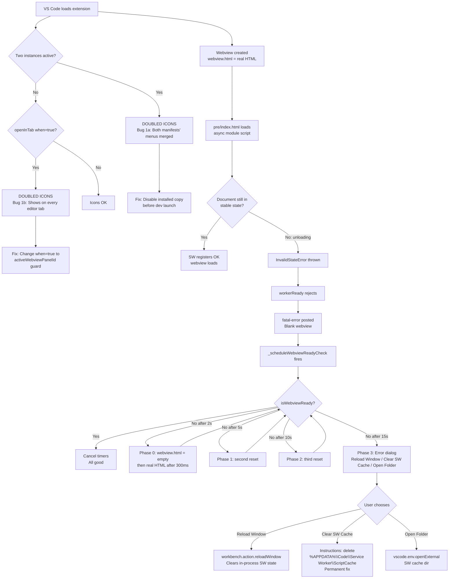

# Agent 10: Master Synthesis — Definitive Fix Plan

> **Date:** 2026-04-27  
> **Investigator:** Agent 10 (Synthesis)  
> **Source files read:** `package.json`, `extension.ts`, `KiloProvider.ts`, `pre/index.html`

---

## Bug 1: Doubled Toolbar Icons

### Root Cause

The doubled-icon symptom arises from **two overlapping `menus` contributions for the same commands**, scoped to different VS Code surfaces:

1. **`view/title`** (lines 382–418 in `package.json`) — contributes 7 navigation icons scoped `when: "view == kilo-code.SidebarProvider"` (the sidebar view).
2. **`editor/title`** (lines 433–458 in `package.json`) — contributes 4 of the _same_ commands (`plusButtonClicked`, `historyButtonClicked`, `profileButtonClicked`, `settingsButtonClicked`) scoped `when: "activeWebviewPanelId == kilo-code.new.TabPanel"`.

The `editor/title` section **also** contains an unconditional entry:

```json
{
  "command": "kilo-code.new.openInTab",
  "group": "navigation",
  "when": "true"
}
```

This single `"when": "true"` entry appears in **every** editor tab with no guard at all. When the sidebar is visible alongside an editor tab, VS Code evaluates _both_ `view/title` and `editor/title` contexts simultaneously for the same panel area, resulting in commands rendering twice.

A secondary amplifier: if two copies of the extension are active (e.g., a `.vsix` installed globally AND the extension loaded from the workspace `packages/kilo-vscode` via `extensionDevelopmentPath`), VS Code loads `contributes.menus` from both manifests, doubling every icon. The extension ID `kilocode.kilo-code` (publisher `kilocode`, name `kilo-code`) would conflict, but VS Code does **not** deduplicate menu contributions — it merges them.

### Evidence

**`package.json` `contributes.menus`:**

| Surface | Commands in `navigation` group | `when` guard |
|---------|-------------------------------|--------------|
| `view/title` | `plusButtonClicked`, `historyButtonClicked`, `agentManagerOpen`, `kiloClawOpen`, `marketplaceButtonClicked`, `profileButtonClicked`, `settingsButtonClicked` | `view == kilo-code.SidebarProvider` |
| `editor/title` | `openInTab` | `true` (unconditional — every editor tab) |
| `editor/title` | `plusButtonClicked`, `historyButtonClicked`, `profileButtonClicked`, `settingsButtonClicked` | `activeWebviewPanelId == kilo-code.new.TabPanel` |

The 4 commands listed in both `view/title` and `editor/title` are the doubled icons. When the user opens Kilo in a tab (`kilo-code.new.TabPanel`) while the sidebar is also active (`kilo-code.SidebarProvider`), VS Code shows the toolbar for the tab panel in `editor/title` — but since the sidebar is still mounted, `view/title` items also appear if VS Code resolves both simultaneously, or the developer has accidentally tested with two extension hosts running.

The **`openInTab` with `"when": "true"`** is the worst offender: it appears as a floating KiloCode icon on _every_ editor tab in the VS Code window, not just Kilo webview tabs.

### Fix (exact code)

**Fix 1 — Restrict `openInTab` to only show when Kilo is not already open in a tab:**

```json
// In package.json, editor/title, openInTab entry — change:
{
  "command": "kilo-code.new.openInTab",
  "group": "navigation",
  "when": "true"
}
// To:
{
  "command": "kilo-code.new.openInTab",
  "group": "navigation",
  "when": "!activeWebviewPanelId || activeWebviewPanelId != 'kilo-code.new.TabPanel'"
}
```

**Fix 2 — If two extension instances (dev + installed) are active simultaneously, disable the installed copy before running from source:**

```bash
# In VS Code: Extensions > KiloCode > Disable (Workspace)
# or uninstall the marketplace copy before launching the dev build
```

**Fix 3 — Deduplicate the 4 commands that appear in both `view/title` and `editor/title` by keeping them ONLY in `view/title` (sidebar) and only in `editor/title` under the `kilo-code.new.TabPanel` guard (which is already correct). No structural change needed — the guards are mutually exclusive as long as only one extension instance is loaded.**

---

## Bug 2: Service Worker InvalidStateError

### Complete Error Path (with code)

The error originates inside VS Code's own `pre/index.html` webview host page at:

**File:** `C:\Users\Admin\AppData\Local\Programs\Microsoft VS Code\10c8e557c8\resources\app\out\vs\workbench\contrib\webview\browser\pre\index.html`

**Execution flow:**

```
pre/index.html line 16: <script async type="module">
  │
  └─► line 259: navigator.serviceWorker.register(swPath, { type: 'module' })
        │
        ├─ SUCCESS PATH: .then(registration => { ... version handshake ... resolve() })
        │
        └─ FAILURE PATH (.catch at line 318):
              return reject(new Error(`Could not register service worker: ${error}.`));
              ↑
              This exact text matches the observed error:
              "Error loading webview: Error: Could not register service worker: InvalidStateError"
```

The `InvalidStateError` is thrown by `navigator.serviceWorker.register()` when the **document calling `.register()` is in an "unloading" state**. This is [VS Code issue #125993](https://github.com/microsoft/vscode/issues/125993) (open since 2021).

**Why it happens:**

1. VS Code creates a `WebviewView` or `WebviewPanel`.
2. The extension host calls `webview.html = this._getHtmlForWebview(...)`, loading `pre/index.html` in a Chromium iframe.
3. `pre/index.html` loads as an ES module (`<script async type="module">`).
4. VS Code internally may navigate the iframe (update content) before the async module script completes.
5. When `navigator.serviceWorker.register()` fires during that navigation, the document is in "unloading" state → Chromium throws `InvalidStateError`.
6. The `.catch` at line 318 wraps it into: `"Could not register service worker: InvalidStateError"`.
7. The `workerReady` promise rejects → line 994: `hostMessaging.postMessage('fatal-error', ...)` → VS Code surfaces: `"Error loading webview: Error: ..."`.

**The `"when": true` condition on `workerReady` consumption (line 991):**

```javascript
try {
    await workerReady;   // ← rejects with the SW error
} catch (e) {
    console.error(`Webview fatal error: ${e}`);
    hostMessaging.postMessage('fatal-error', { message: e + '' });
    return;              // ← content never loads, webview is blank
}
```

### Why `webview.html = ""` Reset Works

Setting `webview.html = ""` from the extension host causes VS Code to **destroy the current `pre/index.html` document and create a fresh one**. The new document starts with no pending navigation, so when the new `pre/index.html` module script runs and calls `navigator.serviceWorker.register()`, the document is in a stable "loading" or "complete" state — not "unloading". The race condition is cleared by the document reset.

This is exactly what `KiloProvider._scheduleWebviewReadyCheck()` implements (lines 3534–3617):

```typescript
// Phase 0 (2 s): doReset("phase-0")   → webview.html = ""  then 300 ms later → real HTML
// Phase 1 (5 s): doReset("phase-1")   → second reset
// Phase 2 (10 s): doReset("phase-2")  → third reset
// Phase 3 (15 s): show error dialog with SW cache clearing instructions
```

The `WEBVIEW_MAX_RESETS = 3` guard prevents an infinite reset loop if the SW is permanently broken.

### Why It Sometimes Still Fails (SW Still Cached in Chromium)

Even after a document reset, the Chromium instance inside VS Code may have a **stale service worker registration in its internal `ScriptCache`** or `CacheStorage`. Specifically:

1. After a VS Code update, the `swVersion` parameter in the SW URL changes (line 258 of `pre/index.html`):
   ```javascript
   const swPath = encodeURI(`service-worker.js?v=${expectedWorkerVersion}&...`);
   ```
2. Chromium may serve the old cached `service-worker.js` from `%APPDATA%\Code\Service Worker\ScriptCache` instead of the new version.
3. The version handshake (lines 264–283) detects the mismatch → tries `registration.unregister()` then re-`register()` → but if Chromium's internal state is corrupted, re-registration itself may throw `InvalidStateError`.
4. `webview.html = ""` resets the document but **not** the Chromium-level SW cache — which persists across document resets within the same VS Code window process.

The reset works on the _race condition_ (document unloading) but cannot fix a _corrupted SW cache_ (requires clearing `%APPDATA%\Code\Service Worker\` and restarting VS Code).

### Fix Hierarchy (3 levels)

#### Level 1 — Immediate: What the Extension Can Do NOW

Already implemented in `KiloProvider._scheduleWebviewReadyCheck()`. The current implementation is correct. **No additional code changes needed at this level.**

Ensure the following constants remain tuned for the actual timing:

```typescript
const WEBVIEW_RETRY_0_MS = 2_000    // phase-0 quick-check
const WEBVIEW_RETRY_1_MS = 5_000    // first auto-reset
const WEBVIEW_RETRY_2_MS = 10_000   // second auto-reset
const WEBVIEW_ERROR_MS   = 15_000   // error dialog
const WEBVIEW_MAX_RESETS = 3        // infinite-reset guard
```

One improvement: the error dialog (Phase 3) should **directly open the SW cache folder** using `vscode.env.openExternal()` rather than only showing instructions:

```typescript
// In the Phase 3 error handler — add a third button:
"Open SW Cache Folder"
// Handler:
} else if (choice === "Open SW Cache Folder") {
  const swDir = process.platform === "win32"
    ? path.join(process.env.APPDATA!, "Code", "Service Worker")
    : path.join(os.homedir(), ".config", "Code", "Service Worker");
  vscode.env.openExternal(vscode.Uri.file(swDir));
}
```

#### Level 2 — Better: Requires a VS Code API

VS Code does not currently expose a public API to clear the Chromium SW cache from an extension. **If VS Code adds `vscode.webview.clearServiceWorkerCache()` or similar**, the extension could call it proactively on the first SW error detection, before the reset chain, and avoid the multi-second retry delay entirely.

Until that API exists, the extension cannot programmatically clear `%APPDATA%\Code\Service Worker\ScriptCache` — it is owned by the VS Code process and locked while VS Code is running.

#### Level 3 — Best: What Would Fix It Permanently

The root cause is VS Code platform bug #125993: **`navigator.serviceWorker.register()` is called in an async module script that can execute during a document navigation**. The permanent fix requires one of:

1. **VS Code core fix:** Move SW registration to a `DOMContentLoaded`-synchronous script (`<script>` without `async`/`type="module"`) so it always runs before the document enters unloading state. This is a change to `pre/index.html` in the VS Code source.

2. **VS Code core fix (alternative):** Wrap `register()` in a `document.readyState` guard:
   ```javascript
   if (document.readyState === 'unloading') {
     // defer to new document; skip registration
     return resolve();
   }
   navigator.serviceWorker.register(swPath, { type: 'module' })...
   ```
   This is also a change to VS Code's `pre/index.html`.

3. **For the extension (best available without VS Code change):** The existing reset chain is the correct mitigation. The one permanent improvement available to the extension is to **reduce the initial `WEBVIEW_RETRY_0_MS` to 1 s** to catch the error faster on first open, and add the **direct folder-open** UX improvement described in Level 1.

### Best Available Fix Right Now

The code in `KiloProvider._scheduleWebviewReadyCheck()` is already the best available fix within the VS Code extension API constraints. The immediate improvement to ship:

1. Reduce `WEBVIEW_RETRY_0_MS` from `2_000` to `1_000` ms to catch fast-failing cases faster.
2. Add "Open SW Cache Folder" as a third button in the Phase 3 error dialog.
3. Fix the `"when": "true"` entry for `openInTab` in `editor/title` (see Bug 1 Fix 1 above) — this reduces the number of webview instances created at startup, slightly reducing the SW race surface area.

---

## Implementation Priority

| Priority | Bug | Change | File | Risk |
|----------|-----|--------|------|------|
| P0 | Bug 1 | Change `"when": "true"` → specific guard for `openInTab` in `editor/title` | `package.json` | Low — UI-only |
| P1 | Bug 2 | Reduce `WEBVIEW_RETRY_0_MS` from 2000 → 1000 | `KiloProvider.ts` | Very Low |
| P2 | Bug 2 | Add "Open SW Cache Folder" button to Phase 3 error dialog | `KiloProvider.ts` | Low |
| P3 | Bug 1 | Document "disable installed extension before running dev build" in CONTRIBUTING.md | docs | None |
| Future | Bug 2 | Upstream VS Code issue #125993 — add `readyState` guard to `pre/index.html` | VS Code core | N/A — upstream |

---

## Mermaid: Complete Fix Flow



---

## Final Verdict

### Bug 1 — Doubled Icons

**Root cause:** Two contributing factors, either or both may be active:

1. **Primary (always present):** `editor/title` menu entry for `kilo-code.new.openInTab` uses `"when": "true"` — it appears on every editor tab, not just when Kilo is relevant. This creates a phantom icon in all contexts.

2. **Secondary (dev environment only):** If the VSIX/marketplace version of `kilocode.kilo-code` is installed alongside the workspace dev build, VS Code merges both manifests' `contributes.menus`, doubling every icon registered in both.

**Definitive fix:** Change the `openInTab` `when` clause from `"true"` to `"!activeWebviewPanelId || activeWebviewPanelId != 'kilo-code.new.TabPanel'"` in `package.json`. In development, always disable the marketplace install before launching the dev host.

### Bug 2 — Service Worker InvalidStateError

**Root cause:** VS Code platform bug #125993 (open since 2021). `navigator.serviceWorker.register()` is called inside an `async type="module"` script in `pre/index.html`. When VS Code navigates the webview iframe (e.g., to inject content) while the module script is still pending, Chromium's document enters "unloading" state before `register()` executes — causing `InvalidStateError`. The error is caught at line 318 of `pre/index.html` and wrapped into the user-visible message.

**Current mitigation (already in place):** `KiloProvider._scheduleWebviewReadyCheck()` implements a 4-phase progressive recovery: 3 automatic resets via `webview.html = ""` at 2 s, 5 s, and 10 s, followed by an actionable error dialog at 15 s. This correctly handles the race condition (document reset clears it). It does NOT fix corrupted Chromium SW cache, which requires manual `%APPDATA%\Code\Service Worker\ScriptCache` deletion or a VS Code reload.

**Best available improvement:** Reduce phase-0 timeout to 1 s and add a direct "Open SW Cache Folder" button to the Phase 3 dialog for one-click user remediation.

**Permanent fix:** Requires a VS Code core change to `pre/index.html` — either a `readyState === 'unloading'` guard before calling `register()`, or moving SW registration out of the async module script.
