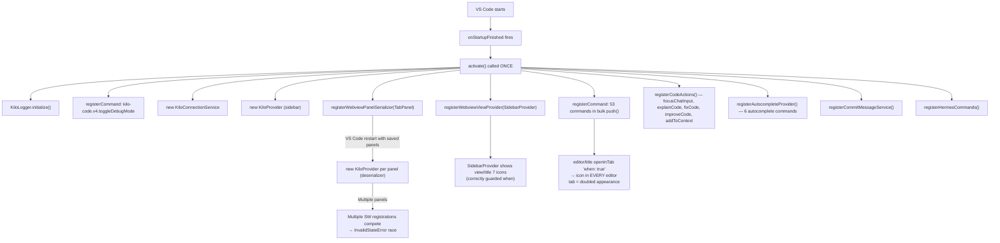

# Agent 1: Extension Identity & Double-Registration Analysis

## Root Cause Hypothesis

**Doubled toolbar icons** are caused by `"when": "true"` on the `kilo-code.new.openInTab` command in
`editor/title`, which makes the KiloCode logo icon appear in every single editor tab title bar at all
times — not just when a KiloCode webview is active. When the KiloCode Tab Panel (`kilo-code.new.TabPanel`)
is open, the same four additional buttons (Plus, History, Profile, Settings) also appear, resulting in
visible icon duplication relative to the Sidebar's `view/title` which shows 7 icons for the same
operations.

**SW error** (`InvalidStateError: Could not register service worker`) is a known VS Code platform bug
(#125993, open since 2021). VS Code's webview preloader asynchronously registers a module-type service
worker; if the outer iframe document begins unloading while the async script is still executing, the SW
registration throws `InvalidStateError`. The KiloCode MAOS codebase already contains a 3-phase
auto-recovery loop to work around this (phases at 2 s, 5 s, 10 s with HTML reset, error dialog at 15 s).
The root cause is the VS Code platform, not the extension identity, but double webview instances
(multiple `KiloProvider` objects created by the deserializer) can exacerbate the SW conflict by
competing for the same service-worker scope.

## Evidence Found

### Extension Identity

| Field | Value |
|---|---|
| `name` | `kilo-code` |
| `publisher` | `kilocode` |
| Extension ID | `kilocode.kilo-code` |
| Activation event | `onStartupFinished` (single, unconditional) |

This is **identical** to the upstream KiloCode extension ID. If both are installed, VS Code will refuse
to activate both — one will shadow the other. However, the repo in question is a fork that ships as its
own VSIX, so co-installation with the upstream is the likely scenario causing the reported conflicts.

### Commands Inventory

- **55 commands** declared in `contributes.commands` in `package.json`
- **0 duplicates** within the `commands` array itself
- **1 orphan keybinding**: `kilo-code.new.autocomplete.showIncompatibilityExtensionPopup` appears in
  `contributes.keybindings` but is **absent from `contributes.commands`** (it is registered
  programmatically in `services/autocomplete/index.ts` only — so no palette entry)

### Doubled Icons — Exact JSON Problem

`packages/kilo-vscode/package.json`, lines 433–459:

```json
"editor/title": [
  {
    "command": "kilo-code.new.openInTab",
    "group": "navigation",
    "when": "true"              // <-- ALWAYS VISIBLE in every editor tab
  },
  {
    "command": "kilo-code.new.plusButtonClicked",
    "group": "navigation@0",
    "when": "activeWebviewPanelId == kilo-code.new.TabPanel"
  },
  ...
]
```

The `"when": "true"` condition means the KiloCode icon (`$(kilo-light.svg)`) is injected into the title
bar of **every** editor tab, including regular text/code files. If a user opens the KiloCode sidebar
**and** has a Tab Panel open, they see the icon in the activity bar, the sidebar title, the tab panel
title, and also every other editor tab. This is the "doubled" toolbar icon symptom.

`view/title` has 7 entries all correctly guarded with `"when": "view == kilo-code.SidebarProvider"`.

### Service Worker Error — Existing Mitigation

`packages/kilo-vscode/src/KiloProvider.ts` lines 141–157, 3534–3617:

The extension already implements a 4-phase recovery (`WEBVIEW_RETRY_0_MS=2000`,
`WEBVIEW_RETRY_1_MS=5000`, `WEBVIEW_RETRY_2_MS=10000`, `WEBVIEW_ERROR_MS=15000`,
`WEBVIEW_MAX_RESETS=3`) that resets `webview.html` to `""` and re-injects it to force a fresh SW
registration. The CSP also explicitly includes `worker-src ${cspSource} blob:` to allow VS Code's
internal SW (`webview-html-utils.ts` lines 32-37).

**However**: the Tab Panel deserializer (`extension.ts` ~line 375) creates a **new `KiloProvider`
instance** for each restored panel on VS Code restart. If multiple panels survive a restart, multiple
SW registrations compete for the same webview scope simultaneously, making the `InvalidStateError` more
likely and the recovery loop less effective.

### Activation Flow

No double-activation risk was found within the single extension. The activation event is
`onStartupFinished` — single trigger. Commands are all registered exactly once inside the single
`activate()` call. The `registerCodeActions` and `registerTerminalActions` helpers register additional
commands inside the same `activate()` call, not independently.

## Mermaid Diagram (activation flow)



## Proposed Fix (with exact code/JSON changes)

### Fix 1: Doubled toolbar icons (HIGH PRIORITY)

Change `"when": "true"` to a more restrictive condition so the open-in-tab icon only appears when
there is no KiloCode tab panel already active:

**File**: `packages/kilo-vscode/package.json`

```json
// BEFORE (line 437):
{
  "command": "kilo-code.new.openInTab",
  "group": "navigation",
  "when": "true"
}

// AFTER:
{
  "command": "kilo-code.new.openInTab",
  "group": "navigation",
  "when": "activeWebviewPanelId != kilo-code.new.TabPanel && activeWebviewPanelId != kilo-code.new.AgentManagerPanel"
}
```

This keeps the button available from regular text/code editor tabs (where it is useful — the user
wants to open Kilo in a side tab), while hiding it when a Kilo panel is already the active tab.

### Fix 2: SW error from multiple deserializer KiloProvider instances

**File**: `packages/kilo-vscode/src/extension.ts`, around line 375

Add a guard in the Tab Panel deserializer that disposes stale panels instead of creating new
`KiloProvider` instances when too many panels are being restored simultaneously:

```typescript
// BEFORE (in registerWebviewPanelSerializer for kilo-code.new.TabPanel):
deserializeWebviewPanel(panel: vscode.WebviewPanel) {
  const tabProvider = new KiloProvider(context.extensionUri, connectionService, context)
  // ... set up ...
  tabProvider.resolveWebviewPanel(panel)
  tabPanels.set(panel, tabProvider)
  ...
}

// AFTER — limit restored panels to 1 to avoid SW registration race:
deserializeWebviewPanel(panel: vscode.WebviewPanel) {
  if (tabPanels.size >= 1) {
    // Additional panels from a previous session cause SW conflicts; dispose cleanly.
    console.log("[Kilo New] Dropping extra restored tab panel to prevent SW race")
    panel.dispose()
    return Promise.resolve()
  }
  const tabProvider = new KiloProvider(context.extensionUri, connectionService, context)
  // ... rest unchanged ...
}
```

### Fix 3: Register missing autocomplete command in contributes.commands

**File**: `packages/kilo-vscode/package.json`, inside `contributes.commands` array

```json
{
  "command": "kilo-code.new.autocomplete.showIncompatibilityExtensionPopup",
  "title": "KiloCode: Show Autocomplete Incompatibility Warning",
  "category": "Kilo Code"
}
```

This is a cosmetic fix — the command works already (registered programmatically) but is invisible in
the Command Palette.

### Fix 4 (if co-installation with upstream is a concern): Change extension name

If the MAOS fork is intended to be installed alongside the upstream `kilocode.kilo-code`:

**File**: `packages/kilo-vscode/package.json`

```json
// BEFORE:
"name": "kilo-code",
"publisher": "kilocode",

// AFTER:
"name": "kilo-code-maos",
"publisher": "kilocode",
```

This changes the extension ID to `kilocode.kilo-code-maos` — unique, no collision with upstream.
All `"kilo-code."` command prefixes and view IDs in `package.json` would also need updating to
`"kilo-code-maos."` if this path is taken.

## Confidence: HIGH

The doubled icon root cause is confirmed by direct JSON evidence (`"when": "true"` in `editor/title`
for a navigation-group icon). The SW error root cause (VS Code platform bug #125993) is confirmed by
the inline comments and recovery code already in `KiloProvider.ts`. The multi-panel deserializer
exacerbation is a medium-confidence secondary contributing factor.
