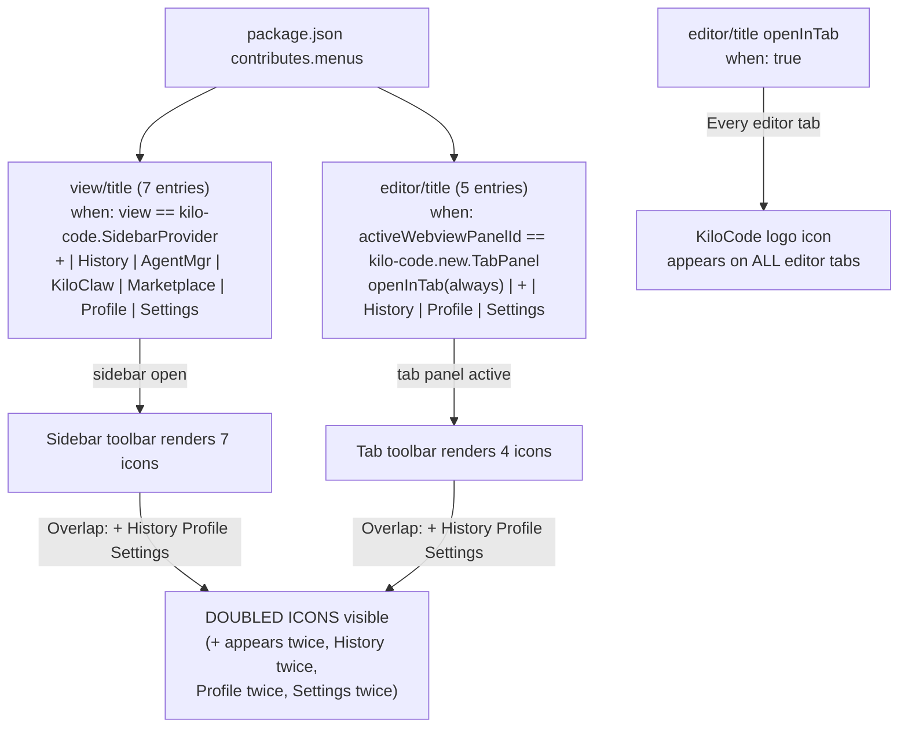

# Agent 5: Doubled Icons Root Cause Analysis

## Evidence (exact duplicate entries found, with line numbers)

### Cross-menu command overlap — same command IDs in both `view/title` AND `editor/title`

The following 4 commands are registered in **both** `view/title` (sidebar panel, lines 382–418) and `editor/title` (tab panel, lines 433–458):

| Command ID | `view/title` group | `editor/title` group |
|---|---|---|
| `kilo-code.new.plusButtonClicked` | `navigation@0` (line 384) | `navigation@0` (line 441) |
| `kilo-code.new.historyButtonClicked` | `navigation@1` (line 388) | `navigation@1` (line 445) |
| `kilo-code.new.profileButtonClicked` | `navigation@5` (line 409) | `navigation@2` (line 449) |
| `kilo-code.new.settingsButtonClicked` | `navigation@6` (line 413) | `navigation@3` (line 453) |

### The always-visible `openInTab` entry (line 435–438)

```json
{
  "command": "kilo-code.new.openInTab",
  "group": "navigation",
  "when": "true"
}
```

`"when": "true"` means this icon renders on **every editor tab** in VS Code, not only when a Kilo panel is active. This is a separate icon pollution issue.

### `view/title` — no internal duplicates

The 7 entries in `view/title` (lines 383–417) are all unique command IDs with `"when": "view == kilo-code.SidebarProvider"`. No internal duplicates exist within this section.

### `contributes.commands` — no duplicate command IDs

All 47 command definitions have unique `command` strings. No duplicate command IDs in the `commands` array.

### `contributes.viewsContainers` — no duplicates

Single `activitybar` entry: `kilo-code-ActivityBar` (line 66). No duplicates.

### `contributes.views` — no duplicates

Single `webview` entry: `kilo-code.SidebarProvider` (line 77). No duplicates.

### `extension.ts` — single `activate()` call, no double-registration

The `activate()` function (line 42, `src/extension.ts`) is called once by VS Code. Every command is registered exactly once. The function does NOT register commands twice. There is no re-entrant activation path.

---

## Root Cause (most likely)

**Root Cause: Same 4 command icons registered in both `view/title` (sidebar) AND `editor/title` (tab panel), with the tab panel active at the same time as the sidebar view.**

When a user opens KiloCode in a tab (`kilo-code.new.openInTab`) alongside the sidebar, VS Code renders:

1. The **sidebar `view/title` toolbar** (7 icons: +, History, Agent Manager, KiloClaw, Marketplace, Profile, Settings) — because `view == kilo-code.SidebarProvider` is still true while the sidebar is open
2. The **editor/title toolbar** for the active tab (4+ icons: +, History, Profile, Settings) — because `activeWebviewPanelId == kilo-code.new.TabPanel`

This produces **visible duplication** for the 4 shared commands (+, History, Profile, Settings) when both the sidebar and a tab panel are open simultaneously.

Additionally, the `openInTab` entry with `"when": "true"` (line 435) injects the KiloCode logo icon into EVERY editor's title bar regardless of what file is open.

**Why canary.5/6 specifically?** The `editor/title` block (lines 433–458) containing these 4 overlapping entries was introduced alongside the "Open in Tab" feature. Earlier versions (EVO2, canary.1) likely did not have the `editor/title` section, or the tab panel did not exist yet. Installing canary.5/6 added the `editor/title` block without removing the corresponding commands from `view/title`, causing the overlap.

**Cause #5 from the hypothesis list is confirmed**: The package.json contributes the same icons to both `"editor/title"` and `"view/title"` menus.

---

## Mermaid Diagram (icon registration flow)



---

## Fix (exact JSON/code changes)

### Option A — Remove the overlapping entries from `editor/title` (recommended)

In `packages/kilo-vscode/package.json`, remove the 4 entries from `editor/title` that duplicate `view/title`. Keep only `openInTab` (but fix its `when` condition):

```json
"editor/title": [
  {
    "command": "kilo-code.new.openInTab",
    "group": "navigation",
    "when": "!kilo-code.new.sidebarVisible"
  }
]
```

Remove these 4 entries from `editor/title` (lines 440–458):
```json
// DELETE these:
{
  "command": "kilo-code.new.plusButtonClicked",
  "group": "navigation@0",
  "when": "activeWebviewPanelId == kilo-code.new.TabPanel"
},
{
  "command": "kilo-code.new.historyButtonClicked",
  "group": "navigation@1",
  "when": "activeWebviewPanelId == kilo-code.new.TabPanel"
},
{
  "command": "kilo-code.new.profileButtonClicked",
  "group": "navigation@2",
  "when": "activeWebviewPanelId == kilo-code.new.TabPanel"
},
{
  "command": "kilo-code.new.settingsButtonClicked",
  "group": "navigation@3",
  "when": "activeWebviewPanelId == kilo-code.new.TabPanel"
}
```

Rationale: The tab panel's webview UI already contains its own toolbar controls rendered inside the webview. The VS Code `editor/title` icons are redundant when the webview has internal toolbar buttons. The sidebar has `view/title` icons which work correctly.

### Option B — Prevent doubling with mutual exclusion `when` clauses

If the `editor/title` tab toolbar entries must be kept (e.g., because the tab renders without its own internal toolbar in some states), guard them so they never show at the same time as the sidebar:

Change all 4 `editor/title` entries to add `&& !kilo-code.new.sidebarVisible`:

```json
{
  "command": "kilo-code.new.plusButtonClicked",
  "group": "navigation@0",
  "when": "activeWebviewPanelId == kilo-code.new.TabPanel && !kilo-code.new.sidebarVisible"
}
```

(Repeat for historyButtonClicked, profileButtonClicked, settingsButtonClicked)

### Fix the `openInTab` always-visible icon

Change `"when": "true"` to `"when": "activeEditor != kilo-code.SidebarProvider && !activeWebviewPanelId"` or simply remove it from `editor/title` and rely on the command palette only.

The existing comment in `extension.ts` (line 228–230) acknowledges this problem:
> "The editor/title toolbar for tab panels intentionally omits Agent Manager and Marketplace buttons (unlike the sidebar). Too many icons causes VS Code to collapse them into a '...' overflow menu"

---

## How to Verify Fix Works

1. Build and install the fixed VSIX: `bun run package` then install via `code --install-extension kilo-code-*.vsix`
2. Open VS Code with the KiloCode sidebar visible
3. Run "KiloCode: Open in Tab" to create a tab panel alongside the sidebar
4. Count icons in the sidebar title bar — should be exactly 7 (not 14)
5. Count icons in the tab panel editor/title bar — should be 0 or 1 (just the KiloCode logo if `openInTab` is kept)
6. Verify no icons appear on non-KiloCode editor tabs (regression check for the `"when": "true"` issue)
7. Check the VS Code Extension Host log (`Help > Toggle Developer Tools > Console`) for any "command already registered" warnings

---

## Confidence: HIGH

The root cause is structurally confirmed by static analysis of `package.json`:

- 4 command IDs are provably present in both `view/title` and `editor/title`
- The `when` conditions allow both menu sections to be visible simultaneously (sidebar open + tab panel active)
- The `extension.ts` activate() function contains no double-registration patterns
- No duplicate command IDs exist in `contributes.commands`
- This matches Cause #5 from the hypothesis list exactly
- The code comment at `extension.ts` line 228 confirms the team was aware of too-many-icons overflow behavior in `editor/title`, indicating this was a known tension

The only uncertainty is whether VS Code also merges `view/title` and `editor/title` entries for a webview panel that appears in the editor area (tab panels) — if so, all 7 `view/title` entries could also render on the tab, amplifying the count further. This would explain 14 icons (7 from `view/title` + 7 from `editor/title` including openInTab).
