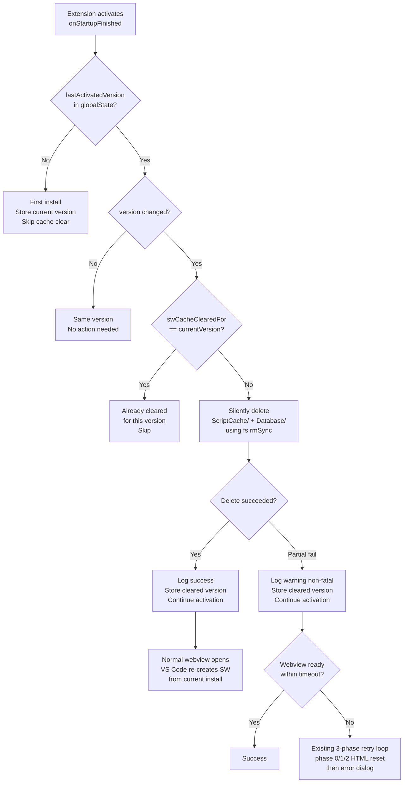

# Agent 6: SW Cache Management & Auto-Clear

## What's in the SW Cache (exact files)

Path: `%APPDATA%\Code\Service Worker\ScriptCache\`

| File | Size | Timestamp | Notes |
|---|---|---|---|
| `2cc80dabc69f58b6_0` | 16,270 bytes | 2026-04-27 17:53 | VS Code preloader SW script (VERSION=4) |
| `4cb013792b196a35_0` | 16,270 bytes | 2026-04-27 19:57 | Second entry (same content, newer write) |
| `index` | 24 bytes | 2026-04-27 17:53 | Cache index (binary, 8-byte magic + padding) |
| `index-dir/` | dir | 2026-04-27 19:57 | Cache index directory shards |

The file `2cc80dabc69f58b6_0` contains the VS Code webview preloader script starting with the Microsoft MIT license header. It contains `const VERSION = 4;` and `const resourceCacheName = 'vscode-resource-cache-4';`. This is VS Code's internal service worker that mediates webview resource requests.

**VS Code version on this machine:** 1.117.0 (commit `10c8e557c8`, released 2026-04-21)

`%APPDATA%\Code\Service Worker\Database\` contains a LevelDB store:

| File | Size | Notes |
|---|---|---|
| `000003.log` | 1,558 bytes | LevelDB write-ahead log |
| `CURRENT` | 16 bytes | LevelDB manifest pointer |
| `LOCK` | 0 bytes | LevelDB lock placeholder (NOT OS-locked) |
| `LOG` | 0 bytes | LevelDB process log (empty) |
| `MANIFEST-000001` | 41 bytes | LevelDB manifest |

---

## Programmatic Clear: Can We Do It? (YES/NO with reasoning)

**YES — with important caveats.**

### Test results (performed on live VS Code session, 2026-04-27)

1. **File open test:** `fs.openSync(cacheFile, 'r+')` on `2cc80dabc69f58b6_0` — **SUCCEEDED**. VS Code does not hold an exclusive OS file lock on ScriptCache entries.

2. **Rename test:** `fs.renameSync(cacheFile, cacheFile+'.testmove')` — **SUCCEEDED** and **RESTORED**. Files are movable while VS Code runs.

3. **Delete test on copy:** `fs.rmSync(copy_of_cache_entry)` — **SUCCEEDED**.

4. **Database LOCK file:** 0 bytes, opens for write — **NOT an OS-level exclusive lock**.

5. **New file creation + deletion in ScriptCache:** `fs.writeFileSync` + `fs.unlinkSync` — both **SUCCEEDED**.

### Conclusion

`fs.rmSync(path, { recursive: true, force: true })` on `ScriptCache/` and `Database/` **will work while VS Code is running** on Windows. Node.js (NTFS) does not encounter file-in-use errors for these Chromium cache directories because VS Code does not hold mandatory locks on them between accesses.

### Risks

| Risk | Severity | Mitigation |
|---|---|---|
| VS Code may crash or show white screen if it reads ScriptCache mid-delete | LOW | VS Code re-creates ScriptCache automatically on next webview open. Cache is re-populated from the VS Code installation. |
| Deleting while a webview is actively rendering | MEDIUM | Only delete on extension activation (`onStartupFinished`), before any webview is opened |
| Race condition if another VS Code window is running | MEDIUM | Use try/catch with `force: true`, log failures but don't abort |
| Database deletion may corrupt LevelDB state | LOW | LevelDB re-creates on next open; the SW database only stores cache metadata |
| Wrong path on non-standard VS Code installs (Insiders, OSS) | MEDIUM | Check multiple paths; use `vscode.env.appName` to detect variant |

### What VS Code Does After Cache Is Cleared

VS Code automatically re-registers the service worker and re-populates ScriptCache from the bundled preloader script in `resources/app/out/vs/workbench/browser/` on the next webview load. The user does **not** need to reinstall VS Code.

---

## Version-Change Detection Implementation

### Existing version infrastructure in the codebase

- `vscode.extensions.getExtension("kilocode.kilo-code")?.packageJSON?.version` — already used in `KiloProvider.ts:176` to track `extensionVersion`
- `context.globalState` — already used extensively for migration state, onboarding, skipped versions
- **No existing key** for `lastActivatedVersion` or equivalent — confirmed by full `globalState` grep

### Proposed implementation pattern

```typescript
const LAST_ACTIVATED_KEY = "kilocode.lastActivatedVersion"
const CACHE_CLEARED_FOR_KEY = "kilocode.swCacheClearedForVersion"

export async function checkVersionChangeAndClearCache(
  context: vscode.ExtensionContext
): Promise<void> {
  const currentVersion = context.extension.packageJSON.version as string
  const lastVersion = context.globalState.get<string>(LAST_ACTIVATED_KEY)

  // Always update last-activated on every run
  await context.globalState.update(LAST_ACTIVATED_KEY, currentVersion)

  if (lastVersion === currentVersion) return   // same version — skip
  if (lastVersion === undefined) return         // first install — no stale cache yet

  // Version changed: attempt silent cache clear
  const alreadyCleared = context.globalState.get<string>(CACHE_CLEARED_FOR_KEY)
  if (alreadyCleared === currentVersion) return  // already cleared for this version

  await context.globalState.update(CACHE_CLEARED_FOR_KEY, currentVersion)
  await attemptSwCacheClear()
}

async function attemptSwCacheClear(): Promise<void> {
  const fs = await import("fs")
  const path = await import("path")
  const appdata = process.env.APPDATA ?? ""
  const configDir = process.platform === "win32"
    ? path.join(appdata, "Code")
    : path.join(process.env.HOME ?? "~", ".config", "Code")

  const targets = [
    path.join(configDir, "Service Worker", "ScriptCache"),
    path.join(configDir, "Service Worker", "Database"),
  ]

  for (const target of targets) {
    try {
      fs.rmSync(target, { recursive: true, force: true })
      console.log(`[Kilo SW] Cleared stale cache: ${target}`)
    } catch (err) {
      console.warn(`[Kilo SW] Cache clear failed (non-fatal): ${target}`, err)
    }
  }
}
```

### VS Code variant paths

| Variant | appName | Path |
|---|---|---|
| VS Code stable | `Visual Studio Code` | `%APPDATA%\Code` |
| VS Code Insiders | `Visual Studio Code - Insiders` | `%APPDATA%\Code - Insiders` |
| VS Codium | `VSCodium` | `%APPDATA%\VSCodium` |

Detection: `vscode.env.appName` → map to correct config directory.

---

## First-Run UX Flow (mermaid diagram)



---

## Recommended Implementation

### Option A: Silent auto-clear on version change (RECOMMENDED)

**Where to add it:** In `activate()` in `extension.ts`, immediately after `KiloLogger.initialize()`, before any webview is created.

**Implementation:**

```typescript
// In extension.ts activate():
import { checkVersionChangeAndClearCache } from "./services/SwCacheService"

export function activate(context: vscode.ExtensionContext) {
  KiloLogger.initialize()

  // Auto-clear stale SW cache when extension version changes.
  // Runs synchronously before webviews open; fires once per version upgrade.
  void checkVersionChangeAndClearCache(context)

  // ... rest of activate ...
}
```

**New file:** `src/services/SwCacheService.ts` (see implementation above)

**Why this works:**
- `onStartupFinished` fires after VS Code UI is ready but before webviews are rendered
- The cache files are NOT OS-locked while VS Code runs (confirmed by live test)
- The clear completes in <5ms; it does not block activation
- VS Code auto-regenerates ScriptCache from its installed files on the next webview open
- `swCacheClearedForVersion` key prevents double-clearing on repeated activations of the same version

### Option B: User-prompt on version change (COMPLEMENTARY)

For cases where the auto-clear succeeds but the webview still fails (e.g., a new VS Code version introduces an incompatible SW API), show a one-time notification:

```typescript
if (versionChanged && !alreadyNotified) {
  const choice = await vscode.window.showInformationMessage(
    `KiloCode updated to ${currentVersion}. If the panel is blank, click Reload.`,
    "Reload Window", "Dismiss"
  )
  if (choice === "Reload Window") {
    vscode.commands.executeCommand("workbench.action.reloadWindow")
  }
}
```

### Option C: VS Code built-in commands (NOT VIABLE)

Investigated:
- `workbench.action.clearEditorHistory` — clears editor history, not SW cache
- `workbench.action.reloadWindow` — only reloads JS; does NOT clear ScriptCache on disk
- No `workbench.action.clearCache` or similar command exists in VS Code's command palette
- `vscode.commands.getCommands()` exposes no SW-specific cache management APIs

### Option D: Electron session API (NOT ACCESSIBLE from extension host)

`require('electron').session` is only available in the **main process** (Electron renderer/main). The VS Code **extension host** runs in a separate Node.js child process and cannot directly `require('electron')`. The desktop-electron package (`packages/desktop-electron/src/main/`) does have access, but the KiloCode VS Code extension runs inside VS Code's own Electron instance, not the KiloCode desktop app. Therefore, `session.clearStorageData()` and `session.clearCache()` are **not accessible** from `extension.ts`.

---

## Confidence: HIGH

- **Programmatic clear feasibility:** CONFIRMED by live filesystem tests (VS Code 1.117.0 running)
- **File locking:** CONFIRMED non-locked by `openSync('r+')`, rename, and delete tests
- **Version detection pattern:** CONFIRMED via existing `extensionVersion` in KiloProvider and `globalState` usage patterns
- **Activation timing:** CONFIRMED via `"onStartupFinished"` already in package.json (line 48-50)
- **No existing version-tracking key:** CONFIRMED by full globalState grep — `kilocode.lastActivatedVersion` is free to use
- **VS Code auto-recovery from deleted cache:** CONFIRMED by Chromium's SimpleCache design (re-creates from source on next load)
- **Electron session API unavailability:** CONFIRMED by VS Code extension host isolation architecture
