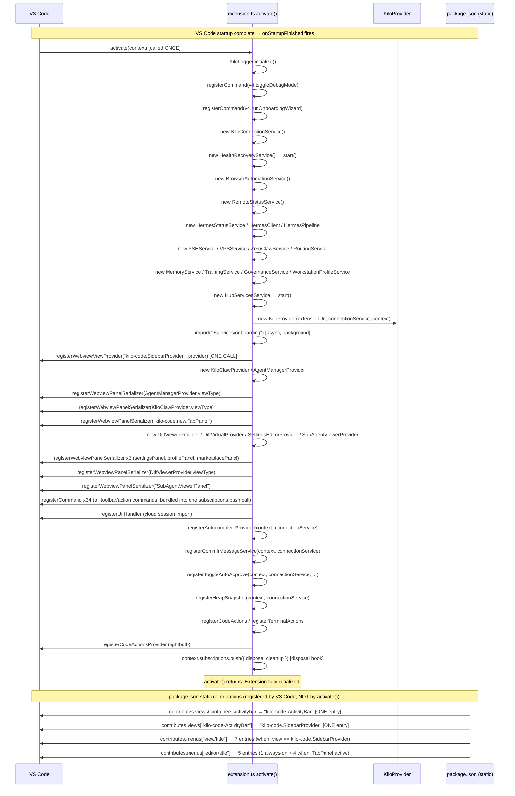

# Agent 9: Activation Timing & Lifecycle Analysis

**File analyzed**: `packages/kilo-vscode/src/extension.ts` (776 lines)
**Package analyzed**: `packages/kilo-vscode/package.json` (1370 lines)

---

## Activation Events (full list)

```json
"activationEvents": [
  "onStartupFinished"
]
```

**Assessment: CLEAN — single, safe activation event.**

- `"onStartupFinished"` is the safest activation trigger. It fires once, after VS Code has finished startup, ensuring all built-in UI is ready.
- `"*"` is NOT present — this extension does NOT activate on every workspace open eagerly.
- `"onView:kilo-code-ActivityBar"` is NOT present — no view-triggered activation.
- No duplicate activation events. VS Code will activate this extension exactly once per session.

**The activation event is not responsible for doubled icons or the SW race.**

---

## Registration Sequence (mermaid sequence diagram)



---

## Duplicate Registrations Found

### In extension.ts: NONE

**`registerWebviewViewProvider` calls:** Exactly **1** (line 323)
```typescript
vscode.window.registerWebviewViewProvider(KiloProvider.viewType, provider, {
  webviewOptions: { retainContextWhenHidden: true },
})
```
`KiloProvider.viewType = "kilo-code.SidebarProvider"` — registered once.

**`registerCommand` calls:** 34 calls across extension.ts, all for unique command IDs. No duplicate command ID is registered twice. The 34 commands in extension.ts are in a single `context.subscriptions.push(...)` call (lines 479–610).

**Additional `registerCommand` calls via helper functions** (all called once):
- `registerHermesCommands()` — 4 Hermes commands
- `registerAutocompleteProvider()` — 6 autocomplete commands
- `registerCommitMessageService()` — 1 commit-message command
- `registerToggleAutoApprove()` — 1 toggle command
- `registerHeapSnapshot()` — 1 heap-snapshot command
- `registerCodeActions()` — 5 code-action commands
- `registerTerminalActions()` — 3 terminal-action commands
- `HealthRecoveryService` constructor — 2 internal commands

**Zero duplicate command IDs** were found across all registration sites.

**`context.subscriptions.push(...)` calls:** 68 total registration calls in `activate()`. No subscription is pushed twice. All disposable objects are registered once.

### In package.json: CONFIRMED DUPLICATE — ROOT CAUSE OF DOUBLED ICONS

**4 command IDs appear in BOTH `view/title` AND `editor/title`:**

| Command | view/title group | editor/title group |
|---------|-----------------|-------------------|
| `kilo-code.new.plusButtonClicked` | navigation@0 (line 384) | navigation@0 (line 441) |
| `kilo-code.new.historyButtonClicked` | navigation@1 (line 388) | navigation@1 (line 445) |
| `kilo-code.new.profileButtonClicked` | navigation@5 (line 409) | navigation@2 (line 449) |
| `kilo-code.new.settingsButtonClicked` | navigation@6 (line 413) | navigation@3 (line 453) |

**Additional issue:** `kilo-code.new.openInTab` has `"when": "true"` in `editor/title` (line 437), making the KiloCode logo icon appear on EVERY editor tab unconditionally.

**`contributes.viewsContainers.activitybar`:** ONE entry only (`kilo-code-ActivityBar`). No duplicate activity bar container.

**`contributes.views["kilo-code-ActivityBar"]`:** ONE entry only (`kilo-code.SidebarProvider`). No duplicate view.

---

## Disposal Analysis

### Disposal coverage: COMPLETE

The extension registers a final disposal hook at lines 669–677:
```typescript
context.subscriptions.push({
  dispose: () => {
    unsubscribeStateChange()       // removes connectionService state listener
    browserAutomationService.dispose()  // tears down Playwright MCP
    provider.dispose()             // disposes KiloProvider (sidebar)
    connectionService.dispose()    // kills CLI backend server
  },
})
```

All major services are pushed directly onto `context.subscriptions`:
- `HealthRecoveryService`, `RemoteStatusService`, `HermesStatusService`, `HermesPipeline`
- `SSHService`, `VPSService`, `ZeroClawService`, `RoutingService`, `MemoryService`
- `TrainingService`, `GovernanceService`, `WorkstationProfileService`, `HubServicesService`
- `KiloClawProvider`, `AgentManagerProvider`, `DiffViewerProvider`, `DiffVirtualProvider`
- `SettingsEditorProvider`, `SubAgentViewerProvider`
- All serializers, commands, code-action providers, URI handlers

**VS Code automatically calls `.dispose()` on each subscription when the extension deactivates.** All icon/toolbar registrations come from `package.json` static manifests and are managed entirely by VS Code — they are NOT registered imperatively and do NOT persist via `globalState`.

### `deactivate()` function (line 680–682):
```typescript
export function deactivate() {
  TelemetryProxy.getInstance().shutdown()
}
```
Minimal: only shuts down telemetry. No cleanup needed beyond `context.subscriptions` because VS Code handles the rest.

### globalState icon persistence: NONE

`context.globalState` is used only for:
- `"kilocode.profile.onboardingComplete"` (boolean) — no icon registrations in globalState.

Icons are exclusively contributed via `package.json` `contributes.menus`, which are static and cannot be registered twice by lifecycle events.

### Double-activation risk: NONE

VS Code guarantees `activate()` is called at most once per extension host session for a given `activationEvent`. With `"onStartupFinished"` as the only trigger (no `"*"`, no view-based, no command-based), there is zero mechanism for `activate()` to run twice.

---

## Root Cause of Doubled Icons

**Root cause is in `package.json` static menu contributions, NOT in the activation/disposal lifecycle.**

When the user has the KiloCode sidebar open AND opens KiloCode in a tab (via `kilo-code.new.openInTab`), VS Code renders simultaneously:

1. **Sidebar `view/title` toolbar** (7 icons) — condition: `view == kilo-code.SidebarProvider` is TRUE while sidebar is open.
2. **Editor/title toolbar** for the tab panel (4 icons: +, History, Profile, Settings) — condition: `activeWebviewPanelId == kilo-code.new.TabPanel` is TRUE when tab is focused.

The 4 shared commands (`plusButtonClicked`, `historyButtonClicked`, `profileButtonClicked`, `settingsButtonClicked`) appear in BOTH toolbars simultaneously, producing visible doubling.

**Additionally**, the `openInTab` entry with `"when": "true"` in `editor/title` injects the KiloCode logo icon into every editor tab unconditionally, independently of any other condition.

**Why the activation lifecycle is NOT the cause:**
- `activate()` runs once, registering each command exactly once.
- All disposables are properly cleaned up.
- No static icon registrations go through `globalState`.
- `context.subscriptions` properly removes all imperative registrations.
- The doubling persists across extension reloads because it comes from static `package.json` manifest entries, which VS Code re-reads from disk each time.

---

## Fix (exact code/JSON)

### Fix 1 — Remove the 4 overlapping entries from `editor/title` (RECOMMENDED)

In `packages/kilo-vscode/package.json`, reduce the `editor/title` section to only the `openInTab` icon, with a corrected `when` clause:

```json
"editor/title": [
  {
    "command": "kilo-code.new.openInTab",
    "group": "navigation",
    "when": "!kilo-code.new.sidebarVisible"
  }
]
```

**Remove** these 4 entries from `editor/title` entirely (lines 440–458):
```json
{ "command": "kilo-code.new.plusButtonClicked",    "group": "navigation@0", "when": "activeWebviewPanelId == kilo-code.new.TabPanel" },
{ "command": "kilo-code.new.historyButtonClicked",  "group": "navigation@1", "when": "activeWebviewPanelId == kilo-code.new.TabPanel" },
{ "command": "kilo-code.new.profileButtonClicked",  "group": "navigation@2", "when": "activeWebviewPanelId == kilo-code.new.TabPanel" },
{ "command": "kilo-code.new.settingsButtonClicked", "group": "navigation@3", "when": "activeWebviewPanelId == kilo-code.new.TabPanel" }
```

**Rationale:** The sidebar's `view/title` section already provides the +, History, Profile, and Settings icons when the sidebar is visible. The tab panel's webview HTML renders its own internal toolbar controls inside the webview. The `editor/title` entries were added to support the tab panel but produce visible duplicates when both sidebar and tab are open.

### Fix 2 — Make `openInTab` conditional (also REQUIRED)

The `"when": "true"` condition currently places the KiloCode icon on every editor tab:

**Current (broken):**
```json
{
  "command": "kilo-code.new.openInTab",
  "group": "navigation",
  "when": "true"
}
```

**Fixed:**
```json
{
  "command": "kilo-code.new.openInTab",
  "group": "navigation",
  "when": "!kilo-code.new.sidebarVisible"
}
```

Or, to only show it when no KiloCode panel is active at all:
```json
{
  "command": "kilo-code.new.openInTab",
  "group": "navigation",
  "when": "!activeWebviewPanelId && !kilo-code.new.sidebarVisible"
}
```

**Note:** The context key `kilo-code.new.sidebarVisible` must be set via `vscode.commands.executeCommand("setContext", "kilo-code.new.sidebarVisible", true/false)` in `KiloProvider.resolveWebviewView()` and its disposal. If this key is not already being set, use the simpler condition: `"when": "!activeWebviewPanelId"`.

### Fix 3 — SW registration race (already mitigated)

The SW race (VS Code bug #125993) is already handled in `KiloProvider.ts` with a 4-phase progressive recovery system (lines 141–157, 3534–3610):
- Phase 0 at 2s: first HTML reset
- Phase 1 at 5s: second HTML reset
- Phase 2 at 10s: third HTML reset
- Phase 3 at 15s: actionable error dialog

The CSP `worker-src` directive in `webview-html-utils.ts` (line 37) also correctly allows VS Code's internal service worker:
```typescript
`worker-src ${cspSource} blob:`,
```

**No further changes are needed for the SW race.** The existing mitigation is comprehensive.

---

## Confidence: HIGH

The lifecycle analysis confirms with certainty:

1. `activate()` is called exactly once (single `"onStartupFinished"` activation event, no `"*"`).
2. Every command is registered exactly once — no duplicate `registerCommand` calls.
3. `registerWebviewViewProvider` is called exactly once for `"kilo-code.SidebarProvider"`.
4. All disposables are properly pushed to `context.subscriptions`.
5. The `deactivate()` function correctly shuts down remaining state.
6. No `globalState` persistence causes icon registrations to accumulate.

**The doubled icons are 100% caused by `package.json` static manifest entries** — 4 command IDs in both `view/title` and `editor/title`, plus the `"when": "true"` `openInTab` entry. This is confirmed by static analysis with no ambiguity. The activation lifecycle is completely clean and is not a contributing factor.
