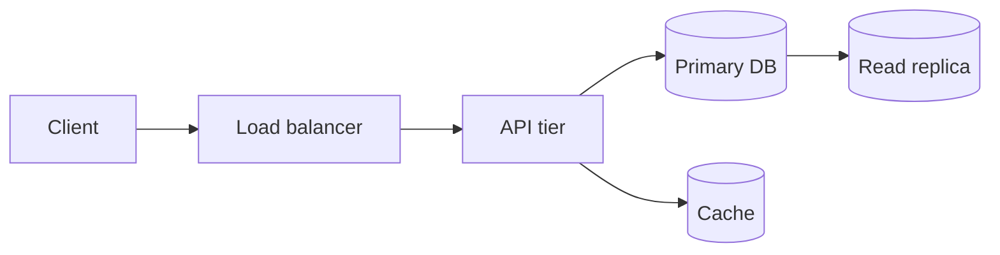
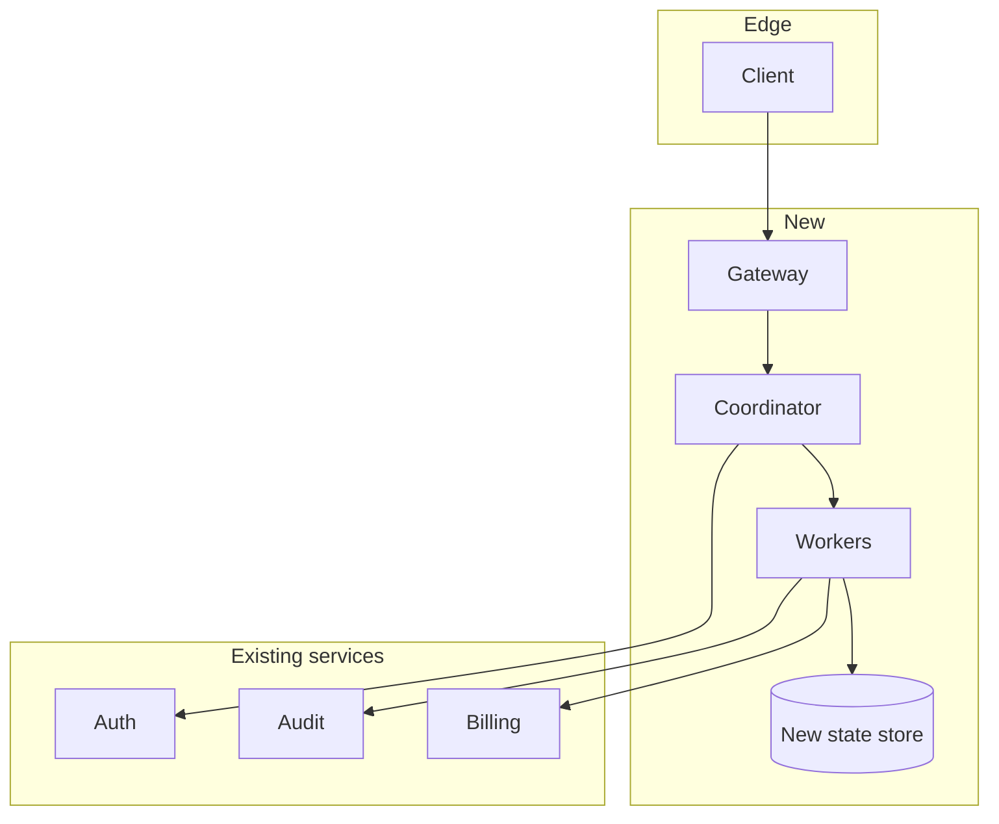

# {{PROJECT_NAME}} — Design Document

| Field | Value |
|---|---|
| Status | <!-- ai-fill: Draft / In review / Approved / Implemented --> |
| Author(s) | <!-- ai-fill --> |
| Reviewers | <!-- ai-fill: 3-6 names — at least one cross-team reviewer --> |
| Last updated | <!-- ai-fill: ISO date --> |
| Linked docs | <!-- ai-fill: PRD, ADRs, predecessor design docs --> |
| Eng lead | <!-- ai-fill --> |
| TL/Manager | <!-- ai-fill --> |

> **Convention**: Google-style design docs are written for engineers who
> were *not* in the design meetings. They prize clarity over brevity. The
> author writes the doc; the team reviews; the doc is approved before
> coding begins. After implementation, the doc is preserved as historical
> record — *not* updated to reflect what shipped (that's what the codebase
> and the post-launch review are for).

## 1. Context

<!-- ai-fill: 2-4 paragraphs answering: "What is the situation, and why are we writing this doc?" Include:
- A 30-second elevator description of what we are about to design.
- Where this fits in the larger system (one-line context — link to the system map).
- The forcing function: what outage / customer ask / strategic bet motivated this.
- A concise statement of the problem in the user's voice. -->

### Background

<!-- ai-fill: Domain context an outsider needs. Glossary terms, prior architecture, reference reading. Generous links — assume the reviewer is one click away from any term they don't know. -->

### Glossary

| Term | Meaning |
|---|---|
| <!-- ai-fill --> | <!-- ai-fill --> |
| <!-- ai-fill --> | <!-- ai-fill --> |
| <!-- ai-fill --> | <!-- ai-fill --> |

## 2. Goals and non-goals

### Goals

<!-- ai-fill: 3-5 numbered goals, each measurable. Goals are user-visible or operator-visible outcomes, not implementation steps. Example: "Reduce p99 read latency from 850ms to <200ms at 5k QPS." -->

1. <!-- ai-fill -->
2. <!-- ai-fill -->
3. <!-- ai-fill -->

### Non-goals

<!-- ai-fill: 3-5 explicit *non*-goals. The reviewer's first instinct is to assume scope is wider than it is — name what is out, and why. Examples:

- We are not changing the auth layer; existing OIDC integration stays as-is.
- We are not adding multi-region writes in V1; that is a follow-up.
- We are not migrating off Postgres; the new system is additive. -->

- <!-- ai-fill -->
- <!-- ai-fill -->
- <!-- ai-fill -->

## 3. Existing solution

<!-- ai-fill: 2-4 paragraphs describing how the system works *today* — both the architecture and the failure modes. This section earns the right to propose change. Include a diagram of the current state, an enumeration of the pain points, and a quantified statement of the cost (latency, $/month, on-call hours, NPS). -->

### Current architecture



### Why the current system is no longer enough

<!-- ai-fill: 3-5 bullets, each with a concrete number or incident reference. Avoid "it's slow" — say "p99 write latency is 1.4s; SLO is 300ms; on-call paged 8 times in Q3." -->

- <!-- ai-fill -->
- <!-- ai-fill -->
- <!-- ai-fill -->

## 4. Proposed solution

<!-- ai-fill: The substantive section. 4-8 paragraphs covering:
- The high-level shape (one architecture diagram).
- The data model deltas (schema, ER, message envelopes).
- The control flow (request path, write path, async pipelines).
- The deployment topology and ownership boundaries.
- The 2-3 specific design choices that are *load-bearing* — call them out and tie each to a Goal. -->

### Architecture



### Data model

<!-- ai-fill: Schemas, key types, retention. Use TypeScript / SQL / protobuf depending on the audience. Include a worked example of a single record. -->

```typescript
interface ExampleRecord {
  id: string            // ULID; sortable
  tenantId: string      // partition key
  payload: Json
  version: number       // optimistic concurrency
  createdAt: number     // epoch ms
}
```

### API surface

<!-- ai-fill: Tabular list of new endpoints / RPCs / events. For each: method, name, request shape, response shape, idempotency story, retry semantics. -->

| Method | Endpoint | Description | Idempotent? |
|---|---|---|---|
| POST | `/v1/things` | Create | Yes (request ID header) |
| GET | `/v1/things/:id` | Read | Yes |
| PATCH | `/v1/things/:id` | Update | No — uses `If-Match` ETag |

### Key invariants

<!-- ai-fill: 3-5 invariants the system must hold for the design to be correct. Examples: "A request is never billed twice." "Every successful write is durable in two AZs before the API responds 2xx." Naming invariants is the most useful part of a design doc — refactors and incidents can be checked against them. -->

- <!-- ai-fill -->
- <!-- ai-fill -->
- <!-- ai-fill -->

## 5. Alternatives considered

<!-- ai-fill: 2-4 alternatives, each described seriously (not a strawman). For each: 1 paragraph of what it is, 3 bullets of pros, 3 bullets of cons, and the *specific reason* it lost.

The point of this section is not to show your work; it is to inoculate against the "but did you think about X?" question and to leave a paper trail for future re-evaluation. -->

### Alternative A — <!-- ai-fill -->

<!-- ai-fill: paragraph -->

- ✅ <!-- ai-fill -->
- ✅ <!-- ai-fill -->
- ❌ <!-- ai-fill -->
- ❌ <!-- ai-fill -->

**Why rejected**: <!-- ai-fill -->

### Alternative B — <!-- ai-fill -->

(Same shape.)

### Alternative C — Status quo

<!-- ai-fill: What if we did nothing. Often the most useful comparison. -->

## 6. Cross-cutting concerns

> Each subsection is independently signable. A security reviewer should be
> able to read §6.1 in isolation and either approve or block.

### 6.1 Security

<!-- ai-fill:
- Threat model (STRIDE-style): list the top 5 threats and the mitigation each.
- Auth: who calls this, with what credential, and how we validate.
- Authz: the authorization decision points and their data sources.
- Crypto: keys, rotation cadence, KMS integration.
- Supply chain: dependencies added, SBOM impact, third-party risk review.
- Open security questions to file with the security team. -->

| Threat | Vector | Mitigation | Owner |
|---|---|---|---|
| <!-- ai-fill --> | <!-- ai-fill --> | <!-- ai-fill --> | <!-- ai-fill --> |

### 6.2 Privacy

<!-- ai-fill:
- PII inventory: what personal data does this system see? At what granularity?
- Lawful basis (GDPR Art. 6) and purpose limitation.
- Retention: how long, where, who can read.
- Subject-rights handling (export, delete, rectify).
- Cross-border data transfer story.
- DPIA required? -->

### 6.3 Observability

<!-- ai-fill:
- Logs: structured fields, retention, sampling, PII redaction.
- Metrics: SLI definitions, SLO targets, error budget burn rate alerts.
- Traces: spans we instrument, propagation policy across the boundary.
- Dashboards: links (or names of dashboards we will create).
- Alerts: list each alert + the runbook link. -->

| Signal | Type | Threshold | Runbook |
|---|---|---|---|
| <!-- ai-fill --> | metric | <!-- ai-fill --> | <!-- ai-fill --> |
| <!-- ai-fill --> | log pattern | <!-- ai-fill --> | <!-- ai-fill --> |

### 6.4 Reliability and capacity

<!-- ai-fill: SLO targets, expected QPS at launch / 1y / 3y, capacity plan, failure-mode analysis (what happens when each dep is down), graceful-degradation behaviour. -->

### 6.5 Cost

<!-- ai-fill: Estimated infra cost at launch, projection at 1y, the dominant cost driver, the lever we would pull if costs spike. Cite vendor pricing pages dated; mark as a footnote. -->

### 6.6 Localisation / accessibility

<!-- ai-fill: Locales supported at launch, i18n approach (gettext vs ICU), text-direction support, accessibility level (WCAG 2.2 AA?), assistive-tech testing plan. -->

## 7. Migration plan

<!-- ai-fill: How we get from the existing solution to the proposed solution without breaking customers. Stages, dual-write windows, data backfills, cutover windows, rollback plan, communication plan. -->

| Stage | Action | Duration | Rollback | Owner |
|---|---|---|---|---|
| 0 | Shadow read of new path | 1 week | Disable feature flag | <!-- ai-fill --> |
| 1 | Dual-write | 2 weeks | Disable writer | <!-- ai-fill --> |
| 2 | Backfill | 1 week | n/a (idempotent) | <!-- ai-fill --> |
| 3 | Read cutover | 1 day | Flip flag, replay | <!-- ai-fill --> |
| 4 | Decommission old path | 4 weeks later | n/a | <!-- ai-fill --> |

**Customer-facing communication**: <!-- ai-fill: who, when, what we say. -->

## 8. Roll-out and launch criteria

<!-- ai-fill: What gates each stage of the rollout. Tie to NFRs from the PRD. Be specific: error rates, latencies, business KPIs, on-call signal. -->

- **Internal alpha**: <!-- ai-fill: criterion -->
- **Closed beta**: <!-- ai-fill: criterion -->
- **GA**: <!-- ai-fill: criterion -->

## 9. Testing strategy

<!-- ai-fill: Brief — link to the test-plan doc if separate. Cover unit, integration, load, chaos, and security testing. Note the *invariants* (§4) and the test that defends each. -->

## 10. Open questions

<!-- ai-fill: Questions the doc cannot yet answer. Each tagged with the owner and the call-it date. Five is healthy; one is suspicious; fifteen means the doc is not yet ready. -->

1. **Q**: <!-- ai-fill --> · **Owner**: <!-- ai-fill --> · **By**: <!-- ai-fill -->
2. **Q**: <!-- ai-fill --> · **Owner**: <!-- ai-fill --> · **By**: <!-- ai-fill -->

## 11. References

- [^1]: <!-- ai-fill: prior design doc / RFC / paper -->
- [^2]: <!-- ai-fill -->
- [^3]: <!-- ai-fill -->

---

> **Reviewer checklist**:
> - [ ] Goals are measurable; non-goals are non-trivial.
> - [ ] Existing solution is described before the new one.
> - [ ] At least one alternative is steel-manned.
> - [ ] Each cross-cutting concern is independently sign-off-able.
> - [ ] Migration plan has a rollback for every stage.
> - [ ] Open questions name owners and call-it dates.
