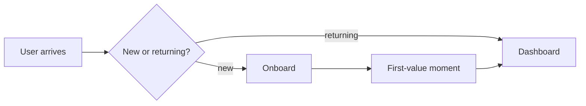

# {{PRODUCT_NAME}} — Product Requirements Document

| Field | Value |
|---|---|
| Status | <!-- ai-fill: Draft / In review / Approved / Building / Shipped / Deprecated --> |
| Author | <!-- ai-fill: name + email --> |
| Reviewers | <!-- ai-fill: 2-4 names: tech lead, design lead, PM peer, stakeholder --> |
| Last updated | <!-- ai-fill: ISO date --> |
| Target launch | <!-- ai-fill: quarter or specific date --> |
| One-line summary | <!-- ai-fill: a single sentence a stranger could grok in 10 seconds --> |
| Linked docs | <!-- ai-fill: PRFAQ, design doc, ADRs, Figma, RFC numbers --> |

---

## 1. Problem

### What is the problem?

<!-- ai-fill: 2-3 paragraphs. Open with a *concrete user vignette* — a real or composite human, the moment of pain, the cost. Then zoom out: how widespread is this, what evidence do we have (research interviews, support tickets, telemetry), and why has nobody solved it well already. End with one sentence framing the problem in the user's own words ("I just want to ___ without ___"). -->

### Why does it matter?

<!-- ai-fill: One short paragraph quantifying the impact: time/money lost, opportunity cost, downstream effects on retention or revenue. Cite at least one internal data source (telemetry query, NPS quote) and one external one. -->

### Why now?

<!-- ai-fill: What changed — in the market, the technology, our roadmap, or our customers — that makes this the right thing to build *this* quarter rather than last year or next? -->

## 2. Goals and non-goals

### Goals (what success looks like)

<!-- ai-fill:
1. **Primary outcome** — the user-visible change we are committing to.
2. **Behavioural change** — the new habit or workflow we expect to enable.
3. **Business outcome** — the metric that improves as a consequence.

Each goal should be specific, measurable, and have a target horizon. Three is the right number. Five means you don't yet have priorities. -->

### Non-goals (what we are explicitly *not* doing)

<!-- ai-fill: 3-5 bullets of capabilities that a reasonable reader might assume are in scope but are not. The non-goals list is more important than the goals list — it prevents scope creep and clarifies the bet.

Example non-goals:
- We are not redesigning the {{ADJACENT_FEATURE}} flow; we will integrate as-is.
- We are not supporting offline mode in V1.
- We are not localising beyond English in V1. -->

## 3. Personas

<!-- ai-fill: 2-3 personas, no more. For each: name, role, day-in-the-life, JTBD (Job-To-Be-Done), what they care about, what they do *not* care about. Avoid demographic detail; focus on workflow and motivation. Real people > made-up archetypes. -->

### Persona A — {{NAME}}

- **Role**: <!-- ai-fill -->
- **Day**: <!-- ai-fill: 1-2 sentence vignette of a typical workday -->
- **JTBD**: "When ___, I want to ___, so I can ___" — <!-- ai-fill -->
- **Cares about**: <!-- ai-fill: 3 things, ordered -->
- **Does not care about**: <!-- ai-fill: 2 things — explicit constraints we don't need to optimise for -->
- **Tools they use today**: <!-- ai-fill: 3-5 tools, including the workaround we are replacing -->

### Persona B — {{NAME}}

(Same shape as Persona A.)

## 4. User stories

> Format: "As a [persona], I want to [action], so that [outcome]." Followed
> by acceptance criteria. Group stories by theme (epic) and rank P0/P1/P2.

### Epic 1: <!-- ai-fill: epic name -->

#### Story 1.1 — P0 — <!-- ai-fill: short title -->

**As a** <!-- ai-fill: persona -->,
**I want to** <!-- ai-fill: action -->,
**so that** <!-- ai-fill: outcome -->.

**Acceptance criteria** (Gherkin-friendly):
- Given <!-- ai-fill -->, when <!-- ai-fill -->, then <!-- ai-fill -->.
- Given <!-- ai-fill -->, when <!-- ai-fill -->, then <!-- ai-fill -->.
- Edge case: <!-- ai-fill -->.

#### Story 1.2 — P1 — <!-- ai-fill: short title -->

(Same shape.)

### Epic 2: <!-- ai-fill: epic name -->

(Repeat the structure.)

## 5. Functional requirements

<!-- ai-fill: Numbered list of capabilities the system MUST / SHOULD / MAY do (RFC 2119 verbs). Tie each requirement back to a user story by ID (e.g., "F-3 satisfies Story 1.1"). Be specific about inputs and outputs; avoid "the system shall be intuitive". -->

| ID | Priority | Requirement | Story link |
|---|---|---|---|
| F-1 | MUST | <!-- ai-fill --> | 1.1 |
| F-2 | MUST | <!-- ai-fill --> | 1.1 |
| F-3 | SHOULD | <!-- ai-fill --> | 1.2 |
| F-4 | MAY | <!-- ai-fill --> | 2.1 |

## 6. Non-functional requirements (NFRs)

<!-- ai-fill: Quantified expectations the system must meet. Avoid weasel words ("fast", "scalable"). Numbers, percentiles, and budgets. -->

| Category | Requirement | Target |
|---|---|---|
| Performance | p50 / p95 latency | <!-- ai-fill: e.g., 120ms / 400ms --> |
| Availability | Monthly uptime SLO | <!-- ai-fill: e.g., 99.9% --> |
| Capacity | Peak QPS | <!-- ai-fill --> |
| Security | Threat model | <!-- ai-fill: link to STRIDE doc --> |
| Privacy | PII categories handled | <!-- ai-fill: list, with retention --> |
| Compliance | Standards | <!-- ai-fill: SOC 2, GDPR, HIPAA, PCI — say "n/a" honestly --> |
| Accessibility | WCAG level | <!-- ai-fill: AA at launch, AAA for {{specific surfaces}} --> |
| Internationalisation | Locales | <!-- ai-fill: launch + planned --> |
| Observability | Logs / metrics / traces | <!-- ai-fill: what is emitted, what dashboards exist --> |
| Cost | Unit economics | <!-- ai-fill: target cost per user / per request --> |

## 7. UX / design

<!-- ai-fill: Link to Figma. Embed key screen names. Note design decisions worth highlighting: pattern reuse, accessibility considerations, motion language, dark mode handling, empty/loading/error states. Diagram if a flow is non-obvious. -->

## 8. System / dependencies

<!-- ai-fill: Bullet list of upstream services, downstream consumers, and external dependencies (third-party APIs, vendors, internal teams). Note the on-call / SLA owner of each dependency. Flag the critical-path ones in **bold**. Defer architecture detail to the linked design doc. -->

## 9. Risks and mitigations

| Risk | Likelihood | Impact | Mitigation | Owner |
|---|---|---|---|---|
| <!-- ai-fill: e.g., LLM provider rate-limits us under launch traffic --> | M | H | <!-- ai-fill: cascade with fallback provider; pre-warmed quota request --> | <!-- ai-fill --> |
| <!-- ai-fill --> | <!-- ai-fill --> | <!-- ai-fill --> | <!-- ai-fill --> | <!-- ai-fill --> |
| <!-- ai-fill --> | <!-- ai-fill --> | <!-- ai-fill --> | <!-- ai-fill --> | <!-- ai-fill --> |

## 10. Rollout

<!-- ai-fill: Stages, gates, and the metric we hold each stage to. Be explicit about who can pull the eject lever and on what signal. -->

| Stage | Audience | Duration | Gate to next | Owner |
|---|---|---|---|---|
| Internal dogfood | Eng + PM | 1 week | Zero P0 bugs, all critical paths exercised | <!-- ai-fill --> |
| Closed beta | 50 invited customers | 2 weeks | NPS ≥ 30, activation ≥ 60% | <!-- ai-fill --> |
| Open beta | All free-tier users | 2 weeks | p95 latency < 400ms, error rate < 1% | <!-- ai-fill --> |
| GA | All users | — | — | <!-- ai-fill --> |

**Kill-switch / rollback plan**: <!-- ai-fill: feature-flag name, safe-state behavior, max-blast-radius if we have to roll back at peak. -->

## 11. Success metrics

<!-- ai-fill: 1 north-star + 3-4 supporting metrics. For each, define the formula, the data source, and the target threshold + horizon. -->

| Metric | Definition | Target | Horizon | Dashboard |
|---|---|---|---|---|
| **North-star** | <!-- ai-fill --> | <!-- ai-fill --> | <!-- ai-fill --> | <!-- ai-fill --> |
| Activation | <!-- ai-fill --> | <!-- ai-fill --> | 30d | <!-- ai-fill --> |
| Retention | <!-- ai-fill --> | <!-- ai-fill --> | 90d | <!-- ai-fill --> |
| Quality | <!-- ai-fill --> | <!-- ai-fill --> | 30d | <!-- ai-fill --> |

**Counter-metrics** (to make sure we don't optimise the north-star at the expense of something else): <!-- ai-fill: 2-3 metrics that should NOT degrade. e.g., support ticket volume, cost-per-request, p95 latency. -->

## 12. Timeline

<!-- ai-fill: Milestones, not dates-down-to-the-day. Each milestone has a deliverable (something you can demo) and an owner. -->

| Milestone | Deliverable | Owner | Target |
|---|---|---|---|
| M0 — Spec freeze | This PRD approved | PM | <!-- ai-fill: week --> |
| M1 — Design freeze | Figma + ADRs signed | Design + Tech lead | <!-- ai-fill --> |
| M2 — Internal alpha | End-to-end happy path | Eng | <!-- ai-fill --> |
| M3 — Closed beta | Invite waitlist live | PM + Marketing | <!-- ai-fill --> |
| M4 — GA | Public launch + post-launch monitor | All | <!-- ai-fill --> |

## 13. Open questions

<!-- ai-fill: Numbered list of unresolved decisions. Each item: question, owner, call-it-by date, current leaning. The reviewer should leave knowing exactly what is undecided. Six is healthy; one is suspicious; fifteen means the PRD is not yet ready. -->

1. **Q**: <!-- ai-fill --> · **Owner**: <!-- ai-fill --> · **By**: <!-- ai-fill --> · **Leaning**: <!-- ai-fill -->
2. **Q**: <!-- ai-fill --> · **Owner**: <!-- ai-fill --> · **By**: <!-- ai-fill --> · **Leaning**: <!-- ai-fill -->
3. **Q**: <!-- ai-fill --> · **Owner**: <!-- ai-fill --> · **By**: <!-- ai-fill --> · **Leaning**: <!-- ai-fill -->

## 14. Appendix

- Research interviews: <!-- ai-fill: link to notes -->
- Telemetry queries that motivated this PRD: <!-- ai-fill -->
- Competitive scan: <!-- ai-fill -->
- Out-of-scope considerations and the rationale for deferral: <!-- ai-fill -->

---

> **Reviewer checklist** (cut from the doc before approving):
> - [ ] Problem section has a real user vignette and a number.
> - [ ] Non-goals are non-trivial (i.e., a thoughtful person would have assumed they were in scope).
> - [ ] Each user story has acceptance criteria, not just a title.
> - [ ] NFRs are quantified.
> - [ ] Success metrics include at least one counter-metric.
> - [ ] Risk table has owners.
> - [ ] Timeline shows demoable milestones, not just dates.
> - [ ] Open questions list is honest.
