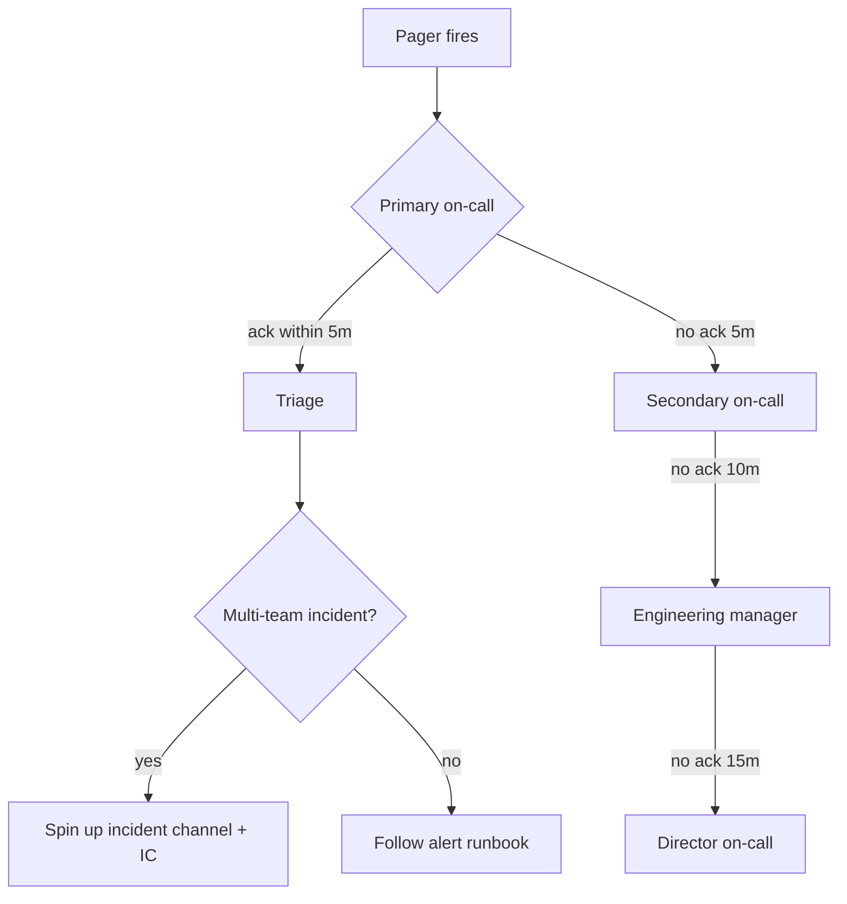

# {{SERVICE_NAME}} — Runbook

| Field | Value |
|---|---|
| Service | <!-- ai-fill --> |
| Tier | <!-- ai-fill: T0 (revenue critical) / T1 / T2 / T3 (best-effort) --> |
| Owning team | <!-- ai-fill: team name + slack channel --> |
| On-call rotation | <!-- ai-fill: link to PagerDuty / Opsgenie schedule --> |
| Backup escalation | <!-- ai-fill: secondary team / manager --> |
| Last incident | <!-- ai-fill: date + ID + link to post-mortem --> |
| Last reviewed | <!-- ai-fill: ISO date — review at least quarterly --> |

> **Runbook contract**: When the pager fires at 03:00, a competent engineer
> who has *never seen this service* should be able to follow this document
> to a safe state. If the runbook would not get them there, it is broken.
>
> **Drift discipline**: Each time we use the runbook, we either follow it
> verbatim or fix it. Diffs welcome; comments out-of-date are not.

## 1. Service overview

### What it does

<!-- ai-fill: 2-3 paragraphs in plain English. What this service is for, who calls it, what depends on it, what the failure modes look like from the user's perspective. End with one sentence framing "what 'down' means for customers." -->

### Architecture at a glance

```mermaid
flowchart LR
    Client --> LB[Load balancer]
    LB --> API[{{SERVICE_NAME}}]
    API --> DB[(Primary DB)]
    API --> Cache[(Redis)]
    API --> Queue[(Kafka)]
    API --> Downstream1[{{DOWNSTREAM_A}}]
    API --> Downstream2[{{DOWNSTREAM_B}}]
```

### Critical dependencies

| Dependency | Type | Owner | Failure behaviour |
|---|---|---|---|
| <!-- ai-fill: Postgres primary --> | datastore | DB SRE | <!-- ai-fill: read-only mode after 30s of write failure --> |
| <!-- ai-fill: Redis cluster --> | cache | <!-- ai-fill --> | <!-- ai-fill: degrade to DB-direct, p99 spikes 3x --> |
| <!-- ai-fill: Auth service --> | upstream | <!-- ai-fill --> | <!-- ai-fill: cached token TTL 60s, then 401 storm --> |

### Capacity profile

<!-- ai-fill: Steady-state QPS, peak QPS, peak hour, headroom we run with, the metric that triggers a scale-up, the runbook entry that walks through scaling. -->

- **Steady-state**: <!-- ai-fill: QPS, p50/p95 latency, infra cost --> 
- **Peak hour**: <!-- ai-fill -->
- **Headroom**: <!-- ai-fill: e.g., we run at 35% peak utilisation -->
- **Scale-up trigger**: <!-- ai-fill -->

## 2. Dashboards and signals

<!-- ai-fill: Tabular list of the dashboards that matter, in order of "first thing to look at when paged". Include the URL and the panel name to focus on. -->

| Dashboard | URL | Look for | Owner |
|---|---|---|---|
| Service overview | <!-- ai-fill --> | Error rate, p95, QPS | SRE |
| Dependency health | <!-- ai-fill --> | DB conns, Kafka lag, cache hit | SRE |
| Cost / capacity | <!-- ai-fill --> | Replica count, autoscaler events | Platform |
| Customer-facing | <!-- ai-fill: status page --> | Public incident state | Comms |

### SLIs and SLOs

| SLI | SLO | Window | Error budget | Burn-rate alert |
|---|---|---|---|---|
| Availability | 99.9% | 30 days | 43m 49s | 14.4× over 1h |
| p95 latency | < 250ms | 30 days | n/a (target) | 5× over 30m |
| Write success | 99.95% | 30 days | 21m 54s | 14.4× over 1h |

### Logs

- **Where**: <!-- ai-fill: log explorer URL + the saved query for service errors -->
- **Common signals**: <!-- ai-fill: 3-5 distinctive log lines that mean something is wrong -->
- **PII redaction**: <!-- ai-fill: confirm PII fields are redacted; link to the redaction config -->

## 3. Alerts → Actions

> Each alert in the production alerting catalog must map to **exactly one**
> entry below. If you receive a page that does not appear here, it is a
> drift bug — file it after handling.

### A1. `{{SERVICE}}.error_rate.high`

**Severity**: page (P1)
**Trigger**: 5xx error rate > 1% over 5m
**What it usually means**: <!-- ai-fill: most common cause from incident history -->

**Steps**:
1. Open the [Service overview dashboard](#2-dashboards-and-signals). Confirm the alert is real (sometimes a noisy upstream redirect spike).
2. Check **Dependency health** — is a downstream alarming concurrently? If yes, escalate to that team and become coordinator (don't keep digging on our side).
3. Run `kubectl -n {{NAMESPACE}} get pods -l app={{SERVICE}}` (or equivalent). Restart count climbing? OOM? Crash-loop?
4. If a recent deploy correlates (look at `deploy.completed` annotations on the dashboard), follow **Procedure: rollback** in §5.
5. If errors are concentrated on one tenant (`tenant_id` label on the metric), follow **Procedure: tenant-scoped throttle**.
6. If none of the above, declare an incident in `#incidents` and follow the [incident commander runbook]({{LINK}}).

**Rollback**: see §5.1.

**Known false positives**: <!-- ai-fill: e.g., GeoIP DB refresh emits 502s for ~30s every Sunday 02:00 UTC -->

---

### A2. `{{SERVICE}}.latency.p95.slo_burn`

**Severity**: page (P1) on 14.4× burn rate
**Trigger**: p95 SLI burning error budget at >14.4× over 1h
**What it usually means**: <!-- ai-fill -->

**Steps**:
1. <!-- ai-fill -->
2. <!-- ai-fill -->
3. <!-- ai-fill -->

---

### A3. `{{SERVICE}}.queue_lag.high`

**Severity**: ticket (P3) — page if > 30m
**Trigger**: Kafka consumer lag > 10k messages or > 5m wall-time
**What it usually means**: <!-- ai-fill -->

**Steps**:
1. <!-- ai-fill -->
2. <!-- ai-fill -->

---

### A4. `{{SERVICE}}.dependency.{{DEP}}.unavailable`

**Severity**: page (P1)
**Trigger**: 5xx rate from {{DEP}} > 5% over 2m
**Steps**:
1. <!-- ai-fill -->
2. <!-- ai-fill -->

<!-- ai-fill: add 4-8 more alert→action entries for every alert this service emits to its on-call. -->

## 4. Escalation paths



| Role | Channel | Who | Page-back time |
|---|---|---|---|
| Primary on-call | PagerDuty schedule | <!-- ai-fill --> | 5m |
| Secondary | PagerDuty escalation | <!-- ai-fill --> | 10m |
| Eng manager | <!-- ai-fill --> | <!-- ai-fill --> | 15m |
| Customer comms | <!-- ai-fill: Slack #incidents-public --> | comms on-call | n/a |
| Security on-call | <!-- ai-fill --> | infosec | 15m for sev-1 |

**When to wake the customer-comms on-call**: any P1 with customer-visible impact for >10m or any data-integrity concern.

## 5. Common procedures

### 5.1 Rollback the latest deploy

```bash
# 1. Confirm the bad deploy
kubectl -n {{NAMESPACE}} rollout history deploy/{{SERVICE}}

# 2. Roll back one revision
kubectl -n {{NAMESPACE}} rollout undo deploy/{{SERVICE}}

# 3. Watch the rollout
kubectl -n {{NAMESPACE}} rollout status deploy/{{SERVICE}}

# 4. Verify error rate drops
# (open the service overview dashboard)
```

**Safety check before rollback**: <!-- ai-fill: any database migrations to consider? Feature-flag dependencies? -->

### 5.2 Drain a single replica

<!-- ai-fill: kubectl cordon + delete pod, or equivalent in your platform; the verification step that confirms traffic redistributed cleanly. -->

### 5.3 Tenant-scoped throttle

<!-- ai-fill: how to apply a per-tenant rate-limit override (config flag, feature gate, or admin RPC). Include the *unset* command — leaving a throttle on after the incident is a classic mistake. -->

### 5.4 Failover the primary database

<!-- ai-fill: the exact command, the expected RTO, the customer-visible behaviour during failover, the SRE who can authorise it (this is a high-blast-radius action — don't authorise yourself). -->

### 5.5 Replay a dead-letter queue

<!-- ai-fill: how to drain the DLQ safely (idempotency check, batch size, observability) and the audit trail. -->

### 5.6 Bypass the cache

<!-- ai-fill: feature flag or query param that disables the cache when it is poisoned; the load-test we run before flipping it back. -->

### 5.7 Scale up replicas manually

<!-- ai-fill: how to override the autoscaler when a known-traffic spike is incoming (marketing send, partner integration). The unset step. -->

## 6. Known issues and gotchas

<!-- ai-fill: A living list. Each entry: title, symptom, the band-aid, the linked permanent-fix ticket, the expected resolution date. Items here >180 days old should be re-evaluated for closure or escalation. -->

### KI-1 — <!-- ai-fill: title -->

- **Symptom**: <!-- ai-fill -->
- **Workaround**: <!-- ai-fill -->
- **Permanent fix**: <!-- ai-fill: link to ticket -->
- **First seen**: <!-- ai-fill -->

### KI-2 — <!-- ai-fill -->

(Same shape.)

### KI-3 — <!-- ai-fill -->

(Same shape.)

## 7. Maintenance windows and planned work

<!-- ai-fill: Recurring maintenance (cert rotation, schema migrations, vendor patch days). Standing windows during which alerts may be suppressed. The procedure to schedule a one-off maintenance window. -->

| Activity | Cadence | Window | Owner |
|---|---|---|---|
| TLS cert rotation | quarterly | Sunday 02:00 UTC | <!-- ai-fill --> |
| DB minor version upgrade | annually | maintenance | <!-- ai-fill --> |
| Disaster-recovery drill | quarterly | Wed 14:00 UTC | <!-- ai-fill --> |

## 8. Disaster recovery

<!-- ai-fill:
- RPO / RTO commitments.
- The DR plan in three sentences.
- The link to the full DR runbook.
- The last successful DR exercise (date + outcome). -->

## 9. Post-incident hygiene

After every incident, before closing the page:
1. File the post-mortem ticket (template: [postmortem.md]).
2. Update this runbook for any drift the incident exposed.
3. File a `runbook-update` issue if a new alert→action entry is needed.
4. Add to §6 Known issues if the workaround will outlive the page.

## 10. References

- Service design doc: <!-- ai-fill -->
- API contract: <!-- ai-fill -->
- Most recent post-mortems: <!-- ai-fill: link to last 3 -->
- Threat model: <!-- ai-fill -->
- Cost dashboard: <!-- ai-fill -->

---

> **Runbook hygiene checklist** (review quarterly):
> - [ ] Every alert in the alerting catalog has an entry in §3.
> - [ ] Every entry in §3 has been used (or rehearsed) in the last 90 days.
> - [ ] §5 procedures have been re-tested in the last 90 days.
> - [ ] §6 known issues older than 180 days have an owner and a date.
> - [ ] Escalation paths in §4 reflect the current org chart.
> - [ ] Dashboard links in §2 still resolve.
