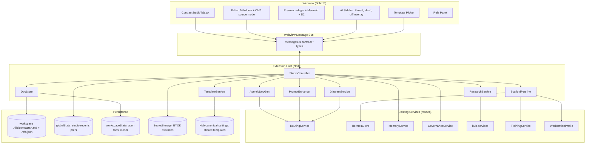

# Contract Markdowns Studio — Unified Architecture & Roadmap

> Version 0.1 — synthesised from 8 partner research agents (Editor UX, Templates, Prompt Enhancer, Agentic Doc-gen, Research/Citations, Multi-Provider LLM, Diagram Pipeline, Spec→Code Pipeline).
> Owner: Studio working group. Status: Draft for review.

---

## TL;DR

**What we are building.** Contract Markdowns Studio is the 28th Settings tab in `kilo-vscode`: a first-class long-form authoring workspace that turns rough product ideas into rigorous, AI-generated, AI-maintained markdown contracts — PRDs, RFCs, ADRs, design docs, runbooks, model cards. It is the *spec layer* that sits above the agent layer: where everyone in the loop (humans, agents, KiloCode itself) goes to read, write, and reconcile *what we are building before it gets built*. Output is plain `.md` files in the workspace plus a JSON sidecar for refs/diagrams; nothing proprietary, fully diff-friendly, fully git-native.

**Why now.** KiloCode already has the substrate — RoutingService with circuit breakers and BYOK, Hermes pipeline, Hub canonical-settings, MemoryService (Shiba), TrainingService (datasets), governance gates, 27 working settings tabs in SolidJS. The expensive parts are paid for. What is missing is the *spec-as-source-of-truth* surface that turns "I want to build a vintage cameras marketplace" into a 12-section PRD, a Mermaid/D2 architecture diagram, a curated stack, a failing test skeleton, and a regenerable build plan — *in under 60 seconds* for the Quick Draft path. GitHub Spec Kit, Copilot Workspace, Cursor, v0, Bolt and Lovable have each shipped a slice; nobody has shipped the *editable, audited, multi-provider, locally-stored, citable* whole.

**The bet.** Studio is the first place a KiloCode user opens after the onboarding wizard and the last place they close before they ship. Every other tab — Hermes, Memory, Routing, Governance, Training, Workstation — gets a Studio integration: contracts feed evals, evals feed datasets, datasets feed training, training feeds routing, routing feeds Studio. Done right, this becomes the connective tissue that makes the 27 sibling tabs feel like one product instead of 27 products in a trench coat.

---

## Architecture

### Component diagram



### Data-flow narration

A user lands on the **Contract Studio** tab. They see (a) a list of their open `.kilo/contracts/*.md` files, (b) a Template Picker with the 28 curated templates from agent #2, and (c) an empty editor with a single chat input *"What are you building?"* They type one paragraph. The webview posts `contract:enhancePrompt` to the host. `PromptEnhancer` (agent #3) runs an Ambiguity Detector — three structured-output Haiku calls in parallel — and surfaces 3 clarifying questions inline. The user answers, then clicks **Generate**. The host pipes the enriched intent through `AgenticDocGen` (agent #4): an Outline Planner using **Claude Opus 4.5+ extended thinking** (deliberation tier) produces the section dependency graph; 6–10 Section Workers (Claude Haiku 4.5, parallelised) draft each section; a Reflexion-style Rubric Critic scores against the chosen template's rubric and re-drafts weak sections; finally a Consistency Reconciler unifies terminology. As sections stream in, the editor shows them filling top-down — first token in <2s, full draft <30s for Quick mode, <60s for Deep mode. Diagrams declared in the outline are dispatched to `DiagramService` (agent #7) which generates D2, falls back to Mermaid on parser failure, runs ELK layout, and emits the SVG. Citations from `ResearchService` (agent #5) — Tavily for web, Semantic Scholar for papers, GitHub Code Search for code — land in the doc as Pandoc-style `[^src-x]` footnotes with a sidebar refs panel. The user edits the doc inline (Milkdown WYSIWYG, slash menu, ghost-text inline rewrites). When ready, they click **Scaffold Project**: `ScaffoldPipeline` (agent #8) parses the contract into a `BuildPlan`, runs the editable plan view, resolves a curated template, applies LLM-generated patches, and hands the result to KiloCode's main agent as a TDD target.

---

## Tab UX

### First-open layout

```
+------------------------------------------------------------------------+
| Tab bar: [Untitled.md *]  [+ New]                  [audience: Eng v]   |
+--------+-----------------------------------+---------+-----------------+
|  TOC   |                                   |         |  Tools rail     |
|  +     |   DOC PANE (Milkdown WYSIWYG)     | PREVIEW |  - AI thread    |
|  Outl. |   - inline ghost rewrites         | (rehype |  - Diff log     |
|  Pins  |   - paragraph gutter chip         |  + D2/  |  - Missing []   |
|  Miss. |   - slash menu (/diagram /expand) |  Mermd) |  - Readability  |
|  Refs  |                                   |         |  - Refs         |
|        |                                   |         |  - Mic / Voice  |
+--------+-----------------------------------+---------+-----------------+
|  CHAT PANE (collapsible bottom drawer, doc-scoped)            ⌘J       |
+------------------------------------------------------------------------+
| status: 4 tools queued · Claude Opus 4.5+ · 1,247 tokens · saved 2s ago |
+------------------------------------------------------------------------+
```

Three resizable splits + collapsible bottom chat drawer + tools rail. `⌘.` enters Focus Mode (iA Writer style). `⌘K` opens command palette. `⌘J` toggles chat. `Ctrl+Tab` cycles open contracts. Source-mode toggle in the toolbar swaps the WYSIWYG pane for CodeMirror 6 raw markdown.

### First-run empty state

A single hero card: *"Start from a template, paste an idea, or import an existing .md."* Three buttons: **Browse Templates** (modal grid of 28), **From Idea** (chat-first), **Import**. Below: recent contracts (last 5) pulled from `globalState.studio.recents`.

---

## Feature inventory

Tagged **MVP** (sprint 1–2), **V2** (sprint 3–4), **Moonshot** (post-roadmap).

### Editing core
1. WYSIWYG markdown editor (Milkdown 7.x + `@milkdown/crepe` preset — Crepe targets React/Vue out of the box, so SolidJS integration uses lower-level Milkdown packages with manual integration; engineering risk flagged) — **MVP**
2. Source-mode toggle (CodeMirror 6) — **MVP**
3. Slash menu (`/diagram`, `/expand`, `/rewrite`, `/section`, `/table`) — **MVP**
4. Inline rewrite (select → Tab → ghost diff → Enter) — **MVP**
5. Diff-revision overlay (per-hunk accept/reject) — **MVP**
6. Paragraph gutter chip → scoped AI thread — **V2**
7. Constraint pins (lock heading; AI cannot rewrite) — **MVP**
8. Section drag-reorder with auto link rewrite — **V2**
9. Audience switcher (re-render same doc as Engineer / CEO / Legal) — **V2**
10. Voice dictation (Web Speech API → diff insert) — **Moonshot**
11. Focus Mode `⌘.` — **MVP**

### Generation
12. From-Idea Quick Draft (PCC topology, <30s) — **MVP**
13. Deep Spec mode (full critic loop, <60s) — **V2**
14. Section Regenerate ("redo §3.2") — **MVP**
15. Streaming outline-first (TOC immediate, fill async) — **MVP**
16. Multi-section parallel fan-out (Sonnet planner / Haiku workers) — **MVP**
17. Reflexion rubric critic + auto-repair loop (max 2 iters) — **V2**
18. Doc-vs-Doc consistency check (PRD vs design doc) — **V2**
19. Stakeholder Simulator (4 personas critique) — **Moonshot**

### Prompt enhancement
20. Ambiguity Detector with 3-question clarifier — **MVP**
21. Domain-Knowledge Injector (embedding router → 30 domain packs) — **MVP**
22. Constraint Extractor (vague qualifier → quantifier prompt) — **V2**
23. Constitutional self-critique pass — **Moonshot**
24. APE/OPRO-style offline meta-prompt optimiser — **Moonshot**

### Templates
25. 28 curated templates (PRD, PRFAQ, ADR, MADR, RFC, runbook, postmortem, model card, etc.) — **MVP**
26. AI-fillable section markers + user-only markers — **MVP**
27. Custom template editor + Hub-shared template registry — **V2**
28. Template "what's missing" checklist — **V2**

### Diagrams
29. LLM → D2 primary path with Mermaid fallback — **MVP**
30. ELK layout pass (`elkjs`) for both — **MVP**
31. ` ```d2 ` and ` ```mermaid ` fenced blocks in markdown — **MVP**
32. Tldraw visual editor round-trip (` ```d2 ` ↔ canvas) — **V2**
33. Screenshot → diagram (VLM regenerate) — **Moonshot**
34. Diagram critic agent (validates syntax, repairs overlap) — **V2**

### Research / citations
35. Live Comparable Scan (HN/PH/Reddit on save) — **V2**
36. Auto Related-Work section (Semantic Scholar) — **V2**
37. Code-Pattern Injection (GitHub Code Search) — **V2**
38. Pandoc footnote refs + JSON sidecar — **MVP**
39. Privacy-preserving query rewrite — **MVP**
40. Hub-cached query layer (rate-limit pooling, cross-user cache) — **V2**
41. Freshness Detector (nightly stale-claim re-check) — **Moonshot**
42. Multi-hop cross-check (claim → search → verify) — **Moonshot**

### Multi-provider LLM
43. **Vercel AI SDK v5** (Aug/Sep 2025; v3 EOL, breaking changes from v4 — new agentic primitives, structured outputs, MCP tooling integration) adapter layer over RoutingService — **MVP**
44. Provider cascade: **Claude Opus 4.5+ / Sonnet 4.5 → MiniMax M2 → DeepSeek V3.2 → Gemini 2.5 Pro → Ollama (Llama 4 Maverick / Qwen3-Coder / Qwen3-VL)** — **MVP**
45. Reasoning UX (collapsed `<details>` "Thinking" pane) — **MVP**
46. Capabilities-aware routing (`requiredCapabilities`) — **V2**

### Spec → code
47. PRD → ProjectIntent JSON (Zod) — **V2**
48. Editable BuildPlan view (Copilot-Workspace-style) — **V2**
49. One-click Scaffold (degit-fetched curated templates) — **V2**
50. Tech-Stack Negotiator chip UI — **V2**
51. Test skeleton emit (Vitest/Playwright failing-by-design) — **Moonshot**
52. License & Security baseline auto-emit — **Moonshot**

---

## API surface

All new webview ↔ host messages live in `webview-ui/src/types/messages.ts` under a `contract:*` namespace. Extension handlers go in a new `src/services/contracts/` directory and are wired through `KiloProvider.dave.ts`'s message router.

| Message (request) | Payload | Response | Handler file |
|---|---|---|---|
| `contract:list` | `{ workspaceOnly?: boolean }` | `contract:list:result` `{ docs: ContractMeta[] }` | `src/services/contracts/DocStore.ts` |
| `contract:open` | `{ path: string }` | `contract:open:result` `{ doc: ContractDoc }` | `src/services/contracts/DocStore.ts` |
| `contract:save` | `{ path: string; markdown: string; refs?: RefsSidecar }` | `contract:save:result` `{ ok: boolean; sha: string }` | `src/services/contracts/DocStore.ts` |
| `contract:enhancePrompt` | `{ rawIdea: string; templateId?: string }` | `contract:enhancePrompt:result` `{ enriched: EnrichedIntent; questions: ClarifyingQuestion[] }` | `src/services/contracts/PromptEnhancer.ts` |
| `contract:generate` | `{ intent: EnrichedIntent; mode: "quick"\|"deep"; templateId: string }` | streaming `contract:generate:delta` + final `contract:generate:done` | `src/services/contracts/AgenticDocGen.ts` |
| `contract:regenerateSection` | `{ docPath: string; sectionId: string; instruction?: string }` | streaming `contract:section:delta` | `src/services/contracts/AgenticDocGen.ts` |
| `contract:rewriteInline` | `{ docPath: string; range: TextRange; instruction: string }` | streaming `contract:inline:delta` | `src/services/contracts/AgenticDocGen.ts` |
| `contract:diagram` | `{ docPath: string; sectionId: string; spec: string; format: "d2"\|"mermaid" }` | `contract:diagram:result` `{ source: string; svg: string }` | `src/services/contracts/DiagramService.ts` |
| `contract:research` | `{ docPath: string; query: string; sources: SourceKind[] }` | `contract:research:result` `{ refs: Ref[] }` | `src/services/contracts/ResearchService.ts` |
| `contract:templates:list` | `{}` | `contract:templates:result` `{ templates: Template[] }` | `src/services/contracts/TemplateService.ts` |
| `contract:templates:install` | `{ templateId: string; from: "builtin"\|"hub"\|"url" }` | `contract:templates:installed` | `src/services/contracts/TemplateService.ts` |
| `contract:rubric:score` | `{ docPath: string }` | `contract:rubric:result` `{ score: number; gaps: Gap[] }` | `src/services/contracts/RubricCritic.ts` |
| `contract:scaffold` | `{ docPath: string; targetDir: string }` | streaming `contract:scaffold:delta` | `src/services/contracts/ScaffoldPipeline.ts` |
| `contract:audienceRender` | `{ docPath: string; audience: "eng"\|"exec"\|"legal" }` | `contract:audienceRender:result` `{ markdown: string }` | `src/services/contracts/AgenticDocGen.ts` |

All streaming messages share the existing `Part`/`PartUpdate` envelope from `messages.ts:544` so the webview can reuse the chat-streaming infra.

---

## Service surface

New code under `packages/kilo-vscode/src/services/contracts/`:

```
contracts/
├── index.ts                  # public exports + DI registration
├── StudioController.ts       # fan-out façade; one handler per contract:* message
├── DocStore.ts               # FS read/write, .refs.json sidecar, atomic save with sha
├── TemplateService.ts        # 28 builtin + Hub-shared registry, AI-fillable markers
├── PromptEnhancer.ts         # Ambiguity Detector, Domain Injector, Constraint Extractor
├── AgenticDocGen.ts          # Outline Planner + Section Workers + Reconciler (PCC topology)
├── RubricCritic.ts           # Reflexion-style rubric scoring + repair loop
├── DiagramService.ts         # D2 primary, Mermaid fallback, ELK re-layout, critic
├── ResearchService.ts        # Tavily / Semantic Scholar / GitHub Code Search via Hub proxy
├── ScaffoldPipeline.ts       # PRD → ProjectIntent → BuildPlan → emit (5 stages)
├── ProviderAdapter.ts        # Vercel AI SDK adapter over RoutingService
├── StreamingAggregator.ts    # unified envelope + partial-JSON repair
└── domains/                  # 30 embedding-routed domain packs (NFRs, regs, anti-patterns)
    ├── marketplace.json
    ├── b2b-saas.json
    └── ...
```

Each service exports `register(context: vscode.ExtensionContext, deps: StudioDeps)` so they bolt into `extension.ts` activation without circular imports. `StudioDeps` carries `routing`, `hermes`, `memory`, `governance`, `hub`, `training`, `workstation` so handlers can reach existing services without re-instantiating clients.

---

## Persistence

| What | Where | Why |
|---|---|---|
| Contract markdown | `${workspace}/.kilo/contracts/*.md` | Git-native, reviewable, diff-friendly |
| Refs sidecar | `${workspace}/.kilo/contracts/*.refs.json` | Pandoc-style numbered footnotes, snippet+timestamp, never inlined |
| Diagram cache | `${workspace}/.kilo/contracts/.cache/diagrams/{sha}.svg` | Skip re-render on unchanged source |
| Template registry (builtin) | bundled in extension under `assets/contract-templates/` | Ships with the .vsix |
| Template registry (shared) | Hub canonical-settings under `studio.templates` | Org-wide custom templates |
| Recent docs, prefs (audience default, source-mode) | `globalState.studio.*` | Per-user across workspaces |
| Open tabs, cursor positions | `workspaceState.studio.*` | Per-workspace, restore on reload |
| BYOK overrides for Studio-only models | `SecretStorage` key `kilo-studio-byok-${providerId}` | Same pattern as RoutingService |
| Hub-cached research queries | Hub Redis with hashed keys | Cross-user cache, privacy-preserving |
| Generated scaffolds | `${workspace}/<userChoice>/` then handed to KiloCode main agent | Outside `.kilo/` so user owns it |

`.kilo/` is added to the project's recommended `.gitignore` template by default (Studio offers an opt-in to commit it). The refs sidecar is always committed because it carries the audit trail.

---

## Integration with existing tabs

- **Hermes.** `ScaffoldPipeline` hands the generated repo to a Hermes pipeline run (existing `HermesClient.dispatchPipeline`) so the new project's first action is a Hermes-orchestrated `npm install + tsc + test` smoke check. Studio's status rail surfaces Hermes progress inline.
- **Memory (Shiba).** Every saved contract is indexed into `MemoryService` as a high-weight memory shard with `kind: "contract"` so future agent runs can retrieve "what did we decide in the auth ADR." Studio's AI sidebar pulls from MemoryService for cross-doc recall.
- **Routing.** All Studio LLM traffic goes through `RoutingService` with `task: "contract"`. `ProviderAdapter` extends fallback order with `anthropic, openai, gemini, openrouter, minimax-m2, deepseek` and adds `capabilities[]` (vision, tools, reasoning, long_context_256k, long_context_1M, json_schema, agentic_coding). High-risk doc types (Postmortem, Privacy Policy, SOC 2) pin **Claude Opus 4.5+** as primary deliberation tier with **Claude Sonnet 4.5** for vision/structured-output sections.
- **Governance.** Every generated contract passes `GovernanceService.evaluate({ artifact: "contract", ... })` before save: PII scrub, license SPDX scan, secret-leak gate. Templates flagged as compliance-sensitive (Privacy Policy, SOC 2) require a human approval step regardless of risk score.
- **Training.** Studio writes `(rough_idea, final_contract)` pairs to a Training dataset slice `studio-prd-pairs` for future preference fine-tuning of the section-worker model. Opt-in per-user.
- **Workstation.** Long-running Deep Spec generations (>30s) can be offloaded to the user's selected `WorkstationProfile` (e.g., a remote box with a faster GPU for local fallback models) — same pattern Training already uses.
- **Hub.** Templates, refs cache, and prompt-enhancer domain packs are mirrored from Hub canonical-settings so an admin can ship org-wide updates without a new extension release.

---

## Implementation roadmap

Each sprint is 1–3 days of agent work, ordered by dependency.

### Sprint 1 — "Editor + skeleton" (MVP foundation)
1. New tab `ContractStudioTab.tsx` wired into `Settings.tsx` (28th entry, `Tabs.Trigger value="contracts"`).
2. `messages.ts` namespace `contract:*` with the 14 message types listed above.
3. `StudioController` + `DocStore` (open/save/list with atomic write + sidecar).
4. Milkdown 7 (crepe preset) integrated as a SolidJS component; CM6 source-mode toggle.
5. Slash menu, focus mode, audience selector (UI only — render impl in Sprint 3).
6. Three-pane layout (TOC / editor / preview) + collapsible chat drawer.
7. `ProviderAdapter` skeleton over RoutingService with one provider live (Claude 4.5).

**Definition of done:** user can create a blank `.md`, type, save, reopen.

### Sprint 2 — "Quick Draft + templates + diagrams" (MVP generation)
1. `TemplateService` with 28 builtin templates, AI-fillable markers, picker modal.
2. `PromptEnhancer` (Ambiguity Detector + Domain Injector) — 30 embedding-routed domain packs bundled.
3. `AgenticDocGen` Quick Draft path: Outline Planner + 6 parallel Section Workers + streaming.
4. `DiagramService` D2 primary, Mermaid fallback, `elkjs` layout, in-place SVG render.
5. Inline rewrite (select → Tab → ghost diff → Enter accept).
6. Streaming outline-first UX (TOC visible <2s, full draft <30s).

**Definition of done:** "vintage cameras marketplace" → 12-section PRD with one architecture diagram in <30s.

### Sprint 3 — "Critic loop + research + multi-provider" (V2)
1. `RubricCritic` Reflexion loop (max 2 repair iters) + Gap Detector sidebar.
2. `ResearchService` with Tavily, Semantic Scholar, GitHub Code Search behind Hub proxy + privacy-preserving query rewrite.
3. Pandoc-style footnote refs + JSON sidecar + Refs panel UI.
4. Audience switcher (re-render same doc per audience).
5. Provider cascade live (MiniMax M2, DeepSeek V3.2, Gemini 2.5 Pro, Ollama with Llama 4 Maverick / Qwen3-Coder / Qwen3-VL) with capabilities-aware routing.
6. Reasoning UX (collapsed `<details>` "Thinking" pane).
7. Hub canonical-settings template registry sync.

**Definition of done:** the same PRD passes a 30-check rubric ≥ 0.85, has 8 cited refs, and can be re-rendered for an exec audience.

### Sprint 4 — "Scaffold + Tldraw + integrations" (V2 polish)
1. `ScaffoldPipeline` 5-stage: PRD → ProjectIntent → BuildPlan → emit → smoke validate.
2. Editable BuildPlan view + Tech-Stack Negotiator chip UI.
3. Tldraw round-trip for diagrams (`@tldraw/tldraw` v3.x + `@tldraw/ai` 0.x — v2 → v3 broke APIs in mid-2024; pin both via thin adapter for swap-out).
4. Section drag-reorder + auto link rewrite.
5. MemoryService indexing of saved contracts; Training dataset opt-in writer.
6. GovernanceService gate on save; Hermes pipeline handoff after scaffold.
7. Doc-vs-Doc consistency checker.

**Definition of done:** "Generate Project" produces a working repo, KiloCode main agent picks it up, Hermes smoke check passes, contract is indexed in Memory and queued in Training.

### Post-roadmap (Moonshot, separate planning)
- Stakeholder Simulator, Constitutional self-critique
- Screenshot → diagram VLM regenerate
- Freshness Detector + multi-hop cross-check
- APE/OPRO offline meta-prompt optimiser
- Voice dictation, live competitive scan

---

## Open questions

1. **Bundle budget.** Milkdown + CM6 + elkjs + Tldraw ≈ 1.4 MB gzipped. Acceptable in webview, but lazy-load Tldraw only when user opens the diagram canvas? Recommend yes.
2. **Markdown flavour.** GFM-only, or include MyST/Pandoc extensions for citations? Recommend GFM + Pandoc footnote subset (for refs); reject MyST.
3. **Refs sidecar format.** `*.refs.json` per doc, or single `.kilo/contracts/refs.db` SQLite? Recommend per-doc JSON for git-friendliness; revisit at >100 docs/workspace.
4. **Template authoring.** Do we ship a template editor in V2, or punt to "edit JSON in repo"? Recommend punt to V3.
5. **Hub-shared templates and license.** If an org pushes a custom Privacy Policy template, who owns the SPDX classification? Need a Governance owner in the template manifest.
6. **Streaming format.** Reuse existing `Part`/`PartUpdate` envelope (chat infra) or a Studio-specific envelope? Recommend reuse — we already do partial-JSON repair there.
7. **Local model fallback.** Should Studio default to Ollama-first when offline, or hard-fail with a clear error? Recommend hard-fail in MVP (Ollama is too slow for the 30s budget); add offline mode in V2.
8. **Spec→code emission target.** Inside `${workspace}/<projectName>/` or always a sibling worktree? Recommend a sibling worktree (matches existing `using-git-worktrees` pattern).
9. **Chat drawer scope.** Per-doc threads or one shared thread? Recommend per-doc, persisted in `workspaceState.studio.threads.${path}`.
10. **Telemetry.** Do we measure rubric score deltas across model versions for the "did Claude 5 actually improve PRDs" question? Recommend yes; add a `studio.rubric.score` metric to the existing telemetry pipeline.

---

## Picked winners (and why)

- **Milkdown 7.x + `@milkdown/crepe`** over BlockNote (BlockNote is React-only; we are Solid) and over Lexical (Lexical needs us to build the markdown layer). Note: Crepe ships React/Vue presets, so SolidJS uses lower-level Milkdown packages with manual integration — engineering risk, isolate behind an editor adapter. [agent #1]
- **D2** primary over Mermaid (D2 has better default layout via ELK; Mermaid kept as fallback for the >90% LLM-syntax success rate). [agent #7]
- **Vercel AI SDK v5** (Aug/Sep 2025) over LangChain.js (LangChain is 50 MB+ and leaky; AI SDK is already a dependency in `kilo-gateway`/`opencode`; v3 is EOL — v5 brings new agentic primitives, structured outputs, MCP tooling integration). [agent #6]
- **Tavily + Semantic Scholar + GitHub Code Search** over Perplexity Pages / Bing / Firecrawl (Tavily is LLM-tuned and cheap; Perplexity has no usable API). [agent #5]
- **Plan-Critique-Compose (PCC)** topology over MetaGPT-style role pipelines (we need deterministic checkpoints for streaming UX; LangGraph supervisor pattern fits SolidJS chat better). [agent #4]
- **Pandoc footnote refs + JSON sidecar** over inline citations (git-friendly diff, hover preview cheap, exports cleanly). [agent #5]
- **Curated 28-template registry** over an open user-defined list (forces quality; user-defined ships in V2 via Hub). [agent #2]
- **Editable BuildPlan + Tech-Stack Negotiator** over Bolt-style "no choice" or Lovable-style lock-in (Copilot Workspace's editable plan is the gold standard). [agent #8]
- **Hub-proxy for research APIs** over direct browser calls (centralises keys, enables rate-pool, anonymises queries). [agent #5]
